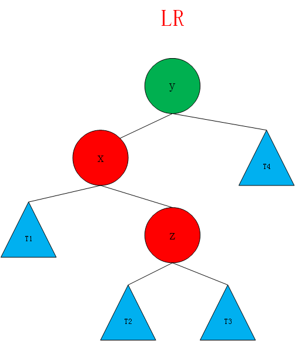

# AVL的定义和平衡因子

AVL树即平衡二叉树。AVL树的定义首先要求该树是二叉查找树（满足排序规则），并在此基础上增加了每个节点的平衡因子的定义，一个节点的平衡因子是该节点的左子树树高减去右子树树高的值。
特点：它是一棵空树或它的左右两个子树的高度差的绝对值不超过1，并且左右两个子树都是一棵平衡二叉树。在AVL树中任何节点的两个子树的高度最大差别为一，所以它也被称为平衡二叉树


平衡因子BF：该节点的左子树的深度减去它的右子树深度。


可见图中的平衡因子有2,那么这棵树不是一个平衡二叉树。

# 计算节点的高度和平衡因子

由上面的定义可以知道，如果想保持二分搜索树的平衡，那么要计算每个节点的高度值，以便计算平衡因子，根据平衡因子对二分搜索树进行一定操作，以便保持平衡。

在之前BST的基础上进行改写(BST见附录),实现新的AVL.

```java
import java.util.ArrayList;

public class BST<K extends Comparable<K>, V> {

    private class Node{
        public K key;
        public V value;
        public Node left, right;
        public int heigth; //树的高度

        public Node(K key, V value){
            this.key = key;
            this.value = value;
            left = null;
            right = null;
            heigth = 1; //初始化时为1
        }
    }

    //判断该二叉树是否是一棵二分搜索树
    //二分搜索树的一个性质之一：在进行中序遍历时，遍历的结果所有元素是按顺序排列的
    public boolean isBST(){
        ArrayList<K> keys = new ArrayList<>();
        inOrder(root,keys);

        for(int i = 1 ; i < keys.size() ; i ++){
            if(keys.get(i - 1).compareTo(keys.get(i)) > 0)
                return false;
        }
        return true;
    }

    private void inOrder(Node node,ArrayList<K> keys){
        if(node == null)
            return;

        inOrder(node.left,keys);
        keys.add(node.key);
        inOrder(node.right,keys);
    }

    //判断该二叉树是否是一棵平衡二叉树
    public boolean isBalanced(){
        return isBalanced(root);
    }

    //判断以Node为根的二叉树是否是一颗平衡二叉树,递归算法
    private boolean isBalanced(Node node){

        if(node == null)
            return true;

        int balanceFactor = getBalanceFactor(node);
        if(Math.abs(balanceFactor) > 1 )
            return false;
        return isBalanced(node.left) && isBalanced(node.right);
    }

    //获得节点node的高度
    private int getHeight(Node node){
        if(node == null)
            return 0;
        return node.heigth;
    }

     //获得节点的平衡因子
    private int getBalanceFactor(Node node){
        if(node == null)
            return 0;
        return getHeight(node.left) - getHeight(node.right);
    }

    // 向以node为根的二分搜索树中插入元素(key, value)，递归算法
    // 返回插入新节点后二分搜索树的根
    //在这个函数中要对height进行维护
    private Node add(Node node, K key, V value){

        if(node == null){
            size ++;
            return new Node(key, value);
        }

        if(key.compareTo(node.key) < 0)
            node.left = add(node.left, key, value);
        else if(key.compareTo(node.key) > 0)
            node.right = add(node.right, key, value);
        else // key.compareTo(node.key) == 0
            node.value = value;

        // 更新height
        node.heigth = 1 + Math.max(getHeight(node.left),getHeight(node.right));

        //计算平衡因子
        int balanceFactor = getBalanceFactor(node);
        if(Math.abs(balanceFactor) > 1)
            System.out.println("unbalanced :" + balanceFactor);

        return node;
    }
}
```

以上代码对AVL树的基本操作进行了编写,其中省略了部分和BST相同的代码

# 旋转操作

在进行了插入节点的操作后，才有可能破坏当前树的平衡性。这时候需要重新计算其父节点和祖先节点的平衡因子，并判断是否失去了平衡性。因为本身插入节点的`add`操作就是用递归实现的，所以在递归代码中进行改写。

## 右旋转

如果平衡因子大于一并且是在树的左侧的左侧添加

如图所示，是两种最简单的向左添加破坏了树的平衡性的情况，以绿色表示的节点其整体向左倾斜.左子树的高度大于其右子树的高度并且其左孩子也是如此。


这时候的解决方法是进行右旋转。


在`add`函数中进行修改:
```java
    //对节点y进行向右旋转操作，返回旋转后的新的根节点x
    //        y                              x
    //       / \                           /   \
    //      x   T4     向右旋转 (y)        z     y
    //     / \       - - - - - - - ->    / \   / \
    //    z   T3                       T1  T2 T3 T4
    //   / \
    // T1   T2
    private Node rightRotate(Node y){
        Node x = y.left;
        Node T3 = x.right;

        //向右旋转
        x.right = y;
        y.left = T3;

        //更新height
        y.heigth = Math.max(getHeight(y.left),getHeight(y.right));
        x.heigth = Math.max(getHeight(x.left),getHeight(x.right));

        return x;
    }

    private Node add(Node node, K key, V value){

        if(node == null){
            size ++;
            return new Node(key, value);
        }

        if(key.compareTo(node.key) < 0)
            node.left = add(node.left, key, value);
        else if(key.compareTo(node.key) > 0)
            node.right = add(node.right, key, value);
        else // key.compareTo(node.key) == 0
            node.value = value;

        // 更新height
        node.heigth = 1 + Math.max(getHeight(node.left),getHeight(node.right));

        //计算平衡因子
        int balanceFactor = getBalanceFactor(node);
        // if(Math.abs(balanceFactor) > 1)
        //     System.out.println("unbalanced :" + balanceFactor);

        ///平衡维护
        if(balanceFactor > 1 && getBalanceFactor(node.left) >= 0)
           return rightRotate(node);

        return node;
    }
```
## 左旋转

同理，当插入的元素在不平衡的节点的右侧的右侧时，进行坐旋转操作以满足平衡性。即左旋转的情况是和右旋转完全对称的。

```java
    // 对节点y进行向左旋转操作，返回旋转后新的根节点x
    //    y                             x
    //  /  \                          /   \
    // T1   x      向左旋转 (y)       y     z
    //     / \   - - - - - - - ->   / \   / \
    //   T2  z                     T1 T2 T3 T4
    //      / \
    //     T3 T4
    private Node leftRotate(Node y){
        Node x = y.right;
        Node T2 = x.left;

        //向左旋转
        x.left = y;
        y.right = T2;

        //更新height
        y.heigth = Math.max(getHeight(y.left),getHeight(y.right)) + 1;
        x.heigth = Math.max(getHeight(x.left),getHeight(x.right)) + 1;

        return x;
    }

    
    private Node add(Node node, K key, V value){
        //...省略部分代码
        
        //平衡维护
        if(balanceFactor > 1 && getBalanceFactor(node.left) >= 0) //左子树比右子树高
           return rightRotate(node);
        if(balanceFactor < -1 && getBalanceFactor(node.right) <= 0) //右子树比左子树高
            return leftRotate(node);
        
        return node;
    }
```

# LR和RL

## LR

当插入的元素在不平衡节点的左侧的右侧(即LR)，这时候不能仅仅使用右旋转。




这时候需要先对x进行左旋转，转化为LL的情况


到了这种情况继续对y进行右旋转就可以了。
继续完善平衡维护的代码:

```java
    //..省略代码

    //平衡维护

    // LL
    if(balanceFactor > 1 && getBalanceFactor(node.left) >= 0) //左子树比右子树高
        return rightRotate(node);

    // RR
    if(balanceFactor < -1 && getBalanceFactor(node.right) <= 0) //右子树比左子树高
        return leftRotate(node);

    // LR
    if(balanceFactor > 1 && getBalanceFactor(node.left) < 0)  {
        node.left = leftRotate(node.left); //转换为LL
        return rightRotate(node);
    }

    //..省略代码
```

## RL
RL是LR对称的一种情况，先将其转化为RR的情况，在进行左旋转。就不在赘述了。

```java
    // RL
    if(balanceFactor < -1 && getBalanceFactor(node.right) > 0) {
        node.right = rightRotate(node.right); //转化为RR
        return leftRotate(node);
    }
```

# 删除元素

删除元素也和添加元素类似，在删除元素后有可能会破坏原树的平衡性，所以在删除元素后要进行向上递归的操作，逐层判断，调整树的平衡。

在平衡二叉树的删除操作中，`node.left`或者`node.right`接到了递归操作的新的node节点后，当前的node节点的平衡性有可能已经遭到了破坏，所以不能直接返回当前的node，要先维护node的平衡，不能这么早的`return node;`,所以先用`retNode`暂存一下要返回的node.这样就有机会对`retNode`进行平衡维护，然后再返回。同理,` key.compareTo(node.key) == 0`时,待删除节点左子树或者右子树为空时返回的node也暂时赋值给`retNode`.同样`待删除节点左右子树均不为空的情况`也是用`retNode`暂存。

这样,`retNode`中存储的就是删除了节点后要返回的新的node.所以在得到了`retNode`后要对retNode进行判断，然后维护平衡。这时候的维护平衡操作其实和添加是一样的，先更新height，然后计算平衡因子，最后根据不同情况进行旋转。只是这时候处理的对象是`retNode`。

要注意在`removeMin(Node node)`函数操作时也有可能打破平衡，所以也要在这个函数中进行平衡维护。其实可以改写为`successor.right = remove(node.right,successor.key);`因为`remove()`函数添加了对平衡性的处理，所以这里的删除最小值操作这样改写是可以的。
```java
     // 从二分搜索树中删除键为key的节点
    public V remove(K key){

        Node node = getNode(root, key);
        if(node != null){
            root = remove(root, key);
            return node.value;
        }
        return null;
    }

    private Node remove(Node node, K key){

        if( node == null )
            return null;

        Node retNode;
        if( key.compareTo(node.key) < 0 ){
            node.left = remove(node.left , key);
            retNode = node;
        }
        else if(key.compareTo(node.key) > 0 ){
            node.right = remove(node.right, key);
            retNode = node;
        }
        else{   // key.compareTo(node.key) == 0

            // 待删除节点左子树为空的情况
            if(node.left == null){
                Node rightNode = node.right;
                node.right = null;
                size --;
                retNode = rightNode;
            }

            // 待删除节点右子树为空的情况
            else if(node.right == null){
                Node leftNode = node.left;
                node.left = null;
                size --;
                retNode = leftNode;
            }

            else {// 待删除节点左右子树均不为空的情况

                    // 找到比待删除节点大的最小节点, 即待删除节点右子树的最小节点
                    // 用这个节点顶替待删除节点的位置
                    Node successor = minimum(node.right);
                    successor.right = remove(node.right, successor.key);
                    successor.left = node.left;

                    node.left = node.right = null;

                    retNode = successor;
            }
        }

        //判断为空的情况，以免访问height会出错
        if(retNode == null)
            return null;

        //更新height
        retNode.heigth = 1 + Math.max(getHeight(retNode.left),getHeight(retNode.right));

        //计算平衡因子
        int balanceFactor = getBalanceFactor(retNode);

        //平衡维护

        // LL
        if(balanceFactor > 1 && getBalanceFactor(retNode.left) >= 0) //左子树比右子树高
            return rightRotate(retNode);

        // RR
        if(balanceFactor < -1 && getBalanceFactor(retNode.right) <= 0) //右子树比左子树高
            return leftRotate(retNode);

        // LR
        if(balanceFactor > 1 && getBalanceFactor(retNode.left) < 0)  {
            retNode.left = leftRotate(retNode.left); //转换为LL
            return rightRotate(retNode);
        }

        // RL
        if(balanceFactor < -1 && getBalanceFactor(retNode.right) > 0) {
            retNode.right = rightRotate(retNode.right); //转化为RR
            return leftRotate(retNode);
        }

        return retNode;
    }
```

# 基于AVL树的set和map

## Map
```java
public interface Map<K,V> {
    void add(K key,V value);
    V remove(K key);            //删除key对应的键值对,并返回值
    boolean contains(K key);  //是否存已在key
    V get(K key);               //获得key对应的value值
    void set(K key,V newValue); //更新值
    int getSize();
    boolean isEmpty();
}
```

```java
public class AVLMap<K extends Comparable<K>,V> implements Map<K,V> {
    private AVLTree<K,V> avl;

    public AVLMap(){
        avl = new AVLTree<>();
    }

    @Override
    public int getSize(){
        return avl.getSize();
    }

    @Override
    public boolean isEmpty(){
        return avl.isEmpty();
    }

    @Override
    public void add(K key,V value){
        avl.add(key,value);
    }

    @Override
    public boolean contains(K key){
        return avl.contains(key);
    }

    @Override
    public V get(K key){
        return avl.get(key);
    }

    @Override
    public void set(K key,V newValue){
        avl.set(key,newValue);
    }

    @Override
    public V remove(K key){
        return avl.remove(key);
    }
}

```
## Set
```java
public interface Set<E> {
    void add(E e);
    void remove(E e);
    boolean isEmpty();
    boolean containes(E e);
    int getSize();
}
```

```java
public class AVLSet<E extends Comparable<E>> implements Set<E> {
    private AVLTree<E, Object> avl;

    public AVLSet(){
        avl = new AVLTree<>();
    }

    @Override
    public int getSize(){
        return avl.getSize();
    }

    @Override
    public boolean isEmpty(){
        return avl.isEmpty();
    }

    @Override
    public boolean containes(E e) {
        return avl.contains(e);
    }

    @Override
    public void add(E e){
        avl.add(e, null);
    }

    
    @Override
    public void remove(E e){
        avl.remove(e);
    }

}
```
# 附录

## BST 
```java
import java.util.ArrayList;

public class BST<K extends Comparable<K>, V> {

    private class Node{
        public K key;
        public V value;
        public Node left, right;

        public Node(K key, V value){
            this.key = key;
            this.value = value;
            left = null;
            right = null;
        }
    }

    private Node root;
    private int size;

    public BST(){
        root = null;
        size = 0;
    }

    public int getSize(){
        return size;
    }

    public boolean isEmpty(){
        return size == 0;
    }

    // 向二分搜索树中添加新的元素(key, value)
    public void add(K key, V value){
        root = add(root, key, value);
    }

    // 向以node为根的二分搜索树中插入元素(key, value)，递归算法
    // 返回插入新节点后二分搜索树的根
    private Node add(Node node, K key, V value){

        if(node == null){
            size ++;
            return new Node(key, value);
        }

        if(key.compareTo(node.key) < 0)
            node.left = add(node.left, key, value);
        else if(key.compareTo(node.key) > 0)
            node.right = add(node.right, key, value);
        else // key.compareTo(node.key) == 0
            node.value = value;

        return node;
    }

    // 返回以node为根节点的二分搜索树中，key所在的节点
    private Node getNode(Node node, K key){

        if(node == null)
            return null;

        if(key.equals(node.key))
            return node;
        else if(key.compareTo(node.key) < 0)
            return getNode(node.left, key);
        else // if(key.compareTo(node.key) > 0)
            return getNode(node.right, key);
    }

    public boolean contains(K key){
        return getNode(root, key) != null;
    }

    public V get(K key){

        Node node = getNode(root, key);
        return node == null ? null : node.value;
    }

    public void set(K key, V newValue){
        Node node = getNode(root, key);
        if(node == null)
            throw new IllegalArgumentException(key + " doesn't exist!");

        node.value = newValue;
    }

    // 返回以node为根的二分搜索树的最小值所在的节点
    private Node minimum(Node node){
        if(node.left == null)
            return node;
        return minimum(node.left);
    }

    // 删除掉以node为根的二分搜索树中的最小节点
    // 返回删除节点后新的二分搜索树的根
    private Node removeMin(Node node){

        if(node.left == null){
            Node rightNode = node.right;
            node.right = null;
            size --;
            return rightNode;
        }

        node.left = removeMin(node.left);
        return node;
    }

    // 从二分搜索树中删除键为key的节点
    public V remove(K key){

        Node node = getNode(root, key);
        if(node != null){
            root = remove(root, key);
            return node.value;
        }
        return null;
    }

    private Node remove(Node node, K key){

        if( node == null )
            return null;

        if( key.compareTo(node.key) < 0 ){
            node.left = remove(node.left , key);
            return node;
        }
        else if(key.compareTo(node.key) > 0 ){
            node.right = remove(node.right, key);
            return node;
        }
        else{   // key.compareTo(node.key) == 0

            // 待删除节点左子树为空的情况
            if(node.left == null){
                Node rightNode = node.right;
                node.right = null;
                size --;
                return rightNode;
            }

            // 待删除节点右子树为空的情况
            if(node.right == null){
                Node leftNode = node.left;
                node.left = null;
                size --;
                return leftNode;
            }

            // 待删除节点左右子树均不为空的情况

            // 找到比待删除节点大的最小节点, 即待删除节点右子树的最小节点
            // 用这个节点顶替待删除节点的位置
            Node successor = minimum(node.right);
            successor.right = removeMin(node.right);
            successor.left = node.left;

            node.left = node.right = null;

            return successor;
        }
    }

    public static void main(String[] args){

        System.out.println("sorcerers.stone.txt");

        ArrayList<String> words = new ArrayList<>();
        if(FileOperation.readFile("sorcerers.stone.txt", words)) {
            System.out.println("Total words: " + words.size());

            BST<String, Integer> map = new BST<>();
            for (String word : words) {
                if (map.contains(word))
                    map.set(word, map.get(word) + 1);
                else
                    map.add(word, 1);
            }

            System.out.println("Total different words: " + map.getSize());
            System.out.println("Frequency of go: " + map.get("go"));
            System.out.println("Frequency of stone: " + map.get("stone"));
        }

        System.out.println();
    }
}

```