# MapReduce编程之WordCount

基于JAVA开发

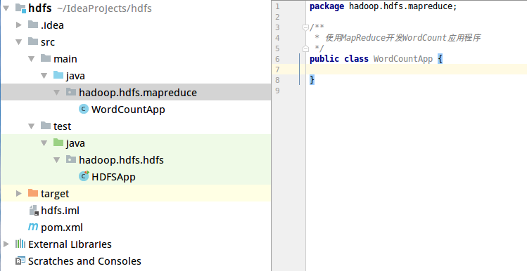


`Text`参数继承了`BinaryComparable`并实现了`WritableComparable`接口，可以把它理解为JAVA里面的字符串。

首先看一些基本的知识：

1. `Mapper`类

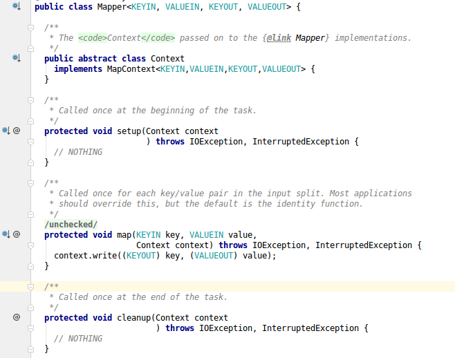
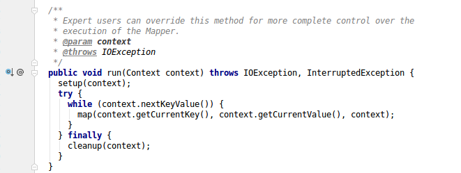

* `Context`代表的上下文
* `setup`代表任务开始的时候执行的操作，且只执行一次。可以在这里进行数据库链接等操作
* `map`方法，对于输入的input在每个键值对出发的时候就调用
* `cleanup`方法是表示在任务结束的时候执行一次
* `run`方法不需要手动调用

关键点是重写`map`方法

2. `Reducer类`

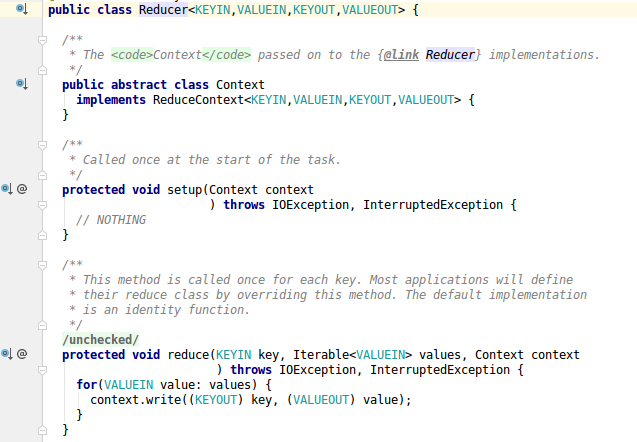
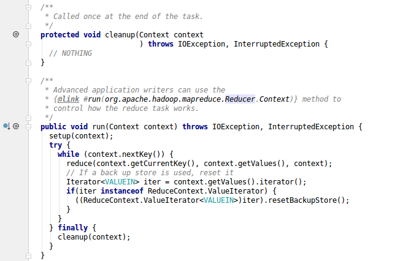

* `setup`和`cleanup`方法同`mapper`方法类似
* `reduce`方法，每个键值对都会被调用一次
* `run`是写好的模板模式

关键点是重写`reduce`方法

先写好基本框架
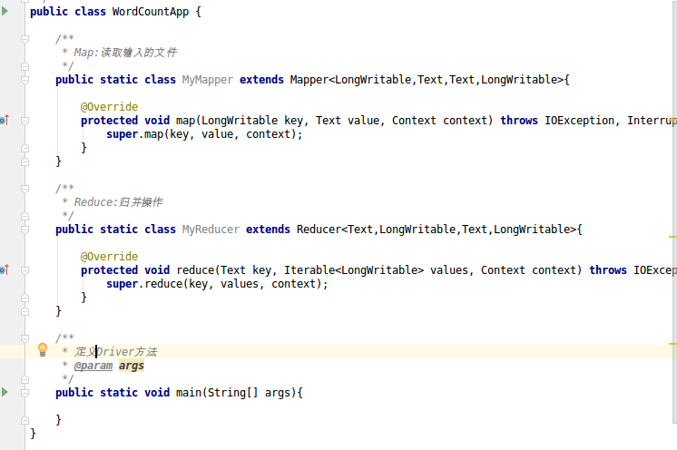

然后复写`map`和`reduce`方法

完整代码：
```java
package hadoop.hdfs.mapreduce;

import org.apache.hadoop.conf.Configuration;
import org.apache.hadoop.fs.Path;
import org.apache.hadoop.io.LongWritable;
import org.apache.hadoop.io.Text;
import org.apache.hadoop.mapreduce.Job;
import org.apache.hadoop.mapreduce.Mapper;
import org.apache.hadoop.mapreduce.Reducer;
import org.apache.hadoop.mapreduce.lib.input.FileInputFormat;
import org.apache.hadoop.mapreduce.lib.output.FileOutputFormat;

import java.io.IOException;

/**
 * 使用MapReduce开发WordCount应用程序
 */
public class WordCountApp {

    /**
     * Map:读取输入的文件
     */
    public static class MyMapper extends Mapper<LongWritable,Text,Text,LongWritable>{

        //定义一个count
        LongWritable plusone = new LongWritable(1);
        @Override
        protected void map(LongWritable key, Text value, Context context) throws IOException, InterruptedException {
            //先读入每一行数据
            String line = value.toString();
            //然后按照指定分隔符分割
            String[] words = line.split(" ");

            for(String word:words){
                //使用上下文context进行输出
                context.write(new Text(word),plusone);
            }
        }
    }

    /**
     * Reduce:归并操作
     */
    public static class MyReducer extends Reducer<Text,LongWritable,Text,LongWritable>{

        @Override
        //Iterable<LongWritable> values是一个集合，因为一个单词交到一个reduce去处理，所以会出现多次
        protected void reduce(Text key, Iterable<LongWritable> values, Context context) throws IOException, InterruptedException {
            long sum = 0;
            for(LongWritable value:values){
                sum += value.get();//通过get()转化为java中的类型
            }

            //最终统计结果的输出      写入上下文
            context.write(key,new LongWritable(sum));
        }
    }

    /**
     * 定义Driver方法，封装MapReduce作业的所有信息
     * @param args
     */
    public static void main(String[] args) throws IOException, ClassNotFoundException, InterruptedException {

        //step1 创建configuration()(org.apache.hadoop.conf.Configuration)
        Configuration configuration = new Configuration();

        //step2 Job.getInstance()拿到一个实例 (org.apache.hadoop.mapreduce.Job;)
        Job job = Job.getInstance(configuration,"wordcount");

        //step3 设置job的处理类(即创建的这个类)
        job.setJarByClass(WordCountApp.class);

        //step4 设置作业处理的输入路径
        FileInputFormat.setInputPaths(job,new Path(args[0]));

        //step5 设置Map相关参数
        //step5.1 设置map处理类
        job.setMapperClass(MyMapper.class);
        //step5.2 设置map的key输出的类型和map的value输出的类型那个
        job.setMapOutputKeyClass(Text.class);
        job.setMapOutputValueClass(LongWritable.class);

        //step6 设置reduce相关参数
        //step6.1 设置reduce处理类
        job.setReducerClass(MyReducer.class);
        //step6.2 设置reduce的key输出类型和value输出类型
        job.setOutputKeyClass(Text.class);
        job.setOutputValueClass(LongWritable.class);

        //step7 设置作业处理的输出路径
        FileOutputFormat.setOutputPath(job,new Path(args[1]));

        //step8 提交作业并输出结果
        System.exit(job.waitForCompletion(true)?0:1);
    }
}
```

然后进行打包编译
切换到项目目录运行`mvn clean package -DskipTests`
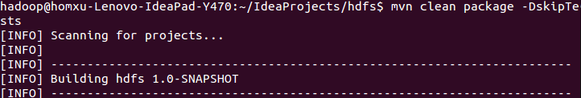

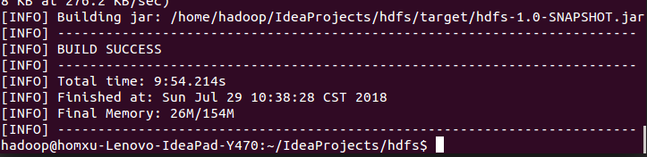
可以看到构建成功

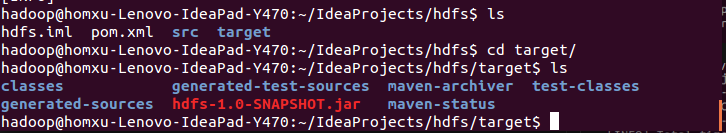
编译成功后在target目录下

如果mvn命令不能使用需要安装相应环境

这里由于网络原因我下了好久 orz

将jar包拷贝到指定目录
`scp hdfs-1.0-SNAPSHOT.jar ~/lib`


查看hdfs上的文件,并查看全路径

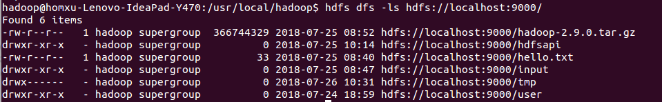

运行 jar包
`hadoop jar jar包目录 组类 (在idea中右键选中然后 CopyReference) 要传入的文件路径 要输出的文件路径 `

我的机器上的指令：
`hadoop jar /home/hadoop/lib/hdfs-1.0-SNAPSHOT.jar hadoop.hdfs.mapreduce.WordCountApp hdfs://localhost:9000/hello.txt hdfs://localhost:9000/hdfsapi/wordcountresult`

输入文件的内容：
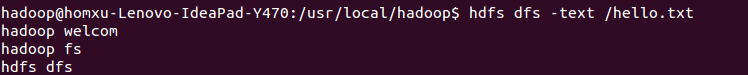

可以在浏览器 http://localhost:8088/cluster 查看yarn的作业

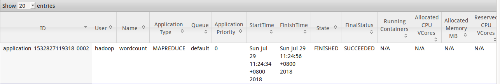

查看结果，操作成功
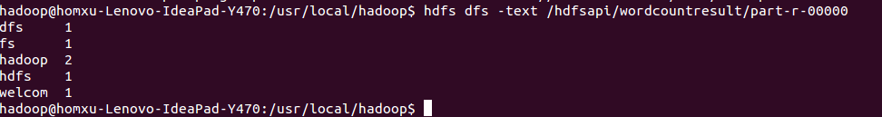

相同的代码和脚本再次运行会报错，因为在MR中，输出文件是不能存在的。
所以要在每次运行后换新的路径或者删除旧的文件
可以手工建一个shell脚本或者在JAVA代码中进行操作
shell 脚本
```
hdfs dfs rm -r 文件路径
hadoop jar jar包目录 组类 (在idea中右键选中然后 CopyReference) 要传入的文件路径 要输出的文件路径
```
要给脚本加上相应权限`chmod u+x 脚本名称`

在JAVA中完成自动删除功能
在//step1 和 //step2 中间清理已经存在的目录
```java
 //step1.5 准备删除已经存在的文件目录
        Path outputPath = new Path(args[1]);
        FileSystem fileSystem = FileSystem.get(configuration);
        if(fileSystem.exists(outputPath)){
            fileSystem.delete(outputPath,true);
            System.out.println("filePath exists,but it has deleted");
        }
```

重新编译代码执行，就可以了

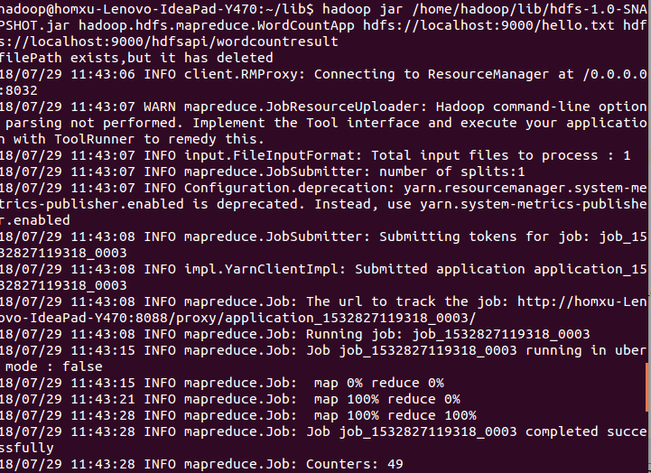
可以看到又一行输出`ilePath exists,but it has deleted`,同时执行成功

# MapReduce编程之Combiner

* 本地的reducer
* 减少MapTask输出的数据量及网络传输量

在Map过程中先对key相同的值进行一个归并，然后在传输到reduce上，这样就减少了传输的数据数量。可以看成是在map端的一个小的reduce操作。

在上面代码的基础上，在step5的`map`操作和step6的`reduce`操作中间价一个`combiner`操作。
```
 //step5.5 设置Combiner处理类，其实在逻辑上和reduce是一样的
 job.setCombinerClass(MyReducer.class);
```

重新编译，拷贝到hdfs目录下，执行

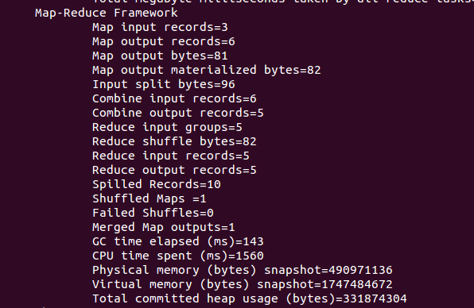
可以看到执行过程中有`Combine`信息，`Combin input records=6`和`Combin output records=5`,说明是生效了的
(可以对比之前的操作，combine操作records=0)

虽然它减少了一些数据量，但是它是有适应场景的。
在`求和`、`求次数`的时候适用，但是在求`平均数`等操作的时候，结果就会有问题，这里要注意

# MapReduce编程之Partitioner

* Partitioner决定MapTask输出的数据交由哪个ReduceTask处理
* 默认实现：分发的key的hash值对ReduceTask个数取模

新建一个用来测试的文档：`animal.txt`

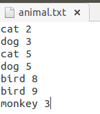

上传到hdfs中：
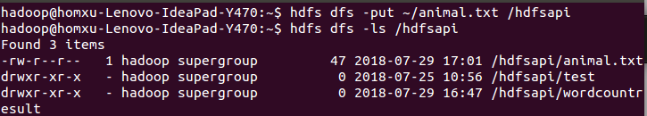

在ieda中，拷贝一份`WordCountApp`的代码，命名为`PartitionerApp`.
按照空格拆分其实就是`动物名字`和`动物数量`，所以在`Mapper`类的`map`方法中修改代码：
```java
 /**
     * Map:读取输入的文件
     */
    public static class MyMapper extends Mapper<LongWritable,Text,Text,LongWritable>{

        @Override
        protected void map(LongWritable key, Text value, Context context) throws IOException, InterruptedException {
            //先读入每一行数据
            String line = value.toString();
            //然后按照指定分隔符分割
            String[] words = line.split(" ");

            context.write(new Text(words[0]),new LongWritable(Long.parseLong(words[1])));

        }
    }
```

还要新建一个`Partition`类
```java
 public static class MyPartitioner extends Partitioner<Text,LongWritable>{
        @Override
        public int getPartition(Text key, LongWritable value, int numPartitions) {
            if(key.equals("cat")){
                return 0;
            }
            if (key.equals("dog")){
                return 1;
            }
            if(key.equals("bird")){
                return 2;
            }
            return 3;
        }
    }
```

在`step6` 和 `step7`之间添加代码：
```java
 //step6.5 设置job的Partition
        job.setPartitionerClass(MyPartitioner.class);
        //step6.5.1 设置reduce的数量，不然不生效,这里设置4个，因为MyPartitioner类中有4种情况
        job.setNumReduceTasks(4);
```

然后编译，将执行的类名和输入的数据改一下`hadoop jar /home/hadoop/lib/hdfs-1.0-SNAPSHOT.jar hadoop.hdfs.mapreduce.PartitionerApphadoop.hdfs.mapreduce.PartitionerApp hdfs://localhost:9000//hdfsapi/animal.txt hdfs://localhost:9000/hdfsapi/Partitionresult`

运行后查看结果
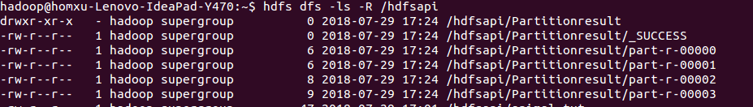

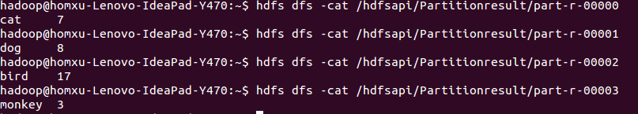

Partition会把符合规则的key送到指定的reduce处理，分别生成相应的结果。

# 配置jobHistory
默认情况下这个功能是不开启的


找到mapreduce的配置`mapred-site.xml`

在`<configuration></configuration>`中间增加
```
<property>
    <name>mapreduce.jobhistory.address</name>
    <value>localhost:10020</value>
    <description>MR JobHistory Server管理的日志的存放位置</description>
</property>

<property>
    <name>mapreduce.jobhistory.webapp.address</name>
    <value>localhost:19888</value>
    <description>查看历史服务器已经运行完的Mapreduce作业记录的web地址，需要启动该服务才行</description>
</property>

<property>
    <name>mapreduce.jobhistory.done-dir</name>
    <value>mr-history/done</value>
    <description>MR JobHistory Server管理的日志的存放位置,默认:/mr-history/done</description>
</property>

<property>
    <name>mapreduce.jobhistory.intermediate-done-dir</name>
    <value>mr-history/mapred/tmp</value>
    <description>MapReduce作业产生的日志存放位置，默认值:/mr-history/tmp</description>
```

保存后先停掉yarn再重启，启动之后还要再启动`mr-jobhistory-daemon.sh`使用`mr-jobhistory-daemon.sh start historyserver`
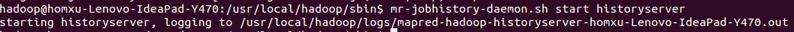
这样就启动成功了
可以看到这时候多了一个进程`JobHistoryServer`
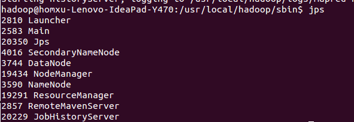

还要配置`yarn-site.xml`.在`<configuration></configuration>`中添加
```
<property>  
    <name>yarn.log-aggregation-enable</name>  
        <value>true</value>  
</property> 
```

再次重新启动yarn

使用mapreduce下的例子进行测试
```
/usr/local/hadoop/share/hadoop/mapreduce$ hadoop jar hadoop-mapreduce-examples-2.9.0.jar pi 2 3
```

我在启动后仍然出现问题，重启了hdfs和yarn都没用，不过后来尝试关闭`jobhistory`
```
./sbin/mr-jobhistory-daemon.sh stop historyserver
```
再重启
```
./sbin/mr-jobhistory-daemon.sh start historyserver
```
竟然可以了

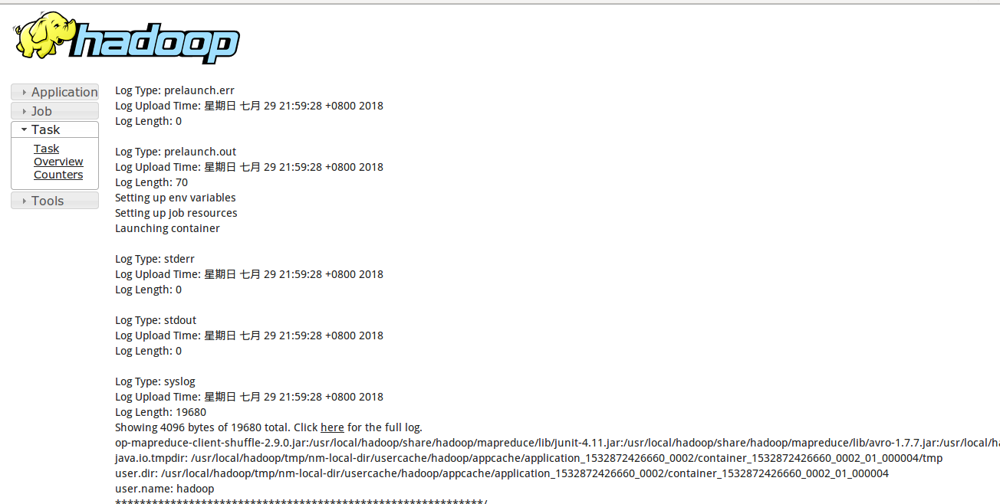

