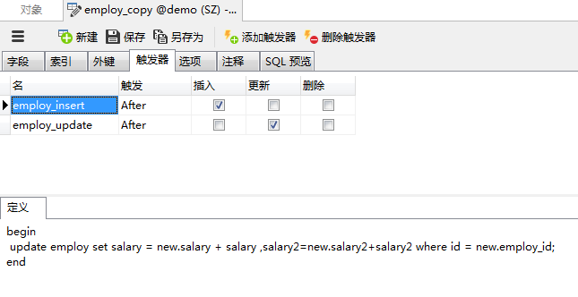
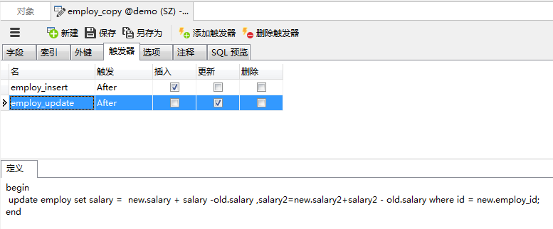
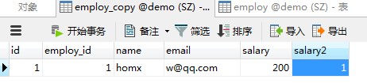
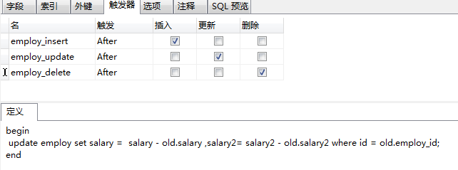
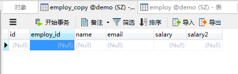

最近有一个项目提出新需求,有一个表由之前的一对一变成一对多,为了不影响使用原表的视图(为了进行统计汇总等),所以打算为这个表拓展子表,在子表上定义触发器,在子表改变的时候对应改变母表.所以这里记录一下定义使用trigger的过程.

在此之前提醒一下：

<font color="red">！！尽量少使用触发器,不建议使用。</font>

假设触发器触发每次执行1s,insert table 500条数据,那么就需要触发500次触发器,光是触发器执行的时间就花费了500s,而insert 500条数据一共是1s,那么这个insert的效率就非常低了。因此我们特别需要注意的一点是触发器的begin end;之间的语句的执行效率一定要高,资源消耗要小。
触发器尽量少的使用,因为不管如何,它还是很消耗资源,如果使用的话要谨慎的使用,确定它是非常高效的：触发器是针对每一行的；对增删改非常频繁的表上切记不要使用触发器,因为它会非常消耗资源。

# MySQL触发器创建

```sql
CREATE　[DEFINER = { 'user' | CURRENT_USER }]
TRIGGER trigger_name
trigger_time trigger_event
ON table_name
FOR EACH ROW
[trigger_order]
trigger_body
```

其中一些字段含义:
|字段|含义|可能的值|
| -- | -- | -- |
|DEFINER=|可选参数,指定创建者,默认为当前登录用户(CURRENT_USER);该触发器将以此参数指定的用户执行,所以需要考虑权限问题；|DEFINER='root@%'<br>DEFINER=CURRENT_USER|
|trigger_name|触发器名称,最好由表名+触发事件关键词+触发时间关键词组成；||
|trigger_time|触发时间,在某个事件之前还是之后|BEFORE、AFTER|
|trigger_event|触发事件,如插入时触发、删除时触发；<br>`INSERT`：插入操作触发器,INSERT、LOAD DATA、REPLACE时触发;<br>`UPDATE`：更新操作触发器,UPDATE操作时触发;`DELETE`：删除操作触发器,DELETE、REPLACE操作时触发;|INSERT、UPDATE、DELETE|
|table_name |触发操作事件的表名||
|trigger_order|可选参数,如果定义了多个具有相同触发事件和触法时间的触发器时(如：BEFORE UPDATE),默认触发顺序与触发器的创建顺序一致,可以使用此参数来改变它们触发顺序。<br>mysql 5.7.2起开始支持此参数。<br>FOLLOWS：当前创建触发器在现有触发器之后激活；<br>PRECEDES：当前创建触发器在现有触发器之前激活|FOLLOWS、PRECEDES|
|trigger_body|触发执行的SQL语句内容,一般以begin开头,end结尾|begin .. end|

在trigger_body中,我们可以使用NEW表示将要插入的新行(相当于MS SQL的INSERTED),OLD表示将要删除的旧行(相当于MS SQL的DELETED)。通过OLD,NEW中获取它们的字段内容,方便在触发操作中使用,下面是对应事件是否支持OLD、NEW的对应关系：
|事件|OLD|NEW|
|-- | -- | -- |
|INSERT|×|√|
|DELETE|√|×|
|UPDATE|√|√|由于UPDATE相当于删除旧行(OLD),然后插入新行(NEW),所以UPDATE同时支持OLD、NEW；

* MySQL分隔符(DELIMITER):

MySQL默认使用";"作为分隔符，SQL语句遇到";"就会提交。而我们的触发器中可能会有多个";"符，为了防止触发器创建语句过早的提交，我们需要临时修改MySQL分隔符，创建完后，再将分隔符改回来。使用DELIMITER可以修改分隔符，如下：

```
DELIMITER $
... --触发器创建语句;
$   --提交创建语句;
DELIMITER ;
```

* MySQL触发器中使用变量：
MySQL触发器中变量变量前面加'@'，无需定义，可以直接使用：
```
-- 变量直接赋值
set @num=999;
 
-- 使用select语句查询出来的数据方式赋值，需要加括号：
set @name =(select name from table);
```

* MySQL触发器中使用if语做条件判断：
```
-- 简单的if语句：
set sex = if (new.sex=1, '男', '女');
 
-- 多条件if语句：
if old.type=1 then
    update table ...;
elseif old.type=2 then
    update table ...;
end if;
```

# 案例

由于项目中的表过于复杂,这里就只用比较简单的表作为例子进行记录。

创建母表:
```sql
CREATE TABLE `employ` (
  `id` int(11) NOT NULL AUTO_INCREMENT,
  `name` char(20) NOT NULL,
  `email` char(40) DEFAULT NULL,
  `salary` int(11) NOT NULL,
  `salary2` int(11) DEFAULT NULL,
  PRIMARY KEY (`id`)
) ENGINE=InnoDB AUTO_INCREMENT=2 DEFAULT CHARSET=utf8
```
创建子表:
```sql
CREATE TABLE `employ_copy` (
  `id` int(11) NOT NULL AUTO_INCREMENT,
  `employ_id` int(11) NOT NULL,
  `name` char(20) NOT NULL,
  `email` char(40) DEFAULT NULL,
  `salary` int(11) NOT NULL,
  `salary2` int(11) DEFAULT NULL,
  PRIMARY KEY (`id`)
) ENGINE=InnoDB AUTO_INCREMENT=7 DEFAULT CHARSET=utf8
```

母表自表之间没有用外键连接,但是子表(employ_copy)根据`employ_id`与母表(employ)的id进行匹配.

为了更直观,这里使用Navicat进行操作：
首先插入一条数据:


在employ_copy中定义插入时的触发器:

在Navicat中直接这样写就可以了:


现在在employ_copy表中插入一条数据,然后看employ表中数据的对应改变:
插入的数据:

数据改变:


当向employ_copy中插入数据时,让employ中的salary和salary2字段等于原来的字段加上新插入的值.由于原来都是0,插入的两个值为100,插入后employ中的两个值变为100

然后定义更新时的触发器:


将刚才employ_copy中的数据进行修改:


然后查看新值:


思路是employ中的值等于减去update之前的旧值然后再加上update之后的新值.

最后定义删除时的触发器:


将刚才employ_copy中的数据进行删除:


然后查看新值:


employ_copy中删除数据后,employ中对应数据也进行了删除

这次只是简单的trigger使用,做一个简单的记录

# 参考

* https://www.cnblogs.com/geaozhang/p/6819648.html

* https://aiezu.com/article/mysql_trigger_syntax.html