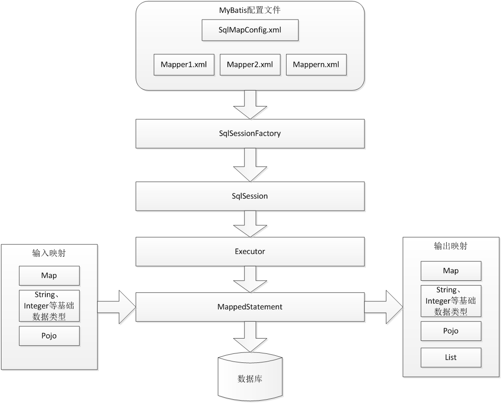

# Mybatis架构图


# 准备测试数据库

```sql
/*
Navicat MySQL Data Transfer

Source Server         : localhost_3306
Source Server Version : 50521
Source Host           : localhost:3306
Source Database       : mybatis

Target Server Type    : MYSQL
Target Server Version : 50521
File Encoding         : 65001

Date: 2015-04-09 16:03:53
*/

SET FOREIGN_KEY_CHECKS=0;

-- ----------------------------
-- Table structure for `orders`
-- ----------------------------
DROP TABLE IF EXISTS `orders`;
CREATE TABLE `orders` (
  `id` int(11) NOT NULL AUTO_INCREMENT,
  `user_id` int(11) NOT NULL COMMENT '下单用户id',
  `number` varchar(32) NOT NULL COMMENT '订单号',
  `createtime` datetime NOT NULL COMMENT '创建订单时间',
  `note` varchar(100) DEFAULT NULL COMMENT '备注',
  PRIMARY KEY (`id`),
  KEY `FK_orders_1` (`user_id`),
  CONSTRAINT `FK_orders_id` FOREIGN KEY (`user_id`) REFERENCES `user` (`id`) ON DELETE NO ACTION ON UPDATE NO ACTION
) ENGINE=InnoDB AUTO_INCREMENT=6 DEFAULT CHARSET=utf8;

-- ----------------------------
-- Records of orders
-- ----------------------------
INSERT INTO `orders` VALUES ('3', '1', '1000010', '2015-02-04 13:22:35', null);
INSERT INTO `orders` VALUES ('4', '1', '1000011', '2015-02-03 13:22:41', null);
INSERT INTO `orders` VALUES ('5', '10', '1000012', '2015-02-12 16:13:23', null);

-- ----------------------------
-- Table structure for `user`
-- ----------------------------
DROP TABLE IF EXISTS `user`;
CREATE TABLE `user` (
  `id` int(11) NOT NULL AUTO_INCREMENT,
  `username` varchar(32) NOT NULL COMMENT '用户名称',
  `birthday` date DEFAULT NULL COMMENT '生日',
  `sex` char(1) DEFAULT NULL COMMENT '性别',
  `address` varchar(256) DEFAULT NULL COMMENT '地址',
  PRIMARY KEY (`id`)
) ENGINE=InnoDB AUTO_INCREMENT=27 DEFAULT CHARSET=utf8;

-- ----------------------------
-- Records of user
-- ----------------------------
INSERT INTO `user` VALUES ('1', '王五', null, '2', null);
INSERT INTO `user` VALUES ('10', '张三', '2014-07-10', '1', '北京市');
INSERT INTO `user` VALUES ('16', '张小明', null, '1', '河南郑州');
INSERT INTO `user` VALUES ('22', '陈小明', null, '1', '河南郑州');
INSERT INTO `user` VALUES ('24', '张三丰', null, '1', '河南郑州');
INSERT INTO `user` VALUES ('25', '陈小明', null, '1', '河南郑州');
INSERT INTO `user` VALUES ('26', '王五', null, null, null);
```

# 环境搭建
导入所需依赖包：


根据1中的架构图，首先准备配置文件：
`SqlMapConfig.xml`:
```xml
<?xml version="1.0" encoding="UTF-8"?>
<!DOCTYPE configuration
PUBLIC "-//mybatis.org//DTD Config 3.0//EN"
"http://mybatis.org/dtd/mybatis-3-config.dtd">
<configuration>
	<!-- 用于配置数据库连接环境  和spring整合后 environments配置将废除    -->
	<environments default="development">
		<environment id="development">
			<!-- 使用jdbc事务管理 -->
			<transactionManager type="JDBC" />
			<!-- 数据库连接池 -->
			<dataSource type="POOLED">
				<property name="driver" value="com.mysql.jdbc.Driver" />
				<property name="url"
					value="jdbc:mysql://localhost:3306/mybatis" />
				<property name="username" value="root" />
				<property name="password" value="12345" />
			</dataSource>
		</environment>
	</environments>
</configuration>
```
其中`environments`标签是用来配置数据库连接环境的，因为这里是单独是mybatis工程，所以要进行配置。后期在整合Spring工程时，数据库的配置由Spring来负责，可以将environments标签除掉。

在`src`包下创建`log4j.properties`.
`log4j.properties`:
```
# Global logging configuration
log4j.rootLogger=DEBUG, stdout
# Console output...
log4j.appender.stdout=org.apache.log4j.ConsoleAppender
log4j.appender.stdout.layout=org.apache.log4j.PatternLayout
log4j.appender.stdout.layout.ConversionPattern=%5p [%t] - %m%n
```

创建`user`表中对应的pojo类.pojo类作为mybatis进行sql映射使用，po类通常与数据库表对应.
```java
package my.study.pojo;

import java.io.Serializable;
import java.util.Date;

public class User implements Serializable {
	
	private static final long serialVersionUID = 1L;
	private Integer id;
	private String username;
	private String sex;
	private Date birthday;
	private String address;


	//省略get和set方法

  //...
	@Override
	public String toString() {
		return "User [id=" + id + ", username=" + username + ", sex=" + sex
				+ ", birthday=" + birthday + ", address=" + address + "]";
	}
}
```

在`my.study.mapper`包下创建`user.xml`:
```xml
<?xml version="1.0" encoding="UTF-8"?>
<!DOCTYPE mapper
PUBLIC "-//mybatis.org//DTD Mapper 3.0//EN"
"http://mybatis.org/dtd/mybatis-3-mapper.dtd">
<!-- 书写sql语句 -->
<mapper>

</mapper>
```
在xml中引入约束后，其根标签就是`<mapper></mapper>`,用来在其中书写sql语句。

在这里定义了`user.xml`文件后，根据架构图，需要和核心配置文件结合，所以要在核心配置文件中使用`<mappers></mappers>`标签：
```xml
<!-- Mapper的位置  Mapper.xml 写Sql语句的文件的位置 -->
	<mappers>
    <mapper resource="my/study/mapper/User.xml"/>
  </mappers>
```

这样准备工作就基本完成了，接下来就要进行架构中的第二部，创建工厂和session并进行测试。

# 操作数据库

## 在配置文件中书写sql
在`User.xml`配置文件中书写查询sql:


其中`<>cache`和`<>cache-ref`表示缓存,它们和`<>parameterMap`都很少用到.`<>sql`表示sql片段,`<>result`表示手动映射。剩下的增删改查和更新。

书写查询sql：
```xml
<!-- 查询用户 -->
	<select id="findUserById" parameterType="Integer" resultType="my.study.pojo.User">
		select * from user where id = #{v}
	</select>
```
标签中的`id`表示这条sql语句在配置文件中的唯一标识;
`parameterType`表示传参的类型;
`resultType`表示自动映射查询到的结果，填写pojo的全路径.自动映射要求所创建的类要和数据库表中的各个字段和类型相对应,如果不对应则需要手动映射.
`#{}`表示占位符，类似于jdbc中的?,大括号中的值可以随便写.

如果有另一个配置文件中的查询语句的id和已存在的重复，这时候可以在`<mapper>`添加`namespace=""`,`namespace`表示命名空间，用于隔离sql,避免发生这种情况.
比如修改为:
```xml
<mapper namespace="user">
...
</mapper>
```
这时候可以使用`user.findUserById`访问这个sql.

## 书写测试类


```java
package my.study.test;

import java.io.InputStream;

import org.apache.ibatis.io.Resources;
import org.apache.ibatis.session.SqlSession;
import org.apache.ibatis.session.SqlSessionFactory;
import org.apache.ibatis.session.SqlSessionFactoryBuilder;
import org.junit.Test;

import my.study.pojo.User;

public class MybatisTest {

	@Test
	public void test1() throws Exception {
		//1.加载核心配置文件
		String resource = "sqlMapConfig.xml";
		InputStream in = Resources.getResourceAsStream(resource);
		//2.创建SqlSessionFactory
		SqlSessionFactory sqlSessionFactory = new SqlSessionFactoryBuilder().build(in);
		//3.创建SqlSession
		SqlSession sqlSession = sqlSessionFactory.openSession();
		//4.执行Sql语句
		User user = sqlSession.selectOne("user.findUserById", 10);
		System.out.println(user);
	}
}
```


这里` sqlSession.selectOne()`方法的第一个参数就是传入`<mapper>`的namespace+sql语句的id;第二个就是传入要进行查询的参数(也就是占位符位置的值);

测试结果:

因为加入了log日志，这里会打印出各个信息

## 实现模糊查询

书写sql语句:
```xml
<!-- 模糊查询 -->
	<select id="findUserByUsername" parameterType="String" resultType="my.study.pojo.User">
		select * from user where username like '%${value}%'
	</select>
```
注意，这里的模糊查询中不是用占位符`#{}`，而是使用`${}`。
类比jdbc中的占位符，`#{}`相当于`?`
而在需要使用字符串拼接功能时，使用`${}`.并且其中要填写`value`,而`#{}`则没有这种限制。
占位符可以防止sql注入，而字符串拼接不能防止sql注入，`#{}`和`${}`也是一个道理。
在测试类中添加测试方法：
```java
//实现模糊查询
	@Test
	public void test2() throws Exception {
		//1.加载核心配置文件
		String resource = "sqlMapConfig.xml";
		InputStream in = Resources.getResourceAsStream(resource);
		//2.创建SqlSessionFactory
		SqlSessionFactory sqlSessionFactory = new SqlSessionFactoryBuilder().build(in);
		//3.创建SqlSession
		SqlSession sqlSession = sqlSessionFactory.openSession();
		//4.执行Sql语句
		List<User> users = sqlSession.selectList("user.findUserByUsername", "五");
		for(User user2:users) {
			System.out.println(user2);
		}		
	}
```
因为模糊查询查出来的可能有很多结果，所以用`List<>`.
测试结果:


上面提了这样不能防止sql注入，所以可以这样写select标签中的sql语句
```xml
select * from user where username like "%"#{v}"%"
```

可以看到打印结果中成功出现了占位符，其实最终的sql语句相当于
```sql
select * from user where username like "%"'五'"%" 
```
这种写法是正确的，只是平时很少这么用

## 新增数据
书写sql语句
```xml
<!-- 新增用户 -->
	<insert id="insertUser" parameterType="my.study.pojo.User">
		insert into user (username,birthday,address,sex)
		values
		(#{username},#{birthday},#{address},#{sex})
	</insert>
```
`#{}`中的参数要和`User.java`类中的字段对应，这样才能知道传参是和哪个字段对应

测试类:
```java
//新增用户
	@Test
	public void testInsert() throws Exception {
		//1.加载核心配置文件
		String resource = "sqlMapConfig.xml";
		InputStream in = Resources.getResourceAsStream(resource);
		//2.创建SqlSessionFactory
		SqlSessionFactory sqlSessionFactory = new SqlSessionFactoryBuilder().build(in);
		//3.创建SqlSession
		SqlSession sqlSession = sqlSessionFactory.openSession();
		//4.执行Sql语句
		User u = new User();
		u.setUsername("李雷");
		u.setBirthday(new Date());
		u.setAddress("火星");
		u.setSex("男");
		int i =sqlSession.insert("user.insertUser", u);	
    sqlSession.commit();	
	}
```
其中insert的返回值为int型，表示影响的行数.注意最后要提交事务才能成功插入.


## 新增数据后返回主键ID

如果想实现在新增完用户后立刻返回这条新增数据的主键，则需要在`<insert>`语句中再嵌套一层`<selectKey>`用来查询主键.
```xml
<selectKey keyProperty="id" resultType="Integer" order="AFTER">
	select LAST_INSERT_ID()
</selectKey>
```
`keyProperty`表示返回值为`User`的`id`属性，`resultType`表示类型是Integer型;
注意：在sql中，如果主键是自增的int型，那么主键是在数据插入完成后再生成主键;如果不是自增类型，比如如果是varchar类型，则会先插入主键，再插入数据。
`order`表示执行顺序,所以这里要用`AFTER`
其中
```sql
select LAST_INSERT_ID()
```
是由sql提供的查询语句，它跟在insert语句后面的话，会返回刚插入的数据的主键,比如:
```sql
insert into ....
select LAST_INSERT_ID()
```
在上面的测试类中添加
```java
System.out.println(u.getId());
```
即可查看到已经获取到最新插入的主键ID


## 修改/更新数据

```xml
<!-- 更新 -->
	<update id="updateUserById" parameterType="my.study.pojo.User">
		update user
		set username = #{username},sex =#{sex},address = #{address},birthday = #{birthday}
		where id =#{id}
	</update>
```

```java
//更新用户
	@Test
	public void testUpdate() throws Exception {
		//1.加载核心配置文件
		String resource = "sqlMapConfig.xml";
		InputStream in = Resources.getResourceAsStream(resource);
		//2.创建SqlSessionFactory
		SqlSessionFactory sqlSessionFactory = new SqlSessionFactoryBuilder().build(in);
		//3.创建SqlSession
		SqlSession sqlSession = sqlSessionFactory.openSession();
		//4.执行Sql语句
		User u = new User();
		u.setId(29);
		u.setUsername("李雷update");
		u.setBirthday(new Date());
		u.setAddress("火星update");
		u.setSex("2");
		int i =sqlSession.update("user.updateUserById", u);
		sqlSession.commit();
	}
```


## 删除

```xml
<!-- 删除 -->
	<delete id="deleteUserById" parameterType="Integer">
		delete from user
		where id = #{id}
	</delete>
```

```java
//删除用户
		@Test
		public void testdelete() throws Exception {
			//1.加载核心配置文件
			String resource = "sqlMapConfig.xml";
			InputStream in = Resources.getResourceAsStream(resource);
			//2.创建SqlSessionFactory
			SqlSessionFactory sqlSessionFactory = new SqlSessionFactoryBuilder().build(in);
			//3.创建SqlSession
			SqlSession sqlSession = sqlSessionFactory.openSession();
			//4.执行Sql语句			
			int d = sqlSession.delete("user.deleteUserById", 29);
			sqlSession.commit();
		}
```


# Mapper动态代理开发
使用动态代理方式，动态生成代码，避免书写重复代码.
原始Dao开发中存在以下问题：
Dao方法体存在重复代码：通过SqlSessionFactory创建SqlSession，调用SqlSession的数据库操作方法
调用sqlSession的数据库操作方法需要指定statement的id，这里存在硬编码，不便于开发维护。

Mapper接口开发方法只需要程序员编写Mapper接口（相当于Dao接口），由Mybatis框架根据接口定义创建接口的动态代理对象。

Mapper接口开发需要遵循以下规范：
1、Mapper.xml文件中的namespace与mapper接口的类路径相同。
2、Mapper接口方法名和Mapper.xml中定义的每个statement的id相同
3、Mapper接口方法的输入参数类型和mapper.xml中定义的每个sql 的parameterType的类型相同
4、Mapper接口方法的输出参数类型和mapper.xml中定义的每个sql的resultType的类型相同

这里定义一个`UserMapper`接口:
```java
package my.study.mapper;

import my.study.pojo.User;

public interface UserMapper {
	//遵循四个原则
	//接口方法名 == User.xml 中的 id名
	//返回值类型 与 User.xml文件中返回值的类型一致
	//方法的入参类型与User.xml中入参的类型一致
	//mapper标签的命名空间绑定此接口
	public User findUserById(Integer id);
}
```
命名空间与接口绑定：


书写测试类：
```java
package my.study.test;

import java.io.InputStream;

import org.apache.ibatis.io.Resources;
import org.apache.ibatis.session.SqlSession;
import org.apache.ibatis.session.SqlSessionFactory;
import org.apache.ibatis.session.SqlSessionFactoryBuilder;
import org.junit.Test;

import my.study.mapper.UserMapper;
import my.study.pojo.User;

public class MybatisMapperTest {
	
	@Test
	public void test1() throws Exception{
		//1.加载核心配置文件
		String resource = "sqlMapConfig.xml";
		InputStream in = Resources.getResourceAsStream(resource);
		//2.创建SqlSessionFactory
		SqlSessionFactory sqlSessionFactory = new SqlSessionFactoryBuilder().build(in);
		//3.创建SqlSession
		SqlSession sqlSession = sqlSessionFactory.openSession();
		//4.SqlSession根据接口生成一个实现类
		UserMapper mapper = sqlSession.getMapper(UserMapper.class);
		
		User user = mapper.findUserById(10);
		System.out.println(user);
	}
}
```


这样使用动态开发，只需要书写一个接口和一个mapper.xml配置文件就可以了.

# Mybatis相比于JDBC的优点

1、数据库连接创建、释放频繁造成系统资源浪费从而影响系统性能，如果使用数据库连接池可解决此问题。
解决：在SqlMapConfig.xml中配置数据连接池，使用连接池管理数据库链接。
2、Sql语句写在代码中造成代码不易维护，实际应用sql变化的可能较大，sql变动需要改变java代码。
解决：将Sql语句配置在XXXXmapper.xml文件中与java代码分离。
3、向sql语句传参数麻烦，因为sql语句的where条件不一定，可能多也可能少，占位符需要和参数一一对应。
解决：Mybatis自动将java对象映射至sql语句，通过statement中的parameterType定义输入参数的类型。
4、对结果集解析麻烦，sql变化导致解析代码变化，且解析前需要遍历，如果能将数据库记录封装成pojo对象解析比较方便。
解决：Mybatis自动将sql执行结果映射至java对象，通过statement中的resultType定义输出结果的类型。

# Mybatis和Hibernate区别

Mybatis和hibernate不同，它不完全是一个ORM框架，因为`MyBatis需要程序员自己编写Sql语句`。mybatis可以通过XML或注解方式灵活配置要运行的sql语句，并将java对象和sql语句映射生成最终执行的sql，最后将sql执行的结果再映射生成java对象。

Mybatis学习门槛低，简单易学，程序员直接编写原生态sql，可严格控制sql执行性能，灵活度高，非常适合对关系数据模型要求不高的软件开发，例如互联网软件、企业运营类软件等，因为这类软件需求变化频繁，一但需求变化要求成果输出迅速。但是灵活的前提是`mybatis无法做到数据库无关性`，如果需要实现支持多种数据库的软件则需要自定义多套sql映射文件，工作量大。

Hibernate对象/关系映射能力强，`数据库无关性好`，对于关系模型要求高的软件（例如需求固定的定制化软件）如果用hibernate开发可以节省很多代码，提高效率。但是Hibernate的学习门槛高，要精通门槛更高，而且怎么设计O/R映射，在性能和对象模型之间如何权衡，以及怎样用好Hibernate需要具有很强的经验和能力才行。