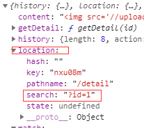

前些日子视频学习了用react.js(16.4版本)简单实现简书前端项目的视频，由于拖延症，一直没有把笔记和总结写下来，导致很多细节都遗忘了，今天算是亡羊补牢，把学习过程中的知识点和感受总结一下。

# 项目简介

项目以ReactJS为主，结合redux做状态管理，用`styled-components`做样式组件，axios做异步操作等，来实现一个模仿简书前端项目的单页面应用。项目相对来说比较简单，但“麻雀虽小，五脏俱全”，基本涵盖了对ReactJS操作和使用的知识点。
在mock后端数据时，使用了charles做为工具。

# 用到的组件

```json
"dependencies": {
    "@testing-library/jest-dom": "^4.2.4",
    "@testing-library/react": "^9.5.0",
    "@testing-library/user-event": "^7.2.1",
    "axios": "^0.20.0",
    "immutable": "^4.0.0-rc.12",
    "react": "^16.13.1",
    "react-dom": "^16.13.1",
    "react-redux": "^7.2.1",
    "react-router-dom": "^5.2.0",
    "react-scripts": "3.4.3",
    "react-transition-group": "^4.4.1",
    "redux": "^4.0.5",
    "redux-immutable": "^4.0.0",
    "redux-thunk": "^2.3.0",
    "styled-components": "^5.2.0"
}
```

# 项目过程中遇到的问题和总结

1. 在管理css样式时，引入styled-components模块。不同组件之间的css互不影响。创建style.js。
全局样式引入时，在styled-components的v4版本开始，引入createGlobalStyle。之前的injectGlobal 已被弃用:
```js
export const Globalstyle=createGlobalStyle `
    body {
        margin: 0;
        font-family: -apple-system, BlinkMacSystemFont, 'Segoe UI', 'Roboto', 'Oxygen',
        'Ubuntu', 'Cantarell', 'Fira Sans', 'Droid Sans', 'Helvetica Neue',
        sans-serif;
        -webkit-font-smoothing: antialiased;
        -moz-osx-font-smoothing: grayscale;
  }
```
然后在对应的App组件中，作为一个组件引入即可

2. 使用reset.css.不同浏览器的内核，显示内容时，会有略微的差别，例如默认的margin值不同，使用①的全局方案，结合reset.css，设置各种原生html标签的默认值。地址：https://meyerweb.com/eric/tools/css/reset/

3. 尽量不要在UI组建中写过多的业务逻辑，例如可以将业务逻辑代码写在组件外，然后在生命周期函数中调用外部代码。如：
```js
class Home extends Component {
  render() {
    return(
      //...
  }
  componentDidMount() {
    this.props.changeHomeData()
  }
}

//业务逻辑代码主要写在UI组件外，在钩子函数中调用
const mapStateToDispatch = (dispatch) => ({
  changeHomeData() {
    axios.get('/api/home.json').then((res) => {
      const result = res.data.data
      const action = {
        type: 'change_home_data',
        topicList: result.topicList,
        articleList: result.articleList,
        recommendList: result.recommendList
      }      
      dispatch(action)
    }).catch()
  }
});
```

4. 有异步请求的代码，尽量将其使用react-thunk进行管理。

5. 可以使用PureComponent组件替代Component组件，它自己内置了shouldComponentUpdate方法。需要注意的是，**PureComponent组件和immutable.js组件结合使用，才能保证数据一定没有问题**，如果没有使用immutable管理数据，可能会出现坑(不易发觉的错误)。

6. 后台获取参数的方式：
- 动态路由:可通过this.props.match.params获取到对应参数
```js
// App.js 设置
<Route path='/detail/:id'  exact component={Detail} />
```

- 使用参数的形式（url+?id=xxx）	
可通过this.props.location.search 对参数进行解析


7. 使用Redirect from 'react-router-dom' ，来实现页面跳转

8. 使用react-loadable导出异步组件，做component的异步加载。默认情况下，所有的组件都打包到一个bundle.js文件中，一次加载所有组件，如果组件数量过多，效率会很慢。
使用：
```js
import React from 'react'
import Loadable from 'react-loadable';

const LoadableComponent = Loadable({
  loader: () => import('./'), //代表当前目录下的index.js
  loading(){
      return <div>正在加载</div>
  } //在加载时，默认显示的内容
});

export default () => <LoadableComponent/>
```

```js
// App.js
import Detail from './pages/detail/loadable.js'
 ...
 
 // detail/index.js
 import { withRouter } from 'react-router-dom'
 ...
 export default connect(mapStateToProps,mapStateToDispatch)(withRouter(Detail))
```

使用后，切换网页会异步加载x.chunk.js，说明该异步组件是放在该js文件中，只有访问这个组件的时候才会被加载

10. 在使用redux管理数据时，如果store中的文件过多，可以将其分为多个store，然后在根目录将各个store引入，使用时按照规则寻找和使用对应的store即可：


这里对sotre文件夹中的各个文件作简要介绍：
- actionCreators.js
用于定义action方法，各个方法返回值为一个action对象，这样在使用时直接调用对应方法即可，书写也简洁
- constants.js
将`action`中的type定义为`常量`，在各个文件中使用和书写type时，约定都使用这个文件中定义的常量值，可以避免因拼写错误而难以发现问题：
```js
export const GET_LIST = 'header/GET_LIST'
```
- index.js
仅做导出功能
```js
import reducer from './reducer'
import * as actionCreators from './actionCreators'
import * as constants from './constants'

export {reducer,actionCreators,constants}
```

- reducer.js
在其中定义和初始化state，并且根据sotre传来的action，判断和返回新的store.

这是组件中各个文件的作用，而全局的store，也只是对各组件的sotre做一个规则，类似于统领各个模块的“统帅”，例如本项目中的reducer.js：
```js
import {combineReducers} from 'redux-immutable'
import {reducer as headerReducer} from '../common/header/store'
import {reducer as homeReducer}  from '../pages/home/store'
import {reducer as detailReducer}  from '../pages/detail/store'

const reducer = combineReducers({
    header: headerReducer,
    home: homeReducer,
    detail: detailReducer
})

export default reducer;
```
本项目中全局sotre中的index.js的作用也是作为默认的引入文件，并对store做一些初始化操作。


# 使用react.js的感受
好久之前就想学习一下react，但是由于各种原因（其实就是懒）也迟迟没能付诸行动。由于这是与react.js的初识，并没有在源码和更深入的层面上去探究react，因此只从使用感受方面做一些总结。

ReactJS很好的贯彻了“面向对象编程”的思想，特别而是与Vue框架相比，这种感觉更为明显。因视频中项目使用的版本是`React.js 16.4`，还未引入React-Hooks，所以在视频学习时，我创建模板时，大部分是以class形式继承React.Component来创建。当然这个版本也支持使用无状态函数来创建组件，在项目中也有应用。

ReactJS与Vue相比，“自由度”很高，但随之带来的也是难度的提升，特别是一些ES6语法和知识点。

要用好ReactJS写好应用，要熟悉ES6的一些语法，并且对于要做的应用，要合理划分模块。

ReactJS的整体使用感受还是很好的，只是随着ReactJS的版本不断迭新，也要不断吸取新的知识，特别是现在React-Hooks也火了起来，后续也将学习一下使用React-Hooks。

本文是使用学习时记下的笔记，并在本文做了整合和整理，仅做自己的学习记录，有不对的地方还往指正~