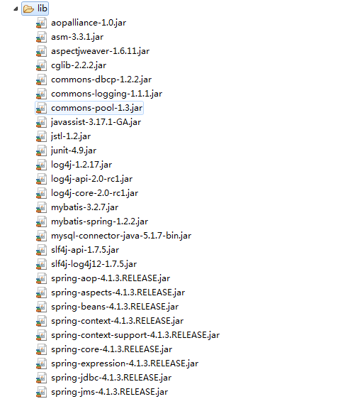
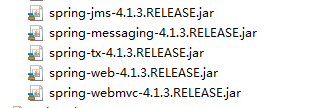
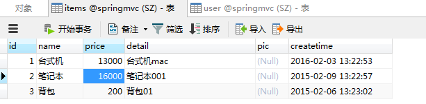
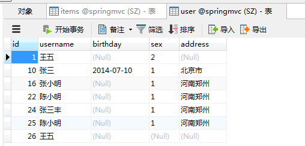
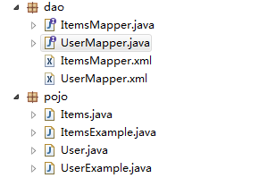
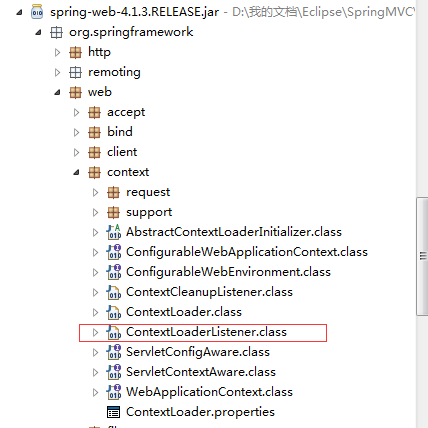
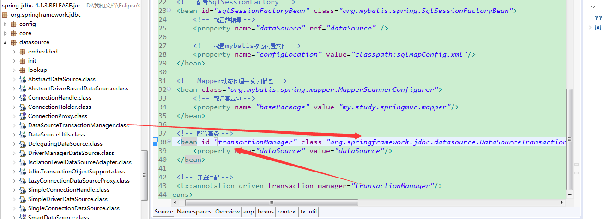
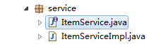
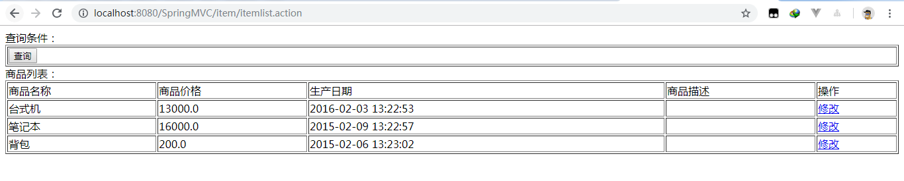

控制层采用springmvc、持久层使用mybatis实现。
首先参考[Spring与Mybatis整合](https://homxuwang.github.io/2018/11/29/Spring%E4%B8%8EMybatis%E6%95%B4%E5%90%88/)

# 所需依赖包



## 配置数据库和逆向工程
数据库表:


使用逆向工程生成pojo和dao:

这里可能和上一篇文章中`User`类和`Items`类的代码不同，需要进行修改

# 配置文件

`applicationContext.xml`:
```xml
<?xml version="1.0" encoding="UTF-8"?>
<beans xmlns="http://www.springframework.org/schema/beans"
	xmlns:context="http://www.springframework.org/schema/context" xmlns:p="http://www.springframework.org/schema/p"
	xmlns:aop="http://www.springframework.org/schema/aop" xmlns:tx="http://www.springframework.org/schema/tx"
	xmlns:xsi="http://www.w3.org/2001/XMLSchema-instance"
	xsi:schemaLocation="http://www.springframework.org/schema/beans http://www.springframework.org/schema/beans/spring-beans-4.0.xsd
	http://www.springframework.org/schema/context http://www.springframework.org/schema/context/spring-context-4.0.xsd
	http://www.springframework.org/schema/aop http://www.springframework.org/schema/aop/spring-aop-4.0.xsd http://www.springframework.org/schema/tx http://www.springframework.org/schema/tx/spring-tx-4.0.xsd
	http://www.springframework.org/schema/util http://www.springframework.org/schema/util/spring-util-4.0.xsd">

	<!-- 加载配置文件 -->
	<context:property-placeholder location="classpath:db.properties"/>
	<!-- 配置数据库连接池 -->
	<bean id="dataSource" class="org.apache.commons.dbcp.BasicDataSource" destroy-method="close">
		<property name="driverClassName" value="${jdbc.driver}" />
		<property name="url" value="${jdbc.url}" />
		<property name="username" value="${jdbc.username}" />
		<property name="password" value="${jdbc.password}" />
		<property name="maxActive" value="10" />
		<property name="maxIdle" value="5" />
	</bean>
	<!-- 配置SqlSessionFactory -->
	<bean id="sqlSessionFactoryBean" class="org.mybatis.spring.SqlSessionFactoryBean">
		<!-- 配置数据源 -->
		<property name="dataSource" ref="dataSource" />
		
		<!-- 配置mybatis核心配置文件 -->
		<property name="configLocation" value="classpath:sqlmapConfig.xml"/>
	</bean>
	
	<!-- Mapper动态代理开发 扫描包 -->
	<bean class="org.mybatis.spring.mapper.MapperScannerConfigurer">
		<!-- 配置基本包 -->
		<property name="basePackage" value="my.study.springmvc.mapper"/>
	</bean>
</beans>
```
`db.properties`:
```
jdbc.driver=com.mysql.jdbc.Driver
jdbc.url=jdbc:mysql://localhost:3306/springmvc
jdbc.username=root
jdbc.password=12345
```

`log4j.properties`:
```
# Global logging configuration
log4j.rootLogger=DEBUG, stdout
# Console output...
log4j.appender.stdout=org.apache.log4j.ConsoleAppender
log4j.appender.stdout.layout=org.apache.log4j.PatternLayout
log4j.appender.stdout.layout.ConversionPattern=%5p [%t] - %m%n
```
`sqlmapConfit.xml`:
```xml
<?xml version="1.0" encoding="UTF-8" ?>
<!DOCTYPE configuration
PUBLIC "-//mybatis.org//DTD Config 3.0//EN"
"http://mybatis.org/dtd/mybatis-3-config.dtd">
<configuration>
  <!-- 设置别名 -->
	<typeAliases>
		<!-- 指定扫描包，会把保内所有的类都设置别名，
		别名的名就是类名，大小写不敏感 
		-->
		<package name="my.study.springmvc.mapper"/>
	</typeAliases>

</configuration>
```

在`web.xml`中配置监听器，去读取配置：
```xml
<context-param>
  	<param-name>contextConfigLocation</param-name>
  	<param-value>classpath:applicationContext.xml</param-value>
  </context-param>
  
  <!-- Spring监听器 -->
  <listener>
  	<listener-class>org.springframework.web.context.ContextLoaderListener</listener-class>
  </listener>
```

配置至此，如果开启tomcat,那么就可以连接数据库了

## 配置事务

在`applicationContext.xml`中配置注解事务,并开启注解:
```xml
<!-- 配置事务 -->
<bean class="org.springframework.jdbc.datasource.DataSourceTransactionManager">
  <property name="dataSource" ref="dataSource"/>
</bean>
<!-- 开启注解 -->
	<tx:annotation-driven transaction-manager="transactionManager"/>
```

# 从mysql中读取信息并显示
书写service层代码:

`ItemService.java`:
```java
package my.study.springmvc.service;

import java.util.List;

import my.study.springmvc.pojo.Items;

public interface ItemService {
	public List<Items> selectItemsList();
}
```
`ItemServiceImpl.java`:
```java
package my.study.springmvc.service;

import java.util.List;

import org.springframework.beans.factory.annotation.Autowired;
import org.springframework.stereotype.Service;

import my.study.springmvc.dao.ItemsMapper;
import my.study.springmvc.pojo.Items;

/**
 * 查询商品信息
 * @author homxu
 *
 */
@Service
public class ItemServiceImpl implements ItemService {

	@Autowired
	private ItemsMapper itemsmapper;
	
	public List<Items> selectItemsList(){
		
		return itemsmapper.selectByExample(null);
	}
}
```
将service代码注入到controller：

```java
package my.study.springmvc.controller;


import java.util.List;

import org.springframework.beans.factory.annotation.Autowired;
import org.springframework.stereotype.Controller;
import org.springframework.web.bind.annotation.RequestMapping;
import org.springframework.web.servlet.ModelAndView;

import my.study.springmvc.pojo.Items;
import my.study.springmvc.service.ItemService;

@Controller
public class ItemController {	
	@Autowired
	private ItemService itemservice;
	@RequestMapping(value = "/item/itemlist.action")
	public ModelAndView itemList(){		
		//从mysql中查询
		List<Items> items = itemservice.selectItemsList();
		
		ModelAndView mav = new ModelAndView();
		mav.addObject("itemList",items);
		mav.setViewName("itemList");
		return mav;
	}	
}
```

其中@Autowired 注释，它可以对类成员变量、方法及构造函数进行标注，完成自动装配的工作。 通过 @Autowired的使用来消除 set ，get方法。关于此注释：https://www.cnblogs.com/caoyc/p/5626365.html
# 附录

## sql
```sql
/*
Navicat MySQL Data Transfer

Source Server         : localhost_3306
Source Server Version : 50611
Source Host           : localhost:3306
Source Database       : springmvc

Target Server Type    : MYSQL
Target Server Version : 50611
File Encoding         : 65001

Date: 2016-05-09 19:45:13
*/

SET FOREIGN_KEY_CHECKS=0;

-- ----------------------------
-- Table structure for items
-- ----------------------------
DROP TABLE IF EXISTS `items`;
CREATE TABLE `items` (
  `id` int(11) NOT NULL AUTO_INCREMENT,
  `name` varchar(32) NOT NULL COMMENT '商品名称',
  `price` float(10,1) NOT NULL COMMENT '商品定价',
  `detail` text COMMENT '商品描述',
  `pic` varchar(64) DEFAULT NULL COMMENT '商品图片',
  `createtime` datetime NOT NULL COMMENT '生产日期',
  PRIMARY KEY (`id`)
) ENGINE=InnoDB AUTO_INCREMENT=4 DEFAULT CHARSET=utf8;

-- ----------------------------
-- Records of items
-- ----------------------------
INSERT INTO `items` VALUES ('1', '台式机', '13000.0', '该电脑质量非常好！！！！', null, '2016-02-03 13:22:53');
INSERT INTO `items` VALUES ('2', '笔记本', '16000.0', '笔记本性能好，质量好！！！！！', null, '2015-02-09 13:22:57');
INSERT INTO `items` VALUES ('3', '背包', '200.0', '名牌背包，容量大质量好！！！！', null, '2015-02-06 13:23:02');

-- ----------------------------
-- Table structure for user
-- ----------------------------
DROP TABLE IF EXISTS `user`;
CREATE TABLE `user` (
  `id` int(11) NOT NULL AUTO_INCREMENT,
  `username` varchar(32) NOT NULL COMMENT '用户名称',
  `birthday` date DEFAULT NULL COMMENT '生日',
  `sex` char(1) DEFAULT NULL COMMENT '性别',
  `address` varchar(256) DEFAULT NULL COMMENT '地址',
  PRIMARY KEY (`id`)
) ENGINE=InnoDB AUTO_INCREMENT=27 DEFAULT CHARSET=utf8;

-- ----------------------------
-- Records of user
-- ----------------------------
INSERT INTO `user` VALUES ('1', '王五', null, '2', null);
INSERT INTO `user` VALUES ('10', '张三', '2014-07-10', '1', '北京市');
INSERT INTO `user` VALUES ('16', '张小明', null, '1', '河南郑州');
INSERT INTO `user` VALUES ('22', '陈小明', null, '1', '河南郑州');
INSERT INTO `user` VALUES ('24', '张三丰', null, '1', '河南郑州');
INSERT INTO `user` VALUES ('25', '陈小明', null, '1', '河南郑州');
INSERT INTO `user` VALUES ('26', '王五', null, null, null);
```

## dao
逆向工程生成的dao：
`ItemsMapper.java`:
```java
package my.study.springmvc.dao;

import my.study.springmvc.pojo.Items;
import my.study.springmvc.pojo.ItemsExample;

import java.util.List;
import org.apache.ibatis.annotations.Param;

public interface ItemsMapper {
    int countByExample(ItemsExample example);

    int deleteByExample(ItemsExample example);

    int deleteByPrimaryKey(Integer id);

    int insert(Items record);

    int insertSelective(Items record);

    List<Items> selectByExampleWithBLOBs(ItemsExample example);

    List<Items> selectByExample(ItemsExample example);

    Items selectByPrimaryKey(Integer id);

    int updateByExampleSelective(@Param("record") Items record, @Param("example") ItemsExample example);

    int updateByExampleWithBLOBs(@Param("record") Items record, @Param("example") ItemsExample example);

    int updateByExample(@Param("record") Items record, @Param("example") ItemsExample example);

    int updateByPrimaryKeySelective(Items record);

    int updateByPrimaryKeyWithBLOBs(Items record);

    int updateByPrimaryKey(Items record);
}
```
`UserMapper.java`:
```java
package my.study.springmvc.dao;

import my.study.springmvc.pojo.User;
import my.study.springmvc.pojo.UserExample;
import java.util.List;
import org.apache.ibatis.annotations.Param;

public interface UserMapper {
    int countByExample(UserExample example);

    int deleteByExample(UserExample example);

    int deleteByPrimaryKey(Integer id);

    int insert(User record);

    int insertSelective(User record);

    List<User> selectByExample(UserExample example);

    User selectByPrimaryKey(Integer id);

    int updateByExampleSelective(@Param("record") User record, @Param("example") UserExample example);

    int updateByExample(@Param("record") User record, @Param("example") UserExample example);

    int updateByPrimaryKeySelective(User record);

    int updateByPrimaryKey(User record);
}
```

`ItemsMapper.xml`:
```xml
<?xml version="1.0" encoding="UTF-8" ?>
<!DOCTYPE mapper PUBLIC "-//mybatis.org//DTD Mapper 3.0//EN" "http://mybatis.org/dtd/mybatis-3-mapper.dtd" >
<mapper namespace="my.study.springmvc.dao.ItemsMapper" >
  <resultMap id="BaseResultMap" type="my.study.springmvc.pojo.Items" >
    <id column="id" property="id" jdbcType="INTEGER" />
    <result column="name" property="name" jdbcType="VARCHAR" />
    <result column="price" property="price" jdbcType="REAL" />
    <result column="pic" property="pic" jdbcType="VARCHAR" />
    <result column="createtime" property="createtime" jdbcType="TIMESTAMP" />
  </resultMap>
  <resultMap id="ResultMapWithBLOBs" type="my.study.springmvc.pojo.Items" extends="BaseResultMap" >
    <result column="detail" property="detail" jdbcType="LONGVARCHAR" />
  </resultMap>
  <sql id="Example_Where_Clause" >
    <where >
      <foreach collection="oredCriteria" item="criteria" separator="or" >
        <if test="criteria.valid" >
          <trim prefix="(" suffix=")" prefixOverrides="and" >
            <foreach collection="criteria.criteria" item="criterion" >
              <choose >
                <when test="criterion.noValue" >
                  and ${criterion.condition}
                </when>
                <when test="criterion.singleValue" >
                  and ${criterion.condition} #{criterion.value}
                </when>
                <when test="criterion.betweenValue" >
                  and ${criterion.condition} #{criterion.value} and #{criterion.secondValue}
                </when>
                <when test="criterion.listValue" >
                  and ${criterion.condition}
                  <foreach collection="criterion.value" item="listItem" open="(" close=")" separator="," >
                    #{listItem}
                  </foreach>
                </when>
              </choose>
            </foreach>
          </trim>
        </if>
      </foreach>
    </where>
  </sql>
  <sql id="Update_By_Example_Where_Clause" >
    <where >
      <foreach collection="example.oredCriteria" item="criteria" separator="or" >
        <if test="criteria.valid" >
          <trim prefix="(" suffix=")" prefixOverrides="and" >
            <foreach collection="criteria.criteria" item="criterion" >
              <choose >
                <when test="criterion.noValue" >
                  and ${criterion.condition}
                </when>
                <when test="criterion.singleValue" >
                  and ${criterion.condition} #{criterion.value}
                </when>
                <when test="criterion.betweenValue" >
                  and ${criterion.condition} #{criterion.value} and #{criterion.secondValue}
                </when>
                <when test="criterion.listValue" >
                  and ${criterion.condition}
                  <foreach collection="criterion.value" item="listItem" open="(" close=")" separator="," >
                    #{listItem}
                  </foreach>
                </when>
              </choose>
            </foreach>
          </trim>
        </if>
      </foreach>
    </where>
  </sql>
  <sql id="Base_Column_List" >
    id, name, price, pic, createtime
  </sql>
  <sql id="Blob_Column_List" >
    detail
  </sql>
  <select id="selectByExampleWithBLOBs" resultMap="ResultMapWithBLOBs" parameterType="my.study.springmvc.pojo.ItemsExample" >
    select
    <if test="distinct" >
      distinct
    </if>
    <include refid="Base_Column_List" />
    ,
    <include refid="Blob_Column_List" />
    from items
    <if test="_parameter != null" >
      <include refid="Example_Where_Clause" />
    </if>
    <if test="orderByClause != null" >
      order by ${orderByClause}
    </if>
  </select>
  <select id="selectByExample" resultMap="BaseResultMap" parameterType="my.study.springmvc.pojo.ItemsExample" >
    select
    <if test="distinct" >
      distinct
    </if>
    <include refid="Base_Column_List" />
    from items
    <if test="_parameter != null" >
      <include refid="Example_Where_Clause" />
    </if>
    <if test="orderByClause != null" >
      order by ${orderByClause}
    </if>
  </select>
  <select id="selectByPrimaryKey" resultMap="ResultMapWithBLOBs" parameterType="java.lang.Integer" >
    select 
    <include refid="Base_Column_List" />
    ,
    <include refid="Blob_Column_List" />
    from items
    where id = #{id,jdbcType=INTEGER}
  </select>
  <delete id="deleteByPrimaryKey" parameterType="java.lang.Integer" >
    delete from items
    where id = #{id,jdbcType=INTEGER}
  </delete>
  <delete id="deleteByExample" parameterType="my.study.springmvc.pojo.ItemsExample" >
    delete from items
    <if test="_parameter != null" >
      <include refid="Example_Where_Clause" />
    </if>
  </delete>
  <insert id="insert" parameterType="my.study.springmvc.pojo.Items" >
    insert into items (id, name, price, 
      pic, createtime, detail
      )
    values (#{id,jdbcType=INTEGER}, #{name,jdbcType=VARCHAR}, #{price,jdbcType=REAL}, 
      #{pic,jdbcType=VARCHAR}, #{createtime,jdbcType=TIMESTAMP}, #{detail,jdbcType=LONGVARCHAR}
      )
  </insert>
  <insert id="insertSelective" parameterType="my.study.springmvc.pojo.Items" >
    insert into items
    <trim prefix="(" suffix=")" suffixOverrides="," >
      <if test="id != null" >
        id,
      </if>
      <if test="name != null" >
        name,
      </if>
      <if test="price != null" >
        price,
      </if>
      <if test="pic != null" >
        pic,
      </if>
      <if test="createtime != null" >
        createtime,
      </if>
      <if test="detail != null" >
        detail,
      </if>
    </trim>
    <trim prefix="values (" suffix=")" suffixOverrides="," >
      <if test="id != null" >
        #{id,jdbcType=INTEGER},
      </if>
      <if test="name != null" >
        #{name,jdbcType=VARCHAR},
      </if>
      <if test="price != null" >
        #{price,jdbcType=REAL},
      </if>
      <if test="pic != null" >
        #{pic,jdbcType=VARCHAR},
      </if>
      <if test="createtime != null" >
        #{createtime,jdbcType=TIMESTAMP},
      </if>
      <if test="detail != null" >
        #{detail,jdbcType=LONGVARCHAR},
      </if>
    </trim>
  </insert>
  <select id="countByExample" parameterType="my.study.springmvc.pojo.ItemsExample" resultType="java.lang.Integer" >
    select count(*) from items
    <if test="_parameter != null" >
      <include refid="Example_Where_Clause" />
    </if>
  </select>
  <update id="updateByExampleSelective" parameterType="map" >
    update items
    <set >
      <if test="record.id != null" >
        id = #{record.id,jdbcType=INTEGER},
      </if>
      <if test="record.name != null" >
        name = #{record.name,jdbcType=VARCHAR},
      </if>
      <if test="record.price != null" >
        price = #{record.price,jdbcType=REAL},
      </if>
      <if test="record.pic != null" >
        pic = #{record.pic,jdbcType=VARCHAR},
      </if>
      <if test="record.createtime != null" >
        createtime = #{record.createtime,jdbcType=TIMESTAMP},
      </if>
      <if test="record.detail != null" >
        detail = #{record.detail,jdbcType=LONGVARCHAR},
      </if>
    </set>
    <if test="_parameter != null" >
      <include refid="Update_By_Example_Where_Clause" />
    </if>
  </update>
  <update id="updateByExampleWithBLOBs" parameterType="map" >
    update items
    set id = #{record.id,jdbcType=INTEGER},
      name = #{record.name,jdbcType=VARCHAR},
      price = #{record.price,jdbcType=REAL},
      pic = #{record.pic,jdbcType=VARCHAR},
      createtime = #{record.createtime,jdbcType=TIMESTAMP},
      detail = #{record.detail,jdbcType=LONGVARCHAR}
    <if test="_parameter != null" >
      <include refid="Update_By_Example_Where_Clause" />
    </if>
  </update>
  <update id="updateByExample" parameterType="map" >
    update items
    set id = #{record.id,jdbcType=INTEGER},
      name = #{record.name,jdbcType=VARCHAR},
      price = #{record.price,jdbcType=REAL},
      pic = #{record.pic,jdbcType=VARCHAR},
      createtime = #{record.createtime,jdbcType=TIMESTAMP}
    <if test="_parameter != null" >
      <include refid="Update_By_Example_Where_Clause" />
    </if>
  </update>
  <update id="updateByPrimaryKeySelective" parameterType="my.study.springmvc.pojo.Items" >
    update items
    <set >
      <if test="name != null" >
        name = #{name,jdbcType=VARCHAR},
      </if>
      <if test="price != null" >
        price = #{price,jdbcType=REAL},
      </if>
      <if test="pic != null" >
        pic = #{pic,jdbcType=VARCHAR},
      </if>
      <if test="createtime != null" >
        createtime = #{createtime,jdbcType=TIMESTAMP},
      </if>
      <if test="detail != null" >
        detail = #{detail,jdbcType=LONGVARCHAR},
      </if>
    </set>
    where id = #{id,jdbcType=INTEGER}
  </update>
  <update id="updateByPrimaryKeyWithBLOBs" parameterType="my.study.springmvc.pojo.Items" >
    update items
    set name = #{name,jdbcType=VARCHAR},
      price = #{price,jdbcType=REAL},
      pic = #{pic,jdbcType=VARCHAR},
      createtime = #{createtime,jdbcType=TIMESTAMP},
      detail = #{detail,jdbcType=LONGVARCHAR}
    where id = #{id,jdbcType=INTEGER}
  </update>
  <update id="updateByPrimaryKey" parameterType="my.study.springmvc.pojo.Items" >
    update items
    set name = #{name,jdbcType=VARCHAR},
      price = #{price,jdbcType=REAL},
      pic = #{pic,jdbcType=VARCHAR},
      createtime = #{createtime,jdbcType=TIMESTAMP}
    where id = #{id,jdbcType=INTEGER}
  </update>
</mapper>
```
`UserMapper.xml`:
```xml
<?xml version="1.0" encoding="UTF-8" ?>
<!DOCTYPE mapper PUBLIC "-//mybatis.org//DTD Mapper 3.0//EN" "http://mybatis.org/dtd/mybatis-3-mapper.dtd" >
<mapper namespace="my.study.springmvc.dao.UserMapper" >
  <resultMap id="BaseResultMap" type="my.study.springmvc.pojo.User" >
    <id column="id" property="id" jdbcType="INTEGER" />
    <result column="username" property="username" jdbcType="VARCHAR" />
    <result column="birthday" property="birthday" jdbcType="DATE" />
    <result column="sex" property="sex" jdbcType="CHAR" />
    <result column="address" property="address" jdbcType="VARCHAR" />
  </resultMap>
  <sql id="Example_Where_Clause" >
    <where >
      <foreach collection="oredCriteria" item="criteria" separator="or" >
        <if test="criteria.valid" >
          <trim prefix="(" suffix=")" prefixOverrides="and" >
            <foreach collection="criteria.criteria" item="criterion" >
              <choose >
                <when test="criterion.noValue" >
                  and ${criterion.condition}
                </when>
                <when test="criterion.singleValue" >
                  and ${criterion.condition} #{criterion.value}
                </when>
                <when test="criterion.betweenValue" >
                  and ${criterion.condition} #{criterion.value} and #{criterion.secondValue}
                </when>
                <when test="criterion.listValue" >
                  and ${criterion.condition}
                  <foreach collection="criterion.value" item="listItem" open="(" close=")" separator="," >
                    #{listItem}
                  </foreach>
                </when>
              </choose>
            </foreach>
          </trim>
        </if>
      </foreach>
    </where>
  </sql>
  <sql id="Update_By_Example_Where_Clause" >
    <where >
      <foreach collection="example.oredCriteria" item="criteria" separator="or" >
        <if test="criteria.valid" >
          <trim prefix="(" suffix=")" prefixOverrides="and" >
            <foreach collection="criteria.criteria" item="criterion" >
              <choose >
                <when test="criterion.noValue" >
                  and ${criterion.condition}
                </when>
                <when test="criterion.singleValue" >
                  and ${criterion.condition} #{criterion.value}
                </when>
                <when test="criterion.betweenValue" >
                  and ${criterion.condition} #{criterion.value} and #{criterion.secondValue}
                </when>
                <when test="criterion.listValue" >
                  and ${criterion.condition}
                  <foreach collection="criterion.value" item="listItem" open="(" close=")" separator="," >
                    #{listItem}
                  </foreach>
                </when>
              </choose>
            </foreach>
          </trim>
        </if>
      </foreach>
    </where>
  </sql>
  <sql id="Base_Column_List" >
    id, username, birthday, sex, address
  </sql>
  <select id="selectByExample" resultMap="BaseResultMap" parameterType="my.study.springmvc.pojo.UserExample" >
    select
    <if test="distinct" >
      distinct
    </if>
    <include refid="Base_Column_List" />
    from user
    <if test="_parameter != null" >
      <include refid="Example_Where_Clause" />
    </if>
    <if test="orderByClause != null" >
      order by ${orderByClause}
    </if>
  </select>
  <select id="selectByPrimaryKey" resultMap="BaseResultMap" parameterType="java.lang.Integer" >
    select 
    <include refid="Base_Column_List" />
    from user
    where id = #{id,jdbcType=INTEGER}
  </select>
  <delete id="deleteByPrimaryKey" parameterType="java.lang.Integer" >
    delete from user
    where id = #{id,jdbcType=INTEGER}
  </delete>
  <delete id="deleteByExample" parameterType="my.study.springmvc.pojo.UserExample" >
    delete from user
    <if test="_parameter != null" >
      <include refid="Example_Where_Clause" />
    </if>
  </delete>
  <insert id="insert" parameterType="my.study.springmvc.pojo.User" >
    insert into user (id, username, birthday, 
      sex, address)
    values (#{id,jdbcType=INTEGER}, #{username,jdbcType=VARCHAR}, #{birthday,jdbcType=DATE}, 
      #{sex,jdbcType=CHAR}, #{address,jdbcType=VARCHAR})
  </insert>
  <insert id="insertSelective" parameterType="my.study.springmvc.pojo.User" >
    insert into user
    <trim prefix="(" suffix=")" suffixOverrides="," >
      <if test="id != null" >
        id,
      </if>
      <if test="username != null" >
        username,
      </if>
      <if test="birthday != null" >
        birthday,
      </if>
      <if test="sex != null" >
        sex,
      </if>
      <if test="address != null" >
        address,
      </if>
    </trim>
    <trim prefix="values (" suffix=")" suffixOverrides="," >
      <if test="id != null" >
        #{id,jdbcType=INTEGER},
      </if>
      <if test="username != null" >
        #{username,jdbcType=VARCHAR},
      </if>
      <if test="birthday != null" >
        #{birthday,jdbcType=DATE},
      </if>
      <if test="sex != null" >
        #{sex,jdbcType=CHAR},
      </if>
      <if test="address != null" >
        #{address,jdbcType=VARCHAR},
      </if>
    </trim>
  </insert>
  <select id="countByExample" parameterType="my.study.springmvc.pojo.UserExample" resultType="java.lang.Integer" >
    select count(*) from user
    <if test="_parameter != null" >
      <include refid="Example_Where_Clause" />
    </if>
  </select>
  <update id="updateByExampleSelective" parameterType="map" >
    update user
    <set >
      <if test="record.id != null" >
        id = #{record.id,jdbcType=INTEGER},
      </if>
      <if test="record.username != null" >
        username = #{record.username,jdbcType=VARCHAR},
      </if>
      <if test="record.birthday != null" >
        birthday = #{record.birthday,jdbcType=DATE},
      </if>
      <if test="record.sex != null" >
        sex = #{record.sex,jdbcType=CHAR},
      </if>
      <if test="record.address != null" >
        address = #{record.address,jdbcType=VARCHAR},
      </if>
    </set>
    <if test="_parameter != null" >
      <include refid="Update_By_Example_Where_Clause" />
    </if>
  </update>
  <update id="updateByExample" parameterType="map" >
    update user
    set id = #{record.id,jdbcType=INTEGER},
      username = #{record.username,jdbcType=VARCHAR},
      birthday = #{record.birthday,jdbcType=DATE},
      sex = #{record.sex,jdbcType=CHAR},
      address = #{record.address,jdbcType=VARCHAR}
    <if test="_parameter != null" >
      <include refid="Update_By_Example_Where_Clause" />
    </if>
  </update>
  <update id="updateByPrimaryKeySelective" parameterType="my.study.springmvc.pojo.User" >
    update user
    <set >
      <if test="username != null" >
        username = #{username,jdbcType=VARCHAR},
      </if>
      <if test="birthday != null" >
        birthday = #{birthday,jdbcType=DATE},
      </if>
      <if test="sex != null" >
        sex = #{sex,jdbcType=CHAR},
      </if>
      <if test="address != null" >
        address = #{address,jdbcType=VARCHAR},
      </if>
    </set>
    where id = #{id,jdbcType=INTEGER}
  </update>
  <update id="updateByPrimaryKey" parameterType="my.study.springmvc.pojo.User" >
    update user
    set username = #{username,jdbcType=VARCHAR},
      birthday = #{birthday,jdbcType=DATE},
      sex = #{sex,jdbcType=CHAR},
      address = #{address,jdbcType=VARCHAR}
    where id = #{id,jdbcType=INTEGER}
  </update>
</mapper>
```