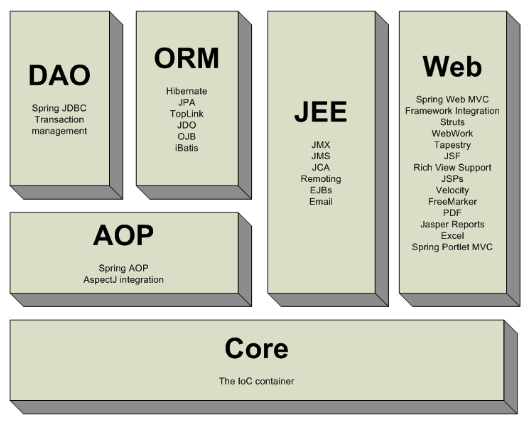
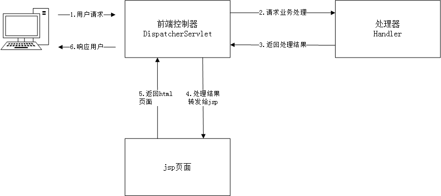
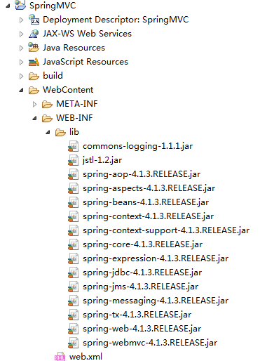
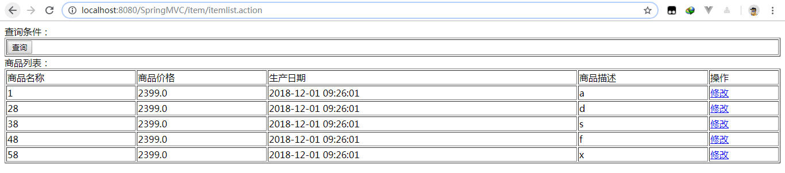
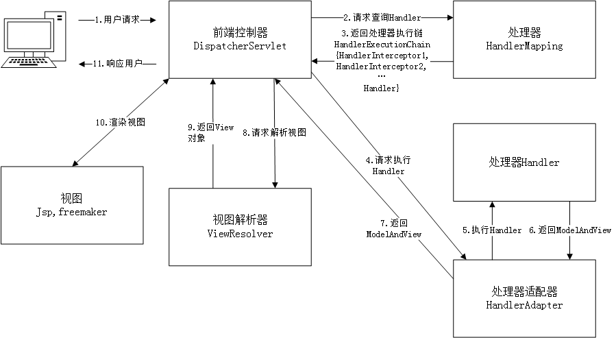
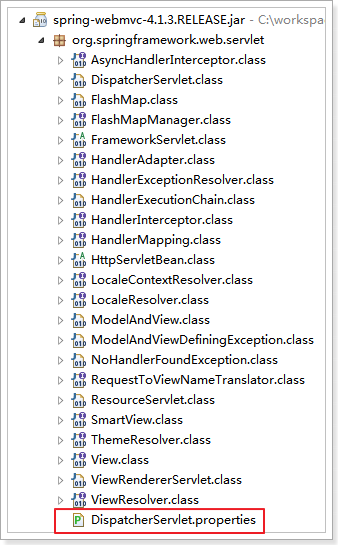

Spring web mvc和Struts2都属于表现层的框架,它是Spring框架的一部分,我们可以从Spring的整体结构中看得出来,如下图：


SpringMVC简单的处理流程图:

前端控制器可以说是SpringMVC的心脏，是核心部分。

# 创建入门程序
创建动态Web工程，导入相关jar包:


## 配置前端控制器

在`web.xml`中配置前端控制器:
```xml
  <!-- 前端控制器 -->
  <servlet>
  	<servlet-name>springmvc</servlet-name>
  	<servlet-class>org.springframework.web.servlet.DispatcherServlet</servlet-class>
    <!-- 默认找 /WEB-INF/[servlet的名称]-servlet.xml -->
  	<init-param>
  		<param-name>contextConfigLocation</param-name>
  		<param-value>classpath:springmvc.xml</param-value>
  	</init-param>
  </servlet>

  <servlet-mapping>
  	<servlet-name>springmvc</servlet-name>
  	<url-pattern>*.action</url-pattern>
  </servlet-mapping>
```

注意，在`<url-pattern>`配置时：
`/*`拦截所有，包括jsp和各种静态资源
`*.action`或者`*.do`只拦截以action和do结尾的请求
`/`拦截所有，但是不包括jsp

## 创建springmvc.xml配置文件

```xml
<?xml version="1.0" encoding="UTF-8"?>
<beans xmlns="http://www.springframework.org/schema/beans"
	xmlns:xsi="http://www.w3.org/2001/XMLSchema-instance" xmlns:p="http://www.springframework.org/schema/p"
	xmlns:context="http://www.springframework.org/schema/context"
	xmlns:mvc="http://www.springframework.org/schema/mvc"
	xsi:schemaLocation="http://www.springframework.org/schema/beans http://www.springframework.org/schema/beans/spring-beans-4.0.xsd
        http://www.springframework.org/schema/mvc http://www.springframework.org/schema/mvc/spring-mvc-4.0.xsd
        http://www.springframework.org/schema/context http://www.springframework.org/schema/context/spring-context-4.0.xsd">

   <!-- 扫描包下有@Controller @Service 注解的代码 -->
   <context:component-scan base-package="my.study.springmvc.controller">
   </context:component-scan>
</beans>
```
## 创建Controller，书写入门程序

```java
package my.study.springmvc.controller;

import java.util.ArrayList;
import java.util.Date;
import java.util.List;

import org.springframework.stereotype.Controller;
import org.springframework.web.bind.annotation.RequestMapping;
import org.springframework.web.servlet.ModelAndView;

import my.study.springmvc.pojo.Items;

@Controller
public class ItemController {	
	@RequestMapping(value = "/item/itemlist.action")
	public ModelAndView itemList(){		
		List<Items> list = new ArrayList<Items>();
		list.add(new my.study.springmvc.pojo.Items(1, "1", 2399f, new Date(), "a"));
		list.add(new Items(2, "28", 2399f, new Date(), "d"));
		list.add(new Items(3, "38", 2399f, new Date(), "s"));
		list.add(new Items(4, "48", 2399f, new Date(), "f"));
		list.add(new Items(5, "58", 2399f, new Date(), "x"));
		
		ModelAndView mav = new ModelAndView();
		mav.addObject("itemList", list);
		mav.setViewName("/WEB-INF/jsp/itemList.jsp");
		return mav;
	}	
}
```
在类上添加`@Controller`注解，把Controller交由Spring管理
`@RequestMapping(value = "请求地址")`该方法请求的地址,其中`.action`可以加也可以不加。
`ModelAndView`从字面意思就可以理解，是数据和视图

在`/WEB-INF/jsp/`路径下创建jsp，用于显示:
```html
<%@ page language="java" contentType="text/html; charset=UTF-8"
    pageEncoding="UTF-8"%>
<%@ taglib uri="http://java.sun.com/jsp/jstl/core" prefix="c" %>
<%@ taglib uri="http://java.sun.com/jsp/jstl/fmt"  prefix="fmt"%>
<!DOCTYPE html PUBLIC "-//W3C//DTD HTML 4.01 Transitional//EN" "http://www.w3.org/TR/html4/loose.dtd">
<html>
<head>
<meta http-equiv="Content-Type" content="text/html; charset=UTF-8">
<title>查询商品列表</title>
</head>
<body> 
<form action="${pageContext.request.contextPath }/item/queryitem.action" method="post">
查询条件：
<table width="100%" border=1>
<tr>
<td><input type="submit" value="查询"/></td>
</tr>
</table>
商品列表：
<table width="100%" border=1>
<tr>
	<td>商品名称</td>
	<td>商品价格</td>
	<td>生产日期</td>
	<td>商品描述</td>
	<td>操作</td>
</tr>
<c:forEach items="${itemList }" var="item">
<tr>
	<td>${item.name }</td>
	<td>${item.price }</td>
	<td><fmt:formatDate value="${item.createtime}" pattern="yyyy-MM-dd HH:mm:ss"/></td>
	<td>${item.detail }</td>
	
	<td><a href="${pageContext.request.contextPath }/itemEdit.action?id=${item.id}">修改</a></td>
</tr>
</c:forEach>
</table>
</form>
</body>
</html>
```

创建pojo：
```java
package my.study.springmvc.pojo;

import java.util.Date;

public class Items {
	
	private Integer id;

    private String name;

    private Float price;

    private String pic;

    private Date createtime;

    private String detail;
	
    public Items(Integer id, String name, Float price, Date createtime, String detail) {
		super();
		this.id = id;
		this.name = name;
		this.price = price;
		this.createtime = createtime;
		this.detail = detail;
	}
  //get/set...
}
```
启动服务器访问:


# SpringMVC架构

架构流程：
1、	用户发送请求至前端控制器DispatcherServlet
2、	DispatcherServlet收到请求调用HandlerMapping处理器映射器。
3、	处理器映射器根据请求url找到具体的处理器，生成处理器对象及处理器拦截器(如果有则生成)一并返回给DispatcherServlet。返回的是`包名+类名+方法名`
4、	DispatcherServlet通过HandlerAdapter处理器适配器调用处理器
5、	执行处理器(Controller，也叫后端控制器)。
6、	Controller执行完成返回ModelAndView
7、	HandlerAdapter将controller执行结果ModelAndView返回给DispatcherServlet
8、	DispatcherServlet将ModelAndView传给ViewReslover视图解析器
9、	ViewReslover解析后返回具体View
10、	DispatcherServlet对View进行渲染视图（即将模型数据填充至视图中）。
11、	DispatcherServlet响应用户

组件说明:
以下组件通常使用框架提供实现：
*	DispatcherServlet：前端控制器
用户请求到达前端控制器，它就相当于mvc模式中的c，dispatcherServlet是整个流程控制的中心，由它调用其它组件处理用户的请求，dispatcherServlet的存在降低了组件之间的耦合性。
*	HandlerMapping：处理器映射器
HandlerMapping负责根据用户请求url找到Handler即处理器，springmvc提供了不同的映射器实现不同的映射方式，例如：配置文件方式，实现接口方式，注解方式等。
*	Handler：处理器
Handler 是继DispatcherServlet前端控制器的后端控制器，在DispatcherServlet的控制下Handler对具体的用户请求进行处理。
由于Handler涉及到具体的用户业务请求，所以一般情况需要程序员根据业务需求开发Handler。

*	HandlAdapter：处理器适配器
通过HandlerAdapter对处理器进行执行，这是适配器模式的应用，通过扩展适配器可以对更多类型的处理器进行执行。

* ViewResolver：视图解析器
View Resolver负责将处理结果生成View视图，View Resolver首先根据逻辑视图名解析成物理视图名即具体的页面地址，再生成View视图对象，最后对View进行渲染将处理结果通过页面展示给用户。 

*	View：视图
springmvc框架提供了很多的View视图类型的支持，包括：jstlView、freemarkerView、pdfView等。我们最常用的视图就是jsp。
一般情况下需要通过页面标签或页面模版技术将模型数据通过页面展示给用户，需要由程序员根据业务需求开发具体的页面。

在springmvc的各个组件中，处理器映射器、处理器适配器、视图解析器称为springmvc的三大组件。
需要用户开发的组件有handler、view

## 默认加载的组件
我们没有做任何配置，就可以使用这些组件
因为框架已经默认加载这些组件了，配置文件位置如下图：



```
# Default implementation classes for DispatcherServlet's strategy interfaces.
# Used as fallback when no matching beans are found in the DispatcherServlet context.
# Not meant to be customized by application developers.

org.springframework.web.servlet.LocaleResolver=org.springframework.web.servlet.i18n.AcceptHeaderLocaleResolver

org.springframework.web.servlet.ThemeResolver=org.springframework.web.servlet.theme.FixedThemeResolver

org.springframework.web.servlet.HandlerMapping=org.springframework.web.servlet.handler.BeanNameUrlHandlerMapping,\
	org.springframework.web.servlet.mvc.annotation.DefaultAnnotationHandlerMapping

org.springframework.web.servlet.HandlerAdapter=org.springframework.web.servlet.mvc.HttpRequestHandlerAdapter,\
	org.springframework.web.servlet.mvc.SimpleControllerHandlerAdapter,\
	org.springframework.web.servlet.mvc.annotation.AnnotationMethodHandlerAdapter

org.springframework.web.servlet.HandlerExceptionResolver=org.springframework.web.servlet.mvc.annotation.AnnotationMethodHandlerExceptionResolver,\
	org.springframework.web.servlet.mvc.annotation.ResponseStatusExceptionResolver,\
	org.springframework.web.servlet.mvc.support.DefaultHandlerExceptionResolver

org.springframework.web.servlet.RequestToViewNameTranslator=org.springframework.web.servlet.view.DefaultRequestToViewNameTranslator

org.springframework.web.servlet.ViewResolver=org.springframework.web.servlet.view.InternalResourceViewResolver

org.springframework.web.servlet.FlashMapManager=org.springframework.web.servlet.support.SessionFlashMapManager
```

## 组件扫描器
使用组件扫描器省去在spring容器配置每个Controller类的繁琐。
使用`<context:component-scan>`自动扫描标记@Controller的控制器类，
在springmvc.xml配置文件中配置如下：
```xml
<!--  配置controller扫描包，多个包之间用,分隔
	扫描包下有@Controller @Service 注解的代码
-->
   <context:component-scan base-package="my.study.springmvc">
   </context:component-scan>
```
## 注解映射器和适配器

### 配置处理器映射器
注解式处理器映射器，对类中标记了@ResquestMapping的方法进行映射。根据@ResquestMapping定义的url匹配@ResquestMapping标记的方法，匹配成功返回HandlerMethod对象给前端控制器。
HandlerMethod对象中封装url对应的方法Method。 

从spring3.1版本开始，废除了DefaultAnnotationHandlerMapping的使用，推荐使用RequestMappingHandlerMapping完成注解式处理器映射。

在springmvc.xml配置文件中配置如下：
```xml
<!-- 配置处理器映射器 -->
<bean class="org.springframework.web.servlet.mvc.method.annotation.RequestMappingHandlerMapping" />
```

注解描述：
`@RequestMapping`：定义请求url到处理器功能方法的映射

### 配置处理器适配器
注解式处理器适配器，对标记@ResquestMapping的方法进行适配。

从spring3.1版本开始，废除了AnnotationMethodHandlerAdapter的使用，推荐使用RequestMappingHandlerAdapter完成注解式处理器适配。

在springmvc.xml配置文件中配置如下：
```xml
<!-- 配置处理器适配器 -->
<bean
	class="org.springframework.web.servlet.mvc.method.annotation.RequestMappingHandlerAdapter" />
```

### 注解驱动
直接配置处理器映射器和处理器适配器比较麻烦，可以使用注解驱动来加载。
SpringMVC使用`<mvc:annotation-driven>`自动加载RequestMappingHandlerMapping和RequestMappingHandlerAdapter
可以在springmvc.xml配置文件中使用`<mvc:annotation-driven>`替代注解处理器和适配器的配置。

```xml
<!-- 注解驱动 -->
<mvc:annotation-driven />
```

## 视图解析器
视图解析器使用SpringMVC框架默认的InternalResourceViewResolver，这个视图解析器支持JSP视图解析
在springmvc.xml配置文件中配置如下：
```xml
<!-- Example: prefix="/WEB-INF/jsp/", suffix=".jsp", viewname="test" -> 
		"/WEB-INF/jsp/test.jsp" -->
	<!-- 配置视图解析器 -->
	<bean
		class="org.springframework.web.servlet.view.InternalResourceViewResolver">
		<!-- 配置逻辑视图的前缀 -->
		<property name="prefix" value="/WEB-INF/jsp/" />
		<!-- 配置逻辑视图的后缀 -->
		<property name="suffix" value=".jsp" />
	</bean>
```
逻辑视图名需要在controller中返回ModelAndView指定，比如逻辑视图名为itemList，则最终返回的jsp视图地址:
“WEB-INF/jsp/itemList.jsp”

最终jsp物理地址：前缀+逻辑视图名+后缀
