在[SpringMVC学习笔记-二](https://homxuwang.github.io/2018/12/02/SpringMVC%E5%AD%A6%E4%B9%A0%E7%AC%94%E8%AE%B0-%E4%BA%8C/)的基础上继续进行开发
# 高级参数绑定

## 绑定数组
需求:在商品列表页面选中多个商品，然后删除。功能要求商品列表页面中的每个商品前有一个checkbok，选中多个商品后点击删除按钮把商品id传递给Controller，根据商品id删除商品信息。
前端页面代码进行修改，修改后的页面见附录。
Controller代码:
```java
//删除多个商品
	@RequestMapping(value = "/item/deleteItems.action" )
	public ModelAndView deleteItems(Integer[] ids) {
		
		ModelAndView mav = new ModelAndView();
		mav.setViewName("success");
		return mav;
	}
```
调试查看接收到值：
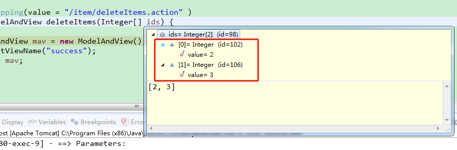

如果将数组作为pojo的内部属性名，则直接在POJO中添加该成员变量，名字与前台的`name`继续保持一致即可.
在`QueryVo`中添加私有成员变量: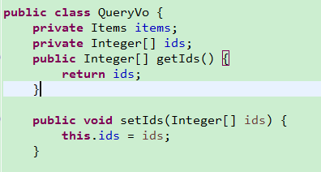

修改Controller: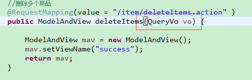

测试结果:
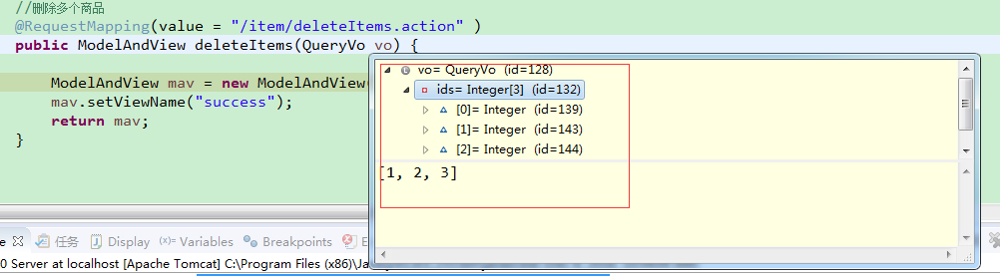

## 将表单的数据绑定到List

需求：实现商品数据的批量修改：
* 1. 在商品列表页面中可以对商品信息进行修改。
* 2. 可以批量提交修改后的商品数据。

修改`QueryVo.java`,添加Items的List属性:
```java
	...
	private Items items;
	private Integer[] ids;
	private List<Items> itemLists;
	//gets/sets...
```
在Controller中添加方法:
```java
//修改多个商品
	@RequestMapping(value = "/item/updatesItems.action" )
	public ModelAndView updatesItems(QueryVo vo) {
		
		ModelAndView mav = new ModelAndView();
		mav.setViewName("success");
		return mav;
	}
```
修改jsp页面,name属性必须是list属性名+下标+元素属性。:
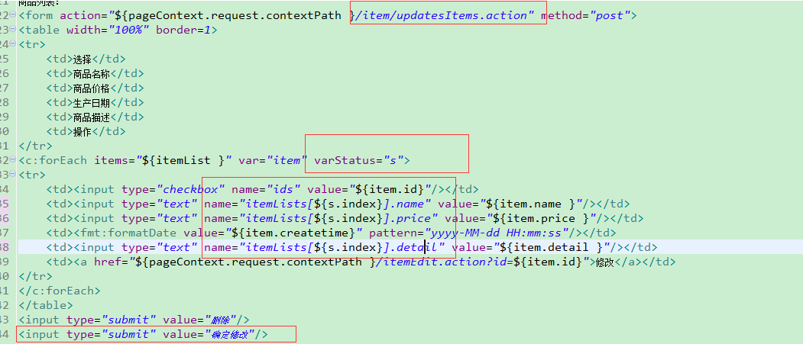
${current}	当前这次迭代的（集合中的）项
${status.first}	判断当前项是否为集合中的第一项，返回值为true或false
${status.last}	判断当前项是否为集合中的最
varStatus属性常用参数总结下：
${status.index}	输出行号，从0开始。
${status.count}	输出行号，从1开始。
${status.后一项，返回值为true或false
begin、end、step分别表示：起始序号，结束序号，跳跃步伐。

测试:
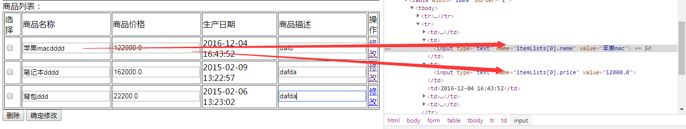


`注意`:接收List时，只能放在包装类的属性中，不能直接接收List

# RequestMapping
通过@RequestMapping注解可以定义不同的处理器映射规则。
## URL路径映射
@RequestMapping(value="item")或@RequestMapping("/item"）
value的值是数组，可以将多个url映射到同一个方法
如:
```java
@RequestMapping(value = { "itemList", "itemListAll" })
```
## 添加在类上面
在class上添加@RequestMapping(url)指定通用请求前缀， 限制此类下的所有方法请求url必须以请求前缀开头
## 请求方法限定
除了可以对url进行设置，还可以限定请求进来的方法
* 限定GET方法
@RequestMapping(method = RequestMethod.GET)

* 如果通过POST访问则报错：
HTTP Status 405 - Request method 'POST' not supported

例如：
@RequestMapping(value = "itemList",method = RequestMethod.POST)

* 限定POST方法
@RequestMapping(method = RequestMethod.POST)

如果通过GET访问则报错：
HTTP Status 405 - Request method 'GET' not supported

* GET和POST都可以
@RequestMapping(method = {RequestMethod.GET,RequestMethod.POST})

# Controller方法返回值
## 返回ModelAndView
controller方法中定义ModelAndView对象并返回，对象中可添加model数据、指定view。
参考前面的代码
## 返回void
在Controller方法形参上可以定义request和response，使用request或response指定响应结果：
* 1、使用request转发页面，如下：
request.getRequestDispatcher("页面路径").forward(request, response);
request.getRequestDispatcher("/WEB-INF/jsp/success.jsp").forward(request, response);

* 2、可以通过response页面重定向：
response.sendRedirect("url")
response.sendRedirect("/springmvc-web2/itemEdit.action");

* 3、可以通过response指定响应结果，例如响应json数据如下：
response.getWriter().print("{\"abc\":123}");

异步请求使用void比较合适

```java
/**
 * 返回void测试
 * 
 * @param request
 * @param response
 * @throws Exception
 */
@RequestMapping("queryItem")
public void queryItem(HttpServletRequest request, HttpServletResponse response) throws Exception {
	// 1 使用request进行转发
	// request.getRequestDispatcher("/WEB-INF/jsp/success.jsp").forward(request,
	// response);

	// 2 使用response进行重定向到编辑页面
	// response.sendRedirect("/springmvc-web2/itemEdit.action");

	// 3 使用response直接显示
	response.getWriter().print("{\"abc\":123}");
}
```
## 返回字符串
### 逻辑视图名
controller方法返回字符串可以指定逻辑视图名，通过视图解析器解析为物理视图地址。
```java
//指定逻辑视图名，经过视图解析器解析为jsp物理路径：/WEB-INF/jsp/itemList.jsp
return "itemList";
```
### Redirect重定向
Contrller方法返回字符串可以重定向到一个url地址
如下商品修改提交后重定向到商品编辑页面。
```java
/**
 * 更新商品
 * 
 * @param item
 * @return
 */
@RequestMapping("updateItem")
public String updateItemById(Item item) {
	// 更新商品
	this.itemService.updateItemById(item);

	// 修改商品成功后，重定向到商品编辑页面
	// 重定向后浏览器地址栏变更为重定向的地址，
	// 重定向相当于执行了新的request和response，所以之前的请求参数都会丢失
	// 如果要指定请求参数，需要在重定向的url后面添加 ?itemId=1 这样的请求参数
	return "redirect:/itemEdit.action?itemId=" + item.getId();
}
```

### forward转发
Controller方法执行后继续执行另一个Controller方法
如下商品修改提交后转向到商品修改页面，修改商品的id参数可以带到商品修改方法中。
```java
/**
 * 更新商品
 * 
 * @param item
 * @return
 */
@RequestMapping("updateItem")
public String updateItemById(Item item) {
	// 更新商品
	this.itemService.updateItemById(item);

	// 修改商品成功后，重定向到商品编辑页面
	// 重定向后浏览器地址栏变更为重定向的地址，
	// 重定向相当于执行了新的request和response，所以之前的请求参数都会丢失
	// 如果要指定请求参数，需要在重定向的url后面添加 ?itemId=1 这样的请求参数
	// return "redirect:/itemEdit.action?itemId=" + item.getId();

	// 修改商品成功后，继续执行另一个方法
	// 使用转发的方式实现。转发后浏览器地址栏还是原来的请求地址，
	// 转发并没有执行新的request和response，所以之前的请求参数都存在
	return "forward:/itemEdit.action";

}
//结果转发到editItem.action，request可以带过去
return "forward: /itemEdit.action";
```
# 异常处理器
springmvc在处理请求过程中出现异常信息交由异常处理器进行处理，自定义异常处理器可以实现一个系统的异常处理逻辑。

## 异常处理思路
系统中异常包括两类：预期异常和运行时异常RuntimeException，前者通过捕获异常从而获取异常信息，后者主要通过规范代码开发、测试通过手段减少运行时异常的发生。
系统的dao、service、controller出现都通过throws Exception向上抛出，最后由springmvc前端控制器交由异常处理器进行异常处理，如下图:

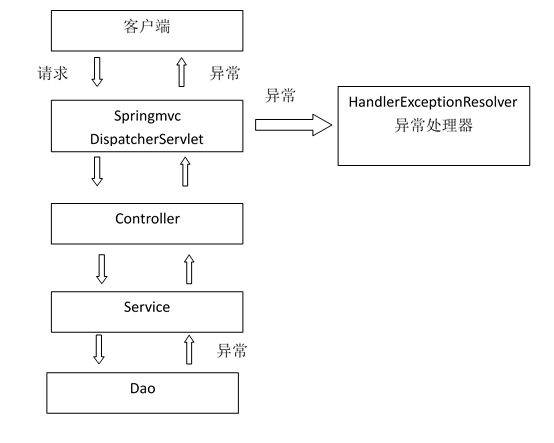
## 自定义异常类
为了区别不同的异常,通常根据异常类型进行区分，这里我们创建一个自定义系统异常。
如果controller、service、dao抛出此类异常说明是系统预期处理的异常信息。
```java
public class MyException extends Exception {
	// 异常信息
	private String message;

	public MyException() {
		super();
	}

	public MyException(String message) {
		super();
		this.message = message;
	}

	public String getMessage() {
		return message;
	}

	public void setMessage(String message) {
		this.message = message;
	}
```
## 自定义异常处理器
```java
package my.study.springmvc.exception;

import java.io.PrintWriter;
import java.io.StringWriter;
import java.io.Writer;

import javax.servlet.http.HttpServletRequest;
import javax.servlet.http.HttpServletResponse;

import org.springframework.web.servlet.HandlerExceptionResolver;
import org.springframework.web.servlet.ModelAndView;

public class CustomExceptionResolver implements HandlerExceptionResolver{

	@Override
	public ModelAndView resolveException(HttpServletRequest request, 
			HttpServletResponse response,
			Object obj,
			Exception e) {
		// 定义异常信息
				String msg;

				// 判断异常类型
				if (e instanceof MyException) {
					// 如果是自定义异常，读取异常信息
					msg = e.getMessage();
				} else {
					// 如果是运行时异常，则取错误堆栈，从堆栈中获取异常信息
					Writer out = new StringWriter();
					PrintWriter s = new PrintWriter(out);
					e.printStackTrace(s);
					msg = out.toString();

				}
				// 把错误信息发给相关人员,邮件,短信等方式
				// TODO

				// 返回错误页面，给用户友好页面显示错误信息
				ModelAndView modelAndView = new ModelAndView();
				modelAndView.addObject("msg", msg);
				modelAndView.setViewName("error");

				return modelAndView;
	}
}
```
## 异常处理器配置
在`springmvc.xml`中：
```xml
 <!-- SpringMVC异常处理器 -->
    <bean class="my.study.springmvc.exception.CustomExceptionResolver" />
```
## 错误页面
`error.jsp`:
```jsp
<%@ page language="java" contentType="text/html; charset=ISO-8859-1"
    pageEncoding="ISO-8859-1"%>
<!DOCTYPE html PUBLIC "-//W3C//DTD HTML 4.01 Transitional//EN" "http://www.w3.org/TR/html4/loose.dtd">
<html>
<head>
<meta http-equiv="Content-Type" content="text/html; charset=ISO-8859-1">
<title>Insert title here</title>
</head>
<body>
${error }
</body>
</html>
```
## 异常测试 
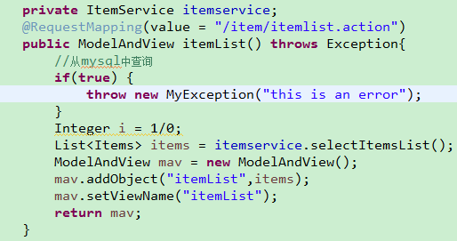
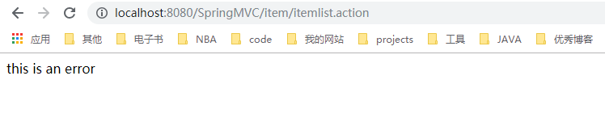

# 上传图片
## 配置虚拟目录
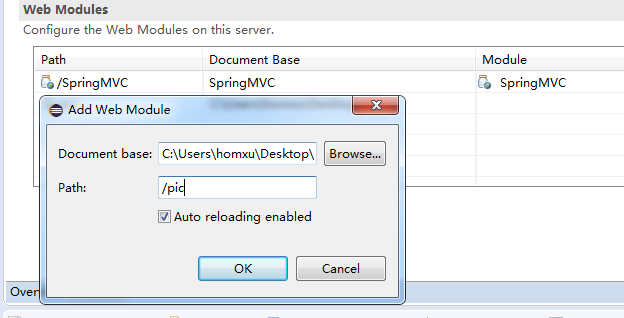
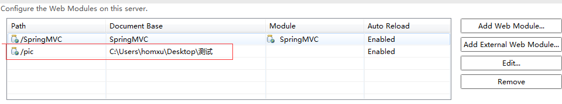
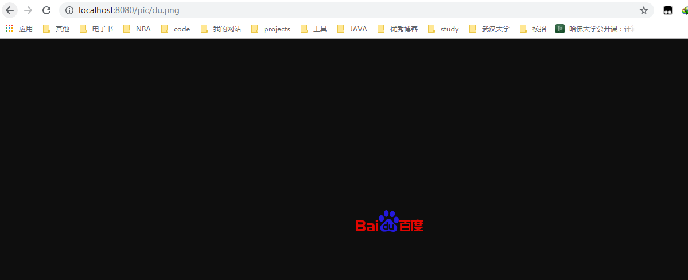
## 加入jar包
实现图片上传需要加入的jar包，把两个jar包放到工程的lib文件夹中，如下图：
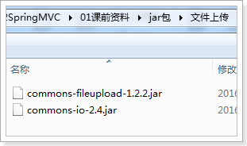
## jsp页面修改
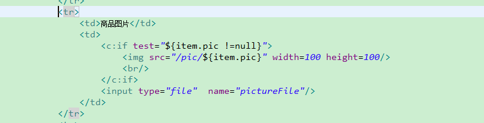
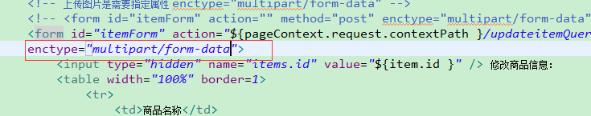
## 配置上传解析器
在springmvc.xml中配置文件上传解析器
```xml
<!-- 文件上传,id必须设置为multipartResolver -->
<bean id="multipartResolver"
	class="org.springframework.web.multipart.commons.CommonsMultipartResolver">
	<!-- 设置文件上传大小 -->
	<property name="maxUploadSize" value="5000000" />
</bean>
```
## 图片上传
更改代码
```java
//使用包装的pojo
	@RequestMapping(value = "/updateitemQueryVo.action")
	public String itemEdit(QueryVo vo,MultipartFile pictureFile) throws Exception {
		//图片上传
		//设置图片名称，不能重复，可以使用uuid
		String picName = UUID.randomUUID().toString();
		
		//获取文件名
		String oriName = pictureFile.getOriginalFilename();
		//获取图片后缀名
		String extName = oriName.substring(oriName.lastIndexOf("."));
		//开始上传
		pictureFile.transferTo(new File("C:\\Users\\homxu\\Desktop\\测试\\"+picName+extName));
		vo.getItems().setPic(picName+extName);
		//更新信息
		itemservice.updateItemsByPojo(vo.getItems());
		
		return "forward:/itemEdit.action?id="+vo.getItems().getId() ;
	}
```
测试可能报错，是因为之前用的日期格式测试不对，在相应代码处改过来即可
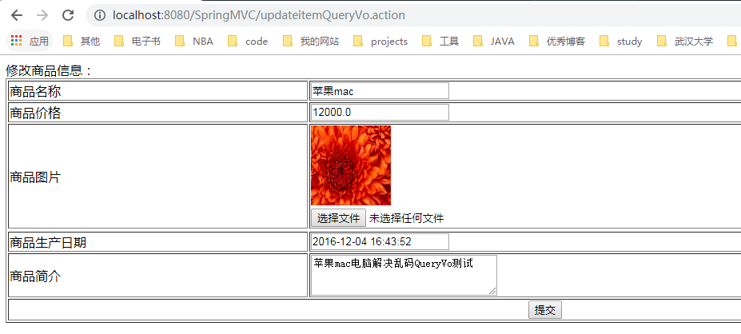

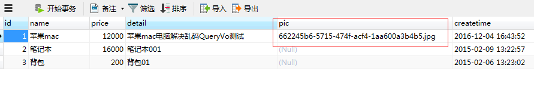

# 附录

## itemList.jsp
```jsp
<%@ page language="java" contentType="text/html; charset=UTF-8"
    pageEncoding="UTF-8"%>
<%@ taglib uri="http://java.sun.com/jsp/jstl/core" prefix="c" %>
<%@ taglib uri="http://java.sun.com/jsp/jstl/fmt"  prefix="fmt"%>
<!DOCTYPE html PUBLIC "-//W3C//DTD HTML 4.01 Transitional//EN" "http://www.w3.org/TR/html4/loose.dtd">
<html>
<head>
<meta http-equiv="Content-Type" content="text/html; charset=UTF-8">
<title>查询商品列表</title>
</head>
<body> 
<form action="${pageContext.request.contextPath }/item/queryitem.action" method="post">
查询条件：
<table width="100%" border=1>
<tr>
<td><input type="submit" value="查询"/></td>
</tr>
</table>
</form>

商品列表：
<form action="${pageContext.request.contextPath }/item/deleteItems.action" method="post">
<table width="100%" border=1>
<tr>
	<td>选择</td>
	<td>商品名称</td>
	<td>商品价格</td>
	<td>生产日期</td>
	<td>商品描述</td>
	<td>操作</td>
</tr>
<c:forEach items="${itemList }" var="item">
<tr>
	<td><input type="checkbox" name="ids" value="${item.id}"/></td>
	<td>${item.name }</td>
	<td>${item.price }</td>
	<td><fmt:formatDate value="${item.createtime}" pattern="yyyy-MM-dd HH:mm:ss"/></td>
	<td>${item.detail }</td>
	
	<td><a href="${pageContext.request.contextPath }/itemEdit.action?id=${item.id}">修改</a></td>

</tr>
</c:forEach>
</table>
<input type="submit" value="删除"/>
</form>
</body>
</html>
```