在不使用Spring的情况下，创建sqlSessionFactory需要两步:
```java
//1.加载核心配置文件
String resource = "sqlMapConfig.xml";
InputStream in = Resources.getResourceAsStream(resource);
//2.创建SqlSessionFactory
SqlSessionFactory sqlSessionFactory = new SqlSessionFactoryBuilder().build(in);
```

原始Dao开发时，每一个实现类都要注入一个工厂，然后工厂调用`openSession()`方法创建SqlSession对象，然后sqlSession再执行sql语句，这一系列存在大量重复代码。

# 整合思路
1、SqlSessionFactory对象应该放到spring容器中作为单例存在。
2、传统dao的开发方式中，应该从spring容器中获得sqlsession对象。
3、Mapper代理形式中，应该从spring容器中直接获得mapper的代理对象。
4、数据库的连接以及数据库连接池事务管理都交给spring容器来完成。

# 依赖包
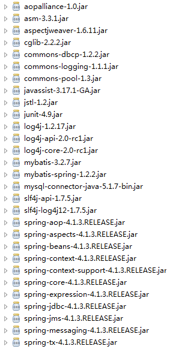
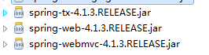

# 创建配置文件
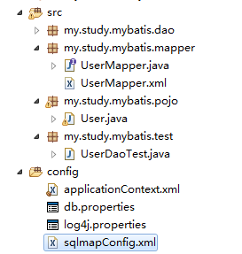
`applicationContext.xml`:
```xml
<?xml version="1.0" encoding="UTF-8"?>
<beans xmlns="http://www.springframework.org/schema/beans"
	xmlns:context="http://www.springframework.org/schema/context" xmlns:p="http://www.springframework.org/schema/p"
	xmlns:aop="http://www.springframework.org/schema/aop" xmlns:tx="http://www.springframework.org/schema/tx"
	xmlns:xsi="http://www.w3.org/2001/XMLSchema-instance"
	xsi:schemaLocation="http://www.springframework.org/schema/beans http://www.springframework.org/schema/beans/spring-beans-4.0.xsd
	http://www.springframework.org/schema/context http://www.springframework.org/schema/context/spring-context-4.0.xsd
	http://www.springframework.org/schema/aop http://www.springframework.org/schema/aop/spring-aop-4.0.xsd http://www.springframework.org/schema/tx http://www.springframework.org/schema/tx/spring-tx-4.0.xsd
	http://www.springframework.org/schema/util http://www.springframework.org/schema/util/spring-util-4.0.xsd">

	<!-- 加载配置文件 -->
	<context:property-placeholder location="classpath:db.properties"/>
	<!-- dbcp数据源(配置数据库连接池) -->
	<bean id="dataSource" class="org.apache.commons.dbcp.BasicDataSource" destroy-method="close">
    <property name="driverClassName" value="${jdbc.driver}" />
		<property name="url" value="${jdbc.url}" />
		<property name="username" value="${jdbc.username}" />
		<property name="password" value="${jdbc.password}" />
		<property name="maxActive" value="10" />
		<property name="maxIdle" value="5" />
	</bean>
	<!-- 配置SqlSessionFactory -->
	<bean id="sqlSessionFactory" class="org.mybatis.spring.SqlSessionFactoryBean">
		<!-- 配置mybatis核心配置文件 -->
		<property name="configLocation" value="classpath:sqlmapConfig.xml"/>
		<!-- 配置数据源 -->
		<property name="dataSource" ref="dataSource" />
	</bean>
</beans>
```
`maxActive`表示连接池最大连接数，`maxIdle`表示最大空闲

`db.properties`:
```
jdbc.driver=com.mysql.jdbc.Driver
jdbc.url=jdbc:mysql://localhost:3306/mybatis
jdbc.username=root
jdbc.password=12345
```
`log4j.properties`:
```
# Global logging configuration
log4j.rootLogger=DEBUG, stdout
# Console output...
log4j.appender.stdout=org.apache.log4j.ConsoleAppender
log4j.appender.stdout.layout=org.apache.log4j.PatternLayout
log4j.appender.stdout.layout.ConversionPattern=%5p [%t] - %m%n

```

`sqlmapConfig.xml`

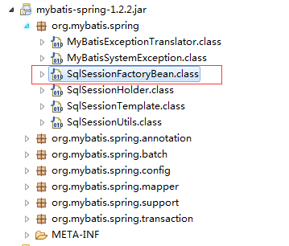

# Mapper代理形式开发dao

## 配置mapper代理
程序结构:


```java
package my.study.mybatis.mapper;

import my.study.mybatis.pojo.User;

public interface UserMapper {
	public User selectUserById(Integer id);
}
```
`applicationContext.xml`:
```xml
<!-- Mpper动态代理开发 -->
<bean id="userMapper" class="org.mybatis.spring.mapper.MapperFactoryBean">
	<property name="sqlSessionFactory" ref="sqlSessionFactoryBean"/>
	<property name="mapperInterface" value="my.study.mybatis.mapper.UserMapper"/>
</bean>
```
`sqlmapConfig.xml`:
```xml
<?xml version="1.0" encoding="UTF-8"?>
<!DOCTYPE mapper
PUBLIC "-//mybatis.org//DTD Mapper 3.0//EN"
"http://mybatis.org/dtd/mybatis-3-mapper.dtd">
<mapper namespace="my.study.mybatis.mapper.UserMapper">
	<!-- 根据用户id查询 -->
	<select id="selectUserById" parameterType="Integer" resultType="my.study.mybatis.pojo.User">
		select * from user where id = #{id}
	</select>
</mapper>
```

```java
package my.study.mybatis.pojo;

import java.io.Serializable;
import java.util.Date;

public class User implements Serializable {
	
	private static final long serialVersionUID = 1L;
	private Integer id;
	private String username;
	private String sex;
	private Date birthday;
	private String address;
	//get/set...
}
```

测试代码：
```java
package my.study.mybatis.test;

import org.junit.Before;
import org.junit.Test;
import org.springframework.context.ApplicationContext;
import org.springframework.context.support.ClassPathXmlApplicationContext;

import my.study.mybatis.mapper.UserMapper;
import my.study.mybatis.pojo.User;

public class UserDaoTest {
	private ApplicationContext context;
	
	@Before
	public void setUp() throws Exception {
		this.context = new ClassPathXmlApplicationContext("classpath:applicationContext.xml");
	}
	
	@Test
	public void testQueryUserById() {
		UserMapper mapper = (UserMapper) this.context.getBean("userMapper");
		User user = mapper.selectUserById(1);
		System.out.println(user);			
	}
}
```
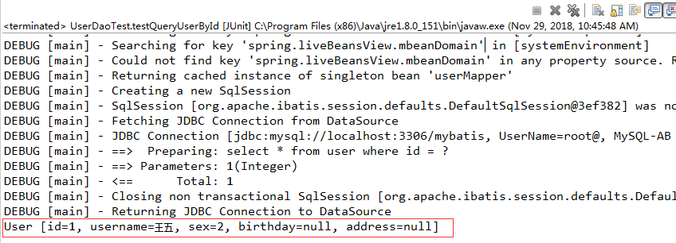

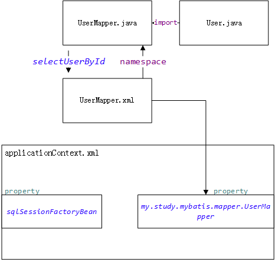

## 扫描包形式配置mapper
使用扫描方式不需要手动再注入工厂，它会扫描spring中配置的工厂,只需制定基本包就可以
```xml
<!-- Mapper动态代理开发 扫描包 -->
<bean class="org.mybatis.spring.mapper.MapperScannerConfigurer">
	<!-- 配置基本包 -->
	<property name="basePackage" value="my.study.mybatis.mapper"/>
</bean>
```
使用这种方式，每个mapper代理对象的id就是类名，首字母小写

注解掉之前配置的Mpper动态代理开发:
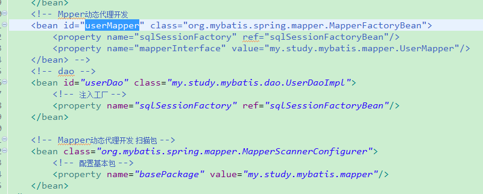

使用扫描方式进行注入，不需要指定id,没有id的情况下，无法指定id，则需要指定实现类:
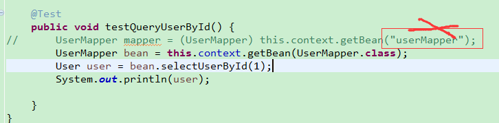
然后进行测试:
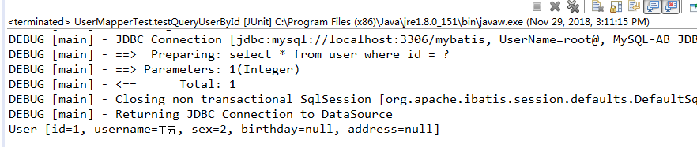
# 传统dao的开发方式

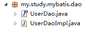

`UserDao`接口:
```java
package my.study.mybatis.dao;

import my.study.mybatis.pojo.User;

public interface UserDao {
	User selectUserById(int id);
}
```

`UserDaoImpl`类:
```java
package my.study.mybatis.dao;

import org.apache.ibatis.session.SqlSession;
import org.mybatis.spring.support.SqlSessionDaoSupport;

import my.study.mybatis.pojo.User;
//继承SqlSessionDaoSupport可以不用再在此类声明工厂，而是交给父类
public class UserDaoImpl extends SqlSessionDaoSupport implements UserDao{
	@Override
	public User selectUserById(int id) {
		// 获取SqlSession
		SqlSession sqlSession = super.getSqlSession();

		// 使用SqlSession执行操作
		User user = sqlSession.selectOne("selectUserById", id);

		// 不要关闭sqlSession

		return user;
	}
}
```

`UserDaoImpl`继承`SqlSessionDaoSupport`可以使Spring在父类创建工厂

`sqlmapConfig.xml`配置:
```xml
<?xml version="1.0" encoding="UTF-8" ?>
<!DOCTYPE configuration
PUBLIC "-//mybatis.org//DTD Config 3.0//EN"
"http://mybatis.org/dtd/mybatis-3-config.dtd">
<configuration>
	<mappers>
		<package name="my.study.mybatis.mapper"/>
	</mappers>

</configuration>
```

`applicationContext.xml`:
```xml
<!-- dao -->
	<bean id="userDao" class="my.study.mybatis.dao.UserDaoImpl">
		<!-- 注入工厂 -->
		<property name="sqlSessionFactory" ref="sqlSessionFactoryBean"/>
	</bean>
```
书写测试类`UserDaoTest.java`:
```java
package my.study.mybatis.test;

import org.junit.Before;
import org.junit.Test;
import org.springframework.context.ApplicationContext;
import org.springframework.context.support.ClassPathXmlApplicationContext;

import my.study.mybatis.dao.UserDao;
import my.study.mybatis.pojo.User;

public class UserDaoTest {
	private ApplicationContext context;
	
	@Before
	public void setUp() throws Exception {
		this.context = new ClassPathXmlApplicationContext("classpath:applicationContext.xml");
	}
	
	@Test
	public void testQueryUserById() {
		// 获取userDao
		UserDao userDao = this.context.getBean(UserDao.class);

		User user = userDao.selectUserById(1);
		System.out.println(user);
	}
}
```
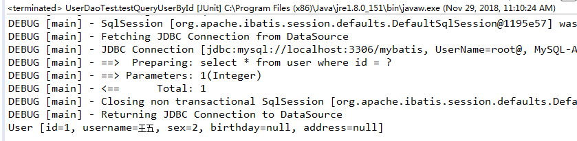

# 逆向工程
使用官方网站的Mapper自动生成工具mybatis-generator-core-1.3.2来生成po类和Mapper映射文件
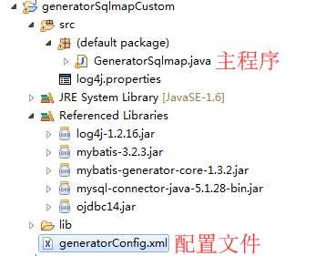

运行时，主程序会读取配置文件，进行生成

配置文件`generatorConfig.xml`:
```xml
<?xml version="1.0" encoding="UTF-8"?>
<!DOCTYPE generatorConfiguration
  PUBLIC "-//mybatis.org//DTD MyBatis Generator Configuration 1.0//EN"
  "http://mybatis.org/dtd/mybatis-generator-config_1_0.dtd">

<generatorConfiguration>
	<!-- id随便取 targetRuntime是MyBatis3版本-->
	<context id="testTables" targetRuntime="MyBatis3">
		<commentGenerator>
			<!-- 是否去除自动生成的注释 true：是 ： false:否 -->
			<property name="suppressAllComments" value="true" />
		</commentGenerator>
		<!--数据库连接的信息：驱动类、连接地址、用户名、密码 -->
		<jdbcConnection driverClass="com.mysql.jdbc.Driver"
			connectionURL="jdbc:mysql://localhost:3306/mybatis" userId="root"
			password="12345">
		</jdbcConnection>
		<!-- <jdbcConnection driverClass="oracle.jdbc.OracleDriver"
			connectionURL="jdbc:oracle:thin:@127.0.0.1:1521:yycg" 
			userId="yycg"
			password="yycg">
		</jdbcConnection> -->

		<!-- 默认false，把JDBC DECIMAL 和 NUMERIC 类型解析为 Integer，为 true时把JDBC DECIMAL 和 
			NUMERIC 类型解析为java.math.BigDecimal -->
		<javaTypeResolver>
			<property name="forceBigDecimals" value="false" />
		</javaTypeResolver>

		<!-- targetProject:生成PO类的位置 -->
		<javaModelGenerator targetPackage="my.study.mybatis.pojo"
			targetProject=".\src">
			<!-- enableSubPackages:是否让schema作为包的后缀 -->
			<property name="enableSubPackages" value="false" />
			<!-- 从数据库返回的值被清理前后的空格 -->
			<property name="trimStrings" value="true" />
		</javaModelGenerator>
        <!-- targetProject:mapper映射文件生成的位置 -->
		<sqlMapGenerator targetPackage="my.study.mybatis.mapper" 
			targetProject=".\src">
			<!-- enableSubPackages:是否让schema作为包的后缀 -->
			<property name="enableSubPackages" value="false" />
		</sqlMapGenerator>
		<!-- targetPackage：mapper接口生成的位置 -->
		<javaClientGenerator type="XMLMAPPER"
			targetPackage="my.study.mybatis.mapper" 
			targetProject=".\src">
			<!-- enableSubPackages:是否让schema作为包的后缀 -->
			<property name="enableSubPackages" value="false" />
		</javaClientGenerator>
		<!-- 指定数据库表 -->
		<table schema="" tableName="user"></table>
		<table schema="" tableName="orders"></table>
		
		<!-- 有些表的字段需要指定java类型
		 <table schema="" tableName="user">
			<columnOverride column="id" javaType="Long" />
		</table> -->
	</context>
</generatorConfiguration>
```
主程序:
```java


import java.io.File;
import java.io.IOException;
import java.util.ArrayList;
import java.util.List;

import org.mybatis.generator.api.MyBatisGenerator;
import org.mybatis.generator.config.Configuration;
import org.mybatis.generator.config.xml.ConfigurationParser;
import org.mybatis.generator.exception.XMLParserException;
import org.mybatis.generator.internal.DefaultShellCallback;

public class GeneratorSqlmap {

	public void generator() throws Exception{

		List<String> warnings = new ArrayList<String>();
		boolean overwrite = true;
		//指定逆向工程配置文件
		File configFile = new File("generatorConfig.xml"); 
		ConfigurationParser cp = new ConfigurationParser(warnings);
		Configuration config = cp.parseConfiguration(configFile);
		DefaultShellCallback callback = new DefaultShellCallback(overwrite);
		MyBatisGenerator myBatisGenerator = new MyBatisGenerator(config,
				callback, warnings);
		myBatisGenerator.generate(null);

	} 
	public static void main(String[] args) throws Exception {
		try {
			GeneratorSqlmap generatorSqlmap = new GeneratorSqlmap();
			generatorSqlmap.generator();
		} catch (Exception e) {
			e.printStackTrace();
		}
		
	}

}
```

在主程序运行,查看日志:
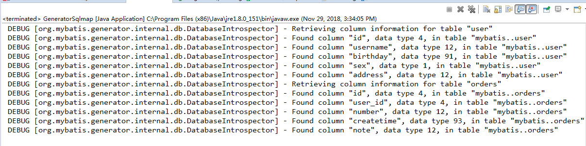
刷新后，可以看到已经生成了对应的文件:
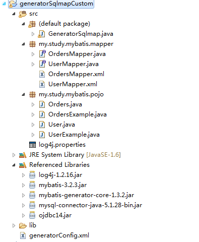

1.逆向工程生成的代码只能做单表查询
2.不能在生成的代码上进行扩展，因为如果数据库变更，需要重新使用逆向工程生成代码，原来编写的代码就被覆盖了。
3.一张表会生成4个文件
4.`*Example.java`文件中封装了很多方便的方法可以用来调用