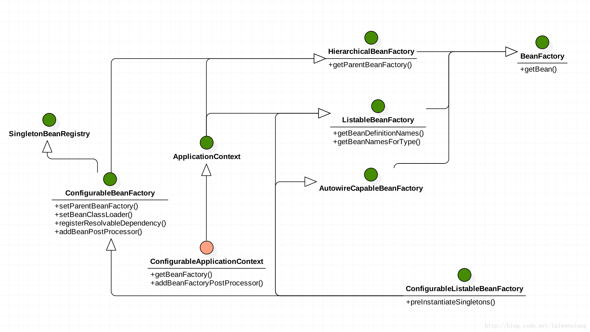

 Spring是一个一站式框架。Spring可以看做是一个容器，所有对象都可以在其中进行管理

# Spring 搭建基本环境

首先导入Spring所需依赖包：


创建一个对象用于测试：


```java
package my.study.bean;

public class User {	
	private String name;
	private Integer age;
	public User(){
		System.out.println("User 的空参构造方法被调用");
	}
	public String getName() {
		return name;
	}
	public void setName(String name) {
		this.name = name;
	}
	public Integer getAge() {
		return age;
	}
	public void setAge(Integer age) {
		this.age = age;
	}		
}
```

然后需要书写配置文件，并将创建好的对象注册到Spring容器中。
建议将配置文件放到源码文件夹根目录(/src)下，文件名可以任意取。

导入配置文件的约束：Preference中搜索`XML Catlog`，打开后点击`Add`->`FileSystem...`
选择Spring解压目录下的`schema`->`beans`->`spring-beans-4.2.xsd`(选择最新版本(我的是4.2)即可)

继续选择`Kye Type`->`Scheme location`：
把`Location`中`spring-beans-4.2.xsd`文件名复制，追加到`Key`中(注意补一个`/`).


然后在配置文件中，输入`<beans></beans>`后，在Eclipse下切换到设计视图，选中`beans`->右键选中`Edit Namespaces`->点击`Add`->勾选`xsi`->点击ok->继续点击`Add`->选择`Specify New Namespace`->选择`Browse`->选择`Select XML Catalog entry`->找到刚才上图的Key->`Namespace Name`填写Key中`http://www.spri.....beans`的内容，`Prefix`不用写


导入成功

最后将对象注册到容器进行测试：


# ApplicationContext&BeanFactory




简单介绍：
其中BeanFactory作为最顶层的接口，功能较为单一。BeanFactory接口实现类的容器，特点是每次获得对象时才会创建对象。

ApplicationContext在每次容器启动时，就会创建容器中的所有对象

# Spring的配置

## bean 元素
以前面配置User对象为例。
>`bean`标签：
>使用该元素描述需要spring容器管理的对象
>class属性:被管理对象的完整类名.
>name属性:给被管理的对象起个名字.获得对象时根据该名称获得对象. 特点:可以重复.可以使用特殊字符.
>id属性: 与name属性一样.特点:名称不可重复.不能使用特殊字符.

### Scope属性
#### singleton(默认值)
单例对象.被标识为单例的对象在spring容器中只会存在一个实例，即默认为：
```
<bean name="User" class="my.study.bean.User" scope="singleton"></bean>
```
测试：
```java
@Test
public void test1() {
  //1.创建容器对象
  ApplicationContext ac = new ClassPathXmlApplicationContext("my/study/b_create/applicationContext.xml");
  //2.在容器中寻找"User"对象
  User u = (User) ac.getBean("User");
  User u1 = (User) ac.getBean("User");
  //3打印user对象
  System.out.println(u == u1);
}
```
结果
```
true
```
#### prototype
多例原型.被标识为多例的对象,每次再获得才会创建.每次创建都是新的对象.
注意，当整合struts2时,ActionBean必须配置为多例的。因为Action对象是由Spring容器管理的，struts2每次请求都会创建一个Action	
将配置文件改为:
```
<bean name="User" class="my.study.bean.User" scope="prototype"></bean>
```
继续用test1()测试，打印结果为`false`
#### request
在web环境下.对象与request生命周期一致.即每当请求完成，对象就会在Spring中移除
#### session
在web环境下,对象与session生命周期一致.即在一次会话中，会话完成后,对象就会在Spring中被移除
### 生命周期属性
 
如果希望Bean在创建时有初始化方法，可以指定Bean中的一个方法为其初始化方法，Spring会在对象创建完成后调用。即`init-method`
同样可以配置一个销毁方法，Spring容器在关闭前调用此方法。`destory-method`
注意`scope="prototype"`不能和`destory-method`标签一起使用

## Spring的分模块配置
在主配置文件中引入其他配置文件，
```
<import resource=""/>
```
目录写在src目录下的全包名和配置文件名
## Spring创建对象的方式
创建新的配置文件和类进行测试


`UserFactory`:
```java
package my.study.bean;

public class UserFactory {

	public static User createUser() {
		System.out.println("静态工厂方式创建User");		
		return new User();
	}
	
	public User createUser2() {
		System.out.println("实例工厂方式创建User");		
		return new User();
	}
}
```

`applicationContext.xml`:
```
<!-- 方式1：空参构造创建 -->
	<bean name="User" class="my.study.bean.User"></bean>
	<!-- 方式2：静态工厂创建
		调用UserFactory的createUser方法创建名为user2的对象，放入容器
	 -->
	<bean name="User2" class="my.study.bean.UserFactory" factory-method="createUser"></bean>
	
	<!-- 方式3：实例工厂创建
		调用UserFactory的createUser方法创建名为user3的对象，放入容器
	 -->
	<bean name="User3" factory-bean="userFactory" factory-method="createUser2"></bean>
	<bean name="userFactory" class="my.study.bean.UserFactory"></bean>
```

### 空参构造方式
空参构造方式就是最开始配置bean时的构造方式，前面已经有结果。当然这里要注意，创建容器对象时，传参时要传入的配置文件需要加上包名
```
ApplicationContext ac = new ClassPathXmlApplicationContext("my/study/b_create/applicationContext.xml");
```
### 静态工厂方式
```java
@Test
//静态工厂方式
public void test2() {
  //1.创建容器对象
  ApplicationContext ac = new ClassPathXmlApplicationContext("my/study/b_create/applicationContext.xml");
  //2.向容器请求"user"对象
  User u = (User) ac.getBean("User2");
  //3打印user对象
  System.out.println(u);
}
```
### 实例工厂方式
```java
@Test
//动态工厂方式
public void test3() {
  //1.创建容器对象
  ApplicationContext ac = new ClassPathXmlApplicationContext("my/study/b_create/applicationContext.xml");
  //2.向容器请求"user"对象
  User u = (User) ac.getBean("User3");
  //3打印user对象
  System.out.println(u);
}
```
# Spring属性注入

## 注入方式
### set方法注入
新建一个包，在配置文件`<bean></bean>`中添加`property`标签，其中`name`表示要注入的属性名,`value`表示要注入的值

```
<!-- set方式注入： -->
<bean name="User" class="my.study.bean.User">
	<property name="name" value="jay"></property>
	<property name="age" value="17"></property>
</bean>
```
书写测试类：
```java
package my.study.c_injection;

import org.junit.Test;
import org.springframework.context.ApplicationContext;
import org.springframework.context.support.ClassPathXmlApplicationContext;

import my.study.bean.User;

public class Demo {
	@Test
	public void test() {
		//1.创建容器对象
		ApplicationContext ac = new ClassPathXmlApplicationContext("my/study/c_injection/applicationContext.xml");
		User u = (User) ac.getBean("User");
		System.out.println(u.getName() + " , " +u.getAge());
	}
}
```
打印出
```java
User [name=jay, age=17]
```
这是值类型注入。

下面是引用类型注入。
然后新建一个`Car`类，
```java
package my.study.bean;

public class Car {
	private String name;
	private String color;
	public String getName() {
		return name;
	}
	public void setName(String name) {
		this.name = name;
	}
	public String getColor() {
		return color;
	}
	public void setColor(String color) {
		this.color = color;
	}
	@Override
	public String toString() {
		return "Car [name=" + name + ", color=" + color + "]";
	}
}
```
在User中添加`car`属性，并添加`get`和`set`方法
如果要注入`Car`类型，需要先把`Car`配置到容器中。
在配置文件中添加：
```
<bean name="Car" class="my.study.bean.Car">  
	<property name="name" value="Q5"></property>
	<property name="color" value="black"></property>
</bean>
```
然后为`User`的`car`属性注入刚才配置的`Car`对象：
```
<bean name="User" class="my.study.bean.User">
	<property name="name" value="jay"></property>
	<property name="age" value="17"></property>
	<property name="car" ref="Car"></property>
</bean>
```
重新书写`User`的`toString()`方法，重新运行`test()`打印结果：
```java
User [name=jay, age=17, car=Car [name=Q5, color=black]]
```
### 构造函数注入
在`User`类中添加有参构造函数
```java
public User(String name, Car car) {
	this.name = name;
	this.car = car;
}
```
然后是`bean`的配置，添加如下配置:
```
<bean name="User2" class="my.study.bean.User"> 
	<constructor-arg name="name" value="chou"></constructor-arg>
	<constructor-arg name="car" ref="Car"></constructor-arg>
</bean>
```
ref依然传入上面定义的`Car`.然后书写代码测试：
```java
public void test() {
	ApplicationContext ac = new ClassPathXmlApplicationContext("my/study/c_injection/applicationContext.xml");
	User u = (User) ac.getBean("User2");
	System.out.println(u);
}
```
打印结果为:
```java
User [name=chou, age=null, car=Car [name=Q5, color=black]]
```

如果定义一个重载构造函数：
```java
public User(Car car,String name) {
	this.name = name;
	this.car = car;
}
```
想让Spring在使用构造函数注入时，使用`User(String name, Car car)`来创建对象，可以在`<contructor-arg></contructor-arg>`中使用`index`.使用`index`来表示构造函数的参数索引,`index`越小表示越靠前的位置.
```
<bean name="User2" class="my.study.bean.User"> 
	<constructor-arg name="name" value="chou" index="0"></constructor-arg>
	<constructor-arg name="car" ref="Car" index="1"></constructor-arg>
</bean>
```

如果是构造函数是同样的注入顺序，但是是不同的类型，在`index`后面继续追加一个`type`，表示构造函数的参数类型：
```java
public User(Integer name, Car car) {
	this.name = name+"";
	this.car = car;
}
```
要注意`value`中的传参要和`type`对应
```
<bean name="User2" class="my.study.bean.User"> 
	<constructor-arg name="name" value="123" index="0" type="java.lang.Integer"></constructor-arg>
	<constructor-arg name="car" ref="Car" index="1"></constructor-arg>
</bean>
```
打印结果：
```java
User [name=123, age=null, car=Car [name=Q5, color=black]]
```

### p名称空间注入
首先在`<beans></beans>`中导入名称空间,添加`xmlns:p="http://www.springframework.org/schema/p" `
即添加后的`beans`名称空间为：
```
<beans xmlns:xsi="http://www.w3.org/2001/XMLSchema-instance" 
		xmlns:p="http://www.springframework.org/schema/p" 
		xmlns="http://www.springframework.org/schema/beans" 
		xsi:schemaLocation="http://www.springframework.org/schema/beans http://www.springframework.org/schema/beans/spring-beans-4.2.xsd ">
</beans>
```
注入方法，使用`p:`属性完成注入，如果是值类型，则用`p:属性名="值"`，如果是引用类型，则用`p:属性名-ref="bean名称"`：
```
<bean name="User3" class="my.study.bean.User" p:name="hey" p:age="22" p:car-ref="Car">
</bean>
```

书写代码测试：
```java
public void test() {
	ApplicationContext ac = new ClassPathXmlApplicationContext("my/study/c_injection/applicationContext.xml");
	User u = (User) ac.getBean("User3");
	System.out.println(u);
}
```
打印结果：
```
User [name=hey, age=22, car=Car [name=Q5, color=black]]
```
### spel注入

即Spring Expression Language.有点类似于el和ognl的写法.

例如:
```
<bean name="User4" class="my.study.bean.User">
	<!-- 使用User的name属性值作为value的值 -->
	<property name="name" value="#{User.name}"></property>
	<!-- 使用User3的value属性值作为value的值 -->
	<property name="age" value="#{User3.age}"></property>
	<!-- 引用类型不支持spel表达式 -->
	<property name="car" ref="Car"></property>
</bean>
```
打印结果为：
```java
User [name=jay, age=22, car=Car [name=Q5, color=black]]
```

## 复杂类型注入
新建`CollectionBean`类进行测试：
```java
package my.study.c_injection;

import java.util.List;
import java.util.Map;
import java.util.Properties;

public class CollectionBean {
	private Object[] arr;
	private List list;
	private Map map;
	private Properties prop;
	public Object[] getArr() {
		return arr;
	}
	public void setArr(Object[] arr) {
		this.arr = arr;
	}
	public List getList() {
		return list;
	}
	public void setList(List list) {
		this.list = list;
	}
	public Map getMap() {
		return map;
	}
	public void setMap(Map map) {
		this.map = map;
	}
	public Properties getProp() {
		return prop;
	}
	public void setProp(Properties prop) {
		this.prop = prop;
	}
	@Override
	public String toString() {
		return "CollectionBean [arr=" + Arrays.toString(arr) + ", list=" + list + ", map=" + map + ", prop=" + prop
				+ "]";
	}
}
```

### 数组
在配置文件中书写配置：
```xml
<bean name="CollectionBean_arr" class="my.study.c_injection.CollectionBean">
	<!-- 如果数组中只准备注入一个元素，直接使用value|ref -->
	<!--  
		<property name="arr" value="11"></property>
	-->
	<!-- 多元素注入 -->
	<property name="arr">
		<array>
			<value>1</value>
			<value>2</value>
			<ref bean="User4"></ref>
		</array>
	</property>
</bean>
```
测试并打印结果：
```java
CollectionBean [arr=[1, 2, User [name=jay, age=22, car=Car [name=Q5, color=black]]], list=null, map=null, prop=null]
```
### List
在配置文件中添加配置：
```
<bean name="CollectionBean_arr" class="my.study.c_injection.CollectionBean">
<!-- arr注入 -->
	<!-- 如果数组中只准备注入一个元素，直接使用value|ref -->
	<!--  
		<property name="arr" value="11"></property>
	-->
	<!-- 多元素注入 -->
	<property name="arr">
		<array>
			<value>1</value>
			<value>2</value>
			<ref bean="User4"></ref>
		</array>
	</property>
<!-- list注入 -->
	<!-- 如果List中只准备注入一个元素，直接使用value|ref -->
	<!-- 多元素注入 -->
	<property name="list">
		<list>
			<value>list1</value>
			<value>list2</value>
			<ref bean="User3"></ref>
		</list>
	</property>
</bean>
```
打印结果：
```java
CollectionBean [arr=[1, 2, User [name=jay, age=22, car=Car [name=Q5, color=black]]], list=[list1, list2, User [name=hey, age=22, car=Car [name=Q5, color=black]]], map=null, prop=null]
```
### Map

在配置文件中添加配置：
```
<bean name="CollectionBean_arr" class="my.study.c_injection.CollectionBean">
<!-- arr注入 -->
	<!-- 如果数组中只准备注入一个元素，直接使用value|ref -->
	<!--  
		<property name="arr" value="11"></property>
	-->
	<!-- 多元素注入 -->
	<property name="arr">
		<array>
			<value>1</value>
			<value>2</value>
			<ref bean="User4"></ref>
		</array>
	</property>
<!-- list注入 -->
	<!-- 如果List中只准备注入一个元素，直接使用value|ref -->
	<!-- 多元素注入 -->
	<property name="list">
		<list>
			<value>list1</value>
			<value>list2</value>
			<ref bean="User3"></ref>
		</list>
	</property>
<!-- map注入 -->		
	<property name="map">
		<map>
			<entry key="key1" value="value1"></entry>
			<entry key="user" value-ref="User4"></entry>
			<entry key-ref="User3" value-ref="User2"></entry>
		</map>
	</property>
</bean>
```

测试并打印结果：
```java
CollectionBean [arr=[1, 2, User [name=jay, age=22, car=Car [name=Q5, color=black]]], list=[list1, list2, User [name=hey, age=22, car=Car [name=Q5, color=black]]], map={key1=value1, user=User [name=jay, age=22, car=Car [name=Q5, color=black]], User [name=hey, age=22, car=Car [name=Q5, color=black]]=User [name=123, age=null, car=Car [name=Q5, color=black]]}, prop=null]
```

### Properties
配置文件中的配置：
```
<bean name="CollectionBean_arr" class="my.study.c_injection.CollectionBean">
<!-- arr注入 -->
	<!-- 如果数组中只准备注入一个元素，直接使用value|ref -->
	<!--  
		<property name="arr" value="11"></property>
	-->
	<!-- 多元素注入 -->
	<property name="arr">
		<array>
			<value>1</value>
			<value>2</value>
			<ref bean="User4"></ref>
		</array>
	</property>
<!-- list注入 -->
	<!-- 如果List中只准备注入一个元素，直接使用value|ref -->
	<!-- 多元素注入 -->
	<property name="list">
		<list>
			<value>list1</value>
			<value>list2</value>
			<ref bean="User3"></ref>
		</list>
	</property>
<!-- map注入 -->		
	<property name="map">
		<map>
			<entry key="key1" value="value1"></entry>
			<entry key="user" value-ref="User4"></entry>
			<entry key-ref="User3" value-ref="User2"></entry>
		</map>
	</property>
<!-- Properties注入 -->
	<property name="prop">
		<props>
			<prop key="propkey1"> propvalue1</prop>
			<prop key="propkey2"> propvalue2</prop>
		</props>
	</property>
</bean>
```
打印结果：
```java
CollectionBean [arr=[1, 2, User [name=jay, age=22, car=Car [name=Q5, color=black]]], list=[list1, list2, User [name=hey, age=22, car=Car [name=Q5, color=black]]], map={key1=value1, user=User [name=jay, age=22, car=Car [name=Q5, color=black]], User [name=hey, age=22, car=Car [name=Q5, color=black]]=User [name=123, age=null, car=Car [name=Q5, color=black]]}, prop={propkey2=propvalue2, propkey1=propvalue1}]
```