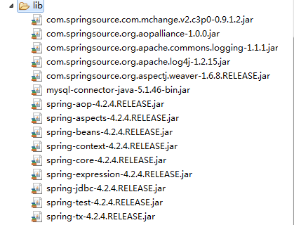
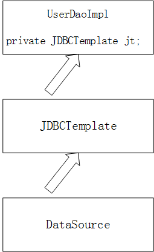
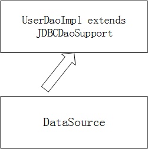
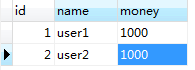
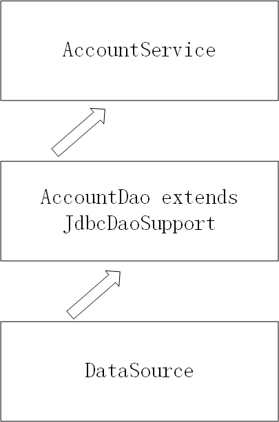
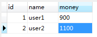
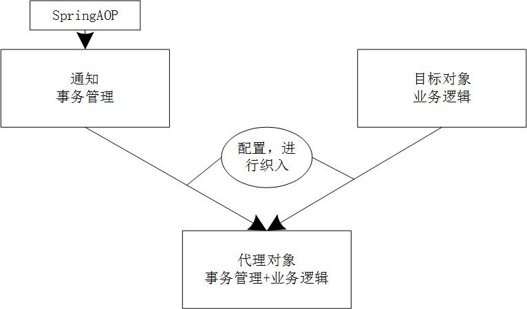
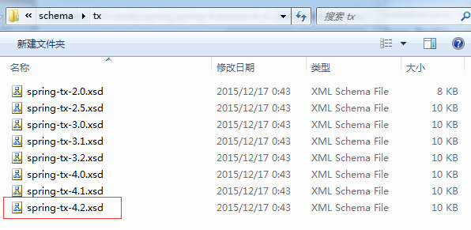
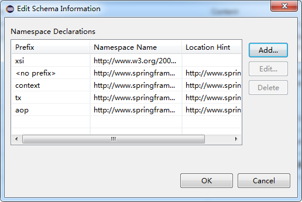

# Spring结合JDBC
其实，Spring中提供了一个可以操作数据库的对象，这个对象封装了各种JDBC技术，可以用它来操作数据库.——`JDBCtemplate`
需要的依赖包：


## 不使用Spring操作数据库
```java
package my.study.g_jdbcTemplate;

import java.beans.PropertyVetoException;

import org.junit.Test;
import org.springframework.jdbc.core.JdbcTemplate;

import com.mchange.v2.c3p0.ComboPooledDataSource;

public class Demo {
	@Test
	public void test1() throws Exception {
		//1. 准备连接池
		ComboPooledDataSource dataSource = new ComboPooledDataSource();
		
		dataSource.setDriverClass("com.mysql.jdbc.Driver");
		dataSource.setJdbcUrl("jdbc:mysql:///你的数据库名");
		dataSource.setUser("root");
		dataSource.setPassword("12345");
		//2. 创建JDBC模板对象
		JdbcTemplate jt = new JdbcTemplate();
		jt.setDataSource(dataSource);
		//3. 书写SQL语句
		String sql = "insert into t_user values(null,'hey')";
		jt.update(sql);
	}
}
```
可以去数据库中自己查看是否添加成功

## 使用Spring操作数据库
1.使用JDBC模板完成增删改查
定义`UserDao`接口
```java
package my.study.g_jdbcTemplate;

import java.util.List;

public interface UserDao {
	void save(User u);
	void delete(Integer id);
	void update(User u);
	User getById(Integer id);
	int getTotalCount();
	List<User> getAll();
}
```
定义`User`类
```java
package my.study.g_jdbcTemplate;

public class User {
	private Integer id;
	private String name;
	public Integer getId() {
		return id;
	}
	public void setId(Integer id) {
		this.id = id;
	}
	public String getName() {
		return name;
	}
	public void setName(String name) {
		this.name = name;
	}
}
```

定义`UserDaoImpl`类，书写方法:
```java
package my.study.g_jdbcTemplate;

import java.sql.ResultSet;
import java.sql.SQLException;
import java.util.List;

import org.springframework.jdbc.core.JdbcTemplate;
import org.springframework.jdbc.core.RowMapper;

public class UserDaoImpl implements UserDao {
  //定义一个JdbcTemplate用来对SQL语句进行操作
	private JdbcTemplate jt;
	
	@Override
	public void save(User u) {
		String sql = "insert into t_user values(null,?)";
		jt.update(sql, u.getName());
	}


	@Override
	public void delete(Integer id) {
		String sql = "delete from t_user where id = ?";
		jt.update(sql, id);
	}

	@Override
	public void update(User u) {
		String sql = "update t_user set name = ? where id = ?";
		jt.update(sql, u.getName(),u.getId()); 

	}

	@Override
	public User getById(Integer id) {
		String sql = "select * from t_user where id = ?";
		User u = jt.queryForObject(sql, new RowMapper<User>() {
			@Override
			public User mapRow(ResultSet rs, int arg1) throws SQLException {
				User u = new User();
				u.setId(rs.getInt("id"));
				u.setName(rs.getString("name"));
				return u;
			}
			
		}, id);
		return u;
	}

	@Override
	public int getTotalCount() {
		String sql = "select count(*) from t_user";
		Integer count = jt.queryForObject(sql,Integer.class);
		return count;
	}

	@Override
	public List<User> getAll() {
		String sql = "select * from t_user";
		List<User> list = jt.query(sql, new RowMapper<User>() {
			@Override
			public User mapRow(ResultSet rs, int arg1) throws SQLException {
				User u = new User();
				u.setId(rs.getInt("id"));
				u.setName(rs.getString("name"));
				return u;
			}			
		});
		return list;
	}
	
	public void setJt(JdbcTemplate jt) {
		this.jt = jt;
	}
}
```

然后需要配置到Spring中，让Spring管理：

在配置文件中配置：
```
<?xml version="1.0" encoding="UTF-8"?>
<beans xmlns:xsi="http://www.w3.org/2001/XMLSchema-instance" xmlns="http://www.springframework.org/schema/beans" xmlns:context="http://www.springframework.org/schema/context" xsi:schemaLocation="http://www.springframework.org/schema/beans http://www.springframework.org/schema/beans/spring-beans-4.2.xsd http://www.springframework.org/schema/context http://www.springframework.org/schema/context/spring-context-4.2.xsd ">
	<!-- 1.将DataSource连接池放入Spring容器 -->
	<bean name="dataSource" class="com.mchange.v2.c3p0.ComboPooledDataSource">
		<property name="JdbcUrl" value="jdbc:mysql:///hibernate_32"></property>
		<property name="DriverClass" value="com.mysql.jdbc.Driver"></property>
		<property name="User" value="root"></property>
		<property name="Password" value="12345"></property>
	</bean>
	<!-- 2.将JDBCTemplate放入Spring容器 -->
	<bean name="JdbcTemplate" class="org.springframework.jdbc.core.JdbcTemplate">
		<property name="dataSource" ref="dataSource"></property>
	</bean>
	<!-- 3.将UserDao放入Spring容器 -->
	<bean name="userDao" class="my.study.g_jdbcTemplate.UserDaoImpl">
		<property name="jt" ref="JdbcTemplate"></property>
	</bean>
</beans>
```

测试代码：
```java
package my.study.g_jdbcTemplate;

import java.beans.PropertyVetoException;

import javax.annotation.Resource;

import org.junit.Test;
import org.junit.runner.RunWith;
import org.springframework.jdbc.core.JdbcTemplate;
import org.springframework.test.context.ContextConfiguration;
import org.springframework.test.context.junit4.SpringJUnit4ClassRunner;

import com.mchange.v2.c3p0.ComboPooledDataSource;

@RunWith(SpringJUnit4ClassRunner.class)
@ContextConfiguration("classpath:my/study/g_jdbcTemplate/applicationContext.xml")
public class Demo {
	@Resource(name="userDao")
	private UserDao ud;
	@Test
	public void test1() throws Exception {
		//1. 准备连接池
		ComboPooledDataSource dataSource = new ComboPooledDataSource();
		
		dataSource.setDriverClass("com.mysql.jdbc.Driver");
		dataSource.setJdbcUrl("jdbc:mysql:///hibernate_32");
		dataSource.setUser("root");
		dataSource.setPassword("12345");
		//2. 创建JDBC模板对象
		JdbcTemplate jt = new JdbcTemplate();
		jt.setDataSource(dataSource);
		//3. 书写SQL语句
		String sql = "insert into t_user values(null,'hey')";
		jt.update(sql);
	}
	
	@Test
	public void test2() throws Exception {
		User u = new User();
		u.setName("hello");
		ud.save(u);		
	}
	
	@Test
	public void test3() throws Exception {
		User u = new User();
		u.setId(2);
		u.setName("nihao");
		ud.update(u);
	}
	
	@Test
	public void test4() throws Exception {
		ud.delete(2);
	}
	
	@Test
	public void test5() throws Exception {
		int totalCount = ud.getTotalCount();
		System.out.println(totalCount);
	}
	
	@Test
	public void test6() throws Exception {
		System.out.println(ud.getById(2));
	}
	
	@Test
	public void test7() throws Exception {
		System.out.println(ud.getAll());
	}
}
```

另外，可以让`UserDaoImpl`继承`JDBCDaoSupport`，父类可以根据连接池自己创建JDBC模板.
```java
package my.study.g_jdbcTemplate;

import java.sql.ResultSet;
import java.sql.SQLException;
import java.util.List;

import org.springframework.jdbc.core.JdbcTemplate;
import org.springframework.jdbc.core.RowMapper;
import org.springframework.jdbc.core.support.JdbcDaoSupport;

public class UserDaoImpl extends JdbcDaoSupport implements UserDao {
	@Override
	public void save(User u) {
		String sql = "insert into t_user values(null,?) ";
		super.getJdbcTemplate().update(sql, u.getName());
	}
	@Override
	public void delete(Integer id) {
		String sql = "delete from t_user where id = ? ";
		super.getJdbcTemplate().update(sql,id);
	}
	@Override
	public void update(User u) {
		String sql = "update  t_user set name = ? where id=? ";
		super.getJdbcTemplate().update(sql, u.getName(),u.getId());
	}
	@Override
	public User getById(Integer id) {
		String sql = "select * from t_user where id = ? ";
		return super.getJdbcTemplate().queryForObject(sql,new RowMapper<User>(){
			@Override
			public User mapRow(ResultSet rs, int arg1) throws SQLException {
				User u = new User();
				u.setId(rs.getInt("id"));
				u.setName(rs.getString("name"));
				return u;
			}}, id);
		
	}
	@Override
	public int getTotalCount() {
		String sql = "select count(*) from t_user  ";
		Integer count = super.getJdbcTemplate().queryForObject(sql, Integer.class);
		return count;
	}

	@Override
	public List<User> getAll() {
		String sql = "select * from t_user  ";
		List<User> list = super.getJdbcTemplate().query(sql, new RowMapper<User>(){
			@Override
			public User mapRow(ResultSet rs, int arg1) throws SQLException {
				User u = new User();
				u.setId(rs.getInt("id"));
				u.setName(rs.getString("name"));
				return u;
			}});
		return list;
	}
}
```
那么在配置文件中可以简化配置，不需要配置`JDBCTemplate`。

```
<?xml version="1.0" encoding="UTF-8"?>
<beans xmlns:xsi="http://www.w3.org/2001/XMLSchema-instance" xmlns="http://www.springframework.org/schema/beans" xmlns:context="http://www.springframework.org/schema/context" xsi:schemaLocation="http://www.springframework.org/schema/beans http://www.springframework.org/schema/beans/spring-beans-4.2.xsd http://www.springframework.org/schema/context http://www.springframework.org/schema/context/spring-context-4.2.xsd ">

  <bean name="dataSource" class="com.mchange.v2.c3p0.ComboPooledDataSource">
    <property name="JdbcUrl" value="jdbc:mysql:///hibernate_32"></property>
    <property name="DriverClass" value="com.mysql.jdbc.Driver"></property>
    <property name="User" value="root"></property>
    <property name="Password" value="12345"></property>
  </bean>

  <bean name="userDao" class="my.study.g_jdbcTemplate.UserDaoImpl" >
    <property name="dataSource" ref="dataSource" ></property>
  </bean>
</beans>
```

Spring中整合properties配置:
新建`db.properties`：
```
JdbcUrl=jdbc:mysql:///hibernate_32
DriverClass=com.mysql.jdbc.Driver
User=root
Password=12345
```

更改配置文件中的配置:
```
...
	<!-- 指定Properties的位置 -->
	<context:property-placeholder location="classpath:db.properties"/>
	<!-- 1.将DataSource连接池放入Spring容器 -->
	<bean name="dataSource" class="com.mchange.v2.c3p0.ComboPooledDataSource">
		<property name="JdbcUrl" value="${jdbc.JdbcUrl}"></property>
		<property name="DriverClass" value="${jdbc.DriverClass}"></property>
		<property name="User" value="${jdbc.User}"></property>
		<property name="Password" value="${jdbc.Password}"></property>
	</bean>
...
```

# Spring中的aop事务

## 事务相关概念

事务的特性：ACID

>⑴ 原子性（Atomicity）
>　　原子性是指事务包含的所有操作要么全部成功，要么全部失败回滚，因此事务的操作如果成功就必须要完全应用到数据库，如果操作失败则不能对数据库有任何影响。
>
>⑵ 一致性（Consistency）
>　　一致性是指事务必须使数据库从一个一致性状态变换到另一个一致性状态，也就是说一个事务执行之前和执行之后都必须处于一致性状态。
>
>　　拿转账来说，假设用户A和用户B两者的钱加起来一共是5000，那么不管A和B之间如何转账，转几次账，事务结束后两个用户的钱相加起来应该还得是5000，这就是事务的一致性。
>
>⑶ 隔离性（Isolation）
>　　隔离性是当多个用户并发访问数据库时，比如操作同一张表时，数据库为每一个用户开启的事务，不能被其他事务的操作所干扰，多个并发事务之间要相互隔离。
>
>　　即要达到这么一种效果：对于任意两个并发的事务T1和T2，在事务T1看来，T2要么在T1开始之前就已经结束，要么在T1结束之后才开始，这样每个事务都感觉不到有其他事务在并发地执行。
>
>　　关于事务的隔离性数据库提供了多种隔离级别。
>
>⑷ 持久性（Durability）
>　　持久性是指一个事务一旦被提交了，那么对数据库中的数据的改变就是永久性的，即便是在数据库系统遇到故障的情况下也不会丢失提交事务的操作。
>
>　　例如我们在使用JDBC操作数据库时，在提交事务方法后，提示用户事务操作完成，当我们程序执行完成直到看到提示后，就可以认定事务以及正确提交，即使这时候数据库出现了问题，也必须要将我们的事务完全执行完成，否则就会造成我们看到提示事务处理完毕，但是数据库因为故障而没有执行事务的重大错误。

事务并发问题：
>1.脏读
>　　脏读是指在一个事务处理过程里读取了另一个未提交的事务中的数据。
>2.不可重复读
>　　不可重复读是指在对于数据库中的某个数据，一个事务范围内多次查询却返回了不同的数据值，这是由于在查询间隔，被另一个事务修改并提交了。
>
>　　例如事务T1在读取某一数据，而事务T2立马修改了这个数据并且提交事务给数据库，事务T1再次读取该数据就得到了不同的结果，发送了不可重复读。
>
>　　不可重复读和脏读的区别是，脏读是某一事务读取了另一个事务未提交的脏数据，而不可重复读则是读取了前一事务提交的数据。
>3.虚读(幻读)
>　　幻读是事务非独立执行时发生的一种现象。例如事务T1对一个表中所有的行的某个数据项做了从“1”修改为“2”的操作，这时事务T2又对这个表中插入了一行数据项，而这个数据项的数值还是为“1”并且提交给数据库。而操作事务T1的用户如果再查看刚刚修改的数据，会发现还有一行没有修改，其实这行是从事务T2中添加的，就好像产生幻觉一样，这就是发生了幻读。
>
>　　幻读和不可重复读都是读取了另一条已经提交的事务（这点就脏读不同），所不同的是不可重复读查询的都是同一个数据项，而幻读针对的是一批数据整体（比如数据的个数）。

>　　现在来看看MySQL数据库为我们提供的四种隔离级别：
>
>　　① Serializable (串行化)：可避免脏读、不可重复读、幻读的发生。
>
>　　② Repeatable read (可重复读)：可避免脏读、不可重复读的发生。
>
>　　③ Read committed (读已提交)：可避免脏读的发生。
>
>　　④ Read uncommitted (读未提交)：最低级别，任何情况都无法保证。

>　　以上四种隔离级别最高的是Serializable级别，最低的是Read uncommitted级别，当然级别越高，执行效率就越低。像Serializable这样的级别，就是以锁表的方式(类似于Java多线程中的锁)使得其他的线程只能在锁外等待，所以平时选用何种隔离级别应该根据实际情况。在MySQL数据库中默认的隔离级别为Repeatable read (可重复读)。

Spring提供了`PlatformTransactionManager`接口，封装了事务操作对象的方法.对不同的平台，有不同的实现类.如:`JDBC`平台--`DataSourceTransactionManager`;`Hibernate`平台---`TransactionManager`..等.在Spring中使用事务管理，最核心的就是使用`PlatformTransactionManager`对象。

Spring事务管理可以管理事务的隔离级别、是否只读、事务的传播行为(比如在一个service方法中调用另一个service方法)、


事务的传播行为包括：

 * 保证同一个事务中

PROPAGATION_REQUIRED 支持当前事务，如果不存在 就新建一个(默认)

PROPAGATION_SUPPORTS 支持当前事务，如果不存在，就不使用事务

PROPAGATION_MANDATORY 支持当前事务，如果不存在，抛出异常

* 保证没有在同一个事务中

PROPAGATION_REQUIRES_NEW 如果有事务存在，挂起当前事务，创建一个新的事务

PROPAGATION_NOT_SUPPORTED 以非事务方式运行，如果有事务存在，挂起当前事务

PROPAGATION_NEVER 以非事务方式运行，如果有事务存在，抛出异常

PROPAGATION_NESTED 如果当前事务存在，则嵌套事务执行

## 定义场景并书写代码

### 不添加事务部分

定义一个转钱的场景，自行建一个表，包含id,姓名和钱数。

定义接口,包含加钱和减钱两个方法：
```java
package my.study.dao;

public interface AccountDao {	
	public void increaseMoney(Integer id,Double money);
	
	public void decreaseMoney(Integer id,Double money);
}
```

定义实现类：
```java
package my.study.dao;

import org.springframework.jdbc.core.support.JdbcDaoSupport;

public class AccountDaoImpl extends JdbcDaoSupport implements AccountDao {

	@Override
	public void increaseMoney(Integer id, Double money) {
		getJdbcTemplate().update("update t_account set money = money + ? where id = ?", money,id);
	}

	@Override
	public void decreaseMoney(Integer id, Double money) {
		getJdbcTemplate().update("update t_account set money = money-? where id = ? ", money,id);
	}
}
```

定义service方法,包含转账方法：
```java
package my.study.service;

public interface AccountService {
	void transfer(Integer from,Integer to,Double money);
}
```

定义service方法实现类：
```java
package my.study.service;

import my.study.dao.AccountDao;

public class AccountServiceImpl implements AccountService {
	private AccountDao ad ;
	@Override
	public void transfer(final Integer from,final Integer to,final Double money) {
		//减钱
		ad.decreaseMoney(from, money);
		//加钱
		ad.increaseMoney(to, money);
	}
	
	public void setAd(AccountDao ad) {
		this.ad = ad;
	}
}
```

书写配置文件:
```
<?xml version="1.0" encoding="UTF-8"?>
<beans xmlns:xsi="http://www.w3.org/2001/XMLSchema-instance" xmlns="http://www.springframework.org/schema/beans" xmlns:context="http://www.springframework.org/schema/context" xsi:schemaLocation="http://www.springframework.org/schema/beans http://www.springframework.org/schema/beans/spring-beans-4.2.xsd http://www.springframework.org/schema/context http://www.springframework.org/schema/context/spring-context-4.2.xsd ">
	<!-- 指定Properties的位置 -->
	<context:property-placeholder location="classpath:db.properties"/>
	<!-- 1.将DataSource连接池放入Spring容器 -->
	<bean name="dataSource" class="com.mchange.v2.c3p0.ComboPooledDataSource">
		<property name="JdbcUrl" value="${jdbc.JdbcUrl}"></property>
		<property name="DriverClass" value="${jdbc.DriverClass}"></property>
		<property name="User" value="${jdbc.User}"></property>
		<property name="Password" value="${jdbc.Password}"></property>
	</bean>
	<!-- 2.AccountDao -->
	<bean name="accountDao" class="my.study.dao.AccountDaoImpl">
		<property name="dataSource" ref="dataSource"></property>
	</bean>
	<!-- 3.将AccountService放入Spring容器 -->
	<bean name="accountService" class="my.study.service.AccountServiceImpl">
		<property name="ad" ref="accountDao"></property>
	</bean>
</beans>
```

书写代码测试:
```java
package my.study.dao;

import javax.annotation.Resource;

import org.junit.Test;
import org.junit.runner.RunWith;
import org.springframework.test.context.ContextConfiguration;
import org.springframework.test.context.junit4.SpringJUnit4ClassRunner;

import my.study.service.AccountService;
@RunWith(SpringJUnit4ClassRunner.class)
@ContextConfiguration("classpath:my/study/dao/applicationContext.xml")
public class Demo {
	@Resource(name="accountService")
	private AccountService as;
	@Test
	public void test1(){
		as.transfer(1, 2, 100d);
	}
}
```

刷新查看数据库结果:


这是没有添加事务的程序.没有添加事务，就容易发生各种问题(前面提到的事务的问题)。

### 添加事务
首先需要配置核心事务管理器,它依赖于连接池：
```
...
	<!-- 事务核心管理器,封装了所有事务操作. 依赖于连接池 -->
	<bean name="transactionManager" class="org.springframework.jdbc.datasource.DataSourceTransactionManager">
		<property name="dataSource" ref="dataSource" ></property>
	</bean>
...
```

#### 编码式
需要在代码中进行事务管理，需要书写重复代码。并不推荐.
编码式需要事务模板对象，在xml中配置,要配置tt属性:
```
...
<!-- 事务模板对象 -->
	<bean name="transactionTemplate" class="org.springframework.transaction.support.TransactionTemplate" >
		<property name="transactionManager" ref="transactionManager" ></property>
	</bean>
...
	<bean name="accountService" class="my.study.service.AccountServiceImpl" >
	<property name="ad" ref="accountDao" ></property>
	<property name="tt" ref="transactionTemplate" ></property>
</bean>  
```

使用编码式，需要在service中声明一个`TransactionTemplate`,并生成set方法,然后定义`execute()`方法，实现接口，在`doInTransactionWithoutResult`方法中书写事务操作的代码:
```java
package my.study.service;

import org.springframework.transaction.TransactionStatus;
import org.springframework.transaction.support.TransactionCallbackWithoutResult;
import org.springframework.transaction.support.TransactionTemplate;

import my.study.dao.AccountDao;

public class AccountServiceImpl implements AccountService {
	private AccountDao ad ;
	private TransactionTemplate tt;
	@Override
	public void transfer(final Integer from,final Integer to,final Double money) {
		tt.execute(new TransactionCallbackWithoutResult() {

			@Override
			protected void doInTransactionWithoutResult(TransactionStatus arg0) {
				//减钱
				ad.decreaseMoney(from, money);
				//加钱
				ad.increaseMoney(to, money);
				
			}
			
		});		
	}
	
	public void setAd(AccountDao ad) {
		this.ad = ad;
	}

	public void setTt(TransactionTemplate tt) {
		this.tt = tt;
	}

}
```

`execute`方法的执行步骤：`打开事务`->执行`doInTransactionWithoutResult`方法->`提交事务`.在`doInTransactionWithoutResult`方法中提供了try catch语句，如果发生错误则进行回滚操作。

#### xml配置
配置AOP事务，AOP事务的配置和效果如图：

进行xml配置之前，还需要导入新的命名空间约束，`tx`约束,并在`XMLEditor`下添加这个约束和`aop`约束:

导入方法见`Spring学习笔记-一`和`Spring学习笔记-二`中相关部分。
最终需要的配置如下：


xml中的各个配置：
`beans`:最基本的根元素
`context`:读取properties配置文件
`aop`:配置AOP，将通知织入目标对象
`tx`:配置事务通知
##### 配置事务通知
接下来配置事务通知，是以方法为单位进行配置的，在配置文件中新增配置事务的部分：
```
<!-- 配置事务通知 -->
	<tx:advice id="txAdvice" transaction-manager="transactionManager">
		<tx:attributes>		
			<tx:method name="transfer" isolation="REPEATABLE_READ" propagation="REQUIRED" read-only="false"></tx:method>
		</tx:attributes>
	</tx:advice>
```
name为事务的方法名
isolation:隔离级别:
		- DEFAULT
		- READ_UNCOMMITTED
		- READ_COMMITTED
		- REPEATABLE_READ
		- SERIALIZABLE
propagation:传播行为：
		- REQUIRED
		- SUPPORTS
		- MANDATORY
		- REQUIRES_NEW
		- NOT_SUPPORTED
		- NEVER
		- NESTED
read-only:"false",这个就不多解释了吧

当然，配置的`name`方法名可以用`*`通配符来进行匹配相似的方法名，可以使用的例子如下：
```
<tx:advice id="txAdvice" transaction-manager="transactionManager">
		<tx:attributes>		
		<tx:method name="save*" isolation="REPEATABLE_READ" propagation="REQUIRED" read-only="false" />
		<tx:method name="persist*" isolation="REPEATABLE_READ" propagation="REQUIRED" read-only="false" />
		<tx:method name="update*" isolation="REPEATABLE_READ" propagation="REQUIRED" read-only="false" />
		<tx:method name="modify*" isolation="REPEATABLE_READ" propagation="REQUIRED" read-only="false" />
		<tx:method name="delete*" isolation="REPEATABLE_READ" propagation="REQUIRED" read-only="false" />
		<tx:method name="remove*" isolation="REPEATABLE_READ" propagation="REQUIRED" read-only="false" />
		<tx:method name="get*" isolation="REPEATABLE_READ" propagation="REQUIRED" read-only="true" />
		<tx:method name="find*" isolation="REPEATABLE_READ" propagation="REQUIRED" read-only="true" />
		<tx:method name="transfer" isolation="REPEATABLE_READ" propagation="REQUIRED" read-only="false"></tx:method>
	</tx:advice>
```
注意其中`get`和`find`的只读为`true`
##### 配置将事务织入目标对象
配置完事务通知要进行配置织入:
```
<!-- 配置织入 -->
	<aop:config >
		<!-- 配置切点表达式 -->
		<aop:pointcut expression="execution(* my.study.service.*ServiceImpl.*(..))" id="txPc"/>
		<!-- 配置切面 -->
		<aop:advisor advice-ref="txAdvice" pointcut-ref="txPc"/>
	</aop:config>
```

其中切面的构成是通知加切点,advice-ref：通知的名称;pointcut-ref：切点的名称.
完整的xml配置:
```
<?xml version="1.0" encoding="UTF-8"?>
<beans xmlns:xsi="http://www.w3.org/2001/XMLSchema-instance" xmlns="http://www.springframework.org/schema/beans" xmlns:context="http://www.springframework.org/schema/context" xmlns:tx="http://www.springframework.org/schema/tx" xmlns:aop="http://www.springframework.org/schema/aop" xsi:schemaLocation="http://www.springframework.org/schema/beans http://www.springframework.org/schema/beans/spring-beans-4.2.xsd http://www.springframework.org/schema/context http://www.springframework.org/schema/context/spring-context-4.2.xsd http://www.springframework.org/schema/tx http://www.springframework.org/schema/tx/spring-tx-4.2.xsd http://www.springframework.org/schema/aop http://www.springframework.org/schema/aop/spring-aop-4.2.xsd ">
	<!-- 指定Properties的位置 -->
	<context:property-placeholder location="classpath:db.properties"/>
	
	<!-- 事务核心管理器,封装了所有事务操作. 依赖于连接池 -->
	<bean name="transactionManager" class="org.springframework.jdbc.datasource.DataSourceTransactionManager">
		<property name="dataSource" ref="dataSource" ></property>
	</bean>
	
	<!-- 事务模板对象 -->
	<bean name="transactionTemplate" class="org.springframework.transaction.support.TransactionTemplate" >
		<property name="transactionManager" ref="transactionManager" ></property>
	</bean>
	
	<!-- 配置事务通知 -->
	<tx:advice id="txAdvice" transaction-manager="transactionManager">
		<tx:attributes>
			<!-- name为方法名
				isolation:隔离级别:
					- DEFAULT
					- READ_UNCOMMITTED
					- READ_COMMITTED
					- REPEATABLE_READ
					- SERIALIZABLE
				propagation:传播行为：
					- REQUIRED
					- SUPPORTS
					- MANDATORY
					- REQUIRES_NEW
					- NOT_SUPPORTED
					- NEVER
					- NESTED
			 -->
			<tx:method name="transfer" isolation="REPEATABLE_READ" propagation="REQUIRED" read-only="false" ></tx:method>
		</tx:attributes>
	</tx:advice>
	
	<!-- 配置织入 -->
	<aop:config >
		<!-- 配置切点表达式 -->
		<aop:pointcut expression="execution(* my.study.service.*ServiceImpl.*(..))" id="txPc"/>
		<!-- 配置切面 
			advice-ref：通知的名称
			pointcut-ref：切点的名称
		-->
		<aop:advisor advice-ref="txAdvice" pointcut-ref="txPc"/>
	</aop:config>
	<!-- 1.将DataSource连接池放入Spring容器 -->
	<bean name="dataSource" class="com.mchange.v2.c3p0.ComboPooledDataSource">
		<property name="JdbcUrl" value="${jdbc.JdbcUrl}"></property>
		<property name="DriverClass" value="${jdbc.DriverClass}"></property>
		<property name="User" value="${jdbc.User}"></property>
		<property name="Password" value="${jdbc.Password}"></property>
	</bean>
	<!-- 2.AccountDao -->
	<bean name="accountDao" class="my.study.dao.AccountDaoImpl">
		<property name="dataSource" ref="dataSource"></property>
	</bean>
	<!-- 3.将AccountService放入Spring容器 -->
	<bean name="accountService" class="my.study.service.AccountServiceImpl">
		<property name="ad" ref="accountDao"></property>
		<property name="tt" ref="transactionTemplate"></property>
	</bean>
</beans>
```
#### 注解配置

注解配置只需将上面的编制织入和配置事务通知替换为:
```
<!-- 开启注解管理AOP事务 -->
	<tx:annotation-driven/>
```

配置完成后可以使用注解配置事务：
```java
package my.study.service;

import org.springframework.transaction.TransactionStatus;
import org.springframework.transaction.annotation.Isolation;
import org.springframework.transaction.annotation.Propagation;
import org.springframework.transaction.annotation.Transactional;
import org.springframework.transaction.support.TransactionCallbackWithoutResult;
import org.springframework.transaction.support.TransactionTemplate;

import my.study.dao.AccountDao;

public class AccountServiceImpl implements AccountService {
	private AccountDao ad ;
	private TransactionTemplate tt;
	@Override
	@Transactional(isolation=Isolation.REPEATABLE_READ,propagation=Propagation.REQUIRED,readOnly=false)
	public void transfer(final Integer from,final Integer to,final Double money) {
				//减钱
				ad.decreaseMoney(from, money);
			//	int i = 1/0;
				//加钱
				ad.increaseMoney(to, money);
	}

	public void setAd(AccountDao ad) {
		this.ad = ad;
	}

	public void setTt(TransactionTemplate tt) {
		this.tt = tt;
	}
}
```
可以在类之前加上注解配置，那么这个类的所有方法都遵循这个配置。如果有某个方法和类声明的注解配置不一样，则再这个方法前面声明一下注解配置即可。

可以再书写一个测试类进行测试，注意要读取正确的配置文件（即开启了注解配置的文件）