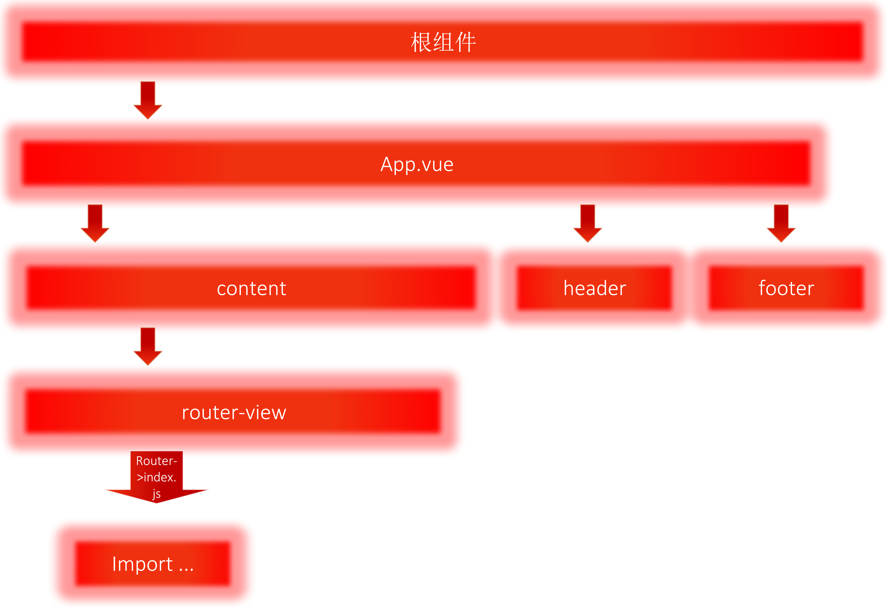

学习了vue有一小段时间，期间中断去学习了java并且补了一下数据结构的基础，有点断层。跟着视频用vue2.0做了一个电商的小项目。思路稍微清晰了一些，但是因为中途转学其他的缘故，有一些东西还是忘掉了，这里总结一下使用vue-cli搭建项目的一些经验和教训。

首先是vue-cli的目录结构，这个是基于webpack的脚手架目录：

```
.
|-- build                            // 项目构建(webpack)相关代码
|   |-- build.js                     // 生产环境构建代码
|   |-- check-version.js             // 检查node、npm等版本
|   |-- utils.js                     // 构建工具相关
|   |-- vue-loader.conf.js           // css加载器配置
|   |-- webpack.base.conf.js         // webpack基础配置
|   |-- webpack.dev.conf.js          // webpack开发环境配置
|   |-- webpack.prod.conf.js         // webpack生产环境配置
|-- config                           // 项目开发环境配置
|   |-- dev.env.js                   // 开发环境变量
|   |-- index.js                     // 项目一些配置变量(包括监听变量，打包路径等)
|   |-- prod.env.js                  // 生产环境变量
|   |-- test.env.js                  // 测试环境变量
|-- node_modules                     //存放依赖的目录
|-- src                              // 源码目录
|   |-- assets                         // 静态资源（css文件，外部js文件）
|   |-- components                     // vue公共组件
|   |-- router                         // 路由配置
|   |-- App.vue                        // 根组件
|   |-- main.js                        // 入口文件，加载各种公共组件
|-- static                           // 静态文件，比如一些图片，json数据等
|-- test                             // 测试文件目录
|-- .babelrc                         // ES6语法编译配置
|-- .editorconfig                    // 定义代码格式
|-- .gitignore                       // git上传需要忽略的文件格式
|-- .postcssrc.js
|-- README.md                        // 项目说明
|-- index.html                       // 入口页面
|-- package.json                     // 项目基本信息
.
```

当然不同版本的项目目录或者文件大同小异，基本都包括在上面了。

接下来讲一个平时用的比较多的网页排版及vue的大体配置。在此之前先介绍几个文件：

1. index.html
  一般只定义一个空的根节点，在main.js里面定义的实例将挂载在根节点下，内容都通过vue组件来填充。


2. App.vue
  App.vue 是个根组件。一个vue文件包括template,script,style三部分。
  vue通常用es6来写，用export default导出。
  `<style></style>`默认是影响全局的，如需定义作用域只在该组件下起作用，需在标签上加scoped。
  如要引入外部css文件，首先需给项目安装css-loader依赖包。使用import引入，比如：
  ```
  <style>

    import './assets/css/bootstrap.css'

  </style>
  ```

3. main.js
  main.js是个入口文件。
  这里:`template: '<App/>' `表示用`<app></app>`替换index.html里面的`<div id="app"></div>`。
  这么做的目的很简单，`<App />`他就是`App.vue`，template就是选择vue实例要加载哪个模板。最新的vue-cli脚手架模板现在是这个形式。App.vue是主程序，其他所有的.vue都是放在App.vue中，所以只需要加载App.vue就完全可以把其他的东西加载出来。
  

4. router
  router目录下的index.js即是路由配置文件
  
  

  router中可以设置多个路由，但是这里要先引入相应的组件，在进行设置：
  ```
  //引入Vue框架
  import Vue from 'vue'

  //引入路由依赖
  import Router from 'vue-router'

  //引入各个页面组件
  import IndexPage from './components/index'
  import DetailPage from './components/detail.vue'
  import DetailAnaPage from './components/detail/analysis'
  import DetailPubPage from './components/detail/publish'
  import DetailCouPage from './components/detail/count'
  import DetailForPage from './components/detail/forecast'
  import OrderListPage from './components/orderList'
  Vue.use(Router)

  export default new Router({
    mode: 'history',
    routes: [
      {
        path: '/',
        component: IndexPage
      },
      {
        path: '/orderList',
        component: OrderListPage
      },
      {
        path: '/detail',
        component: DetailPage,
        redirect: 'detail/analysis',
        children: [
          {
            path: 'forecast',
            component: DetailForPage
          },
          {
            path: 'analysis',
            component: DetailAnaPage
          },
          {
            path: 'publish',
            component: DetailPubPage
          },
          {
            path: 'count',
            component: DetailCouPage
          }
        ]
      }
    ]
  })
  ```

  这里介绍一个基础的vue模板构建思路：
   

  `App.vue`如下，其中的router的配置可以参见上面的代码
  
  
  当然这里只设置了简单的内容，具体的方法和数据及样式根据不同的需求进行补充即可。

  当然这只是一种简单的设计思路，做项目时可以用这个做为参考，但是不要被限制。