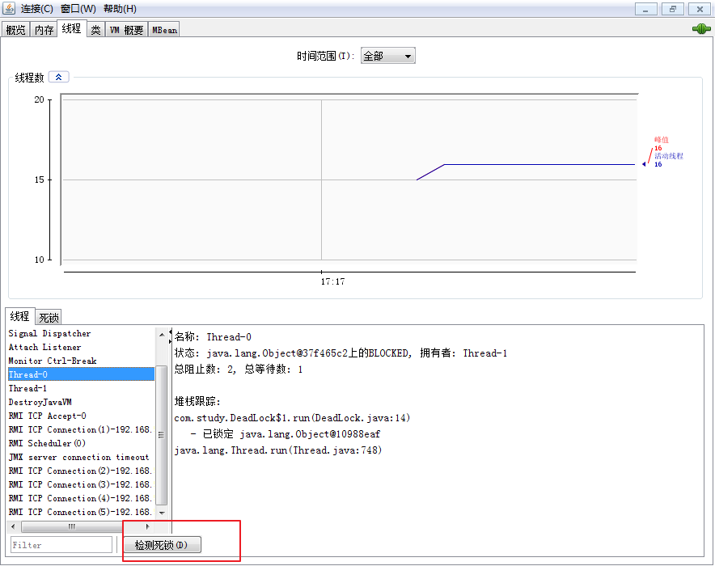

# 什么是死锁？
当两个(或多个)任务正在等待必须由另一线程释放的某个共享资源，而线程该线程又正在等待必须由前述任务之一释放的另一共享资源时，并发应用程序就出现了**死锁**。

<div class="mxgraph" style="max-width:100%;border:1px solid transparent;" data-mxgraph="{&quot;highlight&quot;:&quot;#0000ff&quot;,&quot;nav&quot;:true,&quot;resize&quot;:true,&quot;toolbar&quot;:&quot;zoom layers lightbox&quot;,&quot;edit&quot;:&quot;_blank&quot;,&quot;xml&quot;:&quot;&lt;mxfile modified=\&quot;2019-06-13T07:32:26.952Z\&quot; host=\&quot;www.draw.io\&quot; agent=\&quot;Mozilla/5.0 (Windows NT 6.1; Win64; x64) AppleWebKit/537.36 (KHTML, like Gecko) Chrome/74.0.3729.131 Safari/537.36\&quot; etag=\&quot;N6TJ4Wx920oDQg6_8sun\&quot; version=\&quot;10.7.7\&quot; type=\&quot;device\&quot;&gt;&lt;diagram id=\&quot;_GEg1l8nubf1ai1I0eZx\&quot; name=\&quot;第 1 页\&quot;&gt;zVffk5owEP5rfGwHEhR9rD96nU5vxtGH3j1mYA/SBsLEoNC/vkGCIaKed6eeL072y27I7n4fKz08SYoHQbL4kYfAesgJix6e9hAaeo76rYCyBrwBqoFI0LCGXAMs6T/QoI6LchrCynKUnDNJMxsMeJpCIC2MCME3ttsLZ/ZTMxJBB1gGhHXR3zSUsU4L+Qb/ATSKmye7g1G9k5DGWWeyiknINy0Iz3p4IjiX9SopJsCq2jV1qeO+H9ndXUxAKs8JYEMf/gazxfjnFM0elw+LPMq+DPTdZNkkDKHKX5tcyJhHPCVsZtCx4HkaQnWqoyzj84vzTIGuAv+AlKVuJsklV1AsE6Z31YVF+aTjt8ZzZXztN+a0aG9OS20FuVhvn7s9pKDyyYQp67kJUmtzQmU0B9TJVhkeraGGVjwXAZwoXMNFIiKQJ/zQrtNKIcATUAmpOAGMSLq270E0V6Odnw79JgQpWw4Zp6lctU6eV4By0Kob9esDteZQ32KGWtQHNlbrZgbasucNTNI5rAnLdVZzt0OuTUwlLDOyLe1GvTBsYpBVVmv4hRZVo3XD1iAkFKdb1i2xDvAdqxbY0fbGqFmXx4lbQm6wQz1pFfLtdfLfoTiL+BeUn1HcTjsn5HdB9aAz1YM/qJ4PdQp1GL3oMlq91bNqqapAGAPGI0ESVawMBFXXALG/Nzcb41fkcAH2I8emv+J/h/7+Afp716L/8H7o79rTx39t/ByeOO6tJg4+UzPeZ0wc3LdHjuf41x85uDty0D2MHIz3RDf65Jkzuh/R7c0c93YzxztTP0d6e5uZ43VnTpfSdz5z3NHeX67h1WaOMs0HVP1aMV+hePYf&lt;/diagram&gt;&lt;/mxfile&gt;&quot;}"></div>

当系统中同时出现如下四种条件时，就会导致这种情形。我们称其为**Coffman条件**(产生死锁的4个必要条件)

如果一个系统中如下4种情形同时存在，则产生死锁情形的机会就会上升

* **互斥条件**：进程要求对所分配的资源进行排它性控制，即在一段时间内某资源仅为一进程所占用(死锁中涉及的资源必须是不可共享的。一次只有一个任务可以使用该资源)
* **占有并等待条件**：当进程因请求资源而阻塞时，对已获得的资源保持不放(一个任务在占有某一互斥的资源时又请求另一互斥的资源。当它在等待时，不会释放任何资源)
* **不可剥夺条件**：进程已获得的资源在未使用完之前，不能剥夺，只能在使用完时由自己释放(资源只能被那些持有它们的任务释放)
* **循环等待条件**：在发生死锁时，必然存在一个进程--资源的环形链。例如存在进程集合{P1,P2,P3....Pn}，P1 申请P2获取的资源，P2申请P3资源....而Pn申请P1获取的资源，这样形成了一个闭环，即循环等待。

这4个条件即Coffman条件，由Edward G.Coffman, Jr先生于1971年首次提出。

# 如何避免死锁

有一些机制可以用来避免死锁：
* **忽略它们**：这是最常用的机制。你可以假设自己的系统绝对不会出现死锁，而如果发生死锁，结果就是你可以停止应用程序并且重新执行它。
* **检测与修复**：系统中有一项专门分析系统状态的任务，可以检测是否发生了死锁。如果它检测到了死锁，可以采取一些措施来修复该问题，例如，结束某个任务或者强制释放某一资源。
* **预防**：如果你想防止系统出现死锁，就必须预防Coffman条件中的一条或者多条出现。
* **规避**：如果你可以在某一任务执行之前得到该任务所使用资源的相关信息，那么死锁是可以规避的。当一个任务要开始执行时，你可以对系统中空闲的资源和任务所需的资源进行分析，这样就可以判断任务是否能够开始执行。


## 忽略它们
有时候也称为鸵鸟策略：
把头埋在沙子里，假装根本没发生问题。

因为解决死锁问题的代价很高，因此鸵鸟策略这种不采取任务措施的方案会获得更高的性能。

当发生死锁时不会对用户造成多大影响，或发生死锁的概率很低，可以采用鸵鸟策略。

大多数操作系统，包括 Unix，Linux 和 Windows，处理死锁问题的办法仅仅是忽略它。

## 死锁检测与修复
*  每种类型一个资源的死锁检测
    
  上图为资源分配图，其中方框表示资源，圆圈表示进程。资源指向进程表示该资源已经分配给该进程，进程指向资源表示进程请求获取该资源。
  图a可以抽取出环，如图b，它满足了环路等待条件，因此会发生死锁。
  **每种类型一个资源的死锁检测算法是通过检测有向图是否存在环来实现**，从一个节点出发进行深度优先搜索，对访问过的节点进行标记，如果访问了已经标记的节点，就表示有向图存在环，也就是检测到死锁的发生。
* 每种类型多个资源的死锁检测
  
  上图中，有三个进程四个资源，每个数据代表的含义如下：
  * E 向量：资源总量
  * A 向量：资源剩余量
  * C 矩阵：每个进程所拥有的资源数量，每一行都代表一个进程拥有资源的数量
  * R 矩阵：每个进程请求的资源数量
  进程 P1 和 P2 所请求的资源都得不到满足，只有进程 P3 可以，让 P3 执行，之后释放 P3 拥有的资源，此时 A = (2 2 2 0)。P2 可以执行，执行后释放 P2 拥有的资源，A = (4 2 2 1) 。P1 也可以执行。所有进程都可以顺利执行，没有死锁。
  算法总结如下：
  每个进程最开始时都不被标记，执行过程有可能被标记。当算法结束时，任何没有被标记的进程都是死锁进程。
  1. 寻找一个没有标记的进程 Pi，它所请求的资源小于等于 A。
  2. 如果找到了这样一个进程，那么将 C 矩阵的第 i 行向量加到 A 中，标记该进程，并转回 1。
  3. 如果没有这样一个进程，算法终止。
* 死锁恢复
  * 利用抢占恢复
  * 利用回滚恢复
  * 通过杀死进程恢复

## 死锁预防
* 破坏互斥条件
  例如假脱机打印机技术允许若干个进程同时输出，唯一真正请求物理打印机的进程是打印机守护进程。
* 破坏占有并等待条件
  一种实现方式是规定所有进程在开始执行前请求所需要的全部资源。
* 破坏不可抢占条件
* 破坏环路等待
  给资源统一编号，进程只能按编号顺序来请求资源。

比如:
* 超时放弃
当使用synchronized关键词提供的内置锁时，只要线程没有获得锁，那么就会永远等待下去，然而Lock接口提供了boolean tryLock(long time, TimeUnit unit) throws InterruptedException方法，该方法可以按照固定时长等待锁，因此线程可以在获取锁超时以后，主动释放之前已经获得的所有的锁。通过这种方式，也可以很有效地避免死锁。

## 死锁规避(避免)
在程序运行时避免发生死锁。
* 安全状态
  
  图 a 的第二列 Has 表示已拥有的资源数，第三列 Max 表示总共需要的资源数，Free 表示还有可以使用的资源数。从图 a 开始出发，先让 B 拥有所需的所有资源（图 b），运行结束后释放 B，此时 Free 变为 5（图 c）；接着以同样的方式运行 C 和 A，使得所有进程都能成功运行，因此可以称图 a 所示的状态时安全的。

  定义：如果没有死锁发生，并且即使所有进程突然请求对资源的最大需求，也仍然存在某种调度次序能够使得每一个进程运行完毕，则称该状态是安全的。

  安全状态的检测与死锁的检测类似，因为安全状态必须要求不能发生死锁。下面的银行家算法与死锁检测算法非常类似，可以结合着做参考对比。
* 单个资源的银行家算法
  一个小城镇的银行家，他向一群客户分别承诺了一定的贷款额度，算法要做的是判断对请求的满足是否会进入不安全状态，如果是，就拒绝请求；否则予以分配。
  
  上图 c 为不安全状态，因此算法会拒绝之前的请求，从而避免进入图 c 中的状态。

* 多个资源的银行家算法
  
  上图中有五个进程，四个资源。左边的图表示已经分配的资源，右边的图表示还需要分配的资源。最右边的 E、P 以及 A 分别表示：总资源、已分配资源以及可用资源，注意这三个为向量，而不是具体数值，例如 A=(1020)，表示 4 个资源分别还剩下 1/0/2/0。

  检查一个状态是否安全的算法如下：

  * 查找右边的矩阵是否存在一行小于等于向量 A。如果不存在这样的行，那么系统将会发生死锁，状态是不安全的。
  * 假若找到这样一行，将该进程标记为终止，并将其已分配资源加到 A 中。
  * 重复以上两步，直到所有进程都标记为终止，则状态时安全的。
  如果一个状态不是安全的，需要拒绝进入这个状态。

# 举个栗子

http://tpcg.io/EW1UmT

```java
public static void main(String[] args) {
    final Object a = new Object();
    final Object b = new Object();
    Thread threadA = new Thread(new Runnable() {
        public void run() {
            synchronized (a) {
                try {
                    System.out.println("now i in threadA-locka");
                    Thread.sleep(1000l);
                    synchronized (b) {
                        System.out.println("now i in threadA-lockb");
                    }
                } catch (Exception e) {
                    // ignore
                }
            }
        }
    });

    Thread threadB = new Thread(new Runnable() {
        public void run() {
            synchronized (b) {
                try {
                    System.out.println("now i in threadB-lockb");
                    Thread.sleep(1000l);
                    synchronized (a) {
                        System.out.println("now i in threadB-locka");
                    }
                } catch (Exception e) {
                    // ignore
                }
            }
        }
    });

    threadA.start();
    threadB.start();
}
```
程序执行结果:
```
now i in threadA-locka
now i in threadB-lockb
```

# 死锁检测
## Jstack命令

jstack是java虚拟机自带的一种堆栈跟踪工具。jstack用于打印出给定的java进程ID或core file或远程调试服务的Java堆栈信息。
Jstack工具可以用于生成java虚拟机当前时刻的线程快照。线程快照是当前java虚拟机内每一条线程正在执行的方法堆栈的集合，生成线程快照的主要目的是定位线程出现长时间停顿的原因，如线程间死锁、死循环、请求外部资源导致的长时间等待等。 线程出现停顿的时候通过jstack来查看各个线程的调用堆栈，就可以知道没有响应的线程到底在后台做什么事情，或者等待什么资源。
首先，我们通过jps确定当前执行任务的进程号:

首先，我们通过jps确定当前执行任务的进程号:


可以确定任务进程号是51028，然后执行jstack命令查看当前进程堆栈信息(在eclipse中运行后可能会有jstack无法连接报错的信息，所以我换成了IDEA来执行 ORZ)：

```
C:\Users\homxu>jps
10896
47284 Jps
52168 DeadLock

C:\Users\homxu>jstack -F 52168
Attaching to process ID 52168, please wait...
Debugger attached successfully.
Server compiler detected.
JVM version is 25.144-b01
Deadlock Detection:

Found one Java-level deadlock:
=============================

"Thread-0":
  waiting to lock Monitor@0x00000000569a3968 (Object@0x00000000e071b2f8, a java/lang/Object),
  which is held by "Thread-1"
"Thread-1":
  waiting to lock Monitor@0x00000000569a1188 (Object@0x00000000e071b2e8, a java/lang/Object),
  which is held by "Thread-0"

Found a total of 1 deadlock.

Thread 1: (state = BLOCKED)


Thread 23: (state = BLOCKED)
 - com.study.DeadLock$2.run() @bci=28, line=30 (Interpreted frame)
 - java.lang.Thread.run() @bci=11, line=748 (Interpreted frame)


Thread 22: (state = BLOCKED)
 - com.study.DeadLock$1.run() @bci=28, line=14 (Interpreted frame)
 - java.lang.Thread.run() @bci=11, line=748 (Interpreted frame)


Thread 15: (state = IN_NATIVE)
 - java.net.SocketInputStream.socketRead0(java.io.FileDescriptor, byte[], int, int, int) @bci=0 (Interpreted frame)

 - java.net.SocketInputStream.socketRead(java.io.FileDescriptor, byte[], int, int, int) @bci=8, line=116 (Interpret
ed frame)
 - java.net.SocketInputStream.read(byte[], int, int, int) @bci=117, line=171 (Interpreted frame)
 - java.net.SocketInputStream.read(byte[], int, int) @bci=11, line=141 (Interpreted frame)
 - sun.nio.cs.StreamDecoder.readBytes() @bci=135, line=284 (Interpreted frame)
 - sun.nio.cs.StreamDecoder.implRead(char[], int, int) @bci=112, line=326 (Interpreted frame)
 - sun.nio.cs.StreamDecoder.read(char[], int, int) @bci=180, line=178 (Interpreted frame)
 - java.io.InputStreamReader.read(char[], int, int) @bci=7, line=184 (Interpreted frame)
 - java.io.BufferedReader.fill() @bci=145, line=161 (Interpreted frame)
 - java.io.BufferedReader.readLine(boolean) @bci=44, line=324 (Interpreted frame)
 - java.io.BufferedReader.readLine() @bci=2, line=389 (Interpreted frame)
 - com.intellij.rt.execution.application.AppMainV2$1.run() @bci=36, line=64 (Interpreted frame)


Thread 14: (state = BLOCKED)


Thread 13: (state = BLOCKED)


Thread 12: (state = BLOCKED)
 - java.lang.Object.wait(long) @bci=0 (Interpreted frame)
 - java.lang.ref.ReferenceQueue.remove(long) @bci=59, line=143 (Interpreted frame)
 - java.lang.ref.ReferenceQueue.remove() @bci=2, line=164 (Interpreted frame)
 - java.lang.ref.Finalizer$FinalizerThread.run() @bci=36, line=209 (Interpreted frame)


Thread 11: (state = BLOCKED)
 - java.lang.Object.wait(long) @bci=0 (Interpreted frame)
 - java.lang.Object.wait() @bci=2, line=502 (Interpreted frame)
 - java.lang.ref.Reference.tryHandlePending(boolean) @bci=54, line=191 (Interpreted frame)
 - java.lang.ref.Reference$ReferenceHandler.run() @bci=1, line=153 (Interpreted frame)
```

可以看到，进程的确存在死锁，两个线程分别在等待对方持有的Object对象

## JConsole工具

Jconsole是JDK自带的监控工具，在JDK/bin目录下可以找到。它用于连接正在运行的本地或者远程的JVM，对运行在Java应用程序的资源消耗和性能进行监控，并画出大量的图表，提供强大的可视化界面。而且本身占用的服务器内存很小，甚至可以说几乎不消耗。
我们在命令行中敲入jconsole命令，会自动弹出以下对话框，选择进程52168，并点击“链接”





可以看到进程中存在死锁。
以上例子我都是用synchronized关键词实现的死锁，如果读者用ReentrantLock制造一次死锁，再次使用死锁检测工具，也同样能检测到死锁，不过显示的信息将会更加丰富，有兴趣的读者可以自己尝试一下。

>在我的理解当中，死锁就是“两个任务以不合理的顺序互相争夺资源”造成，因此为了规避死锁，应用程序需要妥善处理资源获取的顺序。
>另外有些时候，死锁并不会马上在应用程序中体现出来，在通常情况下，都是应用在生产环境运行了一段时间后，才开始慢慢显现出来，在实际测试过程中，由于死锁的隐蔽性，很难在测试过程中及时发现死锁的存在，而且在生产环境中，应用出现了死锁，往往都是在应用状况最糟糕的时候——在高负载情况下。因此，开发者在开发过程中要谨慎分析每个系统资源的使用情况，合理规避死锁，另外一旦出现了死锁，也可以尝试使用本文中提到的一些工具，仔细分析，总是能找到问题所在的。

# 参考

* 《精通JAVA并发编程(第二版)》
* https://www.cnblogs.com/thomaschen750215/p/4109646.html
* https://cyc2018.github.io/CS-Notes/#/notes/%E8%AE%A1%E7%AE%97%E6%9C%BA%E6%93%8D%E4%BD%9C%E7%B3%BB%E7%BB%9F%20-%20%E6%AD%BB%E9%94%81?id=%E6%AD%BB%E9%94%81%E6%A3%80%E6%B5%8B%E4%B8%8E%E6%AD%BB%E9%94%81%E6%81%A2%E5%A4%8D
* https://juejin.im/post/5aaf6ee76fb9a028d3753534#heading-1

<script type="text/javascript" src="https://www.draw.io/js/viewer.min.js"></script>