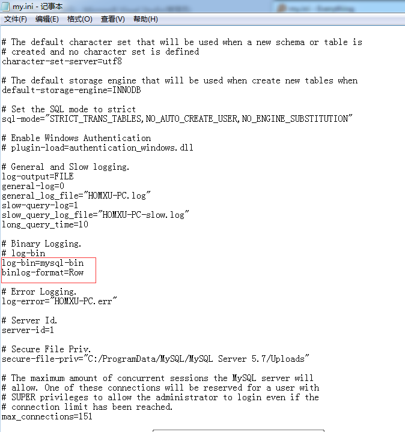
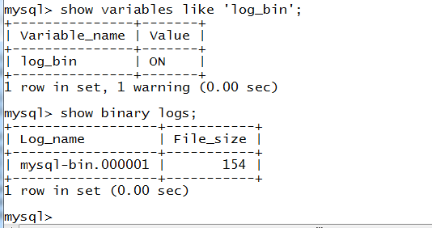
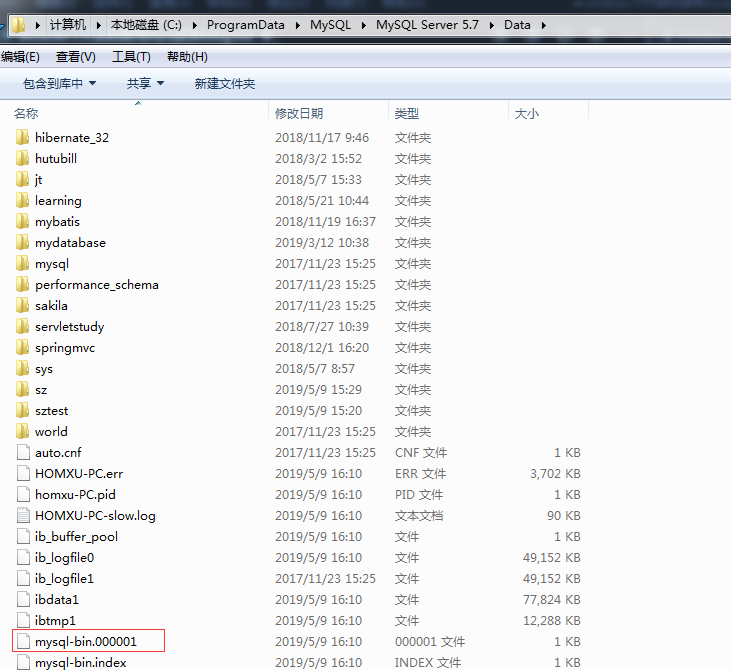
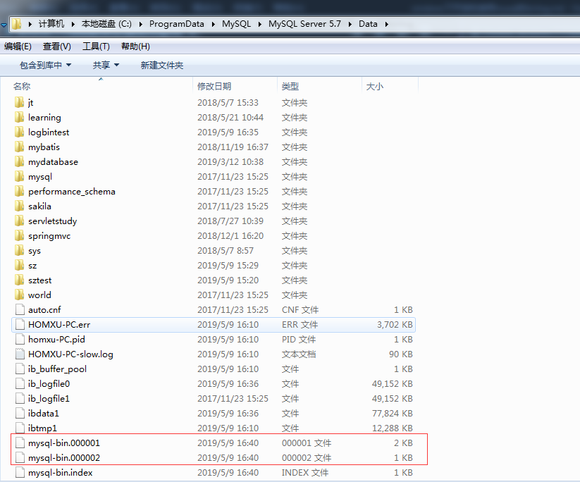
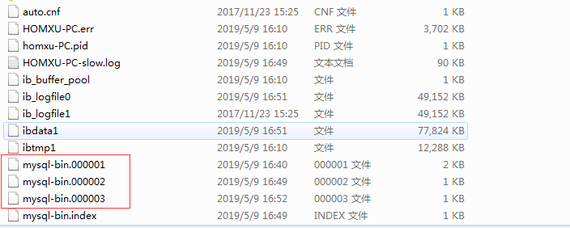

Mysql Binlog是二进制格式的日志文件。Binlog是用来记录Mysql内部对数据库的改动（只记录对数据的修改操作），主要用于数据库的主从复制以及增量恢复。

binlog作用
MySQL的作用类似于Oracle的归档日志，可以用来查看数据库的变更历史（具体的时间点所有的SQL操作）、数据库增量备份和恢复（增量备份和基于时间点的恢复）、Mysql的复制（主主数据库的复制、主从数据库的复制）。

# 开启binlog
首先找到`my.ini`文件.


在`# Binary Logging`部分添加以下内容:
```
log-bin=mysql-bin
binlog-format=Row
```
如下图所示:


修改并保存,然后重启mysql服务:


查看是否已经开始binlog,分别使用命令:
```
show variables like 'log_bin'; 
show binary logs;
```


binlog文件的默认目录(相对于my.ini)为`./Data`:


可以在配置中使用`log-bin=路径名`改变binlog的位置,如
```
log-bin=D:\logbin
```

# logbin的使用

首先创建测试数据库:
```sql
mysql> create database logbintest;
Query OK, 1 row affected (0.01 sec)
```
切换数据库:
```sql
mysql> use logbintest;
Database changed
```

创建表:
```sql
mysql> create table t1(id int,name varchar(20));
Query OK, 0 rows affected (0.03 sec)
```
插入数据:
```sql
mysql> insert into t1 values(1,'hm');
Query OK, 1 row affected (0.02 sec)

mysql> insert into t1 values(2,'xx');
Query OK, 1 row affected (0.00 sec)
```
执行`flush logs;`命令:
```sql
mysql> flush logs;
Query OK, 0 rows affected (0.02 sec)
```

这时目录下多了一个log-bin文件:


可以使用`show master status`查看当前数据库binary log的位置
```
mysql> show master status;
+------------------+----------+--------------+------------------+-------------------+
| File             | Position | Binlog_Do_DB | Binlog_Ignore_DB | Executed_Gtid_Set |
+------------------+----------+--------------+------------------+-------------------+
| mysql-bin.000002 |      154 |              |                  |                   |
+------------------+----------+--------------+------------------+-------------------+
1 row in set (0.00 sec)
```

继续输入sql命令:
```sql
mysql> insert into t1 values(3,'test');
Query OK, 1 row affected (0.01 sec)

mysql> insert into t1 values(4,'hello');
Query OK, 1 row affected (0.01 sec)
```

再次执行`flush logs;`命令和`show master status`命令:
```sql
mysql> flush logs;
Query OK, 0 rows affected (0.02 sec)

mysql> show master status;
+------------------+----------+--------------+------------------+-------------------+
| File             | Position | Binlog_Do_DB | Binlog_Ignore_DB | Executed_Gtid_Set |
+------------------+----------+--------------+------------------+-------------------+
| mysql-bin.000003 |      154 |              |                  |                   |
+------------------+----------+--------------+------------------+-------------------+
1 row in set (0.00 sec)
```

接着输入sql命令:
```sql
mysql> insert into t1 values(5,'hey');
Query OK, 1 row affected (0.01 sec)

mysql> drop table t1;
Query OK, 0 rows affected (0.01 sec)

mysql> drop database logbintest;
Query OK, 0 rows affected (0.01 sec)
```

经过以上操作后,文件夹中有了3个binlog文件,`*.index`是索引文件.



可以用mysqlbinlog 工具来恢复数据。为了下面讲解的方便，我们先将binlog文件解析成txt文件，在mysql-bin文件目录下执行命令,如下：
```
C:\ProgramData\MySQL\MySQL Server 5.7\Data>mysqlbinlog mysql-bin.000001 > D:/1.txt

C:\ProgramData\MySQL\MySQL Server 5.7\Data>mysqlbinlog mysql-bin.000002 > D:/2.txt

C:\ProgramData\MySQL\MySQL Server 5.7\Data>mysqlbinlog mysql-bin.000003 > D:/3.txt
```
通过这三个命令，可以在D盘下生成3个文件，里面分别记录了日志文件的内容，也就是用户操作的步骤。


三个文件内容见附录。

下面开始恢复binlog日志到Mysql数据库，这里只将第1个日志文件恢复。
```
C:\ProgramData\MySQL\MySQL Server 5.7\Data>mysqlbinlog mysql-bin.000001 | mysql -u[数据库用户名] -p[数据库密码]
mysql: [Warning] Using a password on the command line interface can be insecure.
```

然后查看是否恢复成功:
```sql
mysql> show databases;
+--------------------+
| Database           |
+--------------------+
| information_schema |
| logbintest         |
+--------------------+
2 rows in set (0.01 sec)
```

```sql
mysql> use logbintest;
Database changed
mysql> show tables;
+----------------------+
| Tables_in_logbintest |
+----------------------+
| t1                   |
+----------------------+
1 row in set (0.00 sec)

mysql> select * from t1;
+------+------+
| id   | name |
+------+------+
|    1 | hm   |
|    2 | xx   |
+------+------+
2 rows in set (0.01 sec)
```
这时候恢复到相应的备份位置了.

接着恢复第三个备份:
```
C:\ProgramData\MySQL\MySQL Server 5.7\Data>mysqlbinlog mysql-bin.000003 | mysql -u[用户名] -p[密码]
mysql: [Warning] Using a password on the command line interface can be insecure.
```
查看数据:
```sql
mysql> select * from t1;
+------+-------+
| id   | name  |
+------+-------+
|    1 | hm    |
|    2 | xx    |
|    3 | test  |
|    4 | hello |
+------+-------+
4 rows in set (0.00 sec)
```

**注意**:
直接恢复`mysql-bin.000002`会提示`Table 'logbintest.t1' doesn't exist`.我猜想因为`mysql-bin.000002`文件中不包含创建数据库和表的命令,所以只能在恢复`mysql-bin.000001`,即恢复了相应数据库和表格的情况下,才能继续恢复数据.
```
C:\ProgramData\MySQL\MySQL Server 5.7\Data>mysqlbinlog mysql-bin.000002 | mysql -u[用户名] -p[密码]
mysql: [Warning] Using a password on the command line interface can be insecure.
ERROR 1146 (42S02) at line 35: Table 'logbintest.t1' doesn't exist
```

# 参考
https://baike.baidu.com/item/Mysql%20Binlog

https://www.cnblogs.com/wangwust/p/6433453.html

https://blog.csdn.net/king_kgh/article/details/74890381

https://www.iteblog.com/mysql-binlog_basic_usage/

# 附录
1.txt
```
/*!50530 SET @@SESSION.PSEUDO_SLAVE_MODE=1*/;
/*!50003 SET @OLD_COMPLETION_TYPE=@@COMPLETION_TYPE,COMPLETION_TYPE=0*/;
DELIMITER /*!*/;
SET @@SESSION.GTID_NEXT= 'AUTOMATIC' /* added by mysqlbinlog */ /*!*/;
DELIMITER ;
# End of log file
/*!50003 SET COMPLETION_TYPE=@OLD_COMPLETION_TYPE*/;
/*!50530 SET @@SESSION.PSEUDO_SLAVE_MODE=0*/;
```

2.txt
```
/*!50530 SET @@SESSION.PSEUDO_SLAVE_MODE=1*/;
/*!50003 SET @OLD_COMPLETION_TYPE=@@COMPLETION_TYPE,COMPLETION_TYPE=0*/;
DELIMITER /*!*/;
# at 4
#190509 16:40:28 server id 1  end_log_pos 123 CRC32 0xd5ca9838 	Start: binlog v 4, server v 5.7.17-log created 190509 16:40:28
BINLOG '
fOfTXA8BAAAAdwAAAHsAAAAAAAQANS43LjE3LWxvZwAAAAAAAAAAAAAAAAAAAAAAAAAAAAAAAAAA
AAAAAAAAAAAAAAAAAAAAAAAAEzgNAAgAEgAEBAQEEgAAXwAEGggAAAAICAgCAAAACgoKKioAEjQA
ATiYytU=
'/*!*/;
# at 123
#190509 16:40:28 server id 1  end_log_pos 154 CRC32 0xcbc8683a 	Previous-GTIDs
# [empty]
# at 154
#190509 16:48:03 server id 1  end_log_pos 219 CRC32 0x66c5aab9 	Anonymous_GTID	last_committed=0	sequence_number=1
SET @@SESSION.GTID_NEXT= 'ANONYMOUS'/*!*/;
# at 219
#190509 16:48:03 server id 1  end_log_pos 297 CRC32 0x7c1a0b04 	Query	thread_id=3	exec_time=0	error_code=0
SET TIMESTAMP=1557391683/*!*/;
SET @@session.pseudo_thread_id=3/*!*/;
SET @@session.foreign_key_checks=1, @@session.sql_auto_is_null=0, @@session.unique_checks=1, @@session.autocommit=1/*!*/;
SET @@session.sql_mode=1344274432/*!*/;
SET @@session.auto_increment_increment=1, @@session.auto_increment_offset=1/*!*/;
/*!\C gbk *//*!*/;
SET @@session.character_set_client=28,@@session.collation_connection=28,@@session.collation_server=33/*!*/;
SET @@session.lc_time_names=0/*!*/;
SET @@session.collation_database=DEFAULT/*!*/;
BEGIN
/*!*/;
# at 297
#190509 16:48:03 server id 1  end_log_pos 351 CRC32 0x6c102375 	Table_map: `logbintest`.`t1` mapped to number 328
# at 351
#190509 16:48:03 server id 1  end_log_pos 396 CRC32 0xec3029be 	Write_rows: table id 328 flags: STMT_END_F

BINLOG '
Q+nTXBMBAAAANgAAAF8BAAAAAEgBAAAAAAEACmxvZ2JpbnRlc3QAAnQxAAIDDwI8AAN1IxBs
Q+nTXB4BAAAALQAAAIwBAAAAAEgBAAAAAAEAAgAC//wDAAAABHRlc3S+KTDs
'/*!*/;
# at 396
#190509 16:48:03 server id 1  end_log_pos 427 CRC32 0x57760240 	Xid = 16
COMMIT/*!*/;
# at 427
#190509 16:48:19 server id 1  end_log_pos 492 CRC32 0x985b3888 	Anonymous_GTID	last_committed=1	sequence_number=2
SET @@SESSION.GTID_NEXT= 'ANONYMOUS'/*!*/;
# at 492
#190509 16:48:19 server id 1  end_log_pos 570 CRC32 0x602ea4d9 	Query	thread_id=3	exec_time=0	error_code=0
SET TIMESTAMP=1557391699/*!*/;
BEGIN
/*!*/;
# at 570
#190509 16:48:19 server id 1  end_log_pos 624 CRC32 0x0a30970d 	Table_map: `logbintest`.`t1` mapped to number 328
# at 624
#190509 16:48:19 server id 1  end_log_pos 670 CRC32 0x30f313bc 	Write_rows: table id 328 flags: STMT_END_F

BINLOG '
U+nTXBMBAAAANgAAAHACAAAAAEgBAAAAAAEACmxvZ2JpbnRlc3QAAnQxAAIDDwI8AAMNlzAK
U+nTXB4BAAAALgAAAJ4CAAAAAEgBAAAAAAEAAgAC//wEAAAABWhlbGxvvBPzMA==
'/*!*/;
# at 670
#190509 16:48:19 server id 1  end_log_pos 701 CRC32 0xe612b29f 	Xid = 17
COMMIT/*!*/;
# at 701
#190509 16:49:37 server id 1  end_log_pos 748 CRC32 0x8503b6e4 	Rotate to mysql-bin.000003  pos: 4
SET @@SESSION.GTID_NEXT= 'AUTOMATIC' /* added by mysqlbinlog */ /*!*/;
DELIMITER ;
# End of log file
/*!50003 SET COMPLETION_TYPE=@OLD_COMPLETION_TYPE*/;
/*!50530 SET @@SESSION.PSEUDO_SLAVE_MODE=0*/;
```

3.txt
```
/*!50530 SET @@SESSION.PSEUDO_SLAVE_MODE=1*/;
/*!50003 SET @OLD_COMPLETION_TYPE=@@COMPLETION_TYPE,COMPLETION_TYPE=0*/;
DELIMITER /*!*/;
# at 4
#190509 16:49:37 server id 1  end_log_pos 123 CRC32 0x67bdb5fc 	Start: binlog v 4, server v 5.7.17-log created 190509 16:49:37
# Warning: this binlog is either in use or was not closed properly.
BINLOG '
oenTXA8BAAAAdwAAAHsAAAABAAQANS43LjE3LWxvZwAAAAAAAAAAAAAAAAAAAAAAAAAAAAAAAAAA
AAAAAAAAAAAAAAAAAAAAAAAAEzgNAAgAEgAEBAQEEgAAXwAEGggAAAAICAgCAAAACgoKKioAEjQA
Afy1vWc=
'/*!*/;
# at 123
#190509 16:49:37 server id 1  end_log_pos 154 CRC32 0x0e916e92 	Previous-GTIDs
# [empty]
# at 154
#190509 16:50:51 server id 1  end_log_pos 219 CRC32 0x0fcc180d 	Anonymous_GTID	last_committed=0	sequence_number=1
SET @@SESSION.GTID_NEXT= 'ANONYMOUS'/*!*/;
# at 219
#190509 16:50:51 server id 1  end_log_pos 297 CRC32 0xd5da7fee 	Query	thread_id=3	exec_time=0	error_code=0
SET TIMESTAMP=1557391851/*!*/;
SET @@session.pseudo_thread_id=3/*!*/;
SET @@session.foreign_key_checks=1, @@session.sql_auto_is_null=0, @@session.unique_checks=1, @@session.autocommit=1/*!*/;
SET @@session.sql_mode=1344274432/*!*/;
SET @@session.auto_increment_increment=1, @@session.auto_increment_offset=1/*!*/;
/*!\C gbk *//*!*/;
SET @@session.character_set_client=28,@@session.collation_connection=28,@@session.collation_server=33/*!*/;
SET @@session.lc_time_names=0/*!*/;
SET @@session.collation_database=DEFAULT/*!*/;
BEGIN
/*!*/;
# at 297
#190509 16:50:51 server id 1  end_log_pos 351 CRC32 0x60f30968 	Table_map: `logbintest`.`t1` mapped to number 328
# at 351
#190509 16:50:51 server id 1  end_log_pos 395 CRC32 0xace24246 	Write_rows: table id 328 flags: STMT_END_F

BINLOG '
6+nTXBMBAAAANgAAAF8BAAAAAEgBAAAAAAEACmxvZ2JpbnRlc3QAAnQxAAIDDwI8AANoCfNg
6+nTXB4BAAAALAAAAIsBAAAAAEgBAAAAAAEAAgAC//wFAAAAA2hleUZC4qw=
'/*!*/;
# at 395
#190509 16:50:51 server id 1  end_log_pos 426 CRC32 0xae6e3d87 	Xid = 20
COMMIT/*!*/;
# at 426
#190509 16:51:36 server id 1  end_log_pos 491 CRC32 0xdb44b864 	Anonymous_GTID	last_committed=1	sequence_number=2
SET @@SESSION.GTID_NEXT= 'ANONYMOUS'/*!*/;
# at 491
#190509 16:51:36 server id 1  end_log_pos 618 CRC32 0x6dec15c8 	Query	thread_id=3	exec_time=0	error_code=0
use `logbintest`/*!*/;
SET TIMESTAMP=1557391896/*!*/;
DROP TABLE `t1` /* generated by server */
/*!*/;
# at 618
#190509 16:52:34 server id 1  end_log_pos 683 CRC32 0xe3edccf9 	Anonymous_GTID	last_committed=2	sequence_number=3
SET @@SESSION.GTID_NEXT= 'ANONYMOUS'/*!*/;
# at 683
#190509 16:52:34 server id 1  end_log_pos 780 CRC32 0xb8287261 	Query	thread_id=3	exec_time=0	error_code=0
SET TIMESTAMP=1557391954/*!*/;
drop database logbintest
/*!*/;
SET @@SESSION.GTID_NEXT= 'AUTOMATIC' /* added by mysqlbinlog */ /*!*/;
DELIMITER ;
# End of log file
/*!50003 SET COMPLETION_TYPE=@OLD_COMPLETION_TYPE*/;
/*!50530 SET @@SESSION.PSEUDO_SLAVE_MODE=0*/;

```