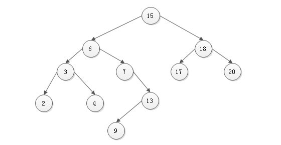
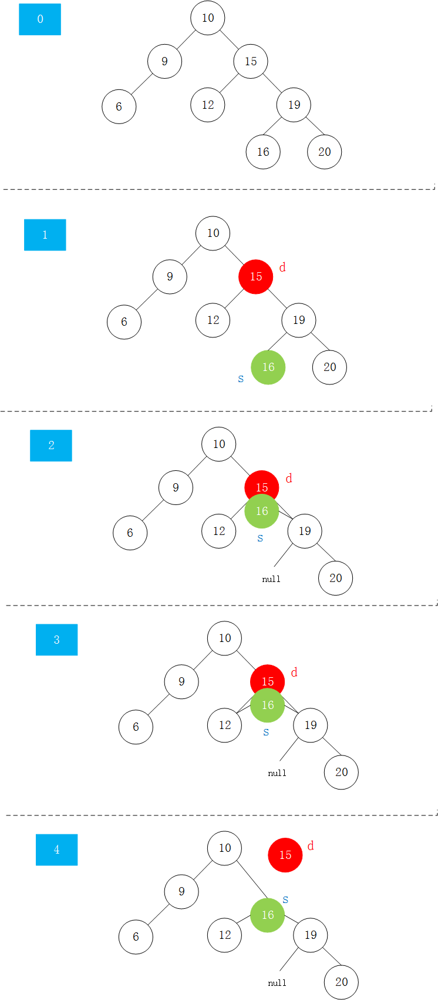

二分搜索树（或者说二叉搜索树）是一种树形结构。

* 二分搜索树是二叉树
* 二分搜索树的每个节点的值：
  大于其左子树的所有节点的值
  小于其右子树的所有节点的值
* 每一棵子数也是二分搜索树
* 存储的元素必须有`可比性`(如果是想存储一个自定义的类型，那么要定义好这个数据类型的两个数据之间时如何比较的)



新建`BST`类，因为其节点值之间需要进行比较，所以继承`Comparable`类

# 基本代码

```java
public class BST<E extends Comparable<E>>{
  //声明节点类
  private class Node{
    public E e;
    public Node left,right;

    public Node(E e){
      this.e = e;
      left = null;
      right = null;
    }
  }

  private Node root; //根节点
  private int size;  //记录存储的元素个数

  //默认构造函数
  public BST(){
      root = null;
      size = 0;
  }

  //获取节点数量
  public int size(){ return size; }

  //判断是否为空
  public boolean isEmpty(){ return size == 0; }
}
```

# 向二分搜索树添加元素

采用递归方式向二分搜索树添加新元素，以下代码放入`BST`类中。
根据二分搜索树的性质，根节点和每个子树的节点的左子树都比当前节点的值小，其右子树比当前节点的值都大。
本文中的二分搜索树不包括重复元素。如果要插入的值等于当前根节点的值，则跳过。
```java
  /**
   * 向二分搜索树添加新的元素
   */

  public void add(E e){
    root = add(root,e);
  }

  /**
   * 返回插入新节点后二分搜索树的根
   * @param node 要比较的节点
   * @param e 要比较的值
   * @return 新节点的根
   */
  private Node add(Node node,E e){
      if(node == null){
          size ++;
          return new Node(e);
      }
      if(e.compareTo(node.e) < 0 ){
          node.left = add(node.left,e);
      }
      else if(e.compareTo(node.e) > 0){
          node.right = add(node.right,e);
      }
      return node;
  }
```

# 二分搜索树的包含方法contains


```java
  /**
   * 看二分搜索树种是否包含元素e,从根节点开始比较
   * @param e 要比较的值
   * @return true or false
   */
  public boolean contains(E e){
      return contains(root,e);
  }

  /**
   * 看以node为根的二分搜索树中是否包含元素e,递归算法
   * @param node 节点
   * @param e 元素e
   * @return true or false
   */
  private boolean contains(Node node,E e){
      if(node==null){
          return false;
      }
      if(e.compareTo(node.e) == 0){
          return true;
      }
      else if(e.compareTo(node.e) < 0){
          return contains(node.left,e);
      }
      else //e.compareTo(node.e) > 0
          return contains(node.right,e);
  }
```

# 二分搜索树的前序遍历

从根节点访问左右子树，自上而下，所以称为前序遍历。

## 前序遍历的递归实现

```java
    /**
     * 二分搜索树的前序遍历
     */
    public void preOrder(){
        preOrder(root);
    }

    /**
     * 前序遍历以node为根的二分搜索树，递归算法
     * @param node 以node为根
     */
    private void preOrder(Node node){
        //终止条件
        if(node == null)
            return;

        System.out.println(node.e);
        preOrder(node.left);
        preOrder(node.right);
    }
```

## 前序遍历的非递归实现

```java
    /**
     * 前序遍历的非递归实现
     */
    public void preOrderNR(){
        Stack<Node> stack = new Stack<>();
        stack.push(root);
        while(!stack.isEmpty()){
            Node cur = stack.pop();
            System.out.println(cur.e);

            if(cur.right != null)
                stack.push(cur.right);
            if(cur.left != null)
                stack.push(cur.left);
        }
    }
```

# 二分搜索树的中序遍历

和前序遍历不同的是，中序遍历先访问左子树，再访问根节点，最后访问右子树。因为访问根节点在中间顺序，所以称为中序遍历。

```java
    /**
     * 二分搜索树的中序遍历
     */
    public void inOrder(){
      inOrder(root);
    }

    private void inOrder(Node node){
        if(node == null)
            return;
        inOrder(node.left);
        System.out.println(node.e);
        inOrder(node.right);
    }
```

二分搜索树的中序遍历打印出的即是二分搜索树排序后的结果。

# 二分搜索树的后序遍历

后序遍历的一个应用:为二分搜索树释放内存时，需要先从叶子节点开始释放，然后释放其父亲节点（JAVA有内存回收机制，不需考虑，但是c c++ 等语言需要考虑）。
```java
    /**
     * 二分搜索树的后序遍历
     */
    public void postOrder(){
        postOrder(root);
    }

    private void postOrder(Node node){
        if(node == null)
            return;

        postOrder(node.left);
        postOrder(node.right);
        System.out.println(node.e);
    }
```

# 二分搜索树的层序遍历

二分搜索树的层序遍历采用队列的思想，首先把根节点入队，然后循环判断队列是否为空，如果不为空，则将队首元素出队，接着将这个元素的左右子树入队，如果为空则不进行入队。循环结束后也就实现了层序遍历。
```java
import java.util.Queue;
import java.util.LinkedList;

    /**
     * 二分搜索树的层序遍历,使用队列
     */
    public void levelOrder(){
        Queue<Node> q = new LinkedList<>(); //这里定义Queue底层采用链表进行实现
        q.add(root);
        while(!q.isEmpty()){
            Node cur = q.remove();       //队首元素出队
            System.out.println(cur.e);

            if(cur.left != null)        //队首元素的左子树
                q.add(cur.left);
            if(cur.right != null)       //队首元素的右子树
                q.add(cur.right);
        }
    }
```

广度优先遍历的意义：可以更快找到要查询的元素。

# 寻找二分搜索树的最大最小值

其实，寻找二分搜索树的最大最小值可以看成寻找一个链表的最后一个不为空的节点。这里给出递归写法。
```java
    /**
     * 寻找二分搜索树的最小元素
     * @return
     */
    public E minimum(){
        if(size == 0)
            throw new IllegalArgumentException("BST is empty");

        return minimum(root).e;
    }

    /**
     * 返回以node为根的二分搜索树的最小值所在的节点
     * @param node
     * @return
     */
    private Node minimum(Node node){
        if(node.left == null)
            return node;
        return minimum(node.left);
    }

    /**
     * 寻找二分搜索树的最大元素
     * @return
     */
    public E maximum(){
        if(size == 0)
            throw new IllegalArgumentException("BST is empty");
        return maximum(root).e;
    }

    /**
     * 返回以node为根的二分搜索树的最大值所在的节点
     * @param node
     * @return
     */
    private Node maximum(Node node){
        if(node.right == null)
            return node;
        return maximum(node.right);
    }
```

# 删除二分搜索树的最大最小节点

```java
    /**
     * 从二分搜索树种删除最小值所在的节点，并返回最小值
     * @return
     */
    public E removeMin(){
        E min = minimum();         //先找到最小值是多少
        root = removeMin(root);    //进行删除操作
        return min;                //返回最小值
    }

    /**
     * 删掉以node为根的二分搜索树中的最小节点
     * @param node 以node为根
     * @return 返回删除节点后新的二分搜索树的根
     */
    private Node removeMin(Node node){
        if(node.left == null){
            Node rightNode = node.right; // 保存一下节点的右子树，即使为空也不违反逻辑
            node.right = null;
            size --;                     //维护size
            return rightNode;            //返回删除节点后新的二分搜索树的根,也即刚才保存的右子树
        }

        node.left = removeMin(node.left);

        return node;
    }

    /**
     * 从二分搜索树种删除最大值所在的节点，并返回最大值
     * @return
     */
    public E removeMax(){
        E max = maximum();
        root = removeMax(root);
        return max;
    }

    /**
     * 删掉以node为根的二分搜索树中的最大节点
     * @param node 以node为根
     * @return 返回删除节点后新的二分搜索树的根
     */
    private Node removeMax(Node node){
        if(node.right == null){
            Node leftNode = node.left;
            node.left = null;
            size --;
            return leftNode;
        }

        node.right = removeMin(node.right);

        return node;
    }
```

# 删除二分搜索树的任意节点

* 删除只有左子树或只有右子树的节点，即将其左子树或其右子树代替当前的节点位置即可
* 删除叶子节点可以将其看做只有左子树或只有右子树的节点，只是其左子树和右子树为空
* 删除一个既有左子树又有右子树的节点，是删除任意节点的难点。使用Hibbard Deletion方法：1) 找到d待删除节点`d`的右子树中最小的节点`s = min(d->right)`,这个节点就是与`d`节点值相差最小的节点 2) 找到这个节点后，在`d`的右子树中删除这个节点,并让这个节点的右子树指向原来`d`节点的右子树，`s->right = removeMin(d->right)` 3) 让`s`节点的左子树等于`d`节点原来的左子树`s->left = d->left`,这时候`s`节点的左右子树就是`d`节点删除`s`节点后的左右子树了 4) 删除`d`,`s`称为新的子树的根，让其上一级的根指向此节点即可
* 或者与上述方法相同，只是在找替代节点时找`d`节点的左子树中最大值的节点作为`s`,其也符合逻辑

```java
    /**
     * 删除二分搜索树的任意元素
     * @param e 要删除的元素的值
     */
    public void remove(E e){
        root = remove(root,e);
    }

    /**
     * 删除函数的递归调用
     * @param node 当前传入的根节点
     * @param e 要删除的元素的值
     * @return 删除后的节点
     */
    private Node remove(Node node,E e){
        if(node == null)
            return null;
        if(e.compareTo(node.e) < 0){
            node.left = remove(node.left,e);
            return node;
        }
        else if(e.compareTo(node.e) > 0){
            node.right = remove(node.right,e);
            return node;
        }
        else{ //e.compareTo(node.e) == 0
            //待删除节点左子树为空的情况
            if(node.left == null){
                Node rightNode = node.right;
                node.right = null;
                size --;
                return rightNode;
            }
            //待删除节点右子树为空的情况
            if(node.right == null){
                Node leftNode = node.left;
                node.left = null;
                size --;
                return leftNode;
            }

            //待删除节点的左右子树均不为空的情况
            //首先找到比待删除节点大的最小节点，即待删除节点右子树的最小节点
            //用这个节点代替删除节点的位置
            Node cur = minimum(node.right);
            cur.right = removeMin(node.right);
            cur.left = node.left;

            node.left = node.right = null;

            return cur;
        }
```

