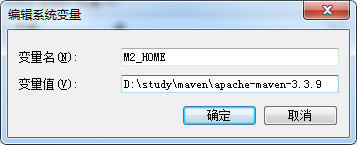

>Maven项目对象模型(POM)，可以通过一小段描述信息来管理项目的构建，报告和文档的项目管理工具软件。
>Maven 除了以程序构建能力为特色之外，还提供高级项目管理工具。由于 Maven 的缺省构建规则有较高的可重用性，所以常常用两三行 Maven 构建脚本就可以构建简单的项目。由于 Maven 的面向项目的方法，许多 Apache Jakarta 项目发文时使用 Maven，而且公司项目采用 Maven 的比例在持续增长。

# 安装Maven

首先去[官网](http://maven.apache.org/)下载对应的版本.

然后设置环境变量

先定义Maven的路径:


在path中添加环境变量


检验是否添加成功:


# 使用Maven

## Maven 目录结构
Maven定义了一个标准的目录结构。
```
- src
  - main
    - java
    - resources
    - webapp
  - test
    - java
    - resources

- target
```

并不是所有的maven都要使用上面的目录,上面的目录中有一些事可选的.一个最简单的目录应该是这样的:
```
- src
  - main
    - java
  - test
    - java
```

下面以构建一个简单的maven项目为例,我构建的一个名为`maven01`的项目目录结构如下:


然后创建两个类,两个类代码如下:
```java
package io.github.homxuwang.maven01.model;

public class HelloWorld {
	public String sayHello() {
		return "Hello World!";
	}
}
```

```java
package io.github.homxuwang.maven01.model;

import org.junit.*;
import org.junit.Assert.*;

public class HelloWorldTest {
	@Test
	public void testHello() {
		Assert.assertEquals("Hello World!",new HelloWorld().sayHello());
	}
}
```

并根据其`package`创建对应目录:


## 编写pom.xml文件
为`maven01`项目编写pom.xml文件,pom.xml文件**与src文件夹同级**.

```xml
<?xml version="1.0" encoding="UTF-8"?>
<project xmlns="http://maven.apache.org/POM/4.0.0" 
	xmlns:xsi="http://www.w3.org/2001/XMLSchema-instance" 
	xsi:schemaLocation="http://maven.apache.org/POM/4.0.0 http://maven.apache.org/xsd/maven-4.0.0.xsd">
  <modelVersion>4.0.0</modelVersion>
	<!-- groupId是项目的包名 -->
  <groupId>io.github.homxuwang.maven01</groupId>
	<!-- 模块名 -->
  <artifactId>maven01-model</artifactId>
  <version>0.0.1SNAPSHOT</version>

<!-- 项目的依赖 -->
  <dependencies>
  	<dependency>
  		<groupId>junit</groupId>
  		<artifactId>junit</artifactId>
  		<version>4.10</version>
  	</dependency>
  </dependencies>
</project>
```

这便是最基本的pom.xml文件.
`<modelVersion>4.0.0</modelVersion>`是固定的.
`<groupId></groupId>`是项目的包名.
`<artifactId></artifactId>`为模块名.
`<version></version>`则是定义发布的版本.
`<dependencies></dependencies>`中存放相关的依赖包,因为上面的例子中使用了junit依赖,所以这里进行相关设置,junit的版本为4.10.

可以根据上面的例子查看.

## 使用mvn命令进行编译等操作

进入到项目目录(我的为maven01),输入
```
mvn compile
```
进行编译,第一次编译时要下载相应依赖,所以有可能会很慢:


使用
```
mvn test
```
进行测试.


可以看到测试结果中,Tests run:1,即成功执行了一个测试.

在src目录下,生成了一个`target`文件夹,


target文件夹内容如下:
`classes`文件夹内就是编译后生成的字节码文件.
`surefire-reports`是相应的测试报告.


接着使用
```
mvn package
```
对程序进行打包


可以看到target文件夹下生成了一个jar包,其文件名就是在pom.xml中定义的 `<artifactId>maven01-model</artifactId>`+`<version>0.0.1SNAPSHOT</version>`的组合.

这便是maven最基本的操作

# maven拓展学习

## maven常用命令

* mvn -v 查看版本
* mvn compile 编译
* mvn test 测试
* mvn package 打包
* mvn clean 删除target文件夹
* mvn install 安装jar包到本地仓库中
如,再别的项目中如果想要使用maven01的话,那么就得先将maven01安装到本地仓库.然后再新项目的`dependencies`标签中添加maven01的相关信息.如:
```xml
...
<!-- 项目的依赖 -->
  <dependencies>
    <dependency>
      <groupId>junit</groupId>
      <artifactId>junit</artifactId>
      <version>4.10</version>
    </dependency>

    <dependency>
      <groupId>io.github.homxuwang.maven01</groupId>
      <artifactId>maven01-model</artifactId>
      <version>0.0.1SNAPSHOT</version>
    </dependency>
  </dependencies>
...
```
其实在加载依赖时,maven首先会扫描本地仓库是否有符合的依赖,如果有则加载,如果没有会到网上的maven中央仓库中进行下载,并放到本地仓库中以供使用.

## 使用archetype插件自动建立目录骨架

在最开始的例子中,我们要手动创建相应的符合maven开发的目录.而使用archetype插件可以自动生成一个符合maven开发的目录结构.
maven规定主代码的目录为:`src`:`main`:`java`:`主代码`
测试目录为:`src`:`test`:`测试代码`

在相应的项目目录下使用
```
mvn archetype:generate
```
然后按照提示进行选择,之后会自动创建对应目录.

第一次使用时会下载一些文件,可能时间会较长.

当然也可以一次性输入命令:
```
mvn archetype:generate -DgroupId=[groupId] -DartifactId=[artifactId] -Dversion=[version] -Dpackage=[代码所在的包名]
```

## maven中的坐标和仓库
maven中的
```xml
<groupId>xxx</groupId>
<artifactId>xxx</artifactId>
<version>xxx</version>
```
可以组成项目的一个基本坐标,任何的构建使用这个坐标进行**唯一标识**
一般`groupId`标签使用[公司网址的反写.项目名]
`artifactId`使用[项目名-模块名]
`version`则是对应的版本号

而很多的构件都是存放在仓库中的.仓库分为本地仓库和远程仓库.
首先maven会在本地仓库找相应的构件,如果找不到则会到远程仓库进行寻找.如果在找不到则会报错.

默认的全球中央仓库的地址是https://repo.maven.apache.org/maven2
这里包含了大多数的开源项目.

可以在https://search.maven.org/
搜索相应的包.

当然国内也有很多镜像仓库.
通过修改`[你的maven目录]\conf\settings.xml`文件,找到`mirrors`标签,进行相关镜像仓库的设置。其中给出了设置镜像仓库的格式:
```xml
<mirror>
  <id>mirrorId</id>
  <mirrorOf>repositoryId</mirrorOf>
  <name>Human Readable Name for this Mirror.</name>
  <url>http://my.repository.com/repo/path</url>
</mirror>
```

国内的两个常用的Maven仓库地址:
* 开源中国
```xml
<mirror>
    <id>nexus-osc</id>
    <mirrorOf>*</mirrorOf>
    <name>Nexus osc</name>
    <url>http://maven.oschina.net/content/groups/public/</url>
</mirror>
```
* 阿里
```xml
<mirror>
  <id>nexus-aliyun</id>
  <mirrorOf>*</mirrorOf>
  <name>Nexus aliyun</name>
  <url>http://maven.aliyun.com/nexus/content/groups/public</url>
</mirror>
```

更改仓库的位置:
maven从远程仓库下载的构件,默认存放在`C:\Users\[用户名]\.m2\repository`中

更改本地仓库的默认路径,依然要修改`[你的maven目录]\conf\settings.xml`文件,找到`localRepository`标签进行修改,注意目录间要使用`/`
```xml
<localRepository>/path/to/local/repo</localRepository>
```
可以将`settings.xml`文件复制一份到新的仓库文件夹中,这样如果以后修改maven版本就不用再修改settings文件了.

## maven的生命周期

完整的项目构建过程包括:
`清理`->`编译`->`测试`->`打包`->`集成测试`->`验证`->`部署`

maven的三套生命周期:
* clean 清理项目
* default 构建项目
* site 生成项目站点

三套生命周期之间的关系：
较之于生命周期阶段的前后依赖关系，三套生命周期本身是相互独立的，用户可以仅仅调用clean生命周期的某个阶段，或者仅仅调用default生命周期的某个阶段，而不会对其他生命周期产生任何影响。例如，当用户调用clean生命周期的clean阶段的时候，不会触发default生命周期的任何阶段，反之亦然，当用户调用default生命周期的compile阶段的时候，也不会触发clean生命周期的任何阶段。而当我们执行package时，会自动执行compile和test.

* **clean生命周期**

  clean生命周期的目的是清理项目，它包含三个阶段：

  * pre-clean执行一些清理前需要完成的工作。
  * clean清理上一次构建生成的文件。
  * post-clean执行一些清理后需要完成的工作。

* **default生命周期(核心)**
  default 生命周期定义了真正构建时所需要执行的所有步骤，它是所有生命周期中最核心的部分，常用的几个阶段有`compile`,`test`,`package`,`install`.其包含的阶段如下，这里只对重要的阶段进行解释：

  * validate
  * initialize
  * generate-sources
  * process-sources处理项目主资源文件。一般来说，是对src/main/resources目录的内容进行变量替换等工作后，复制到项目输出的主classpath目录中。
  * generate-resources
  * process-resources
  compile编译项目的主源码。一般来说，是编译src/main/java目录下的Java文件至项目输出的主classpath目录中。
  * process-classes
  * generate-test-sources
  * process-test-sources处理项目测试资源文件。一般来说，是对src/test/resources目录的内容进行变量替换等工作后，复制到项目输出的测试classpath目录中。
  * generate-test-resources
  * process-test-resources
  * test-compile编译项目的测试代码。一般来说，是编译src/test/java目录下的Java文件至项目输出的测试classpath目录中。
  * process-test-classes
  test使用单元测试框架运行测试，测试代码不会被打包或部署。
  * prepare-package
  package接受编译好的代码，打包成可发布的格式，如JAR。
  * pre-integration-test
  * integration-test
  * post-integration-test
  * verify
  * install将包安装到Maven本地仓库，供本地其他Maven项目使用。
  * deploy将最终的包复制到远程仓库，供其他开发人员和Maven项目使用。

* **site生命周期**
  site生命周期的目的是建立和发布项目站点，Maven能够基于POM所包含的信息，自动生成一个友好的站点，方便团队交流和发布项目信息。该生命周期包含如下阶段：

  * pre-site执行一些在生成项目站点之前需要完成的工作。
  * site生成项目站点文档。
  * post-site执行一些在生成项目站点之后需要完成的工作。
  * site-deploy将生成的项目站点发布到服务器上。

## maven的插件
http://maven.apache.org/plugins 可以查看maven提供的插件
以使用source插件为例.这个插件可以将项目源码进行打包.

在pom.xml中绑定插件
```xml
<project>
  ...
  <build>
    <plugins>
      <plugin>
        <!-- groupId artifactId version 是maven的坐标 -->
        <groupId>org.apache.maven.plugins</groupId>
        <artifactId>maven-source-plugin</artifactId>
        <version>2.4</version>
        <!-- 绑定source到default生命周期的package阶段 
             这样在执行package命令时就可以将源码进行打包
        -->
        <executions>
          <execution>
            <!-- 指定阶段 -->
            <phase>package</phase>
            <goals>
              <goal>jar-no-fork</goal>
            </goals>
          </execution>
        </executions>
      </plugin>
    </plugins>
  </build>
  ...
</project>
```

* **注**：
指定source的目标(即)`<goals><goal>jar-no-fork</goal></goals>`时,可在 http://maven.apache.org/plugins/maven-source-plugin/ 进行查看

## pom.xml解析
`project`为根标签,不用多说
`modelVersion`指定了当前pom的版本

* 坐标信息
  基本坐标信息由`groupId` `artifactId` `version` `packaging`构成
  * `groupId`标签定义当前的Maven属于哪个实际的项目。maven项目和实际的项目不是一一对应关系,maven项目提现的是模块化概念,因此一个实际项目往往被划分为很多的模块.
  * `artifactId`标签表示模块的标识,表示实际项目中的一个模块.一般用[项目名+模块名]进行标识
  * `version`标签标识版本号.第一个0表示大版本号,第二个0表示分支版本号,第三个0表示小版本号.`snapshot-快照`,`alpha-内部测试`,`beta-公测`,`Release-稳定`,`GA-正式发布`
  * `packaging`标签表示maven项目的打包方式.默认为`jar`,也可以指定为`war`,`zip`,`pom`等

  其他的一些描述信息:
    * `name`标签表示项目描述名
    * `url`标签表示项目地址
    * `description`标签表示项目的描述信息
    * `developers`标签表示开发人员列表
    * `licenses`标签表示许可信息
    * `organization`标签表示组织信息

* 依赖列表dependencies
  依赖列表放在`dependencies`标签中，其下可以包含多个依赖项`dependency`.依赖项里面如何确定一个依赖所在的位置呢？其实也是使用坐标,即`groupId` `artifactId` `version`这三个在上面的坐标信息中有介绍,还可以有:
  * `type`标签
  * `scope`标签表示**依赖范围**.比如junit依赖,`scope`标签其中填写test，表示junit只在test的依赖范围内有用.
  * `optional`标签表示设置以来是否可选,有两个值true,false,默认是false.如果为false则子项默认是继承的,否则要显示引入该依赖
  * `exclusions`标签表示排除依赖传递列表。其子标签为`exclusion`表示不需要使用到的依赖.

* 依赖管理dependencyManagement
  依赖管理放在`dependencyManagement`标签中.其中也可以声明依赖列表,包含多个依赖,但她不会被引用到依赖中，不会实际运行.
  ```xml
  <dependencyManagement>
    <dependencies>
      <dependency></dependency>
    </dependencies>
  </dependencyManagement>
  ```

* 为构建行为提供支持build
  在上面介绍过build,为构建项目提供一些支持.其根标签为`build`,常用的一个字标签为`plugins`即插件列表,在其下定义`plugin`,`plugin`依然要提供插件的坐标.
  ```xml
  <build>
    <plugins>
      <plugin>
         <groupId></groupId>
         <artifactId></artifactId>
         <version></version>
      </plugin>
    </plugins>
  </build>
  ```

* 继承父模块parent
parent通常表示在子模块中对父模块pom的继承

* 对多个模块进行编译modules
可以在`modules`下指定多个模块`module`.

## 依赖范围
在上一节中简单介绍了`scope`标签的一些内容.
在开发时,如果要用到某个jar包,就要将其引入到项目的classpath构件中,这样项目就能用该框架.maven中提供了三种classpath:编译、测试、运行.所以这里的依赖范围就是用来控制依赖与三种classpath的关系的.
主要有6个Dependency Scope
* compile
* provided
* runtime
* test
* system
* import

在[这里](http://maven.apache.org/guides/introduction/introduction-to-dependency-mechanism.html#Dependency_Scope)查看提供的scope值,并有具体描述.

## 依赖传递
比如C依赖B,而B依赖A.
在A打包并install到本地仓库后(保证B添加依赖后能正确编译),在B中添加对A的依赖,即在B的pom.xml中添加依赖:
```xml
<project>
...
 <dependencies>
    <dependency>
      <groupId>A</groupId>
      <artifactId>A</artifactId>
      <version>1.0</version>
    </dependency>
  </dependencies>
</project>
```
对B进行编译和打包(使得C可以添加对B的依赖,否则会报错).

然后让C依赖于B,即在C的pom.xml中添加依赖:
```xml
<project>
...
 <dependencies>
    <dependency>
      <groupId>B</groupId>
      <artifactId>B</artifactId>
      <version>1.0</version>
    </dependency>
  </dependencies>
</project>
```
然后对C进行编译,可以编译成功.

在对C编译成功后,C的maven依赖有A和B,虽然在对C进行添加依赖时只添加了B,但是由于依赖的传递性,A也会成为C的依赖.

* 排除依赖
如果C想排除A的依赖,要用到`exclusions`标签,如下:
```xml
<project>
...
 <dependencies>
    <dependency>
      <groupId>B</groupId>
      <artifactId>B</artifactId>
      <version>1.0</version>
      <exclusions>
        <exclusion>  <!-- declare the exclusion here -->
          <groupId>A</groupId>
          <artifactId>A/artifactId>
        </exclusion>
      </exclusions>
    </dependency>
  </dependencies>
</project>
```
这样就可以去除A的依赖了

## 依赖冲突
假设A和B依赖了不同版本的相同构件,对于依赖于A、B的C来说,它究竟依赖A和B的哪一个版本的构件.这里有两个原则：
* 短路优先
假设
A->B->C->X(jar)
A->D->X(jar)
那么A会依赖路径较短的版本

* 先声明路径优先
如果路径长度相同,则谁先声明,先解析谁

## 聚合和继承
* 聚合
在依赖传递中看到,如果要使用A和B，需要分别对A和B打包编译install，有一种方法可以将多个项目进行install,这个方式称为聚合.
进行聚合需要新建一个maven项目,这个项目与几个要打包的项目在同一目录(当然也可以不在同一目录,只是在module中要寻找相应的路径).在pom.xml中,将坐标信息的`packaging`标签修改为`pom`.可以将这个pom看成一个pom容器.

然后使用`modules`标签中的`module`找到要打包的多个项目:
```xml
<project>
...
  <groupId>io.github.homxuwang</groupId>
  <artifactId>mavenStudy-model</artifactId>
  <version>0.0.1SNAPSHOT</version>
  <packaging>pom</packaging>

  <modules>
    <module>../A</module>
    <module>../B</module>
    <module>../C</module>
  </modules>
</project>
```
然后对这个项目进行`install`时,会构建modules中的三个项目.

* 继承
假设A,B,C三个项目都用到了junit依赖,那么它们就有了重复的配置.在maven中可以将共同的特性封装成一个父类，使用`dependencyManagement`(使用这个标签,它的内容不会在项目中运行).
在父类pom.xml文件中,(这里假设新建一个名为Parent的新的maven项目,让ABC三个项目进行继承).

```xml
<project>
...
  <groupId>io.github.homxuwang</groupId>
  <artifactId>mavenStudy-model</artifactId>
  <version>0.0.1SNAPSHOT</version>
  <packaging>pom</packaging>

  <properties>
    <junit.version>3.8.1</junit.version>
  </properties>
  <dependencyManagement>
    <dependencies>
      <dependency>
        <groupId>junit</groupId>
        <artifactId>junit</artifactId>
        <version>${junit.version}</version>
      </dependency>
  </dependencies>
  </dependencyManagement>
</project>
```

上面的pom.xml中使用了`<properties>`标签,定义了junit的版本,然后在`dependency`中的`version`标签使用`${}`对其进行引用.

对于父亲pom，它的main目录和test目录是没有作用的,可以删除.

在子类pom.xml中继承父类的pom,以C为例:
```xml
<project>
...
 <groupId>C</groupId>
 <artifactId>C</artifactId>
 <version>0.0.1</version>
 <packaging>jar</packaging>
 <!-- 使用parent标签,其中写父亲pom的坐标 -->
 <parent>
    <!-- 父pom的坐标 -->
   <groupId>io.github.homxuwang</groupId>
   <artifactId>mavenStudy-model</artifactId>
   <version>0.0.1SNAPSHOT</version>
 </parent>

 <dependencies>
    <dependency>
      <groupId>junit</groupId>
      <artifactId>junit</artifactId>
    </dependency>
</project>
```

可以看到,`dependency`中junit的版本号(version标签)已经删除了,但是由于它集成了父pom,其中定义了junit的版本,所以是正确的.

# 参考

https://www.imooc.com/video/8644

https://blog.csdn.net/wangdong5678999/article/details/72848044