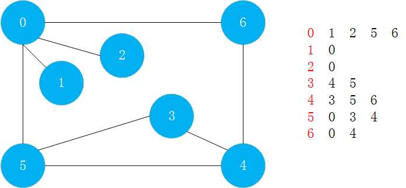
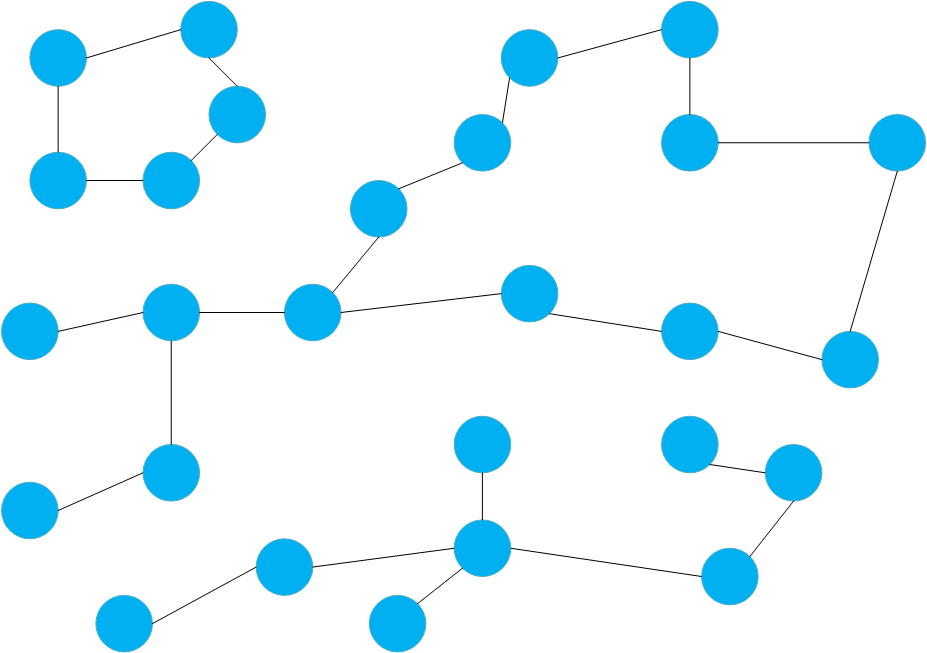
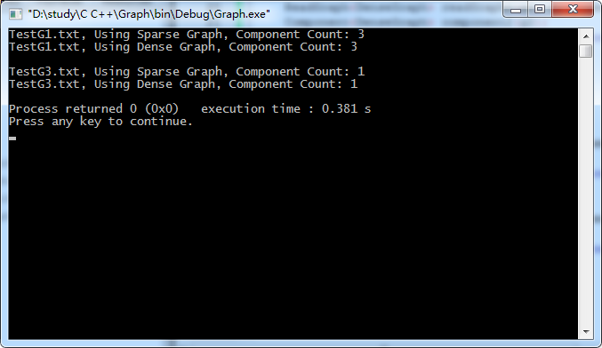
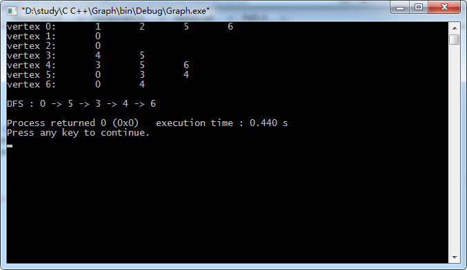
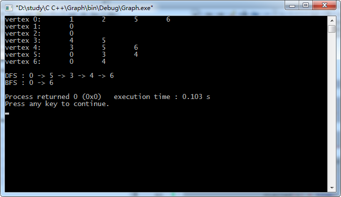
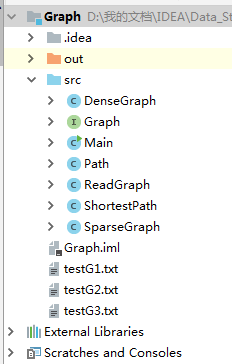
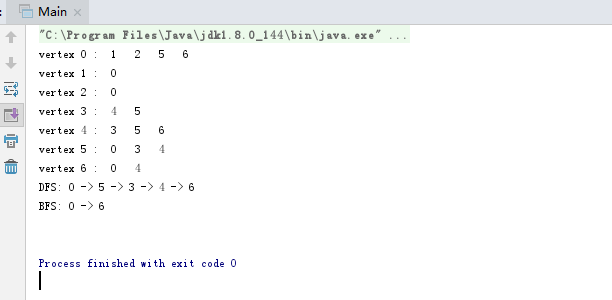

对于图的遍历，和树一样，也有深度优先遍历和广度优先遍历。
对于图的深度优先遍历，是从一个点开始，不停的往下试探，知道不能继续为止。但是与树不同的是，图有可能会存在环，所以要记录一下某个点是否已经被遍历过，如果已经被遍历过，则下面的遍历就不需要继续走这个点了。

以下面的数据为例:


# 深度优先遍历

假设从0开始遍历，看与0相连的第一个节点1，节点1没有遍历过所以遍历了1，此时为`0 1`；
接着看和节点1相邻的节点，只有节点0，节点0已经被遍历过了，不用管，此时1没有其他相邻节点了，此时这条路就算走完了，则退回到节点0；
然后看0的下一个没有被遍历的节点为节点2,节点2没有被遍历过，所以将2遍历，此时为`0 1 2`；
接着看和节点2相邻的节点，只有节点0，节点0已经被遍历过，退回到节点0；
接着看下一个和0相邻的节点，为节点5，没有被遍历过，所以对节点5进行遍历，此时遍历的元素为`0 1 2 5`；
接着看和节点5相邻的节点，第一个节点为节点0，已经被遍历过；第二个节点为节点3，没有被遍历过，所以进行遍历，此时遍历的元素为`0 1 2 5 3`；
接着看和节点3相邻的节点，第一个为节点4，没有被遍历过，所以进行遍历，此时遍历元素为`0 1 2 5 3 4`；
然后看和节点4相邻的节点，节点3和节点5已经被遍历过了，不进行遍历；节点6没有被遍历过，所以进行遍历，此时遍历的元素为`0 1 2 5 3 4 6`；
然后来到节点6，和节点6相邻的节点0和节点4已经被遍历过了，所以不进行遍历；
然后退回到节点4，节点4从节点6退回来之后，没有其他节点，节点4的这条路遍历完了，所以从节点4退回到节点3；对于节点3来说，刚才将节点4遍历了，下一个节点5也已经遍历了，节点3这条路遍历完了；所以又从节点3退回到节点5，对于节点5的下一个节点——节点4也已经遍历过了，所以节点5这条路也遍历完了；退回到节点0，节点0的下一个要遍历的节点6已经被遍历过了，所以节点0这条路也已经便利完了；
至此，使用深度优先的方式，将所有节点全部遍历了一遍。

整个过程需要记录一下某个节点是否已经被遍历过。

## 连通分量
深度优先遍历的一个典型应用就是求连通分量。

对于一张有三个部分的图，在图论中，这三部分就是连通分量。连通分量之间没有任何边相连。求连通分量只需整体遍历这个图，从某个点开始遍历，先将这个连通分量遍历完；然后再找一个没有被遍历的点，继续遍历，则也可以将第二部分遍历完；最后将剩下的部分进行遍历。



以求连通分量为例，实现图的深度优先遍历。
创建`Component.h`
```c
#ifndef COMPONENT_H_INCLUDED
#define COMPONENT_H_INCLUDED

#include <iostream>
#include <cassert>
using namespace std;

template <typename Graph>
class Component{

private:
    Graph &G;
    bool *visited; //记录某个节点是否已经被访问过
    int ccount; //连通分量个数

    void dfs( int v ){

        visited[v] = true;

        typename Graph::adjIterator adj(G, v); //加typename指定adjInterator是一个类型而不是一个成员变量
        for( int i = adj.begin() ; !adj.end() ; i = adj.next() ) {//从adj的第一个开始，只要不到adj的结尾，就进行循环，每次i变为adj的下一个元素
            if( !visited[i] ) //如果没有被访问过，使用递归方法对它继续进行深度优先遍历，
                dfs(i);
        }
    }
public:
    Component(Graph &graph): G(graph){
        visited = new bool[G.V()];
        ccount = 0 ;
        for(int i = 0 ; i < G.V() ; i ++)
            visited[i] = false;

        for(int i = 0 ; i < G.V() ; i ++){
            if( !visited[i] ){ //如果当前的节点没有被访问过的话，就进行深度优先遍历
                dfs(i);     //遍历之后，所有连通的节点都置为true
                ccount ++;  //遍历之后，连通分量+1；然后接着找没有被遍历的节点作为起点进行深度遍历
            }
        }

    }

    ~Component(){
        delete[] visited;
    }

    int count(){
        return ccount;
    }
};

#endif // COMPONENT_H_INCLUDED
```

新建文件`testG3.txt`，例子中的图表达为:
```
7 8
0 1
0 2
0 5
0 6
3 4
3 5
4 5
4 6
```

在main函数中进行测试:
```c
#include <iostream>
#include <stdlib.h>
#include <time.h>
#include "SparseGraph.h"
#include "DenseGraph.h"
#include "ReadGraph.h"
#include "Component.h"
using namespace std;

int main() {

    string filename1 = "testG1.txt";
    SparseGraph g1 = SparseGraph(13, false);
    ReadGraph<SparseGraph> readGraph1(g1, filename1);
    Component<SparseGraph> component1(g1);
    cout<<"TestG1.txt, Using Sparse Graph, Component Count: "<<component1.count()<<endl;

    DenseGraph g2 = DenseGraph(13, false);
    ReadGraph<DenseGraph> readGraph2(g2, filename1);
    Component<DenseGraph> component2(g2);
    cout<<"TestG1.txt, Using Dense Graph, Component Count: "<<component2.count()<<endl;

    cout<<endl;

    // TestG3.txt - g3 and g4
    string filename2 = "testG2.txt";
    SparseGraph g3 = SparseGraph(7, false);
    ReadGraph<SparseGraph> readGraph3(g3, filename2);
    Component<SparseGraph> component3(g3);
    cout<<"TestG3.txt, Using Sparse Graph, Component Count: "<<component3.count()<<endl;

    DenseGraph g4 = DenseGraph(7, false);
    ReadGraph<DenseGraph> readGraph4(g4, filename2);
    Component<DenseGraph> component4(g4);
    cout<<"TestG3.txt, Using Dense Graph, Component Count: "<<component4.count()<<endl;


    return 0;
}
```


相应的，如果能求出连通分量，也能求出两个结点之间是否是相连的。对`Component.h`做出修改:
```c
#ifndef COMPONENT_H_INCLUDED
#define COMPONENT_H_INCLUDED

#include <iostream>
#include <cassert>
using namespace std;

template <typename Graph>
class Component{

private:
    Graph &G;
    bool *visited; //记录某个节点是否已经被访问过
    int ccount; //连通分量个数
    int *id;
    void dfs( int v ){

        visited[v] = true;
        id[v] = ccount;  //在进行dfs操作时，将id[v]的值设置为ccount的值，这样不同连通分量部分的顶点其值不同
        typename Graph::adjIterator adj(G, v); //加typename指定adjInterator是一个类型而不是一个成员变量
        for( int i = adj.begin() ; !adj.end() ; i = adj.next() ) {//从adj的第一个开始，只要不到adj的结尾，就进行循环，每次i变为adj的下一个元素
            if( !visited[i] ) //如果没有被访问过，使用递归方法对它继续进行深度优先遍历，
                dfs(i);
        }
    }
public:
    Component(Graph &graph): G(graph){
        visited = new bool[G.V()];
        id = new int[G.V()];
        ccount = 0 ;
        for(int i = 0 ; i < G.V() ; i ++){
            visited[i] = false;
            id[i] = -1;
        }

        for(int i = 0 ; i < G.V() ; i ++){
            if( !visited[i] ){ //如果当前的节点没有被访问过的话，就进行深度优先遍历
                dfs(i);     //遍历之后，所有连通的节点都置为true
                ccount ++;  //遍历之后，连通分量+1；然后接着找没有被遍历的节点作为起点进行深度遍历
            }
        }

    }

    ~Component(){
        delete[] visited;
        delete[] id;
    }

    int count(){
        return ccount;
    }

    bool isConnected( int v , int w){
        assert( v >= 0 && v < n );
        assert( w >= 0 && w < n );
        return id[v] == id[w];
    }
};

#endif // COMPONENT_H_INCLUDED
```

## 获得两点间的一条路径

使用深度优先的方式，不一定能获得一条最短路径。在`Path.h`类中新增一个数组`from`，用来记录每访问一个节点时，该节点是从哪个节点过来的，根据from数组，就可以倒推出两点之间相应的路径。
`Path.h`
```c
#ifndef PATH_H_INCLUDED
#define PATH_H_INCLUDED

#include <vector>
#include <stack>
#include <iostream>
#include <cassert>
using namespace std;

template <typename Graph>
class Path{

private:
    Graph &G;
    int s;
    bool* visited;
    int* from; // 记录路径, from[i]表示查找的路径上i的上一个节点

    void dfs( int v ){

        visited[v] = true;
        typename Graph::adjIterator adj(G, v); //加typename指定adjInterator是一个类型而不是一个成员变量
        for( int i = adj.begin() ; !adj.end() ; i = adj.next() ) {//从adj的第一个开始，只要不到adj的结尾，就进行循环，每次i变为adj的下一个元素
            if( !visited[i] ) {
                //如果没有被访问过，使用递归方法对它继续进行深度优先遍历，并将该节点放入from[]数组，说明是从v节点过来的
                from[i] = v;
                dfs(i);
            }
        }
    }
public:
    // 构造函数, 寻路算法, 寻找图graph从s点到其他点的路径
    Path(Graph &graph, int s):G(graph){
        //算法初始化
        assert( s >= 0 && s < G.V() );

        visited = new bool[G.V()];
        from = new int[G.V()];
        for( int i = 0 ; i < G.V() ; i ++ ){
            visited[i] = false;
            from[i] = -1;
        }
        this->s = s;

        // 寻路算法
        // 其实就是进行深度优先遍历的过程中，记录一下
        dfs(s);
    }

    ~Path(){
        delete[] visited;
        delete[] from;
    }

    //从原点s到w是否有路
    bool hasPath(int w){
        assert( w >= 0 && w < G.V() );
        return visited[w];
    }

    //从原点到w的具体路径是什么样的
    //因为是从w节点倒着走，所以先存放在stack中，然后在依次放在vector中
    void path(int w, vector<int> &vec){
        // 通过from数组逆向查找到从s到w的路径, 存放到栈中
        stack<int> s;

        int p = w;
        while( p != -1 ){
            s.push(p);
            p = from[p];
        }

        vec.clear();
        while( !s.empty() ){
            vec.push_back( s.top() );
            s.pop();
        }
    }

    //打印出从s到w的路径
    void showPath(int w){
        vector<int> vec;

        path(w,vec);

        for( int  i = 0 ; i < vec.size() ; i ++){
            cout << vec[i];
            if( i == vec.size() - 1)
                cout << endl;
            else
                cout << " -> ";
        }


    }
};

#endif // PATH_H_INCLUDED
```
在`main.h`中进行测试，打印从0到6的路径。

```c
#include <iostream>
#include <stdlib.h>
#include <time.h>
#include "SparseGraph.h"
#include "DenseGraph.h"
#include "ReadGraph.h"
#include "Path.h"
using namespace std;


int main() {

    string filename = "testG3.txt";
    SparseGraph g = SparseGraph(7, false);
    ReadGraph<SparseGraph> readGraph1(g, filename);
    g.show();
    cout<<endl;

    Path<SparseGraph> dfs(g,0);
    cout<<"DFS : ";
    dfs.showPath(6);

    return 0;
}
```



## 深度优先遍历的复杂度

稀疏图（邻接表）:O(V+E)
稠密图（邻接矩阵）:O(V^2)

深度优先遍历对有向图依然有效

# 广度优先遍历

广度优先遍历，使用队列进行辅助。
还是使用最开始的图进行讲解。

首先将节点0推入队列中，然后开始遍历过程；（和树的遍历一致，先将根节点推入）(此时队列为`0`)
遍历时，每次遍历都将队列首的元素取出来作为遍历的对象，现在队列首是节点0，将其取出，遍历节点0；(此时队列为空,遍历过的节点有`0`)
然后将所有与节点0相邻的节点，如果还没有加入队列中，就将其加入，所以将节点1，节点2，节点5，节点6加入到队列中，这样就完成了一次操作；(此时队列为`1 2 5 6`,遍历过的节点有`0`)
接着，将队列首的节点1拿出来作为遍历的对象，节点1就被遍历了，而与节点1相邻的节点只有节点0,0已经遍历过；所以继续将节点2从队列首拿出来，作为遍历的对象，而节点2相邻的节点也只有节点0,不用管；(此时队列为`5 6`，遍历过的节点有`0 1 2`)
接着将队列首的节点5拿出来，作为遍历的对象，对于节点5，它相邻的节点有节点0，节点3，节点4，节点0已经加入过队列并遍历完，所以将节点3，节点4加入到队列中；(此时队列为`6 3 4`，遍历过的节点有`0 1 2 5`)
继续将队列首的节点6拿出来，作为遍历的对象，节点6的相邻节点有节点0和节点4，需要注意节点0已经被遍历过不需要管，节点4虽然没有被遍历过，但是它已经被加入到队列中（所以在代码实现时，注意需要对加入到队列中的元素进行标记，因为一旦被加入到队列，那么它一定会被遍历），所以这次遍历就算完成;(此时队列为`3 4`,遍历过的节点有`0 1 2 5 6`)
接着将队列首的节点3拿出来进行遍历，节点3相邻的节点有节点4和节点5，节点5和节点4都已经被加入过队列，这次遍历结束；(此时队列为`4`，遍历过的节点有`0 1 2 5 6 3`)
最后将队列首的节点4拿出来进行遍历，对于节点4相邻的节点3，节点5，节点6都已经加入过队列，所以这次遍历结束。
至此，队列为空，广度优先遍历结束。

其实广度优先遍历，是以距起始节点的距离为顺序进行遍历的。
首先0节点自己到自己的距离为0，然后与节点0所有相邻的节点1、2、5、6被推进队列，它们距节点0的距离都为1；
接着将节点3,4推入到队列，它们距节点0的距离都为2。
所以广度优先遍历有时候也成为层序优先遍历，以遍历的起点开始，一层层的往下推，先遍历的节点距离起始节点近（更严谨的说法是先遍历的节点到起始节点的距离是小于等于后遍历的节点的，比如先遍历节点1后遍历节点6，但是它们到节点0 的距离都是1）。
利用这种方法，可以在程序中记录这个距离。在无权图中记录到起始节点的距离，不仅如此，如果像深度优先遍历，同时用`from[]`记录每一个节点是从哪一个节点过来，还可以将最短路径同时求出来。所以，广度优先遍历的一个应用就是求出`无权图`的最短路径(这里注意是无权图，但是不局限于有向图还是无向图)。

新建`ShortestPath.h`类:
```c
#ifndef SHORTESTPATH_H_INCLUDED
#define SHORTESTPATH_H_INCLUDED

#include <vector>
#include <queue>
#include <iostream>
#include <cassert>

using namespace std;

template <typename Graph>
class ShortestPath{

private:
    Graph &G;
    int s;
    bool *visited;  // 记录dfs的过程中节点是否被访问
    int *from;  // 记录路径, from[i]表示查找的路径上i的上一个节点
    int *ord; //记录s到每一个节点的距离是多少，即记录路径中节点的次序。ord[i]表示i节点在路径中的次序。


public:
    ShortestPath( Graph &graph, int s):G(graph){
        //算法初始化
        assert( s >= 0 && s < graph.V() );

        visited = new bool[graph.V()];
        from = new int[graph.V()];
        ord = new int[graph.V()];
        for(int  i = 0 ; i < graph.V() ; i++){
            visited[i] = false;
            from[i] = -1;
            ord[i] = -1;
        }
        this->s = s;

         // 无向图最短路径算法, 从s开始广度优先遍历整张图
        queue<int> q;
        q.push(s); //首先向队列中推入原点s
        visited[s] = true; //标记s已经被访问
        ord[s] = 0; //标记原点到自己的距离为0
        while( !q.empty() ){
            int v = q.front(); //将队列首的元素取出
            q.pop(); //队列首的元素出队

            typename Graph::adjIterator adj(G,v);   //遍历与队列首元素v所有相邻的元素
            for( int i = adj.begin() ; !adj.end() ; i = adj.next() ){
                if( !visited[i] ){ //查看i元素是不是已经被访问过，即是否已经被加入过队列，如果没有的话
                    q.push(i); //把i加入到队列中
                    visited[i] = true;
                    from[i] = v; //是从v节点走到i的
                    ord[i] = ord[v] + 1; //从过来的节点的距离+1
                }
            }
        }
    }

    ~ShortestPath(){
        delete[] visited;
        delete[] from;
        delete[] ord;
    }

    bool hasPath(int w){
        assert( w >= 0 && w < G.V());
        return visited[w];
    }

    void path(int w ,vector<int> &vec){
        assert( w >= 0 && w < G.V());

        stack<int> s;

        int p = w;
        while( p != -1 ){
            s.push(p);
            p = from[p];
        }

        vec.clear();
        while( !s.empty() ){
            vec.push_back( s.top() );
            s.pop();
        }
    }

    void showPath(int w){

        assert( w >= 0 && w < G.V() );

        vector<int> vec;
        path(w,vec);
        for(int  i = 0 ; i < vec.size() ; i ++ ){
            cout<<vec[i];
            if( i == vec.size() - 1 )
                cout << endl;
            else
                cout << " -> ";
        }
    }

    int length(int w){
        assert( w >= 0 && w < G.V() );
        return ord[w];
    }
};

#endif // SHORTESTPATH_H_INCLUDED
```

使用main函数测试:

```c
#include <iostream>
#include <stdlib.h>
#include <time.h>
#include "SparseGraph.h"
#include "DenseGraph.h"
#include "ReadGraph.h"
#include "Path.h"
#include "ShortestPath.h"
using namespace std;


int main() {

    string filename = "testG3.txt";
    SparseGraph g = SparseGraph(7, false);
    ReadGraph<SparseGraph> readGraph1(g, filename);
    g.show();
    cout<<endl;

    Path<SparseGraph> dfs(g,0);
    cout<<"DFS : ";
    dfs.showPath(6);

    ShortestPath<SparseGraph> bfs(g,0);
    cout<<"BFS : ";
    bfs.showPath(6);
    return 0;
}

```



使用深度优先遍历有可能会找到最短路径，这与图的创建、具体的存储顺序有关；但是使用广度优先遍历，一定能够找到两个连通点的最短路径。此外，在这个图中，如果求0到4的最短路径，有可能取出`0->6->4`或者`0->5->4`，这与在图中遍历的顺序是怎样的有关。

## 广度优先遍历的复杂度

广度优先遍历的复杂度和深度优先遍历的复杂度是一样的:

稀疏图（邻接表）:O(V+E)
稠密图（邻接矩阵）:O(V^2)

# java实现


其中几个主要的类实现参考
[图论基础](https://homxuwang.github.io/2019/03/29/%E5%9B%BE%E8%AE%BA%E5%9F%BA%E7%A1%80/)

`Path.java`:
```java
import java.util.Vector;
import java.util.Stack;

public class Path {

    private Graph G; // 图的引用
    private int s;  //起始点
    private boolean[] visited; // 记录dfs的过程中节点是否被访问
    private int[] from;  // 记录路径，from[i]表示查找的路径上i的上一个节点

    //图的深度优先遍历
    private void dfs( int v ){
        visited[v] = true;
        for( int i : G.adj(v) ){ // 遍历所有v的相邻点
            if( !visited[i] ){ // 如果没有被遍历过
                from[i] = v;   //将v加入到路径数组
                dfs(i);     //递归进行遍历
            }
        }
    }

    // 构造函数, 寻路算法, 寻找图graph从s点到其他点的路径
    public Path(Graph graph , int s){
        G = graph;
        if(!(s >= 0 && s < G.V() )){
            throw new IllegalArgumentException("make sure that s >= 0 and s < G.V()");
        }

        visited = new boolean[G.V()];
        from = new int[G.V()];
        for(int i = 0 ; i < G.V() ; i ++){
            visited[i] = false;
            from[i] = -1;
        }
        this.s = s;

        //寻路算法
        dfs(s);
    }

    //查询从s点到w点是否有路径
    boolean hasPath(int w){
        if(!(w >= 0 && w < G.V() )){
            throw new IllegalArgumentException("make sure that w >= 0 and w < G.V()");
        }

        return visited[w];
    }

    //查询从s点到w点的路径,存放在vec中
    Vector<Integer> path(int w){
        if(!(hasPath(w))){
            throw new IllegalArgumentException("no path between s and w");
        }

        Stack<Integer> s = new Stack<>();
        //通过from数组逆向查找从s到w的路径，存放到栈中
        int p = w;
        while (p != -1){
            s.push(p);
            p = from[p];
        }

        //从栈中取出元素，获得顺序的从s到w的路径
        Vector<Integer> res = new Vector<>();
        while( !s.empty() ){
            res.add( s.pop() );
        }
        return res;
    }

    //打印出从s点到w点的路径
    void showPath(int w){
        if(!hasPath(w)){
            throw new IllegalArgumentException("no path between s and w");
        }

        Vector<Integer> vec = path(w);
        for( int i = 0 ; i < vec.size() ; i++){
            System.out.print(vec.elementAt(i));
            if( i == vec.size() - 1 )
                System.out.println();
            else
                System.out.print(" -> ");
        }
    }

}
```

`ShortestPath.java`:
```java
import java.util.Vector;
import java.util.Stack;
import java.util.LinkedList;
import java.util.Queue;

public class ShortestPath {

    private Graph G; //图的引用
    private int s;  //起始点
    private boolean[] visited; // 记录dfs的过程中节点是否被访问
    private int[] from; //记录路径，from[i]表示查找的路径上i的上一个节点
    private int[] ord;  //记录路径中节点的次序，ord[i]表示i节点在路径中的次序

    //构造函数，寻路算法，寻找图graph从s点到其他点的路径
    public ShortestPath(Graph graph, int s){
        G = graph;
        if(!(s >= 0 && s < G.V() )){
            throw new IllegalArgumentException("make sure that s >= 0 and s < G.V()");
        }

        visited = new boolean[G.V()];
        from = new int[G.V()];
        ord = new int[G.V()];
        for(int i = 0 ; i < G.V() ; i ++){
            visited[i] = false;
            from[i] = -1;
            ord[i] = -1;
        }
        this.s = s;

        //无向图最短路径算法，s开始广度优先遍历整张图
        Queue<Integer> q = new LinkedList<>();

        q.add(s);
        visited[s] = true;
        ord[s] = 0 ;
        while(!q.isEmpty()){
            int v = q.remove();
            for(int i : G.adj(v))
                if(!visited[i]){
                    q.add(i);
                    visited[i] = true;
                    from[i] = v;
                    ord[i] = ord[v] + 1;
                }
        }
    }

    //查询从s点到w点是否有路径
    public boolean hasPath(int w){
        if(!(w >= 0 && w < G.V() )){
            throw new IllegalArgumentException("make sure that w >= 0 and w < G.V()");
        }
        return visited[w];
    }

    //查询从s点到w点的路径，存放在vec中
    public Vector<Integer> path(int w){
        if(!(hasPath(w))){
            throw new IllegalArgumentException("no path between s and w");
        }

        Stack<Integer> s = new Stack<>();
        //通过from数组逆向查找从s到w的路径,存放在栈中
        int p = w;
        while(p != -1){
            s.push(p);
            p = from[p];
        }

        //从栈中一次取出元素,获得顺序的从s到w的路径
        Vector<Integer> res = new Vector<>();
        while (!s.empty()){
            res.add(s.pop());
        }

        return res;
    }

    //打印出从s到w的路径
    public void showPath(int w){
        if(!(hasPath(w))){
            throw new IllegalArgumentException("no path between s and w");
        }

        Vector<Integer> vec = path(w);
        for(int i = 0 ; i < vec.size() ; i ++){
            System.out.print(vec.elementAt(i));
            if(i == vec.size() - 1)
                System.out.println();
            else
                System.out.print(" -> ");
        }
    }

    //查看从s点到w点的最短路径长度
    //若从s到w不可达，则返回-1
    public int length(int w){
        if(!(w >= 0 && w < G.V() )){
            throw new IllegalArgumentException("make sure that w >= 0 and w < G.V()");
        }
        return ord[w];
    }
}
```

`testG3.txt`:
```
7 8
0 1
0 2
0 5
0 6
3 4
3 5
4 5
4 6
```

`Main.java`:
```java
public class Main {
    public static void main(String[] args){

        String filename = "testG3.txt";
        SparseGraph g = new SparseGraph(7,false);
        ReadGraph readGraph = new ReadGraph(g,filename);
        g.show();

        //比较使用深度优先遍历和广度优先遍历获得路径的不同
        //广度优先遍历获得的是无权图的最短路径
        Path dfs = new Path(g,0);
        System.out.print("DFS: ");
        dfs.showPath(6);

        ShortestPath bfs = new ShortestPath(g,0);
        System.out.print("BFS: ");
        bfs.showPath(6);

        System.out.println();

    }
}
```

实验结果:

