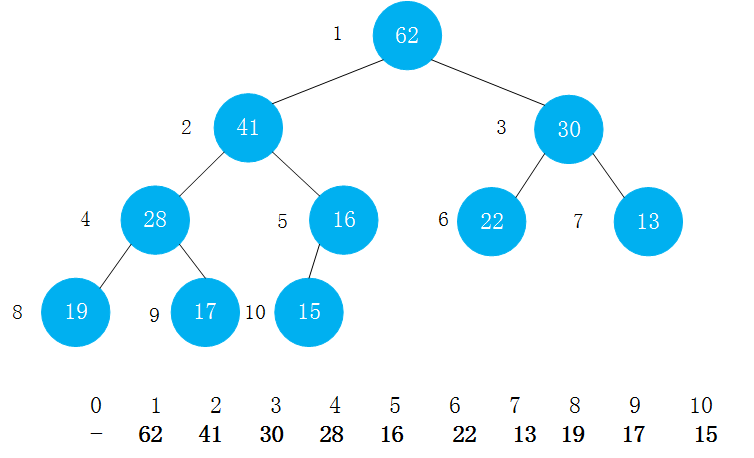
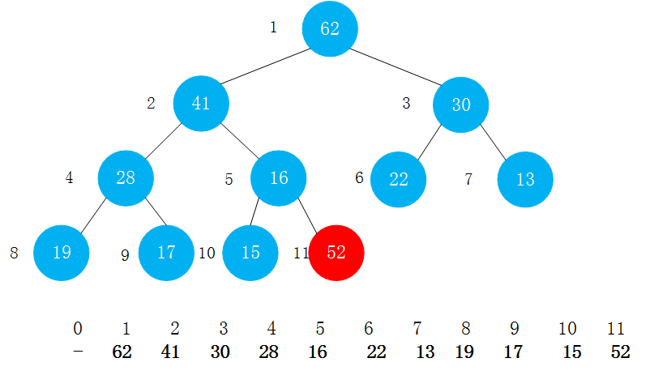
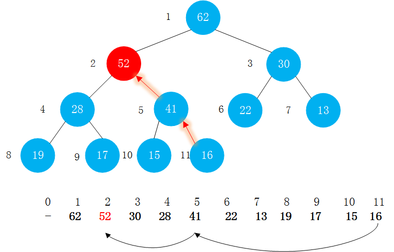
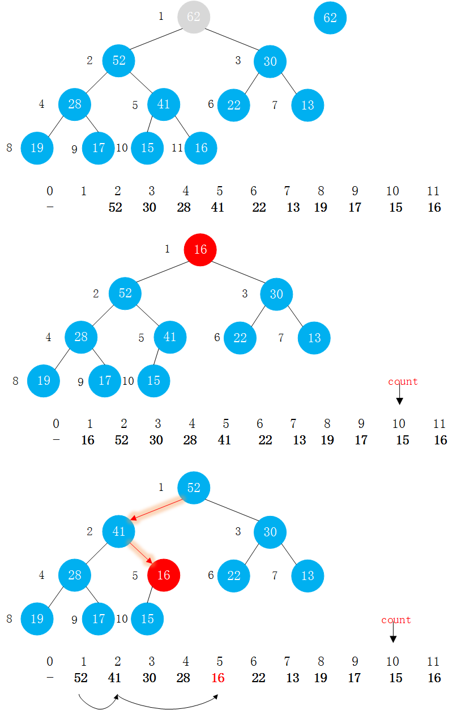
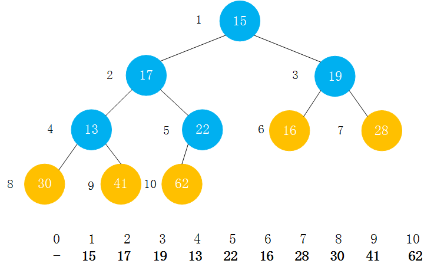
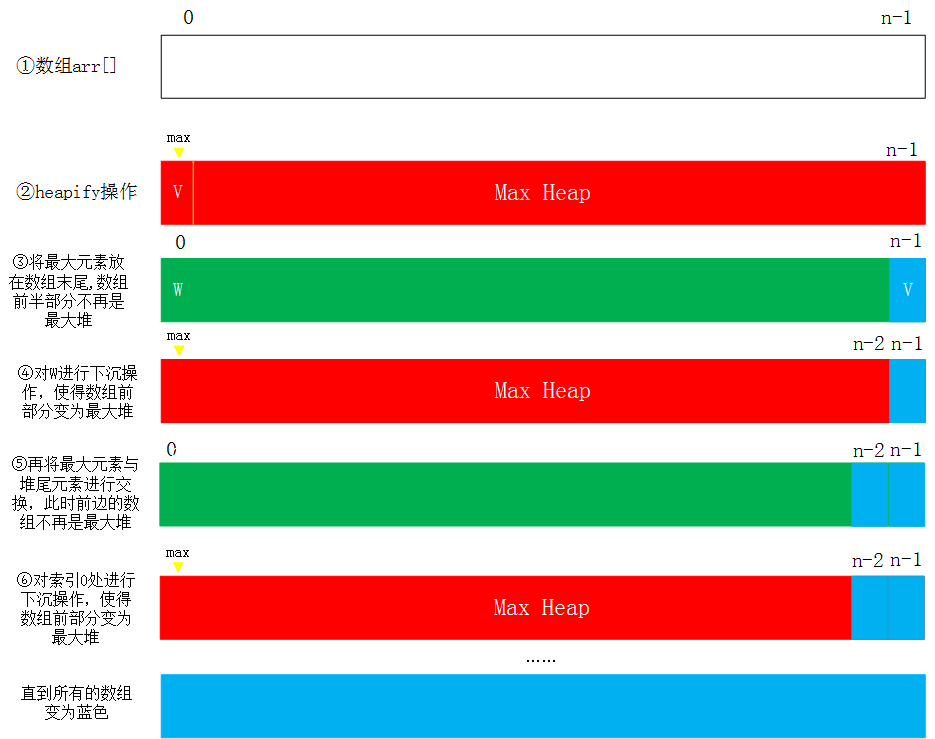
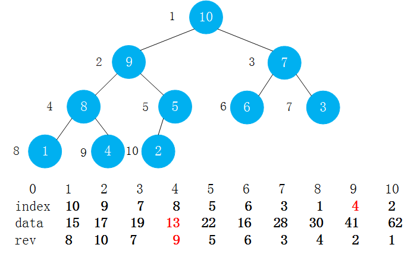

在[优先队列](https://homxuwang.github.io/2018/08/12/%E5%AE%9E%E7%8E%B0%E4%BC%98%E5%85%88%E9%98%9F%E5%88%97/)这一文章中，实现优先队列使用了最大堆的数据结构。这一次将详细讲解堆。

>数据结构二叉堆能够很好地实现优先队列的基本操作。在二叉堆的数组中，每个元素都要保证大于等于另两个特定位置的元素。相应地，这些位置的元素又至少要大于等于数组中的另两个元素，以此类推。如果我们将所有元素画成一棵二叉树，将每个较大元素和两个较小的元素用边连接就可以很容易看出这种结构。

>定义：当一棵二叉树的每个结点都大于等于它的两个子结点时，它被称为有序堆。

* 堆中某个结点的值总是不大于其父结点的值
* 堆总是一棵完全二叉树
* 层数越高并<font color=red>不一定</font>值越大

# 堆的基本实现

如果用指针来表示堆有序的二叉树，那么每个元素都需要三个指针来找到它的上下结点(父结点和两个子结点)。由于二叉堆是一个完全二叉树，因此可以使用数组来表示它。
>定义。二叉堆是一组能够用堆有序的完全二叉树排序的元素，并在数组中按照层级储存(不使用数组的第一个位置)。

下面均以最大堆为例进行介绍。

下图为算法第四版中堆的表示：


>在一个堆中，位置k的结点的父亲结点的位置为[k/2],而它的两个子结点的位置则分别为2k和2k+1。这样在不使用指针的情况下我们也可以通过计算数组的索引在树中上下移动:从a[k]向上一层就令k等于k/2，向下一层则令k等于2k或2k+1.



```
parent(i) = i / 2

left child   (i) = 2 * i
right chilld (i) = 2 * i + 1
```

# 堆的算法

>在有序化的过程中我们会遇到两种情况。当某个结点的优先级上升(或是在堆底加入一个新的元素)时，我们需要由下至上恢复堆的顺序。当某个结点的优先级下降(例如，将根节点替换为一个较小的元素)时，我们需要由上至下恢复堆的顺序。

## 由下至上的堆有序化(上浮)

以下面的图为例，在堆中添加一个元素，相当于在数组末尾添加了一个元素.



此时加入的元素`52`打破了堆的定义，它变得比它的父结点更大，所以需要交换它和它的父结点来修复堆。交换后这个节点比它的两个子结点都大(一个是曾经的父结点，另一个比它更小，因为它是曾经父结点的子结点)，但这个节点仍可能比它现在的父结点更大。所以要一遍遍地用相同的方法进行恢复，将这个结点不断上移，直到遇到一个比它大的父结点。



只要记住位置k的结点的父结点是[k/2]。在《算法(第四版)》中，这个方法定义为`swim()`，意为当一个节点太大的时候它需要浮(swim)到堆的更高层也有的地方将此方法定义为`shiftUp()`。这里只需明白其本质含义，理解起来就不难了。
`swim()`方法中的循环可以保证只有位置k上的节点大于它的父结点时，堆的有序状态才会被打破。因此只要该节点不再大于它的父结点，堆的有序状态就恢复了。

首先需要两个辅助函数`less()`和`exch()`:
```java
//辅助函数less():比较索引i处的值是否小于索引j处的值
private boolean less(int i, int j){
    return data[i].compareTo(data[j]) < 0;
}

//辅助函数交换堆中索引为i和j的两个元素
private void exch(int i,int j){
    Item t = data[i];
    data[i] = data[j];
    data[j] = t;
}
```
然后实现`swim()`函数:
```java
//最大堆核心辅助函数——swim()，进行元素上浮操作
private void swim(int k){
    while ( k > 1 && less(k/2,k)){
        exch(k/2,k);
        k /= 2;
    }
}
```

这些辅助函数在元素插入的时候进行相关调用:
```java
//插入函数
public void insert(Item item){
    if(count + 1 > capacity){
        throw new IllegalArgumentException("out of bounds!");
    }
    data[count + 1] = item;  //因为索引0位置不用，所以要+1
    count ++;
    //上面两行可以写成data[++count] = item;
    swim(  count );
}
```

## 由上至下的堆有序化(下沉)

与上浮操作对应的操作就是下沉(sink或叫Shift Down)操作。
>如果堆的有序状态因为某个结点变得比它的两个子结点或是其中之一更小而被打破了，那么我们可以通过将它和它的两个子结点中较大者交换来恢复堆。交换可能会在子结点处继续打破堆的有序状态，因此我们需要不断地用相同的方式将其修复，将结点向下移动直到它的子结点都比它更小或是到达了堆的底部。

上浮操作对应了堆的插入操作，下沉操作则对应了堆的取出元素的操作(也就是在优先队列中出队操作时，需要调用堆的取出元素操作，进而需要使用sink来维护堆)。

在取出元素时，只能取出根结点的元素(即最大值)。在取出根结点的元素后，将数组最后的元素放到根结点，然后从根结点开始下沉。(这是根据堆是完全二叉树的性质，将最后一个元素放到根结点，整个堆仍是一个完全二叉树)



下沉操作函数`sink()`:
```java
//最大堆核心辅助函数——sink(),进行元素下沉
private void sink(int k){
    while (2 * k <= count){
        int j = 2 * k;// 在此轮循环中,data[k]和data[j]交换位置
        if( j+1 <= count && less(j,j+1)) //判断是否有右孩子,如果有的话得到左孩子和右孩子中较大的值
            j ++;
        // data[j] 是 data[2*k]和data[2*k+1]中的最大值
        if(!less(k,j)) //data[k].compareTo(data[j]) >= 0
            break;
        exch(k,j);
        k = j;
    }
}
```

在《算法(第四版)》中，取出最大值的函数为`delMax()`，个人觉得"删除"不是很合适。所以使用了bobo老师的命名`extractMax()`.

```java
//从最大堆中取出堆顶元素
public Item extractMax(){
    if(!(count > 0)){
        throw new IllegalArgumentException("count should be > 0!");
    }
    Item ret = data[1];

    exch(1,count);
    count --;
    sink(1);

    return ret;
}
```

实现最大堆的完成代码:见附录一

## Heapify

对于给定的一个完全二叉树，它不满足堆的性质，如图。但是，对于给定的二叉树来说，它的所有叶子节点(即没有孩子的结点)，他们本身就是一个最大堆(黄色标记的节点)，每个堆中的元素只有一个。



对于一个完全二叉树来说，第一个非叶子节点的索引是[完全二叉树的元素个数/2]得到的索引值.即对于这个完全二叉树来说，第一个非叶子结点的索引是[10/2=5].

从后向前考虑每一个不是叶子结点的结点。上面提到了，第一个非叶子结点是索引为5的结点，它和它的子结点62不满足堆的性质，所以对其进行`sink()`操作；然后对索引为4的结点进行`sink()`操作;接着是索引为3的节点、索引为2的节点、索引为1的节点(根节点).然后操作完成。


看看算法第四版中的描述:
>一个更聪明更有效的办法是从右至左用sink()函数构造子堆。数组的每个位置都已经是一个子堆的根节点了，sink()对于这些子堆也适用。如果一个根节点的两个子结点都已经是堆了，那么在该节点上调用sink()可以将它们变成一个堆。这个过程会递归的建立起堆的秩序。开始时我们只需要扫描数组中的一半元素，因为我们可以跳过大小为1的子堆。最后我们在位置1上调用sink()方法,扫描结束。在排序的第一阶段，堆的构造方法和我们的想象有所不同，因为我们的目标是构造一个堆有序的数组并使最大元素位于数组的开头(次大的元素在附近)而非构造函数结束的末尾。

新的构造函数:
```java
// 构造函数, 通过一个给定数组创建一个最大堆
// 该构造堆的过程, 时间复杂度为O(n)
public MaxHeap(Item[] arr){
    int n = arr.length;

    data = (Item[]) new Comparable[n+1];
    capacity = n;

    for(int i = 0 ; i < n ; i ++){
        data[i+1] = arr[i];
    }
    count = n;

    for(int i = count / 2 ; i >= 1 ; i --){ //从第一个不是叶子结点的节点开始
        sink(i);
    }
}
```

这里要强调，堆排序的效率其实不如快速排序和归并排序，它在处理一些动态问题时是有优势的。

使用这种方式建堆比一个个插入元素建堆的效率是要高的。将n个元素逐个插入到一个空堆中，算法复杂度为O(nlogn).但是heapify的过程，算法复杂度为O(n).

使用这种方法初始化堆，然后进行堆排序虽然在速度上有了一定提升，但是和上面的堆排序一样，他们的空间复杂度都为O(n),即都需要重新构建n个空间的数组来进行相应操作，但是其实可以对其进行优化，使得排序在原数组上进行.

## 原地堆排序

所谓原地堆排序就是直接在相应的数组上进行排序，而不用再额外开辟n个空间将数组复制到堆中，原地堆排序的空间复杂度为O(1).
前面的知识我们知道，其实一个堆就是一个数组，只是它的索引从1开始，空间是n+1.所以我们完全可以把传入的数组看成一个堆，然后在它上面进行相应操作。

①、②：首先，将传入的数组使用heapify操作，将其变成一个最大堆。在最大堆中，第一个元素的位置就是整个数组中最大值.

③：然后，将最大的元素V放在数组末尾的位置，即让arr[0]:V与arr[n-1]:W交换。
这时候，前面的数组arr[0...n-2]部分不再满足最大堆的性质，因为第一个位置为W，它不是最大值。

④：所以这时候对元素W进行下沉操作，将绿色部分的数组再次转换为最大堆。这时，整个堆中最大的元素又在arr[0]位置，堆末尾的元素在倒数第2个位置arr[n-2]处。

⑤：此时再将堆首和堆尾的元素进行交换。此时的最大元素arr[0]放在了arr[n-2]位置处。由于这次交换，又打破了最大堆的性质，前面的数组(绿色部分)不再是最大堆。

⑥：这时候继续对索引为0的位置进行下沉操作。使得前半部分数组再次成为最大堆。

这样依次进行操作，知道堆中所有的元素都进入到蓝色部分。



整个算法直接在原数组上进行，空间复杂度为O(1).

由于数组都是从索引0开始的，所以在对其操作时，需要注意相应的索引都应-1.


这时候计算孩子和父亲时需要注意:
```
//父节点
parent(i) = (i-1) / 2

//孩子节点
left child   (i) = 2 * i + 1
right child  (i) = 2 * i + 2

//最后一个非叶子节点的索引
index = (count-1) / 2
```

代码实现:
```java
import java.util.*;

// 不使用一个额外的最大堆, 直接在原数组上进行原地的堆排序
public class HeapSort {

    //不产生实例
    private HeapSort(){}

    public static void sort(Comparable[] arr){

        int n = arr.length;

        //对数组进行hepify操作

        //注意，此时的堆是从0开始索引的
        //从(最后一个元素的索引-1)/2开始
        //最后一个元素的索引 = n - 1
        for(int i = (n - 1 - 1 ) / 2 ; i >= 0 ; i --){
            sink2(arr,n,i);
        }

        for(int i = n - 1 ; i > 0 ; i --){
            //依次交换数组首个元素和索引为i的元素
            exch(arr,0,i);
            //交换后对数组首元素进行下沉操作，使数组前部分扔为最大堆
            sink(arr,i,0);
        }
    }

    //交换堆中索引为i和j的两个元素
    private static void exch(Object[] arr,int i,int j){
        Object t = arr[i];
        arr[i] = arr[j];
        arr[j] = t;
    }

    /**
     * sink下沉操作
     * @param arr 用来处理的数组
     * @param n 元素个数
     * @param k 用于下沉的元素索引
     */
    private static void sink(Comparable[] arr,int n,int k){
        while (2 * k + 1 < n){
            int j = 2 * k + 1; //左孩子
            if( j + 1 < n && arr[j+1].compareTo(arr[j]) > 0)
                j += 1;
            if(arr[k].compareTo(arr[j]) >= 0 )
                break;

           exch(arr,k,j);
           k = j;
        }
    }

    // 优化的下沉过程, 使用赋值的方式取代不断的exch,
    // 该优化思想和我们之前对插入排序进行优化的思路是一致的
    private static void sink2(Comparable[] arr, int n, int k){
        Comparable e = arr[k];
        while( 2*k+1 < n ){
            int j = 2*k+1;
            if( j+1 < n && arr[j+1].compareTo(arr[j]) > 0 )
                j += 1;

            if( e.compareTo(arr[j]) >= 0 )
                break;

            arr[k] = arr[j];
            k = j;
        }
        arr[k] = e;
    }
}
```

# 索引堆 - Index Heap

前面的介绍中，在进行堆排序时，实际上是在数组中进行了操作，排序的过程让元素在数组中的位置发生改变。当然这只是简单的元素。如果在实际应用中用了更复杂的结构，如字符串，让它进行交换会产生很大的性能消耗；又如本来堆排好序后是表示任务的优先级，现在要改变指定索引处任务则需要进行遍历、修改数据结果等操作，这都要消耗很大的性能。所以引入索引堆。

以最大索引堆为例,对于索引堆来说，将索引和数据分开存储，而真正表征堆的数组，是由索引构建成的，如下图，二叉堆的每个结点存的是索引号，当将数组构建成堆后，data域并没有改变，真正改变的是index域。index数组发生了改变，形成了一个堆-索引堆。


那么如何解读索引堆呢？
看上图，此时堆顶的元素是10，意思是堆顶的元素是索引10指向的data[10]:62;
相应的，堆顶元素的左孩子为9，即对应data数组中索引为9的元素data[9]:41,右孩子为7,即对应data数组中索引为7的元素data[7]:28...依次类推

这样做的优点是：
* 构建索引堆的过程只是索引的位置发生交换，而索引就只是简单的int型，如果data中存储的是很复杂的数据结构，仅交换索引的效率是很高的；
* 如果想对堆中的数据进行操作，比如将进程号为7的系统任务提高优先级，将data[7]:28提高为data[7]:38,进行完提高优先级操作后，这时候还要进行一系列操作维持堆的性质，这时候只需要根据新的data[]数组改变index数组就可以了。

简单的解释就是在数据比较的时候比较的是data中的数据，在进行交换的时候交换的是index的索引。

索引堆的代码实现：见附录二

## 索引堆的优化

在索引堆的代码中，进行change操作时，维护indexes数组时对indexes数组进行了一次遍历，使得其时间复杂度变为了O(n).其实有方法将其时间复杂度提升.

改进方法的思路成为反向查找。如下图，在原来两个数组的基础上又多了一个数组rev(reverse),rev[i]表示i这个索引在数组中的位置是什么。

举例来说，如果用户把位置4处的data:13修改了，修改了之后，就要维护4这个索引在堆中的位置，即维护indexes数组，那么可以通过rev[4]找到其在堆中的位置，即rev[4] = 9,索引4在堆中的位置就是在indexes[9]处。



使用rev数组，在更新操作时就可以使用O(1)复杂度更新索引在indexes中的位置。

| 0 | 1 | 2 | 3 | 4 | 5 | 6 | 7 | 8 | 9 | 10 |
| -- | -- | -- | -- | -- | -- | -- | -- | -- | -- | -- |
| index | 10 | 9 | 7 | 8 | 5 | 6 | 3 | 1 | 4 | 2 |
| data | 15 | 17 | 19 | 13 | 22 | 16 | 28 | 30 | 41 | 62 |
| rev | 8 | 10 | 7 | 9 | 5 | 6 | 3 | 4 | 2 | 1 |

reverse和indexes的关系:
`reverse[i] 表示索引i在indexes(堆)中的位置`

如果对堆进行了改动，那么reverse也要进行改动:
`indexes[i] = j
reverse[j] = i`

`indexes[reverse[i]] = i
reverse[indexes[i]] = i`

在书写代码时需要注意，在change函数操作时，输入索引i时，即使`i>=1 && i < capacity`满足，但是也不意味着i处的元素在堆中。因此需要引入辅助函数`contain(i)`来检查索引堆是否包含该索引。需要在`getItem`和`change`方法中进行调用.

修改后的代码请见附录三(只写出了发生改变的函数).

# 其他

可以使用堆实现优先队列，动态选择优先级最高的任务执行。

可以借用堆实现多路归并排序。

有了二叉堆的基础，可以基于用数组表示的完全三叉树构造堆，或者构造多叉堆。

本篇的用例都是以最大堆为例进行讲解和代码编写，转换一下逻辑也可以实现最小堆。

本篇中的数组采用的是固定大小的数组，也可是使用动态数组来实现，没有了capacity的限制，动态调整堆中数组的大小。


# 附录一

```java
import java.util.*;
// 在堆的有关操作中，需要比较堆中元素的大小，所以Item需要extends Comparable
public class MaxHeap<Item extends Comparable> {

    private Item[] data;
    private int count;
    private int capacity;  //能够容纳的元素数量
    //构造函数,构造一个空的堆，能够容纳capacity个元素
    public MaxHeap(int capacity){
        data = (Item[])new Comparable[capacity + 1];
        count = 0;
        this.capacity = capacity;
    }

    //返回堆中的元素个数
    public int size(){
        return count;
    }

    //返回一个布尔值，表示堆是否为空
    public boolean isEmpty(){
        return count == 0;
    }

    //插入函数
    public void insert(Item item){
        if(count + 1 > capacity){
            throw new IllegalArgumentException("out of bounds!");
        }
        data[count + 1] = item;  //因为索引0位置不用，所以要+1
        count ++;
        //上面两行可以写成data[++count] = item;
        swim(  count );
    }

    //从最大堆中取出堆顶元素
    public Item extractMax(){
        if(!(count > 0)){
            throw new IllegalArgumentException("count should be > 0!");
        }
        Item ret = data[1];

        exch(1,count);
        count --;
        sink(1);

        return ret;
    }

    // 获取最大堆中的堆顶元素
    public Item getMax(){
        if(!(count > 0)){
            throw new IllegalArgumentException("count should be > 0!");
        }
        return data[1];
    }
    //最大堆核心辅助函数——swim()，进行元素上浮操作
    private void swim(int k){
        while ( k > 1 && less(k/2,k)){
            exch(k/2,k);
            k /= 2;
        }
    }

    //最大堆核心辅助函数——sink(),进行元素下沉
    private void sink(int k){
        while (2 * k <= count){
            int j = 2 * k;// 在此轮循环中,data[k]和data[j]交换位置
            if( j+1 <= count && less(j,j+1))  //判断是否有右孩子,如果有的话得到左孩子和右孩子中较大的值
                j ++;
            // data[j] 是 data[2*k]和data[2*k+1]中的最大值
            if(!less(k,j)) //data[k].compareTo(data[j]) >= 0
                break;
            exch(k,j);
            k = j;
        }
    }
    //辅助函数less():比较索引i处的值是否小于索引j处的值
    private boolean less(int i, int j){
        return data[i].compareTo(data[j]) < 0;
    }

    //辅助函数交换堆中索引为i和j的两个元素
    private void exch(int i,int j){
        Item t = data[i];
        data[i] = data[j];
        data[j] = t;
    }

    // 测试 MaxHeap
    public static void main(String[] args) {

        MaxHeap<Integer> maxHeap = new MaxHeap<Integer>(100);
        int N = 100; // 堆中元素个数
        int M = 100; // 堆中元素取值范围[0, M)
        for( int i = 0 ; i < N ; i ++ )
            maxHeap.insert( new Integer((int)(Math.random() * M)) );

        Integer[] arr = new Integer[N];
        // 将maxheap中的数据逐渐使用extractMax取出来
        // 取出来的顺序应该是按照从大到小的顺序取出来的
        for( int i = 0 ; i < N ; i ++ ){
            arr[i] = maxHeap.extractMax();
            System.out.print(arr[i] + " ");
        }
        System.out.println();

        // 确保arr数组是从大到小排列的
        for( int i = 1 ; i < N ; i ++ )
            assert arr[i-1] >= arr[i];
    }
}
```

# 附录二

```java
import java.util.*;
import java.lang.*;

//最大索引堆
public class IndexMaxHeap<Item extends Comparable> {

    protected Item[] data;   //存储最大索引堆中的数据
    protected int[] indexes;//存储最大索引堆中的索引
    protected int count;
    protected int capacity;

    //构造函数,构造一个空堆,可容纳capacity个元素
    public IndexMaxHeap(int capacity){
        data = (Item[])new Comparable[capacity +1 ];
        indexes = new int[capacity + 1];
        this.capacity = capacity;
    }

    //返回索引堆中的元素个数
    public int size(){
        return count;
    }

    //返回一个布尔值,表示索引堆中是否为空
    public boolean isEmpty(){
        return count == 0;
    }

    // 获取最大索引堆中索引为i的元素
    public Item getItem( int i ){
        if(!(i + 1 >= 1 && i + 1 <= capacity)){
            throw new IllegalArgumentException("out of bounds!");
        }
        return data[i+1]; //对用户来说，索引从0开始，所以这里要+1
    }

    //向最大索引堆中插入一个新的元素,新元素的索引为i,元素为item
    //传入的i对用户而言,是从0索引的
    public void insert(int i , Item item){
        if(count + 1 > capacity){
            throw new IllegalArgumentException("out of bounds!");
        }
        if(!(i + 1 >= 1 && i + 1 <= capacity)){
            throw new IllegalArgumentException("out of bounds!");
        }

        //对用户而言是从索引0开始，但是内部还是从1开始
        i += 1;
        data[i] = item; //将item插入到data[i]处
        indexes[count + 1 ] = i;  //之前是插入到data堆中，现在则插入到indexes堆底
        count ++;

       swim(count);
    }

    //从最大索引堆中取出堆顶元素,即索引堆中所存储的最大数据
    public Item extractMax(){
        if(count <= 0){
            throw new IllegalArgumentException("count should be > 0.");
        }
        Item ret = data[indexes[1]];
        exchIndexes(1,count);
        count --;
        sink(1);

        return ret;
    }

    // 从最大索引堆中取出堆顶元素的索引
    public int extractMaxIndex(){
        if(count <= 0){
            throw new IllegalArgumentException("count should be > 0.");
        }

        int ret = indexes[1] - 1;  //对用户来说，索引从0开始，所以要-1
        exchIndexes( 1 , count );
        count --;
        sink(1);

        return ret;
    }

    // 获取最大堆中的堆顶元素
    public Item getMax(){
        if(!(count > 0)){
            throw new IllegalArgumentException("count should be > 0!");
        }
        return data[indexes[1]];
    }

    // 获取最大索引堆中的堆顶元素的索引
    public int getMaxIndex(){
        if(!(count > 0)){
            throw new IllegalArgumentException("count should be > 0!");
        }
        return indexes[1]-1;  //对用户来说，索引是从0开始的，所以要减一
    }

    //将最大索引堆中索引为i的元素修改为newItem
    public void change(int i , Item newItem){
        i += 1;
        data[i] = newItem;

        //找到indexes[j] = i ,j表示data[i]在堆中的位置
        //之后进行sink(j)、swim(j) (前后顺序可变)
        for(int j = 1 ; j < count ; j ++){
            if(indexes[j] == i){
                swim(j);
                sink(j);
                return;
            }
        }
    }

    // 交换索引堆中的索引i和j
    private void exchIndexes(int i, int j){
        int t = indexes[i];
        indexes[i] = indexes[j];
        indexes[j] = t;
    }

    //在索引堆中，数据之间的比较根据data的大小进行比较，但实际操作的是索引
    private void swim(int k) {
        while(k > 1 && data[indexes[k/2]].compareTo(data[indexes[k]])< 0){ //原来直接对于data数组的操作要通过indexes索引堆间接找到data中的元素
            exchIndexes(k,k/2);
            k /= 2;
        }
    }

    // 索引堆中, 数据之间的比较根据data的大小进行比较, 但实际操作的是索引
    private void sink(int k){
        while(2 * k <= count){
            int j = 2 * k;
            if(j + 1 <= count && data[indexes[j+1]].compareTo(data[indexes[j]]) > 0)
                j ++;
            if(data[indexes[k]].compareTo(data[indexes[j]]) >= 0)
                break;

            exchIndexes(k,j);
            k = j;
        }
    }
}
```

# 附录三
```java
import java.util.*;
import java.lang.*;

//最大索引堆
public class IndexMaxHeap<Item extends Comparable> {

    protected Item[] data;   //存储最大索引堆中的数据
    protected int[] indexes;// 最大索引堆中的索引, indexes[x] = i 表示索引i在x的位置
    protected int[] reverse;// 最大索引堆中的反向索引, reverse[i] = x 表示索引i在x的位置
    protected int count;
    protected int capacity;

    //构造函数,构造一个空堆,可容纳capacity个元素
    public IndexMaxHeap(int capacity){
        data = (Item[])new Comparable[capacity +1 ];
        indexes = new int[capacity + 1];
        reverse = new int[capacity + 1]; //reverse表示i索引在堆中的位置
        //取标记值,i不存在时应为0.因为索引是从1开始计数，0没有意义.
        for(int i = 0 ; i <= capacity ; i ++)
            reverse[i] = 0;

        this.capacity = capacity;
    }

    //返回索引堆中的元素个数
    //...

    //返回一个布尔值,表示索引堆中是否为空
    //...

    // 获取最大索引堆中索引为i的元素
    public Item getItem( int i ){
        if(!(i + 1 >= 1 && i + 1 <= capacity)){
            throw new IllegalArgumentException("out of bounds!");
        }

        if(!(contain(i))){
            throw new IllegalArgumentException("index i is not in the heap!");
        }
        return data[i+1]; //对用户来说，索引从0开始，所以这里要+1
    }

    //向最大索引堆中插入一个新的元素,新元素的索引为i,元素为item
    //传入的i对用户而言,是从0索引的
    public void insert(int i , Item item){
        if(count + 1 > capacity){
            throw new IllegalArgumentException("out of bounds!");
        }
        if(!(i + 1 >= 1 && i + 1 <= capacity)){
            throw new IllegalArgumentException("out of bounds!");
        }
        //在插入一个新元素前，还需要保证索引i所在的位置是没有元素的
        if(contain(i)){
            throw new IllegalArgumentException("index i is not in the heap!");
        }

        //对用户而言是从索引0开始，但是内部还是从1开始
        i += 1;
        data[i] = item; //将item插入到data[i]处
        indexes[count + 1 ] = i;  //之前是插入到data堆中，现在则插入到indexes堆底
        reverse[i] = count + 1;

        count ++;

       swim(count);
    }

    //从最大索引堆中取出堆顶元素,即索引堆中所存储的最大数据
    public Item extractMax(){
        if(count <= 0){
            throw new IllegalArgumentException("count should be > 0.");
        }
        Item ret = data[indexes[1]];
        exchIndexes(1,count);
        reverse[indexes[count]] = 0; //因为交换后，相当于把栈顶元素放到了最后，然后用count--就相当于删除这个元素，删除这个元素那么它的reverse值指向0就可以了.

        count --;
        sink(1);

        return ret;
    }

    // 从最大索引堆中取出堆顶元素的索引
    public int extractMaxIndex(){
        if(count <= 0){
            throw new IllegalArgumentException("count should be > 0.");
        }

        int ret = indexes[1] - 1;  //对用户来说，索引从0开始，所以要-1
        exchIndexes( 1 , count );
        reverse[indexes[1]] = 1;
        reverse[indexes[count]] = 0; //因为交换后，相当于把栈顶元素放到了最后，然后用count--就相当于删除这个元素，删除这个元素那么它的reverse值指向0就可以了.

        count --;
        sink(1);

        return ret;
    }

    // 获取最大堆中的堆顶元素
    public Item getMax(){
        if(!(count > 0)){
            throw new IllegalArgumentException("count should be > 0!");
        }
        return data[indexes[1]];
    }

    // 获取最大索引堆中的堆顶元素的索引
    public int getMaxIndex(){
        if(!(count > 0)){
            throw new IllegalArgumentException("count should be > 0!");
        }
        return indexes[1]-1;  //对用户来说，索引是从0开始的，所以要减一
    }

    //将最大索引堆中索引为i的元素修改为newItem
    public void change(int i , Item newItem){
        if(!(contain(i))){
            throw new IllegalArgumentException("index i is not in the heap!");
        }
        i += 1;
        data[i] = newItem;

        //找到indexes[j] = i ,j表示data[i]在堆中的位置
        //之后进行sink(j)、swim(j) (前后顺序可变)

        // 有了 reverse 之后可以非常简单的通过reverse直接定位索引i在indexes中的位置
        int j = reverse[i];
        swim(j);
        sink(j);
//        for(int j = 1 ; j < count ; j ++){
//            if(indexes[j] == i){
//                swim(j);
//                sink(j);
//                return;
//            }
//        }

    }

    // 交换索引堆中的索引i和j
    // 由于有了反向索引reverse数组，
    // indexes数组发生改变以后， 相应的就需要维护reverse数组
    private void exchIndexes(int i, int j){
        int t = indexes[i];
        indexes[i] = indexes[j];
        indexes[j] = t;

        reverse[indexes[i]] = i;
        reverse[indexes[j]] = j;
    }

    //在索引堆中，数据之间的比较根据data的大小进行比较，但实际操作的是索引
    private void swim(int k) {
        while(k > 1 && data[indexes[k/2]].compareTo(data[indexes[k]])< 0){ //原来直接对于data数组的操作要通过indexes索引堆间接找到data中的元素
            exchIndexes(k,k/2);
            //下面两行写在了exchIndexes中
            // reverse[indexes[k/2]] = k / 2;
            // reverse[indexes[k]] = k;

            k /= 2;
        }
    }

    // 索引堆中, 数据之间的比较根据data的大小进行比较, 但实际操作的是索引
    private void sink(int k){
        while(2 * k <= count){
            int j = 2 * k;
            if(j + 1 <= count && data[indexes[j+1]].compareTo(data[indexes[j]]) > 0)
                j ++;
            if(data[indexes[k]].compareTo(data[indexes[j]]) >= 0)
                break;

            exchIndexes(k,j);
            //下面两行写在了exchIndexes中
            // reverse[indexes[k]] = k;
            // reverse[indexes[j]] = j;

            k = j;
        }
    }

    //判断索引是否在堆中
    private boolean contain( int i ){
        if(!(i + 1 >= 1 && i + 1 <= capacity)){
            throw new IllegalArgumentException("i out of bounds!");
        }
        return reverse[ i + 1 ] != 0;
    }

        // 测试索引堆中的索引数组index和反向数组reverse
    // 注意:这个测试在向堆中插入元素以后, 不进行extract操作有效
    public boolean testIndexes(){

        int[] copyIndexes = new int[count+1];
        int[] copyReverseIndexes = new int[count+1];

        for( int i = 0 ; i <= count ; i ++ ) {
            copyIndexes[i] = indexes[i];
            copyReverseIndexes[i] = reverse[i];
        }

        copyIndexes[0] = 0;
        copyReverseIndexes[0] = 0;
        Arrays.sort(copyIndexes);
        Arrays.sort(copyReverseIndexes);

        // 在对索引堆中的索引和反向索引进行排序后,
        // 两个数组都应该正好是1...count这count个索引
        boolean res = true;
        for( int i = 1 ; i <= count ; i ++ )
            if( copyIndexes[i-1] + 1 != copyIndexes[i] ||
                    copyReverseIndexes[i-1] + 1 != copyReverseIndexes[i] ){
                res = false;
                break;
            }

        if( !res ){
            System.out.println("Error!");
            return false;
        }

        return true;
    }

    // 测试 IndexMaxHeap
    public static void main(String[] args) {

        int N = 1000000;
        IndexMaxHeap<Integer> indexMaxHeap = new IndexMaxHeap<Integer>(N);
        for( int i = 0 ; i < N ; i ++ )
            indexMaxHeap.insert( i , (int)(Math.random()*N) );
        assert indexMaxHeap.testIndexes();
    }
}
```

