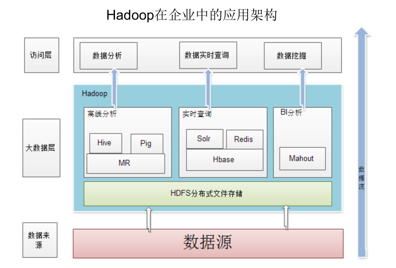
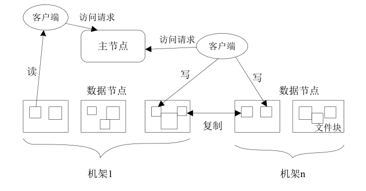
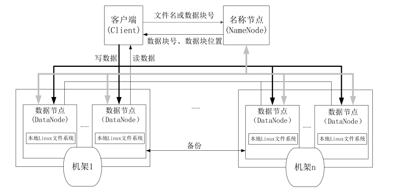
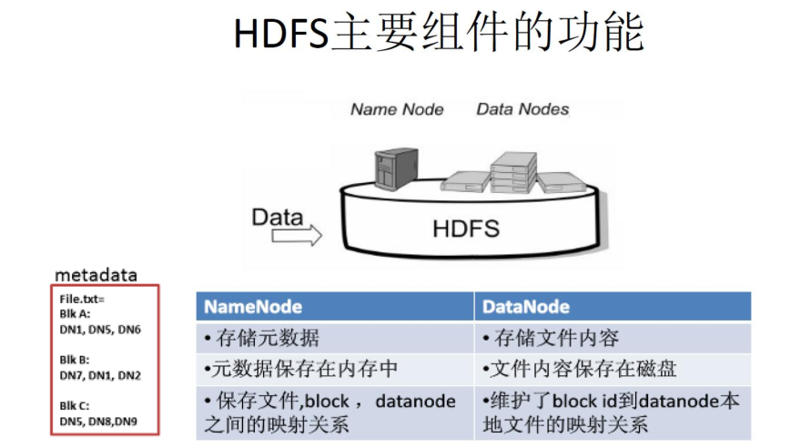
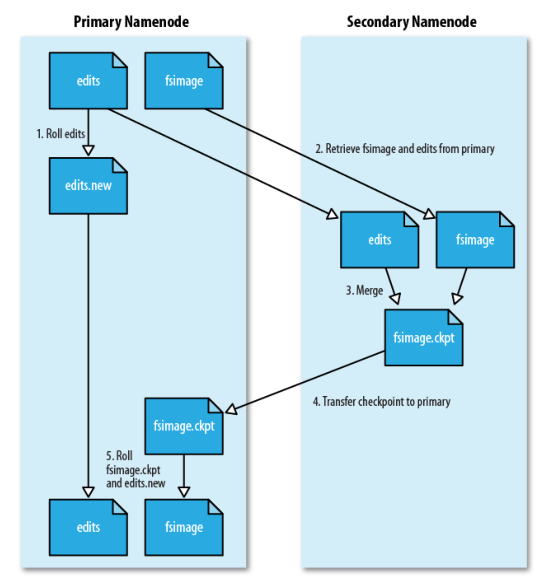
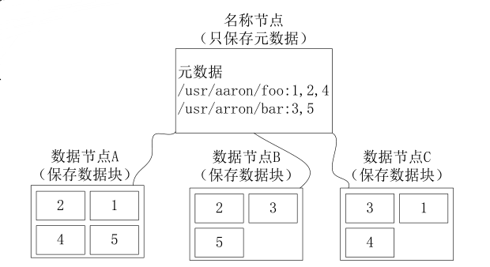

# Hadoop
## Hadoop的应用现状和构成简介

下图为Hadoop在企业中的 应用架构

访问层不用多说，满足企业的数据分析、数据挖掘和数据实时查询功能。
为了满足访问层的需求，大数据层的各个技术对其进行支撑。
（1）离线分析：大量数据拿过来之后进行批量处理。其中MR是MapReduce的简称，Hive数据仓库和Pig也可以进行离线数据分析。
（2）实时查询：其中Hbase是一个可以支持几十亿行数据的非常好的分布式数据库。
（3）BI分析：Mahout是Hadoop平台上的一款数据挖掘应用。可以把各种数据挖掘，机器学习和商务智能的算法用MapReduce实现。否则开发人员要自己用MapReduce写决策树算法。

下图为一些大数据计算模式及其代表产品

下图为Hadoop项目结构

YARNz专门负责调度内存，CPU，带宽等计算资源。而上面的事完成具体的计算工作的。

Tez会把很多的MapReduce作业进行分析优化，构建成一个有向无环图，保证获得最好的处理效率。

Spark与MapReduce类似，也是进行相应的计算。但是Spark是基于内存的，而MapReduce是基于磁盘的计算。MR在计算时，先把数据写到磁盘中，然后c处理结束后再写到分布式文件系统中。所以Spark的性能要高。

Pig实现流数据处理，较MR属于轻量级。它也支持类似于SQL的语句。是一种轻量级的脚本语言。

Oozie是一个工作流管理系统，可以把一个工作分成不同的工作环节。

Zookeeper提供分布式协调一致性服务。

Hbase是一个非关系型数据库，可以支持随机读写。

Flume是专门负责日志收集的，分析一些实时生成的数据流。

Sqoopy用于在Hadoop与传统数据库之间进行数据传递（导入导出等）。可以把之前存到关系型数据库（如Oracle）中的数据导入到HDFS、Hive或者Hbase中，反之亦可。

Ambari是一个安装部署工具，可以在一个集群上面智能化的管理一整套Hadoop上的各个套件。

Hadoop各组件的功能如下：

## Hadoop集群的节点类型

Hadoop框架中最核心的设计是为海量数据提供存储的`HDFS`和对数据进行计算的`MapReduce`

MapReduce的作业主要包括：
（1）从磁盘或从网络读取数据，即IO密集工作；
（2）计算数据，即CPU密集工作

•Hadoop集群的整体性能取决于CPU、内存、网络以及存储之间的性能平衡。因此运营团队在选择机器配置时要针对不同的工作节点选择合适硬件类型
•一个基本的Hadoop集群中的节点主要有:

•NameNode：负责协调集群中的数据存储

•DataNode：存储被拆分的数据块

•JobTracker：协调数据计算任务

•TaskTracker：负责执行由JobTracker指派的任务

•SecondaryNameNode：帮助NameNode收集文件系统运行的状态信息

# HDFS
全称：Hadoop Distributed File System.解决海量数据的分布式存储问题。
## 分布式文件系统的结构

分布式文件系统在物理结构上是由计算机集群中的多个节点构成的，这些节点分为两类，一类叫“主节点”(Master Node)或者也被称为“名称结点”(NameNode)，另一类叫“从节点”（Slave Node）或者也被称为“数据节点”(DataNode)

HDFS的三个节点：Namenode，Datanode，Secondary Namenode

Namenode：HDFS的守护进程，用来管理文件系统的命名空间，负责记录文件是如何分割成数据块，以及这些数据块分别被存储到那些数据节点上，它的主要功能是对内存及IO进行集中管理。

Datanode：文件系统的工作节点，根据需要存储和检索数据块，并且定期向namenode发送他们所存储的块的列表。

Secondary Namenode：辅助后台程序，与NameNode进行通信，以便定期保存HDFS元数据的快照。

HDFS采用了主从（Master/Slave）结构模型，一个HDFS集群包括一个名称节点（
NameNode）和若干个数据节点（DataNode）（如图所示）。名称节点作为中心服务器，负责管理文件系统的命名空间及客户端对文件的访问。集群中的数据节点一般是一个节点运行一个数据节点进程，负责处理文件系统客户端的读/写请求，在名称节点的统一调度下进行数据块的创建、删除和复制等操作。每个数据节点的数据实际上是保存在本地Linux文件系统中的。

HDFS的缺点：

1.不适合低延迟的数据访问
2.无法高效存储大量小文件
3.不支持多用户写入及任意修改文件

### 名称节点和数据节点

在HDFS中，名称节点（NameNode）负责管理分布式文件系统的命名空间（Namespace），保存了两个核心的数据结构，即FsImage和EditLog。

•FsImage用于维护文件系统树以及文件树中所有的文件和文件夹的元数据

•操作日志文件EditLog中记录了所有针对文件的创建、删除、重命名等操作

•名称节点记录了每个文件中各个块所在的数据节点的位置信息。

客户端在访问数据时，先通过名称节点，获取元数据信息，从而知道被访问的数据存到哪些数据节点，获得数据块具体存储位置的信息之后，客户端就会到各个机器上去获取它所需要的数据。写入操作类似，客户端先访问名称节点，一个大文件（如1TB,2TB）要怎么写，然后名称节点会告诉它，把文件分成多少块，每个块放到哪个数据节点上。

#### FsImage 文件

•FsImage文件包含文件系统中所有目录和文件inode的序列化形式。每个inode是一个文件或目录的元数据的内部表示，并包含此类信息：文件的复制等级、修改和访问时间、访问权限、块大小以及组成文件的块。对于目录，则存储修改时间、权限和配额元数据

•FsImage文件没有记录块存储在哪个数据节点。而是由名称节点把这些映射保留在内存中，当数据节点加入HDFS集群时，数据节点会把自己所包含的块列表告知给名称节点，此后会定期执行这种告知操作，以确保名称节点的块映射是最新的。

在名称节点启动的时候，它会将FsImage文件中的内容加载到内存中，之后再执行
EditLog文件中的各项操作，使得内存中的元数据和实际的同步，存在内存中的元数据支持客户端的读操作。

•一旦在内存中成功建立文件系统元数据的映射，则创建一个新的FsImage文件和一个空的EditLog文件

•名称节点起来之后，HDFS中的更新操作会重新写到EditLog文件中，因为FsImage文件一般都很大（GB级别的很常见），如果所有的更新操作都往FsImage文件中添加，这样会导致系统运行的十分缓慢，但是，如果往EditLog文件里面写就不会这样，因为EditLog 要小很多。每次执行写操作之后，且在向客户端发送成功代码之前，edits文件都需要同步更新

#### 第二名称节点

第二名称节点是HDFS架构中的一个组成部分，它是用来保存名称节点中对HDFS 元
数据信息的备份，并减少名称节点重启的时间。SecondaryNameNode一般是单独运行在一台机器上。

SecondaryNameNode的工作情况：

（1）SecondaryNameNode会定期和NameNode通信，请求其停止使用EditLog文件，暂时将新的写操作写到一个新的文件edit.new上来，这个操作是瞬间完成，上层写日志的函数完全感觉不到差别；

（2）SecondaryNameNode通过HTTP GET方式从NameNode上获取到FsImage和EditLog文件，并下载到本地的相应目录下；

（3）SecondaryNameNode将下载下来的FsImage载入到内存，然后一条一条地执行EditLog文件中的各项更新操作，使得内存中的FsImage保持最新；这个过程就是EditLog和FsImage文件合并；

（4）SecondaryNameNode执行完（3）操作之后，会通过post方式将新的FsImage文件发送到NameNode节点上；

（5）NameNode将从SecondaryNameNode接收到的新的FsImage替换旧的FsImage文件，同时将edit.new替换EditLog文件，通过这个过程EditLog就变小。

#### 数据节点（DataNode）

数据节点是分布式文件系统HDFS的工作节点，负责数据的存储和读取，会根据客
户端或者是名称节点的调度来进行数据的存储和检索，并且向名称节点定期发送自己所存储的块的列表

•每个数据节点中的数据会被保存在各自节点的本地Linux文件系统中

## HDFS存储原理

### 冗余数据保存

作为一个分布式文件系统，为了保证系统的容错性和可用性，HDFS采用了多副
本方式对数据进行冗余存储，通常一个数据块的多个副本会被分布到不同的数据节点上，数据块1被分别存放到数据节点A和C上，数据块2被存放在数据节点A和B上。这种多副本方式具有以下几个优点：
（1） 加快数据传输速度

（2） 容易检查数据错误

（3） 保证数据可靠性

### 数据存取策略

#### 数据存放
•第一个副本：放置在上传文件的数据节点；如果是集群外提交，则随机挑选一台磁盘不太满、CPU不太忙的节点

•第二个副本：放置在与第一个副本不同的机架的节点上

•第三个副本：与第一个副本相同机架的其他节点上

•更多副本：随机节点

#### 数据读取

•HDFS提供了一个API可以确定一个数据节点所属的机架ID，客户端也可以调用API
获取自己所属的机架ID

•当客户端读取数据时，从名称节点获得数据块不同副本的存放位置列表，列表中包含了副本所在的数据节点，可以调用API来确定客户端和这些数据节点所属的机架ID，当发现某个数据块副本对应的机架ID和客户端对应的机架ID相同时，就优先选择该副本读取数据，如果没有发现，就随机选择一个副本读取数据

### 数据错误与恢复
HDFS具有较高的容错性，可以兼容廉价的硬件，它把硬件出错看作一种常态，
而不是异常，并设计了相应的机制检测数据错误和进行自动恢复，主要包括以下几种情形：名称节点出错、数据节点出错和数据出错。

#### 名称节点出错

名称节点保存了所有的元数据信息，其中，最核心的两大数据结构是FsImage和Editlog，如果这两个文件发生损坏，那么整个HDFS实例将失效。因此，HDFS设
置了备份机制，把这些核心文件同步复制到备份服务器SecondaryNameNode上。当名称节点出错时，就可以根据备份服务器SecondaryNameNode中的FsImage和
Editlog数据进行恢复。

#### 数据节点出错

•每个数据节点会定期向名称节点发送“心跳”信息，向名称节点报告自己的状态

•当数据节点发生故障，或者网络发生断网时，名称节点就无法收到来自一些数据节点的心跳信息，这时，这些数据节点就会被标记为“宕机”，节点上面的所有数据都会被标记为“不可读”，名称节点不会再给它们发送任何I/O请求

•这时，有可能出现一种情形，即由于一些数据节点的不可用，会导致一些数据块的副本数量小于冗余因子•名称节点会定期检查这种情况，一旦发现某个数据块的副本数量小于冗余因子，就会启动数据冗余复制，为它生成新的副本

•HDFS和其它分布式文件系统的最大区别就是可以调整冗余数据的位置

#### 数据出错

•网络传输和磁盘错误等因素，都会造成数据错误

•客户端在读取到数据后，会采用md5和sha1对数据块进行校验，以确定读取到正确的数据

•在文件被创建时，客户端就会对每一个文件块进行信息摘录，并把这些信息写入到同一个路径的隐藏文件里面

•当客户端读取文件的时候，会先读取该信息文件，然后，利用该信息文件对每个读取的数据块进行校验，如果校验出错，客户端就会请求到另外一个数据节点读取该文件块，并且向名称节点报告这个文件块有错误，名称节点会定期检查并且重新复制这个块

本笔记的来源源自林子雨老师的MOOC课程和课件，地址：https://www.icourse163.org/course/XMU-1002335004