# 数据仓库概念

数据仓库（Data Warehouse）是一个面向主题的（Subject Oriented）、集成
的（Integrated）、相对稳定的（Non-Volatile）、反映历史变化（Time Variant）的数据集合，用于支持管理决策。

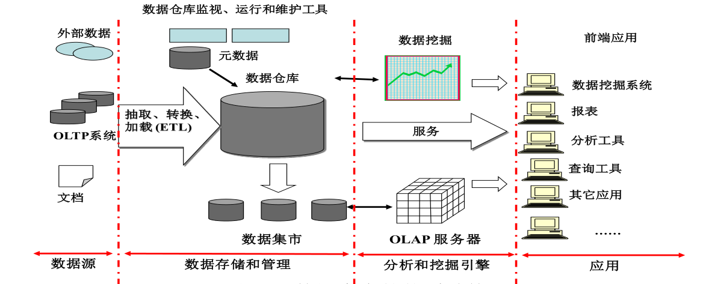

# Hive简介

•Hive是一个构建于Hadoop顶层的数据仓库工具

•支持大规模数据存储、分析，具有良好的可扩展性

•某种程度上可以看作是用户编程接口，本身不存储和处理数据

•依赖分布式文件系统HDFS存储数据

•依赖分布式并行计算模型MapReduce处理数据

•定义了简单的类似SQL 的查询语言——HiveQL

•用户可以通过编写的HiveQL语句运行MapReduce任务

•可以很容易把原来构建在关系数据库上的数据仓库应用程序移植到Hadoop平台上

•是一个可以提供有效、合理、直观组织和使用数据的分析工具

Hive具有的特点非常适用于数据仓库

1 采用批处理方式处理海量数据

•Hive需要把HiveQL语句转换成MapReduce任务进行运行

•数据仓库存储的是静态数据，对静态数据的分析适合采用批处理方式，不需要快速响应给出结果，而且数据本身也不会频繁变化

2 提供适合数据仓库操作的工具

•Hive本身提供了一系列对数据进行提取、转换、加载（ETL）的工具，可以存储、查询和分析存储在Hadoop中的大规模数据

•这些工具能够很好地满足数据仓库各种应用场景

# Hive与Hadoop生态系统中其他组件的关系

•Hive 依赖于HDFS  存储数据

•Hive 依赖于MapReduce  处理数据

• 在某些场景下Pig 可以作为Hive 的替代工具

•HBase 提供数据的实时访问

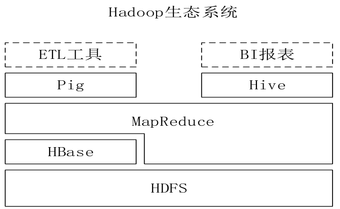

# Hive 与传统数据库的对比分析

Hive在很多方面和传统的关系数据库类似，但是它的底层依赖的是HDFS和MapReduce，所以在很多方面又有别于传统数据库

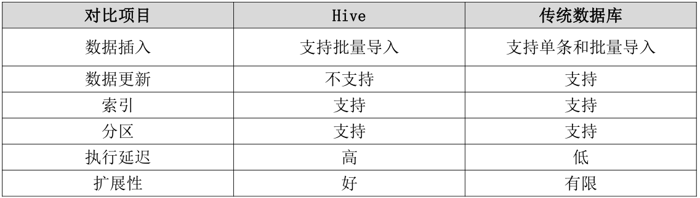

# Hive 在企业中的部署和应用

1. Hive在企业大数据分析平台中的应用

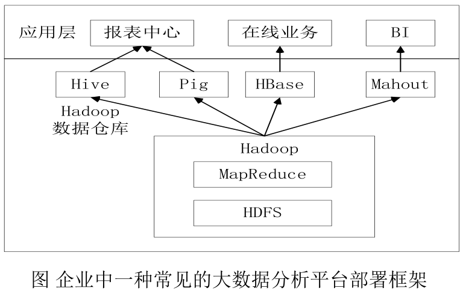

2. Hive 在Facebook 公司中的应用

•基于Oracle的数据仓库系统已经无法满足激增的业务需求

•Facebook公司开发了数据仓库工具Hive，并在企业内部进行了大量部署

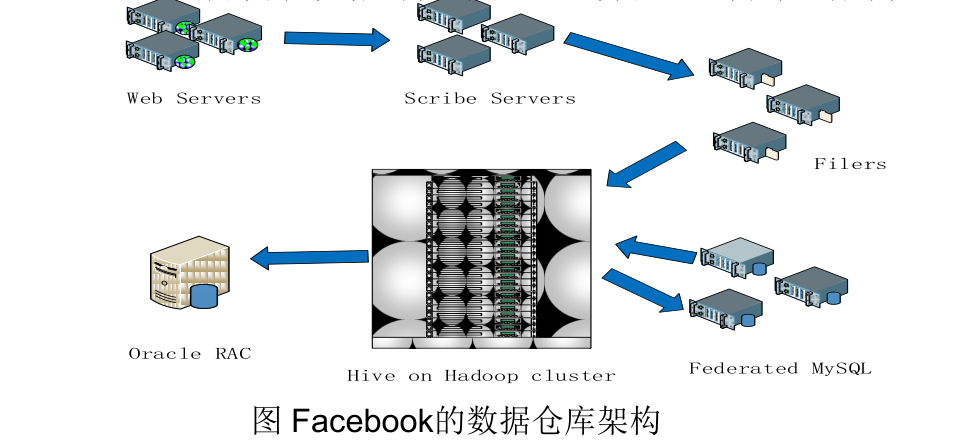

# Hive系统架构

•用户接口模块包括CLI、HWI、JDBC、ODBC、Thrift Server

•驱动模块（Driver）包括编译器、优化器、执行器等，负责把HiveSQL语句转换成一系列MapReduce作业

•元数据存储模块（Metastore）是一个独立的关系型数据库（自带derby数据库，或MySQL数据库）

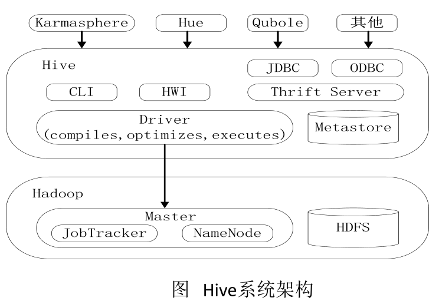

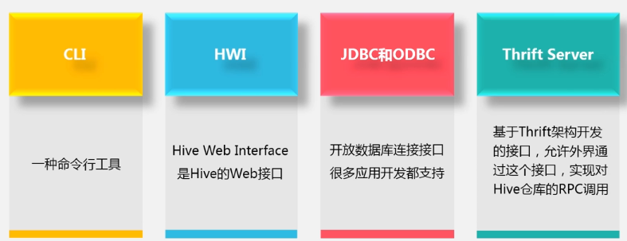

# Hive HA基本原理

问题：在实际应用中，Hive也暴露出不稳定的问题

解决方案：Hive HA（High Availability）

•由多个Hive实例进行管理的，这些Hive实例被纳入到一个资源池中，并由HAProxy提供一个统一的对外接口

•对于程序开发人员来说，可以把它认为是一台超强“Hive"

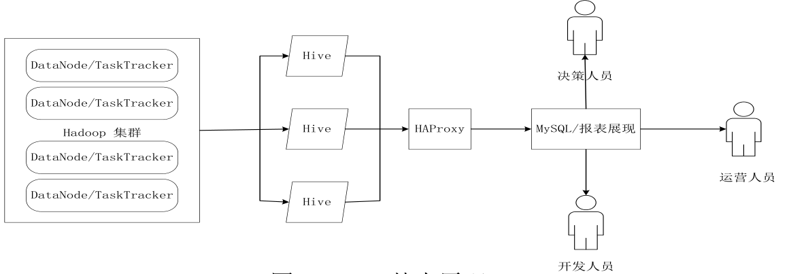

# Hive工作原理

## SQL语句转换成MapReduce作业的基本原理

1. join的实现原理

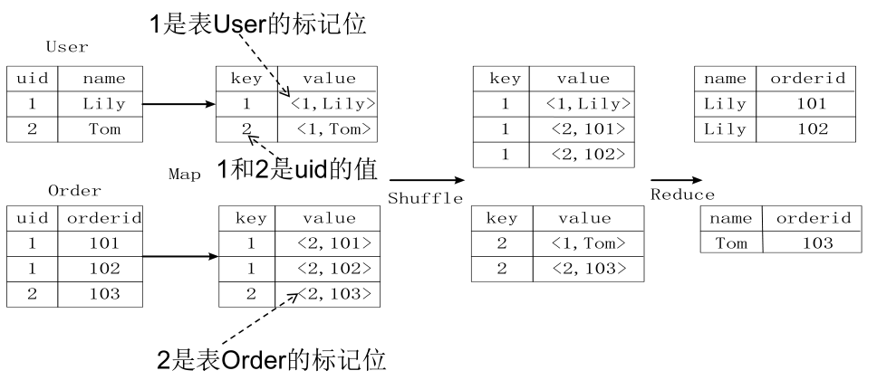

2. group by 的实现原理

存在一个分组（Group By）操作，其功能是把表Score的不同片段按照rank和
level的组合值进行合并，计算不同rank和level的组合值分别有几条记录：
select rank, level ,count(*) as value from score group by rank, level

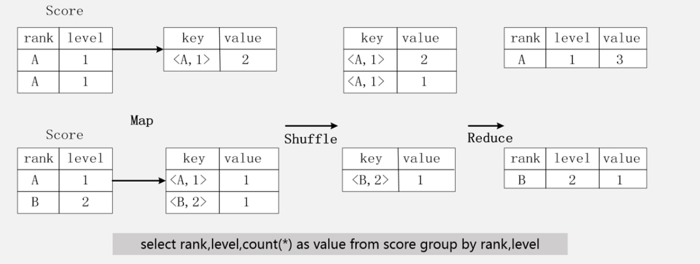

## Hive中SQL查询转换成MapReduce作业的过程

•当用户向Hive输入一段命令或查询时，Hive需要与Hadoop交互工作来完成该操作：

•驱动模块接收该命令或查询编译器

•对该命令或查询进行解析编译

•由优化器对该命令或查询进行优化计算

•该命令或查询通过执行器进行执行

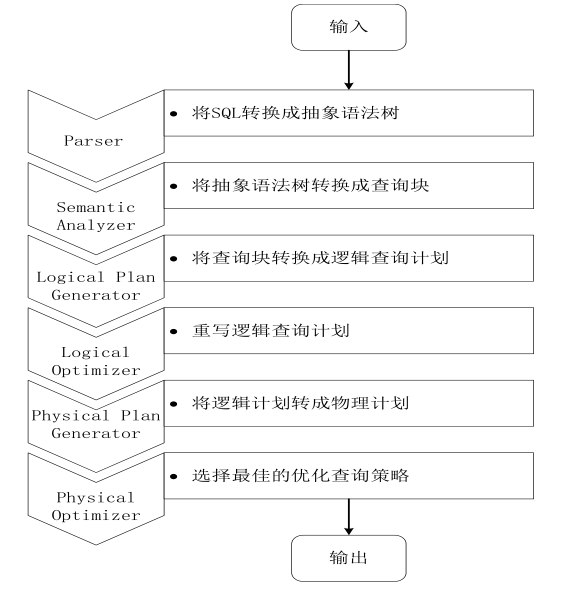

第1步：由Hive驱动模块中的编译器对用户输入的SQL语言进行词法和语法解析，将SQL语句转化为抽象语法树的形式

第2步：抽象语法树的结构仍很复杂，不方便直接翻译为MapReduce算法程序，因此，把抽象语法书转化为查询块

第3步：把查询块转换成逻辑查询计划，里面包含了许多逻辑操作符

第4步：重写逻辑查询计划，进行优化，合并多余操作，减少MapReduce任务数量

第5步：将逻辑操作符转换成需要执行的具体MapReduce任务

第6步：对生成的MapReduce任务进行优化，生成最终的MapReduce任务执行计划

第7步：由Hive驱动模块中的执行器，对最终的MapReduce任务进行执行输出

几点说明：

• 当启动MapReduce程序时，Hive本身是不会生成MapReduce算法程序的

• 需要通过一个表示“Job执行计划”的XML文件驱动执行内置的、原生的Mapper和Reducer模块

• Hive通过和JobTracker通信来初始化MapReduce任务，不必直接部署在JobTracker所在的管理节点上执行

• 通常在大型集群上，会有专门的网关机来部署Hive工具。网关机的作用主要是远程操作和管理节点上的JobTracker通信来执行任务

• 数据文件通常存储在HDFS上，HDFS由名称节点管理

# Impala

## Impala简介

• Impala是由Cloudera公司开发的新型查询系统，它提供SQL语义，能查询存储在Hadoop的HDFS和HBase上的PB级大数据，在性能上比Hive高出3~30倍

• Impala的运行需要依赖于Hive的元数据

• Impala是参照 Dremel系统进行设计的

• Impala采用了与商用并行关系数据库类似的分布式查询引擎，可以直接与HDFS和HBase进行交互查询

• Impala和Hive采用相同的SQL语法、ODBC驱动程序和用户接口

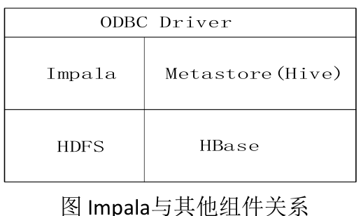

## Impala系统架构

Impala和Hive、HDFS、HBase等工具是统一部署在一个Hadoop平台上的Impala主要由Impalad，State Store和CLI三部分组成

图中虚线组件是Impala的组件
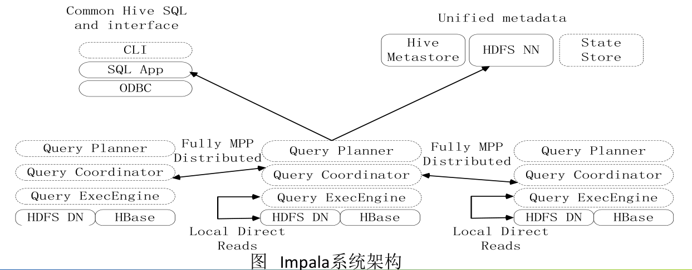

Impala主要由Impalad，State Store和CLI三部分组成
1. Impalad

• 负责协调客户端提交的查询的执行

• 包含Query Planner、Query Coordinator和Query Exec Engine三个模块

• 与HDFS的数据节点（HDFS DN）运行在同一节点上

• 给其他Impalad分配任务以及收集其他Impalad的执行结果进行汇总

• Impalad也会执行其他Impalad给其分配的任务，主要就是对本地HDFS和HBase里的部分数据进行操作

2. State Store

• 会创建一个statestored进程

• 负责收集分布在集群中各个Impalad进程的资源信息，用于查询调度

3. CLI

• 给用户提供查询使用的命令行工具

• 还提供了Hue、JDBC及ODBC的使用接口

说明：Impala中的元数据直接存储在Hive中。Impala采用与Hive相同的元数据、SQL语法、ODBC驱动程序和用户接口，从而使得在一个Hadoop平台上，可以统一部署Hive和Impala等分析工具，同时支持批处理和实时查询

## Impala查询执行过程

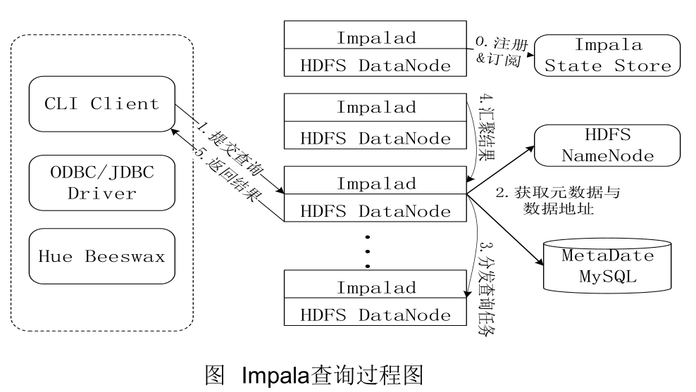

Impala执行查询的具体过程：

• 第0步，当用户提交查询前，Impala先创建一个负责协调客户端提交的查询的Impalad进程，该进程会向Impala State Store提交注册订阅信息，State Store会创建一个statestored进程，statestored进程通过创建多个线程来处理Impalad的注册订阅信息。

• 第1步，用户通过CLI客户端提交一个查询到impalad进程，Impalad的Query Planner对SQL语句进行解析，生成解析树；然后，Planner把这个查询的解析树变成若干PlanFragment，发送到Query Coordinator

• 第2步，Coordinator通过从MySQL元数据库中获取元数据，从HDFS的名称节点中获取数据地址，以得到存储这个查询相关数据的所有数据节点。

• 第3步，Coordinator初始化相应impalad上的任务执行，即把查询任务分配给所有存储这个查询相关数据的数据节点。

• 第4步，Query Executor通过流式交换中间输出，并由Query Coordinator汇聚来自各个impalad的结果。

• 第5步，Coordinator把汇总后的结果返回给CLI客户端。

# Impala与Hive的比较

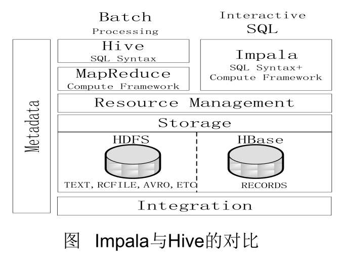

Hive与Impala的 不同点总结如下：

1. Hive适合于长时间的批处理查询分析，而Impala适合于实时交互式SQL查询

2. Hive依赖于MapReduce计算框架，Impala把执行计划表现为一棵完整的执行计划树，直接分发执行计划到各个Impalad执行查询

3. Hive在执行过程中，如果内存放不下所有数据，则会使用外存，以保证查询能顺序执行完成，而Impala在遇到内存放不下数据时，不会利用外存，所以Impala目前处理查询时会受到一定的限制

Hive与Impala的 相同点总结如下：

1. Hive与Impala使用相同的存储数据池，都支持把数据存储于HDFS和HBase中

2. Hive与Impala使用相同的元数据

3. Hive与Impala中对SQL的解释处理比较相似，都是通过词法分析生成执行计划

总结

•Impala的目的不在于替换现有的MapReduce工具

•把Hive与Impala配合使用效果最佳

•可以先使用Hive进行数据转换处理，之后再使用Impala在Hive处理后的结果数据集上进行快速的数据分析

转自林子雨老师的公开课  视频地址：http://www.icourse163.org/learn/XMU-1002335004#/learn/content?type=detail&id=1003836807&cid=1004616536&replay=true

