# HBase功能组件

• HBase的实现包括三个主要的功能组件：
– （1）库函数：链接到每个客户端
– （2）一个Master主服务器（充当管家的作用）
– （3）许多个Region服务器

• 主服务器Master负责管理和维护HBase表的分区信息，维护Region服务器列表，分配Region，负载均衡

• 一个大的表会被分成很多个Region，Region服务器负责存储和维护分配给自己的Region，处理来自客户端的读写请求

• 客户端并不是直接从Master主服务器上读取数据，而是在获得Region的存储位置信息后，直接从Region服务器上读取数据

• 客户端并不依赖Master，而是通过Zookeeper来获得Region位置信息，大多数客户端甚至从来不和Master通信，这种设计方式使得Master负载很小

## 表和Region

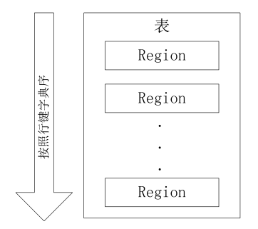

•开始只有一个Region，后来不断分裂

•Region拆分操作非常快，接近瞬间，因为拆分之后的Region读取的仍然是原存储文件，直到“合并”过程把存储文件异步地写到独立的文件之后，才会读取新文件

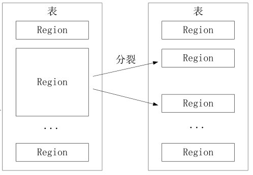

这种拆分只是逻辑上的拆分，只是数据的指向发生了变化，它的实际存储还是在原来的旧的Region中的数据。
当读新的Region时，后台会有一个合并操作，会把拆分的数据进行重新操作，最终会写到新的文件中去。

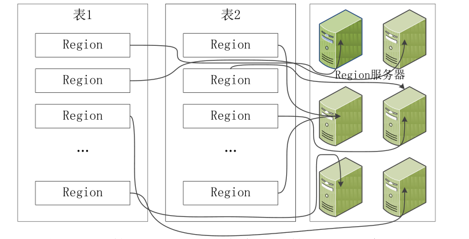

一个Region只能存到一个Region服务器上。

## Region的定位

那么有一个问题，当一个Region被拆成很多个Region时，这些Region会把它打散，分布到不同的地方存储，那么怎么知道它被存到哪里去了呢？

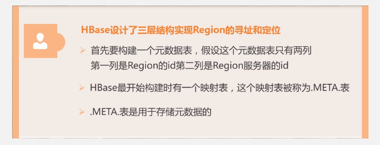

•元数据表，又名.META.表，存储了Region和Region服务器的映射关系

•当HBase表很大时， .META.表也会被分裂成多个Region

•根数据表，又名-ROOT-表，记录所有元数据的具体位置

•-ROOT-表只有唯一一个Region，名字是在程序中被写死的

•Zookeeper文件记录了-ROOT-表的位置

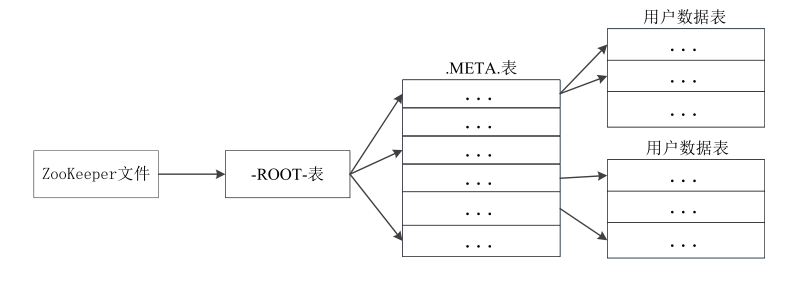

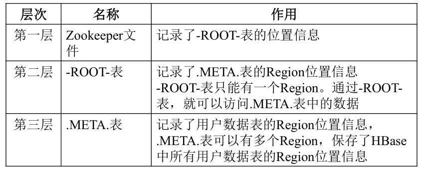

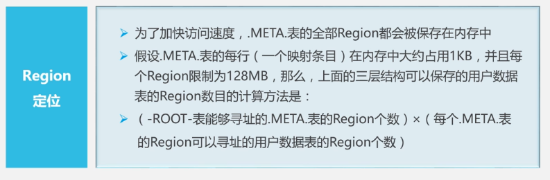

•一个-ROOT-表最多只能有一个Region，也就是最多只能有128MB，按照每行（一个映射条目）占用1KB内存计算，128MB空间可以容纳128MB/1KB=2^17 行，也就是说，一个-ROOT-表可以寻址2^17 个.META.表的Region。

•同理，每个.META.表的 Region可以寻址的用户数据表的Region个数是128MB/1KB=2^17 。

•最终，三层结构可以保存的Region数目是(128MB/1KB) × (128MB/1KB) = 2^34 个Region

所以三层架构能够满足企业的需求。

客户端访问数据时的“三级寻址”
•为了加速寻址，客户端会缓存位置信息，同时，需要解决缓存失效问题

•寻址过程客户端只需要询问Zookeeper服务器，不需要连接Master服务器

这里的缓存机制采用的是惰性缓存，如果在使用缓存获取数据时，获取不到数据，那么就失效了，这时候再次进行三级寻址过程，以解决缓存失效问题。

# HBase运行机制

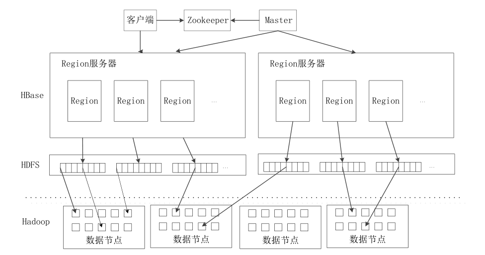

• 1. 客户端
– 客户端包含访问HBase的接口，同时在缓存中维护着已经访问过的Region位置信息，用来加快后续数据访问过程

• 2. Zookeeper服务器
– Zookeeper可以帮助选举出一个Master作为集群的总管，并保证在任何时刻总有唯一一个Master在运行，这就避免了Master的“单点失效”问题Zookeeper是一个很好的集群管理工具，被大量用于分布式计算，提供配置维护、域名服务、分布式同步、组服务等。提供管家的功能，维护整个HBase集群。虽然有很多备用的Master，但是它保证只有一个Master是运行的。

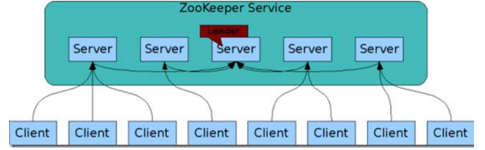

• 3. Master
• 主服务器Master主要负责表和Region的管理工作：
– 管理用户对表的增加、删除、修改、查询等操作
– 实现不同Region服务器之间的负载均衡
– 在Region分裂或合并后，负责重新调整Region的分布
– 对发生故障失效的Region服务器上的Region进行迁移

• 4. Region服务器
– Region服务器是HBase中最核心的模块，负责维护分配给自己的Region，并响应用户的读写请求

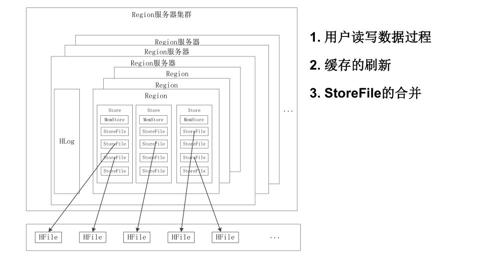

## Region服务器工作原理

1.用户读写数据过程

•用户写入数据时，被分配到相应Region服务器去执行

•用户数据首先被写入到MemStore和Hlog中

•只有当操作写入Hlog之后，commit()调用才会将其返回给客户端

•当用户读取数据时，Region服务器会首先访问MemStore缓存，如果找不到，再去磁盘上面的StoreFile中寻找

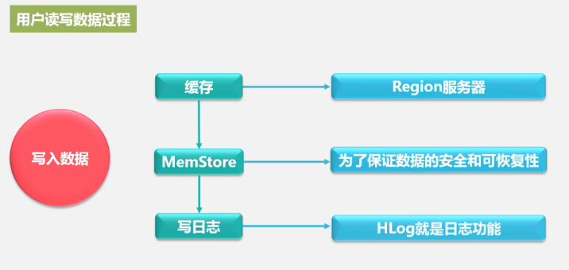

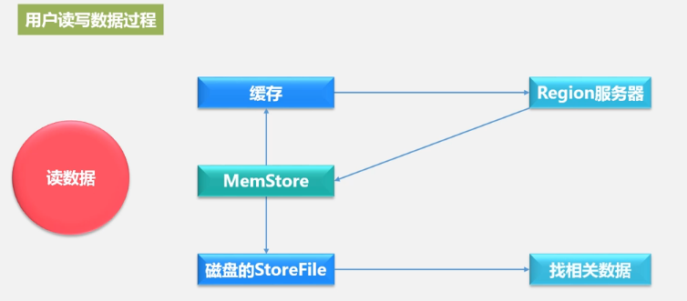

2.缓存的刷新

•系统会周期性地把MemStore缓存里的内容刷写到磁盘的StoreFile文件中，清空缓存，并在Hlog里面写入一个标记

•每次刷写都生成一个新的StoreFile文件，因此，每个Store包含多个StoreFile文件

•每个Region服务器都有一个自己的HLog 文件，每次启动都检查该文件，确认最近一次执行缓存刷新操作之后是否发生新的写入操作；如果发现更新，则先写入MemStore，再刷写到StoreFile，最后删除旧的Hlog文件，开始为用户提供服务

3.StoreFile 的合并

•每次刷写都生成一个新的StoreFile，数量太多，影响查找速度

•调用Store.compact()把多个合并成一个

•合并操作比较耗费资源，只有数量达到一个阈值才启动合并

## Store工作原理

•Store是Region服务器的核心

•多个StoreFile合并成一个

•单个StoreFile过大时，又触发分裂操作，1个父Region被分裂成两个子Region

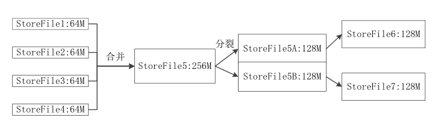

## HLog工作原理

• 分布式环境必须要考虑系统出错。HBase采用HLog保证系统恢复

• HBase系统为每个Region服务器配置了一个HLog文件，它是一种预
写式日志（Write Ahead Log）

• 用户更新数据必须首先写入日志后，才能写入MemStore缓存，并且
，直到MemStore缓存内容对应的日志已经写入磁盘，该缓存内容才能被刷写到磁盘

• Zookeeper会实时监测每个Region服务器的状态，当某个Region服
务器发生故障时，Zookeeper会通知Master

• Master首先会处理该故障Region服务器上面遗留的HLog文件，这个遗留的HLog文件中包含了来自多个Region对象的日志记录

• 系统会根据每条日志记录所属的Region对象对HLog数据进行拆分，
分别放到相应Region对象的目录下，然后，再将失效的Region重新
分配到可用的Region服务器中，并把与该Region对象相关的HLog日
志记录也发送给相应的Region服务器

• Region服务器领取到分配给自己的Region对象以及与之相关的HLog日志记录以后，会重新做一遍日志记录中的各种操作，把日志记录中的数据写入到MemStore缓存中，然后，刷新到磁盘的StoreFile文件中，完成数据恢复

• 共用日志优点：提高对表的写操作性能；缺点：恢复时需要分拆日志

本笔记参考自厦门大学林子雨老师的公开课：https://www.icourse163.org/course/XMU-1002335004