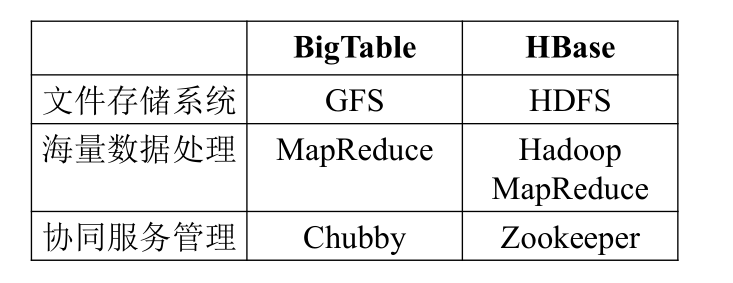
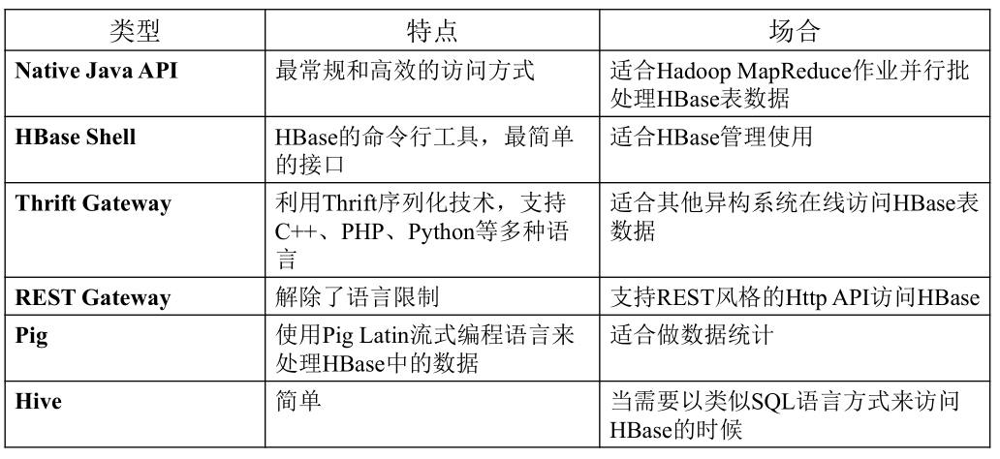
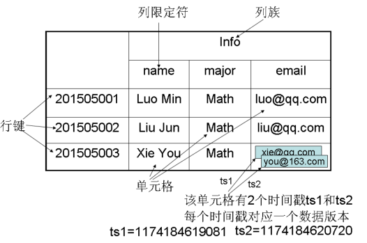
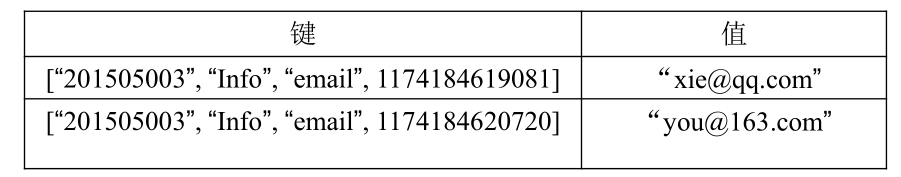
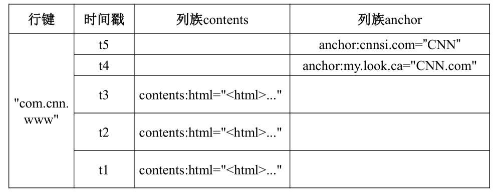
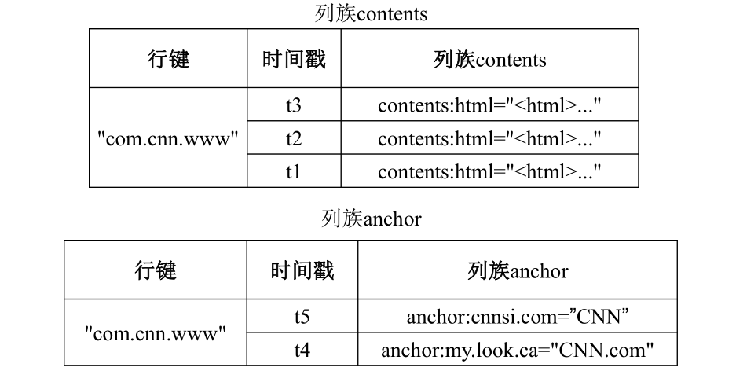
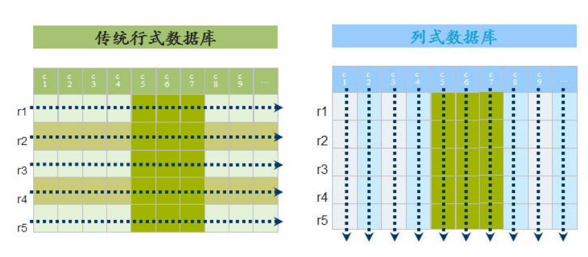
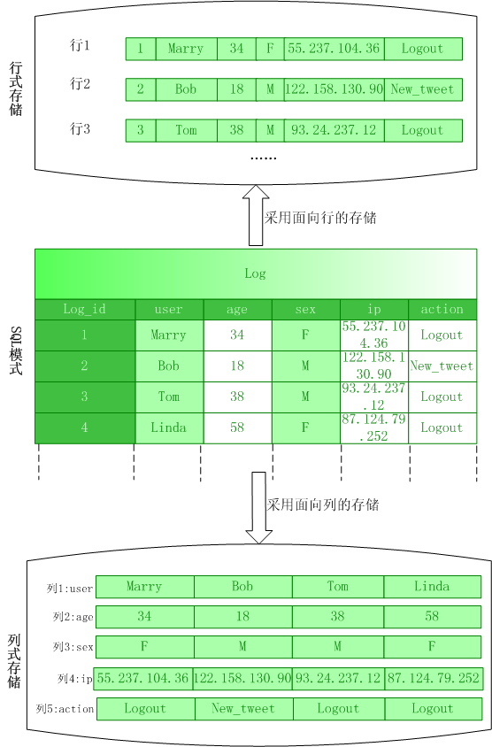
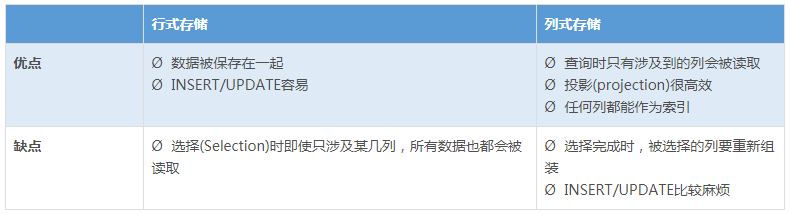

# Hbase简介

HBase是一个高可靠、高性能、面向列、可伸缩的分布式数据库，是谷歌BigTable的开源实现，主要用来存储非结构化和半结构化的松散数据。HBase的目标是处理非常庞大的表，可以通过水平扩展的方式，利用廉价计算机集群处理由超过10亿行数据和数百万列元素组成的数据表。

底层的分布式文件系统用来存储完全非结构化的数据。

Hbase是架构在底层的分布式文件系统HDFS基础之上的同时MR可以对Hbase的数据进行处理。同时Hive和Pig等都可以访问Hbase中的数据。

从上图可以看出，BigTable和HBase的底层技术的对比。

## 为什么要设计HBase这个数据产品呢？

•Hadoop可以很好地解决大规模数据的离线批量处理问题，但是，受限于HadoopMapReduce编程框架的高延迟数据处理机制，使得Hadoop无法满足大规模数据实时处理应用的需求

•HDFS面向批量访问模式，不是随机访问模式

•传统的通用关系型数据库无法应对在数据规模剧增时导致的系统扩展性和性能问题（分库分表也不能很好解决）

•传统关系数据库在数据结构变化时一般需要停机维护；空列浪费存储空间

•因此，业界出现了一类面向半结构化数据存储和处理的高可扩展、低写入/查询延迟的系统，例如，键值数据库、文档数据库和列族数据库（如BigTable和HBase等）

•HBase已经成功应用于互联网服务领域和传统行业的众多在线式数据分析处理系统中

## HBase与传统关系数据库的对比分析

• HBase与传统的关系数据库的区别主要体现在以下几个方面：

• （1）数据类型：关系数据库采用关系模型，具有丰富的数据类型（整型，字符型等等）和存储方式，HBase则采用了更加简单的数据模型，它把数据存储为未经解释的字符串（也就是Bytes数组）

• （2）数据操作：关系数据库中包含了丰富的操作（增删改查），其中会涉及复杂的多表连接。HBase操作则不存在复杂的表与表之间的关系，只有简单的插入、查询、删除、清空等，因为HBase在设计上就避免了复杂的表和表之间的关系

• （3）存储模式：关系数据库是基于行模式存储的。HBase是基于列存储的，每个列族都由几个文件保存，不同列族的文件是分离的

• （4）数据索引：关系数据库通常可以针对不同列构建复杂的多个索引，以提高数据访问性能。HBase只有一个索引——行键，通过巧妙的设计，HBase中的所有访问方法，或者通过行键访问，或者通过行键扫描，从而使得整个系统不会慢下来

• （5）数据维护：在关系数据库中，更新操作会用最新的当前值去替换记录中原来的旧值，旧值被覆盖后就不会存在。而在HBase中执行更新操作时，并不会删除数据旧的版本，而是生成一个新的版本，旧有的版本仍然保留，只有在过了设置的参数期限之后，在系统后台清理的时候才会清理掉

• （6）可伸缩性：关系数据库很难实现横向扩展，纵向扩展（如添加内存，改进CPU等等）的空间也比较有限。相反，HBase和BigTable这些分布式数据库就是为了实现灵活的水平扩展而开发的，能够轻易地通过在集群中增加或者减少硬件数量来实现性能的伸缩

## HBase的访问接口

以后在使用Hbase的时候，可以通过哪些方式访问HBase数据库？
见下图：

## HBase数据模型

• HBase是一个稀疏、多维度、排序的映射表，这张表的索引是行键、列族、列限定符和时间戳

• 每个值是一个未经解释的字符串，没有数据类型

• 用户在表中存储数据，每一行都有一个可排序的行键和任意多的列

• 表在水平方向由一个或者多个列族组成，一个列族中可以包含任意多个列，同一个列族里面的数据存储在一起

• 列族支持动态扩展，可以很轻松地添加一个列族或列，无需预先定义列的数量以及类型，所有列均以字符串形式存储，用户需要自行进行数据类型转换

• HBase中执行更新操作时，并不会删除数据旧的版本，而是生成一个新的版本，旧有的版本仍然保留（这是和HDFS只允许追加不允许修改的特性相关的）

• 表：HBase采用表来组织数据，表由行和列组成，列划分为若干个列族

• 行：每个HBase表都由若干行组成，每个行由行键（row key）来标识。

• 列族：一个HBase表被分组成许多“列族”（Column Family）的集合，它是基本的访问控制单元（支持动态拓展）

• 列限定符：列族里的数据通过列限定符（或列）来定位

• 单元格：在HBase表中，通过行、列族和列限定符确定一个“单元格”（cell），单元格中存储的数据没有数据类型，总被视为字节数组byte[]

• 时间戳：每个单元格都保存着同一份数据的多个版本，这些版本采用时间戳进行索引

### HBase的数据坐标

HBase中需要根据行键、列族、列限定符和时间戳来确定一个单元格，因此，可以视为一个“四维坐标”，即[行键, 列族, 列限定符, 时间戳]

### 概念视图

HBase在概念上和实际的底层存储是有区分的，在概念上HBase只是一个表，如下面只给了一个行键：

如这一个行键给了两个列族，第一个列族contents中冒号前面的contents是列族的名称，冒号后面的html是列的名称，引号中的内容就是这一列的数据。一个时间戳并不一定会在所有列族插入数据，从图中就可以看出。所以这就导致了HBase的稀疏表的特性。这只是在概念上的视图。

### 物理视图

实际上在实际存储中，并不是按上述的方式去存的。在底层存储时，是按列族为单位进行存储的。

上图是在实际存储时，存储在底层的实际的表。并没有像概念视图中存储了很多的空数据。所以概念视图和物理视图上是有区分的。

### 面向列的存储

传统的数据库，以行为单位进行存储，一行包括ID,姓名，年龄，性别，IP，操作等。
但是按列存储，里面的姓名、年龄等进行单独存储。

它们各自的优缺点：

另外，使用列式存储，数据可以达到很高的数据压缩率。而行式存储，很难压缩。

本笔记参考自厦门大学林子雨老师的公开课：https://www.icourse163.org/course/XMU-1002335004