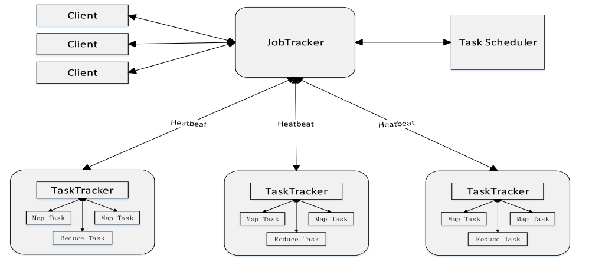
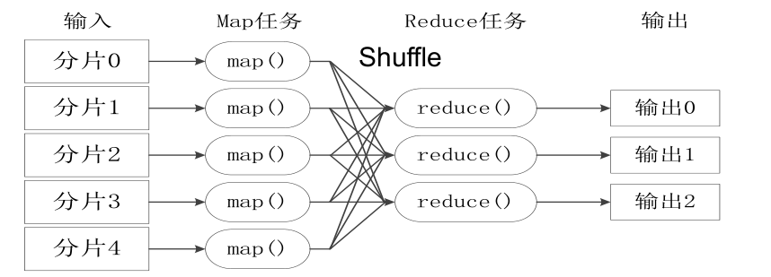
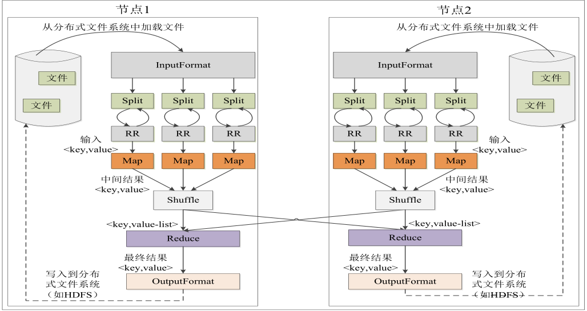
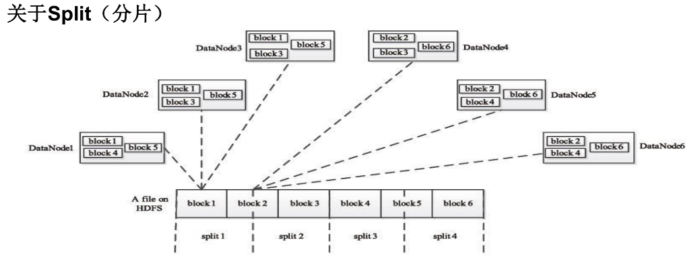
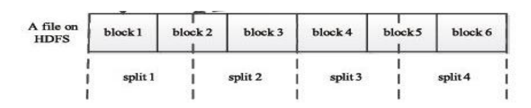
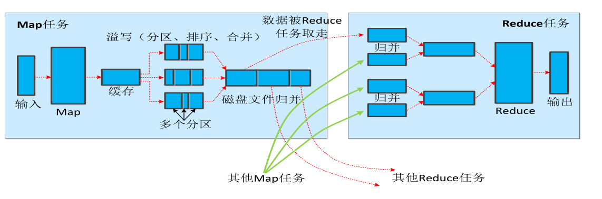
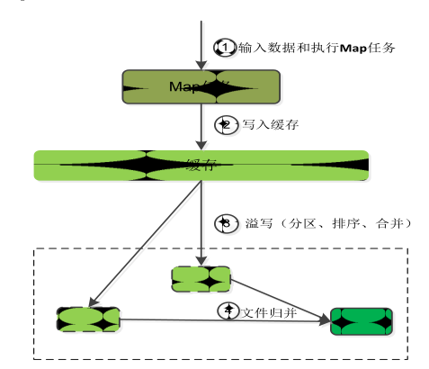
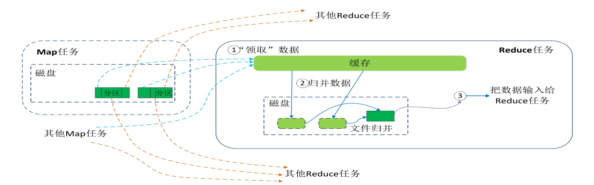
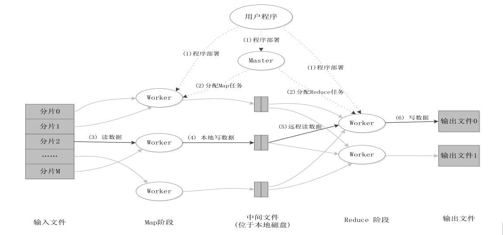

# MapReduce体系结构

MapReduce主要有以下4个部分组成：

1 ）Client

•用户编写的MapReduce程序通过Client提交到JobTracker端

•用户可通过Client提供的一些接口查看作业运行状态

2 ）JobTracker

•JobTracker负责资源监控和作业调度

•JobTracker 监控所有TaskTracker与Job的健康状况，一旦发现失败，就将相应的任务转移到其他节点

•JobTracker 会跟踪任务的执行进度、资源使用量等信息，并将这些信息告诉任务调度器（TaskScheduler），而调度器会在资源出现空闲时，选择合适的任务去使用这些资源

3 ）TaskTracker

•TaskTracker 会周期性地通过“心跳”将本节点上资源的使用情况和任务的运行进度汇报给JobTracker，同时接收JobTracker 发送过来的命令并执行相应的操作（如启动新任务、杀死任务等）

•TaskTracker 使用“slot”等量划分本节点上的资源量（CPU、内存等）。一个Task 获取到一个slot 后才有机会运行，而Hadoop调度器的作用就是将各个TaskTracker上的空闲slot分配给Task使用。slot 分为Map slot 和Reduce slot 两种，分别供MapTask 和Reduce Task使用

4 ）Task

Task 分为Map Task 和Reduce Task 两种，均由TaskTracker 启动

# MapReduce工作流程概述

MapReduce把一个大的数据集拆分成多个小数据块在多台机器上并行处理，也就是说，一个大的MapReduce作业，首先会被拆分成许多个Map任务在多台机器上并行执行，每个Map任务通常运行在数据存储的节点上，这样，计算和数据就可以放在一起运行，不需要额外的数据传输开销。当Map任务结束后，会生成以<Key,value>形式表示的许多中间结果。然后，这些中间结果会被分发到多个Reduce任务在多台机器上并行执行，具有相同Key的<Key,value>会被发送到同一个Reduce任务那里，Reduce任务会对中间结果进行会中计算得到最后的结果，并输出到分布式文件系统中。

•不同的Map任务之间不会进行通信

•不同的Reduce任务之间也不会发生任何信息交换

•用户不能显式地从一台机器向另一台机器发送消息

•所有的数据交换都是通过MapReduce框架自身去实现的

# MapReduce各个执行阶段

MapReduce的算法执行过程：

1）MapReduce框架使用InputFormat模块做Map前的预处理，比如验证输入的格式是否符合输入定义，然后，将输入文件切分为逻辑上的多个InputSplit，这是MapReduce对文件进行处理和运算的输入单位，只是一个逻辑概念，每个InputSplit并没有对文件进行实际切割，只是记录了要处理的数据的位置和长度。

2）因为InuptSplit是逻辑切分而非物理切分，所以还需要通过RecordReader（RR）根据InputSplit中的信息来处理InputSplit中的具体记录，加载数据并转换为适合Map任务读取的键值对，输入给Map任务。

3）Map任务会根据用户自定义的映射规则，输出一系列的<Key,value>作为中间结果。

4）为了让Reduce可以并行处理Map的结果，需要对Map的输出进行一定的分区（Portition）、排序（Sort）、合并（Combine）、归并（Merge）等操作，得到<Key,value-list>形式的中间结果，在交给对应的Reduce进行处理，这个过程称为Shuffle。从无序的<Key,value>到有序的<Key,value-list>，这个过程用Shuffle（洗牌）来称呼是非常形象的。

5）Reduce以一系列<Key,value-list>中间结果作为输入，执行用户定义的逻辑，输出结果给OutputFormat模块。

6）OutputFormat模块会验证输出目录是否已经存在以及输出结果类型是否符合配置文件中的配置类型，如果都满足，就输出Reduce的结果到分布式文件系统。

HDFS 以固定大小的block 为基本单位存储数据，而对于MapReduce 而言，其处理单位是split。split 是一个逻辑概念，它只包含一些元数据信息，比如数据起始位置、数据长度、数据所在节点等。它的划分方法完全由用户自己决定。

Map 任务的数量

•Hadoop为每个split创建一个Map任务，split 的多少决定了Map任务的数目。大多数情况下，理想的分片大小是一个HDFS块

Reduce 任务的数量

•最优的Reduce任务个数取决于集群中可用的reduce任务槽(slot)的数目

•通常设置比reduce任务槽数目稍微小一些的Reduce任务个数（这样可以预留一些系统资源处理可能发生的错误

# Shuffle过程原理
1.Shuffle 过程简介

2.Map 端的Shuffle 过程

Map的输出结果首先被写入缓存，当缓存满时，就启动溢写操作，把缓存中的数据写入磁盘文件，并清空缓存。当启动溢写操作时，首先需要把缓存中的数据进行分区，然后对每个分区的数据进行排序（Sort）和合并（Combine），之后再写入磁盘文件。每次溢写操作会生成一个新的磁盘文件，随着Map任务的执行，磁盘中就会生成多个溢写文件。在Map任务全部结束之前，这些溢写文件会被归并（Merge）成一个大的磁盘文件，然后通知相应的Reduce任务来领取属于自己处理的数据。

•每个Map任务分配一个缓存

•MapReduce默认100MB缓存

•设置溢写比例0.8

•分区默认采用哈希函数

•排序是默认的操作

•排序后可以合并（Combine）

•合并不能改变最终结果

•在Map任务全部结束之前进行归并

•归并得到一个大的文件，放在本地磁盘

•文件归并时，如果溢写文件数量大于预定值（默
认是3）则可以再次启动Combiner，少于3不需要

•JobTracker会一直监测Map任务的执行，并通知
Reduce任务来领取数据

合并（Combine）和归并（Merge）的区别：
两个键值对<“a”,1>和<“a”,1>，如果合并，会得到<“a”,2>，如果归并，会得到<“a”,<1,1>>

3.Reduce 端的Shuffle 过程

Reduce任务从Map端的不同Map及其领回属于自己处理的那部分数据，然后对数据进行归并（Merge）后交给Reduce处理。

•Reduce任务通过RPC向JobTracker询问Map任务是否已经完成，若完成，则领取数据

•Reduce领取数据先放入缓存，来自不同Map机器，先归并，再合并，写入磁盘

•多个溢写文件归并成一个或多个大文件，文件中的键值对是排序的

•当数据很少时，不需要溢写到磁盘，直接在缓存中归并，然后输出给Reduce

# MapReduce应用程序执行过程

参考资料：林子雨老师的MOOC课程：
https://www.icourse163.org/learn/XMU-1002335004#/learn/content?type=detail&id=1003836797&cid=1004616527&replay=true