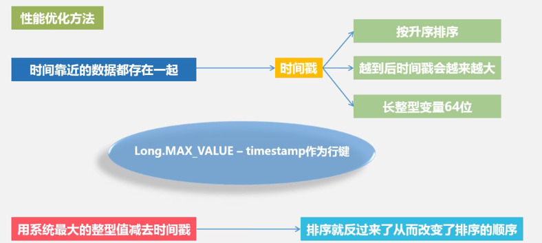
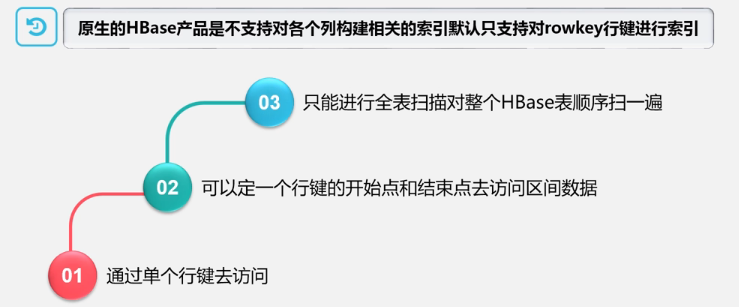
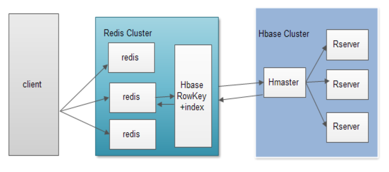
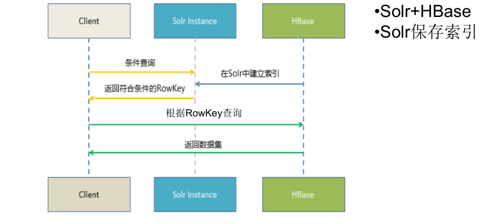

# HBase应用方案

## HBase实际应用中的性能优化方法

`行键（Row Key ）`

行键是按照 字典序存储，因此，设计行键时，要充分利用这个排序特点，将经常一起读取的数据存储到一块，将最近可能会被访问的数据放在一块。

举个例子：如果最近写入HBase表中的数据是最可能被访问的，可以考虑将时间戳
作为行键的一部分，由于是字典序排序，所以可以使用Long.MAX_VALUE -
timestamp作为行键，这样能保证新写入的数据在读取时可以被快速命中。

`InMemory`
创建表的时候，可以通过HColumnDescriptor.setInMemory(true)将表放到Region服务器的缓存中，保证在读取的时候被cache命中。

`Max Version`
创建表的时候，可以通过HColumnDescriptor.setMaxVersions(int maxVersions)设置表中数据的最大版本，如果只需要保存最新版本的数据，那么可以设置setMaxVersions(1)。

`Time To Live`
创建表的时候，可以通过HColumnDescriptor.setTimeToLive(int timeToLive)设置表中数据的存储生命期，过期数据将自动被删除，例如如果只需要存储最近两天的数据，那么可以设置setTimeToLive(2 * 24 * 60 * 60)。

## HBase性能监视

`Master-status(自带)`

•HBase Master默认基于Web的UI服务端口为60010，HBase region服务器默认基于Web的UI服务端口为60030.如果master运行在名为master.foo.com的主机中，mater的主页地址就是http://master.foo.com:60010，用户可以通过Web浏览器输入这个地址查看该页面

•可以查看HBase集群的当前状态

`Ganglia`

Ganglia是UC Berkeley发起的一个开源集群监视项目，用于监控系统性能

`OpenTSDB`

OpenTSDB可以从大规模的集群（包括集群中的网络设备、操作系统、应用程序）中获取相应的metrics并进行存储、索引以及服务，从而使得这些数据更容易让人理解，如web化，图形化等

`Ambari`

Ambari 的作用就是创建、管理、监视 Hadoop 的集群

## 在HBase之上构建SQL引擎

NoSQL区别于关系型数据库的一点就是NoSQL不使用SQL作为查询语言，至于为何在NoSQL数据存储HBase上提供SQL接口，有如下原因：

1. 易使用。使用诸如SQL这样易于理解的语言，使人们能够更加轻松地使用HBase。

2. 减少编码。使用诸如SQL这样更高层次的语言来编写，减少了编写的代码量。
方案：

1.Hive整合HBase
2.Phoenix

1.Hive 整合HBase

Hive与HBase的整合功能从Hive0.6.0版本已经开始出现，利用两者对外的API接口互相通信，通信主要依靠hive_hbase-handler.jar工具包(Hive Storage Handlers)。由于HBase有一次比较大的版本变动，所以并不是每个版本的Hive都能和现有的HBase版本进行整合，所以在使用过程中特别注意的就是两者版本的一致性。

2.Phoenix

Phoenix由Salesforce.com开源，是构建在Apache HBase之上的一个SQL中间层，可以让开发者在HBase上执行SQL查询。

## 构建HBase二级索引
二级索引，又叫辅助索引

HBase只有一个针对行健的索引访问HBase表中的行，只有三种方式：

•通过单个行健访问

•通过一个行健的区间来访问

•全表扫描

使用其他产品为HBase行健提供索引功能：

•Hindex二级索引

•HBase+Redis

•HBase+solr

原理：采用HBase0.92版本之后引入的Coprocessor特性

`Coprocessor构建二级索引`

•Coprocessor提供了两个实现：endpoint和observer，endpoint相当于关系型数据库的
存储过程，而observer则相当于触发器

•observer允许我们在记录put前后做一些处理，因此，而我们可以在插入数据时同步写
入索引表

•Coprocessor构建二级索引•缺点：每插入一条数据需要向索引表插入数据，即耗时是双倍的，对HBase的集群的压力也是双倍的

优点：
非侵入性：引擎构建在HBase之上，既没有对HBase进行任何改动，也不需要上层应用做任何妥协

Hindex二级索引

Hindex 是华为公司开发的纯 Java 编写的HBase二级索引，兼容 Apache HBase 0.94.8。当前的特性如下：

•多个表索引

•多个列索引

•基于部分列值的索引

`HBase+Redis`

•Redis+HBase方案

•Coprocessor构建二级索引

•Redis做客户端缓存

•将索引实时更新到Redis等KV系统中，定时从KV更新索引到HBase的索引表中

`Solr+HBase`

Solr是一个高性能，采用Java5开发，基于Lucene的全文搜索服务器。同时对其进行
了扩展，提供了比Lucene更为丰富的查询语言，同时实现了可配置、可扩展并对查询
性能进行了优化，并且提供了一个完善的功能管理界面，是一款非常优秀的全文搜索
引擎。

