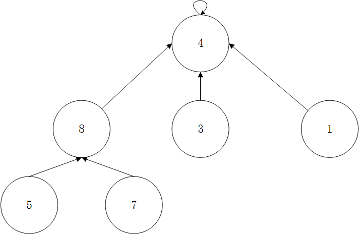

# 并查集(Union Find)的概念

并查集是由孩子指向父亲的树结构。可以高效的回答连接问题，判断网络中节点间的连接问题。
并查集对于一组数据主要支持两个动作:
* union(p,q)
* isConnected(p,q)

# 并查集的简单实现

## 定义接口

```java
public interface UF {

    int getSize();    //并查集一共有多少个元素
    boolean isConnectted(int p,int q); //id为p何id为q的元素是否相连
    void unionElements(int p,int q); //连接id为p和id为q的元素
}
```
在这里不考虑并查集的增删操作。

## 基本数据表示

假设0~9是十个不同的数据，它可以代表实际生活中的任何物体，但是在这里只把它抽象为十个数据。对于每一个元素，并查集存储的是这个元素所属的集合的id.比如图中0~4属于集合0,5~9属于集合1.


将上面的数组称为id,通过这个数组,就能很轻松的回答连接问题，即只要对应的id值相同，那么他们就是一类，也即它们是连接的。那么回答isConnected(p,q) 就是求 find(p) == find(q)

# Quick Find

基于上面的内容，可知`find`操作的时间复杂度是O(1)的。实现QuickFind的代码:

```java
/*
QuickFind方法
unionElements(p,q)的时间复杂度为0(n)
isConnectted(p,q)的时间复杂度为0(1)
 */

public class UnionFind1 implements UF {

    private int[] id;

    public UnionFind1(int size){
        id = new int[size];

        //初始化时，每个元素对应的id都是不同的，将每个id的值设置为i对应的值
        for(int i = 0 ; i < size ; i++){
            id[i] = i;
        }
    }

    @Override
    public int getSize(){
        return id.length;
    }
    //查找元素p对应的集合编号
    private int find(int p){
        if(p < 0 || p >= id.length)
            throw new IllegalArgumentException("p is outof bound");
        return id[p];
    }
    //查看元素p和元素q是否属于一个集合
    @Override
    public boolean isConnectted(int p, int q){
        return find(p) == find(q);
    }

```

在QuickFind方法下，虽然查找的时间复杂度很低，但是union操作却很耗费时间。比如在上图中，`4`和`5`属于不同的集合，如果union(4,5),那么对应的`0~4`和`5~9`都应该属于一个集合，这时候他们的id都为0或1,所以要对整个数组进行遍历，将id值对比并且改变为0或1.
所以QuickFind下的Union操作的时间复杂度为O(n).

实现Union操作的代码:
```java

    //合并元素p和元素q所属的集合
    @Override
    public void unionElements(int p ,int q){
        int pID = find(p);
        int qID = find(q);

        if(pID == qID)
            return;

        for(int i = 0 ; i < id.length; i++){
            if(id[i] == pID){
                id[i] = qID;
            }
        }
    }
}
```

# QuickUnion

QuickUnion的思路是把每一个元素看成树中的一个节点，并查集中的树结构是孩子指向父亲的树结构。


如果有更复杂的情况，一棵树中的元素要和另一元素进行合并，就让一棵树的根节点指向另一颗树的根节点即可。如下图:



在QuickUnion下的数据表示:


在QuickUnion下，parent[i]表示这个节点指向的父节点是谁。初始化时，parent[i]都是i.在这种情况下，假设要Union`4`和`3`,就将parent[4] = 3即可.


| 0 | 1 | 2 | 3 | 4 | 5 | 6 | 7 | 8 | 9 |
| :----: | :----: | :----: | :----: | :----: | :----: | :----: | :----: | :----: | :----: |
| 0 | 1 | 2 | 3 | 4 | 5 | 6 | 7 | 8 | 9 |


| 0 | 1 | 2 | 3 | 4 | 5 | 6 | 7 | 8 | 9 |
| :----: | :----: | :----: | :----: | :----: | :----: | :----: | :----: | :----: | :----: |
| 0 | 1 | 2 | 3 | <font color='red'>3</font> | 5 | 6 | 7 | 8 | 9 |

如果继续union(3,8)


| 0 | 1 | 2 | 3 | 4 | 5 | 6 | 7 | 8 | 9 |
| :----: | :----: | :----: | :----: | :----: | :----: | :----: | :----: | :----: | :----: |
| 0 | 1 | 2 | <font color='red'>8</font> | 3 | 5 | 6 | 7 | 8 | 9 |

继续union(9,4),查询4的根节点:4->3->8->8,则4的根节点是8.则让9指向8.当然这里有可能使8指向9,如果数据过多，成为链表就体现不出树的优势了。


| 0 | 1 | 2 | 3 | 4 | 5 | 6 | 7 | 8 | 9 |
| :----: | :----: | :----: | :----: | :----: | :----: | :----: | :----: | :----: | :----: |
| 0 | 1 | 2 | 8 | 3 | 5 | 6 | 7 | 8 |  <font color='red'>8</font> |

所以Union操作无非就是找到当前要合并的两个元素的根节点，然后让其中一个指向另一个即可。所以Union操作的时间复杂度是O(h),h为树的高度。QucikUnion下的find操作就要比QuickFind下的find操作慢一些，因为这牵扯到查找元素的根,消耗的时间是要比QuickFind多的,查询所需要的时间复杂度为O(h)

实现代码:
```java
/*
UnionFind2
QuickUnion方法
parent数组表示当前元素指向的父元素是谁
 */
public class UnionFind2 implements UF{

    private int[] parent;

    public UnionFind2(int size){
        parent = new int[size];

        for(int i = 0 ; i < size ; i++){
            parent[i] = i ;
        }
    }

    @Override
    public int getSize(){
        return parent.length;
    }

    //查找过程,查找元素p所对应的元素编号,即父节点,直到最后找到根节点
    //O(h)复杂度,h为树的高度
    private int find(int p){
        if(p< 0 || p >= parent.length){
            throw new IllegalArgumentException("p is out of bound.");
        }
        while (p != parent[p])
            p = parent[p];
        return p;
    }

    //查看元素p和元素q是否属于一个集合
    //O(h)复杂度,h为树的高度
    @Override
    public boolean isConnectted(int p,int q){
        return find(p) == find(q);
    }

    //合并元素p和元素q所属的集合
    //O(h)复杂度,h为树的高度
    @Override
    public void unionElements(int p,int q){
        int pRoot = find(p);
        int qRoot = find(q);

        if(pRoot == qRoot)
            return;

        parent[pRoot] = qRoot;
    }
}
```

# 基于size的优化

在进行测试时，当数据的size很大，进行的合并或者查找操作较小时，UnionFind2有很大的时间优势，而当size很大，进行合并或者查找的操作也很大时，UnionFind2的时间会增长。
其中一个原因是，在使用UnionFind1进行合并操作时，其实就是对一片连续的空间进行循环操作，这种操作在java的jvm中有很好的优化，所以运行速度很快。而UnionFind2中的find操作，是一个不断索引的过程，不是顺次访问一片连续的空间，在不同的地址间进行跳转，所以会慢。另一个原因是，UnionFind2中的各个操作都是O(h)级别的，当合并或者查找操作数较多，在Union操作时，过多的元素被放在了一个集合中，所以得到的这棵树就很大，对应的它的深度就有可能很高，所以后续的isConnected的时候所消耗的时间也会很高。

所以可以在Union时，针对树的特点进行优化。

可以考虑这种情况，在不断执行union操作时，union(0,1),union(0,2)....union(0,9),在最坏的情况下，树的高度就是元素的个数，也就是树退化为了一个链表。这是因为合并的时候没有对树的高度进行判断，其中一个方法就是对当前的树考虑它有多少个子树。


在上图中，如果要进行union(4,9)操作，那么为了减小树的高度，应该让9->8,得到结果如下图:


即将元素个数少的树的根节点指向元素个数多的树的根节点，这样就是基于size的优化.

```java
/*
UnionFind3
对UnionFind2的union进行优化,基于size的优化
QuickUnion方法
parent数组表示当前元素指向的父元素是谁
 */
public class UnionFind3 implements UF{

    private int[] parent;
    private int[] sz; //sz[i]表示以i为根的集合中元素的个数

    public UnionFind3(int size){
        parent = new int[size];
        sz = new int[size];

        for(int i = 0 ; i < size ; i++){
            parent[i] = i ;
            sz[i] = 1;
        }
    }

    @Override
    public int getSize(){
        return parent.length;
    }

    //查找过程,查找元素p所对应的元素编号,即父节点,直到最后找到根节点
    //O(h)复杂度,h为树的高度
    private int find(int p){
        if(p< 0 || p >= parent.length){
            throw new IllegalArgumentException("p is out of bound.");
        }
        while (p != parent[p])
            p = parent[p];
        return p;
    }

    //查看元素p和元素q是否属于一个集合
    //O(h)复杂度,h为树的高度
    @Override
    public boolean isConnectted(int p,int q){
        return find(p) == find(q);
    }

    //合并元素p和元素q所属的集合
    //O(h)复杂度,h为树的高度
    @Override
    public void unionElements(int p,int q){
        int pRoot = find(p);
        int qRoot = find(q);

        if(pRoot == qRoot)
            return;

        //根据两个元素所在树的元素个数不同判断合并方向
        //将元素个数少的集合合并到元素个数多的集合上
        if(sz[pRoot] < sz[qRoot]){
            parent[pRoot] = qRoot;
            sz[qRoot] += sz[pRoot]; //qRoot为根的集合树变大了，元素数多了sz[pRoot]个
        }
        else{
            parent[qRoot] = pRoot;
            sz[pRoot] += sz[qRoot];
        }

    }
}
```

初始时,`sz[i] = 1`表示每个集合中的元素只有一个,`unionElements`方法中，在改变根节点的同时，维护sz的大小.

# 基于rank的优化


| 0 | 1 | 2 | 3 | 4 | 5 | 6 | 7 | 8 | 9 |
| :----: | :----: | :----: | :----: | :----: | :----: | :----: | :----: | :----: | :----: |
| 7 | 7 | 7 | 8 | 3 | 7 | 7 | 7 | 8 | 9 |

对于上面的并查集，进行union(4,2),如果是基于size的优化方法，则是节点8指向节点7，如下图:


但是树的深度增加了大于2的高度，树的高度高的节点指向了树的高度低的节点。

所以一个更好的优化union方法，应该是让深度低的树的根节点指向深度高的树的根节点。

```java
/*
UnionFind4
对UnionFind3的union进行优化,基于rank的优化
QuickUnion方法
parent数组表示当前元素指向的父元素是谁
 */
public class UnionFind4 implements UF{

    private int[] parent;
    private int[] rank; //rank[i]表示以i为根的集合中树的高度

    public UnionFind4(int size){
        parent = new int[size];
        rank = new int[size];

        for(int i = 0 ; i < size ; i++){
            parent[i] = i ;
            rank[i] = 1;
        }
    }

    @Override
    public int getSize(){
        return parent.length;
    }

    //查找过程,查找元素p所对应的元素编号,即父节点,直到最后找到根节点
    //O(h)复杂度,h为树的高度
    private int find(int p){
        if(p< 0 || p >= parent.length){
            throw new IllegalArgumentException("p is out of bound.");
        }
        while (p != parent[p])
            p = parent[p];
        return p;
    }

    //查看元素p和元素q是否属于一个集合
    //O(h)复杂度,h为树的高度
    @Override
    public boolean isConnectted(int p,int q){
        return find(p) == find(q);
    }

    //合并元素p和元素q所属的集合
    //O(h)复杂度,h为树的高度
    @Override
    public void unionElements(int p,int q){
        int pRoot = find(p);
        int qRoot = find(q);

        if(pRoot == qRoot)
            return;

        //根据两个元素所在树的rank不同判断合并方向
        //将rank低的集合合并到rank高多的集合上
        if(rank[pRoot] < rank[qRoot]){
            parent[pRoot] = qRoot;
        }
        else if(rank[qRoot] < rank[pRoot]){
            parent[qRoot] = pRoot;
        }
        else{
            parent[qRoot] = pRoot;
            rank[pRoot] += 1;
        }

    }
}
```

修改的方法只有`unionElements`方法，合并过程是在rank的基础上进行合并。当`rank[pRoot] < rank[qRoot]`时，即使parent[pRoot]指向了qRoot,那么本身qRoot的深度就要比pRoot的大，多了这个子树它的深度依然不会改变。同理`rank[qRoot] < rank[pRoot]`时也一样。只有在两棵树的深度一样时，它们两个指向任意一个都可以，最后让树高度+1即可。

# 路径压缩


如上图，这三种树结构所表达的并查集的含义相同，但是它们的效率是不同的。在之前的union方法中，不断的让根节点指向另一个树的根节点，会导致让树的高度越来越高。路径压缩则可以让一棵比较高的树压缩为一棵比较矮的树。只要能让树的高度降低，那么对并查集的性能都会有所提升。

路径压缩发生在find操作中。


| 0 | 1 | 2 | 3 | 4 |
| :----: | :----: | :----: | :----: | :----: |
| 0 | 0 | 1 | 2 | 3 |

在查找4的根节点时，只关心4的根节点是多少，而不去考虑中间的父节点是谁，所以4在向上遍历的时候，同时执行`parent[p] = parent[parent[p]]`

从4向上遍历，执行一次操作后,将4的parent指向3的parent2:


| 0 | 1 | 2 | 3 | 4 |
| :----: | :----: | :----: | :----: | :----: |
| 0 | 0 | 1 | 2 | <font color='red'>2</font> |

接着向上遍历,将2的parent指向1的parent0:


| 0 | 1 | 2 | 3 | 4 |
| :----: | :----: | :----: | :----: | :----: |
| 0 | 0 | 0 | 2 | 2 |

这时，由深度为5降低为深度为3.

实现代码:
```java
/*
UnionFind5
对UnionFind4的find进行优化,路径压缩
QuickUnion方法
parent数组表示当前元素指向的父元素是谁
 */
public class UnionFind5 implements UF{

 //其他代码相同


    private int find(int p){
        if(p< 0 || p >= parent.length){
            throw new IllegalArgumentException("p is out of bound.");
        }
        while (p != parent[p]){
            parent[p] = parent[parent[p]];
            p = parent[p];
        }
        return p;
    }

//..其他代码相同
```

在这个过程中没有去管理rank的值，之所以取名为rank而不是h(树的高度)或者其他,是因为rank实际上表示的是一个排名或者序,在进行完路径压缩后,排名和序并没有变化，依然是rank值比较低的节点在下面，rank值比较高的值在上面，只是有可能出现同一层的元素它们的rank值不同，但这并没有什么影响。只是它不再反应节点所代表的高度值。不做rank的维护，既没有必要也会浪费性能。

# 压缩为高度为2的树

最理想化的路径压缩是将每个集合压缩为高度为2的树.


| 0 | 1 | 2 | 3 | 4 |
| :----: | :----: | :----: | :----: | :----: |
| 0 | 0 | 0 | 0 | 0 |

实现这种压缩需要使用递归。

```java
//其他部分代码同上

private int find(int p){
    if(p< 0 || p >= parent.length){
        throw new IllegalArgumentException("p is out of bound.");
    }
    //如果当前节点不是根节点，则find它的父亲节点所对应的根节点，其实也就是p节点的根节点，然后返回parent[p],也就是整棵树的根节点
    //这是从宏观语义角度进行分析
    if (p != parent[p])
        parent[p] = find(parent[p]);

    return parent[p];
}
```

这种方式是在查询一个节点的根节点时，将这个节点和这个节点的父亲节点直接指向根节点。  

# 并查集的时间复杂度

非严格意义上:o(h)

严格意义上: o(log*n)  (iterated logarithm)

>log*n = 0 (n<=1)
>log*n = 1 + log*(logn) (n>1)

o(log*n)的时间复杂度比log(n)还要快，近乎于o(1)