项目所需依赖包：
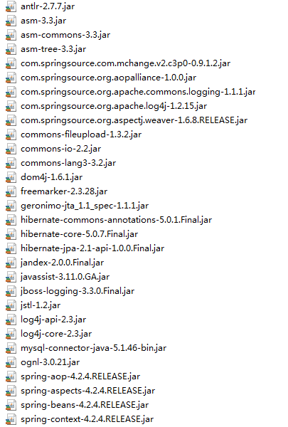
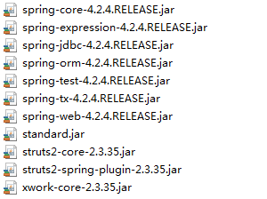

# 单独配置Spring

## 创建配置文件 导入xml约束

约束包括`beans`|`context`|`aop`|`tx`
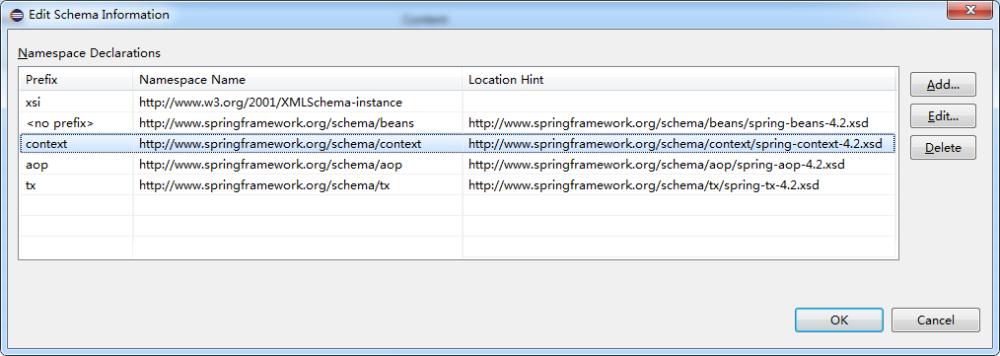
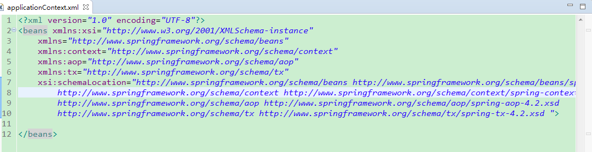

创建`UserAction`,并在Spring配置文件中配置.
```java
package my.study.web.action;

import com.opensymphony.xwork2.ActionSupport;

public class UserAction extends ActionSupport {

}
```

```xml
<bean name="userAction" class="my.study.web.action.UserAction"></bean>
```
## 配置tomcat的web.xml
在`web.xml`中配置让spring随web启动而创建的监听器,并配置spring配置文件配置参数:
```xml
 <!-- 让spring随web启动而创建的监听器 -->
  <listener>
  	<listener-class>org.springframework.web.context.ContextLoaderListener</listener-class>
  </listener>
  <!-- 配置spring配置文件参数 -->
  <context-param>
  	<param-name>contextConfigLocation</param-name>
  	<param-value>classpath:applicationContext.xml</param-value>
  </context-param>
```
此时可以启动服务看看有没有报错，如果没有报错，这一步就配置成功了。

# 单独配置Struts2
## 配置struts2主配置文件
首先创建`struts.xml`，添加约束,并配置`UserAction`(约束可以在struts2-core-2.3.35.jar包下的struts-2.3.dtd中查找到)：
```xml
<?xml version="1.0" encoding="UTF-8"?>
<!DOCTYPE struts PUBLIC
	"-//Apache Software Foundation//DTD Struts Configuration 2.3//EN"
	"http://struts.apache.org/dtds/struts-2.3.dtd">
	
<struts>
	<package name="ssh" namespace="/" extends="struts-default">
		<action name="UserAction_*" class="my.study.web.action.UserAction" method="{1}">
			<result name="success">/success.jsp</result>
		</action>
	</package>
</struts>
```
jsp文件自己定义一个放在`WebContent`目录下即可.

## 配置struts2核心过滤器到web.xml
在`web.xml`中配置struts2核心过滤器
```xml
...
<!-- struts2核心过滤器 -->
  <filter>
  	<filter-name>struts2</filter-name>
  	<filter-class>org.apache.struts2.dispatcher.ng.filter.StrutsPrepareAndExecuteFilter</filter-class>
  </filter>
  
  <filter-mapping>
  	<filter-name>struts2</filter-name>
  	<url-pattern>/*</url-pattern>
  </filter-mapping>
...
```
`url-pattern`为`/*`表示所有路径都要经过核心过滤器
如果启动服务器没有错误就说明配置成功

# Spring和Struts2整合
整合的目的是让struts的Action不再自己创建，而是由spring创建(依赖包是struts2-spring-plugin-2.3.35.jar)。
## 配置常量
在`struts2-core-2.3.35.jar`->`org.apache.struts2`->`default.properties`中查找常量。

`struts.objectFactory = spring`是将action的创建交给spring容器
`struts.objectFactory.spring.autoWire = name`spring负责装配Action
一般只需配置`struts.objectFactory`第二个自动开启

在`<struts></struts>`标签中配置`<constant name="struts.objectFactory" value="spring">`
## 两种方案
创建各个类进行测试：
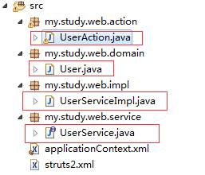
```java
package my.study.web.action;

import com.opensymphony.xwork2.ActionSupport;

import my.study.web.service.UserService;

public class UserAction extends ActionSupport {
	private UserService userService;

	public void setUserService(UserService userService) {
		this.userService = userService;
	}
  public void login() throws Exception{
		System.out.println(userService);
	}
}
```
```java
package my.study.web.domain;

public class User {
	private Long user_id;
	private String user_code;
	private String user_name;
	private String user_password;
	private Character user_state;
	public Long getUser_id() {
		return user_id;
	}
	public void setUser_id(Long user_id) {
		this.user_id = user_id;
	}
	public String getUser_code() {
		return user_code;
	}
	public void setUser_code(String user_code) {
		this.user_code = user_code;
	}
	public String getUser_name() {
		return user_name;
	}
	public void setUser_name(String user_name) {
		this.user_name = user_name;
	}
	public String getUser_password() {
		return user_password;
	}
	public void setUser_password(String user_password) {
		this.user_password = user_password;
	}
	public Character getUser_state() {
		return user_state;
	}
	public void setUser_state(Character user_state) {
		this.user_state = user_state;
	}
	@Override
	public String toString() {
		return "User [user_id=" + user_id + ", user_code=" + user_code + ", user_name=" + user_name + ", user_password="
				+ user_password + "]";
	}		
}
```
```java
package my.study.web.impl;

import my.study.web.domain.User;
import my.study.web.service.UserService;

public class UserServiceImpl implements UserService {

	@Override
	public User getUserByCodePassword(User u) {
		System.out.println("getUserByCodePassword");
		return null;
	}
}
```
```java
package my.study.web.service;

import my.study.web.domain.User;

public interface UserService {
	User getUserByCodePassword(User u);
}
```
在spring配置文件中配置service:
```xml
  <!-- action配置 -->
	<bean name="userAction" class="my.study.web.action.UserAction"></bean>
	<!-- servie配置 -->
	<bean name="userService" class="my.study.web.impl.UserServiceImpl"></bean>
```

* 整合方案1:class属性上仍然配置action的完整类名，这样struts2仍然创建action,由spring负责组装Action中的依赖属性
`UserAction`中的`login()`方法就是为了检测是否是由spring装配属性。
访问`http://localhost:8080/SSH/UserAction_login`看到打印结果:
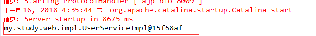
当然这种方法并不推荐，最好由spring完整管理action的生命周期。spring中功能才应用到Action上.

* 整合方案2:spring负责创建action以及组装.首先配置`applicationContext.xml`中的`action`，然后配置`struts.xml`
这种方式下在`class`属性处填写spring中action对象的`BeanName`.完全由spring管理action生命周期，这样spring需要手动组装依赖属性。即需要在`applicationContext.xml`中action的`<bean></bean>`中使用`<property></property>`进行手动注入：
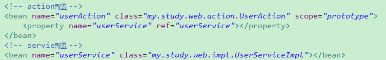
同时，要注意，Action对象作用范围一定是多例的，这样才符合Struts2的架构。所以将`scope`属性配置为`prototype`

访问`http://localhost:8080/SSH/UserAction_login`依然可以打印出`my.study.web.impl.UserServiceImpl`
至此，struts与spring就整合结束了。

# 单独配置Hibernate

## 导入实体类和orm元数据
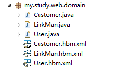
`User.hbm.xml`:
```xml
<?xml version="1.0" encoding="UTF-8"?>
<!DOCTYPE hibernate-mapping PUBLIC 
    "-//Hibernate/Hibernate Mapping DTD 3.0//EN"
    "http://www.hibernate.org/dtd/hibernate-mapping-3.0.dtd">
<hibernate-mapping package="my.study.web.domain" >
	<class name="User" table="sys_user" >
		<id name="user_id"  >
			<generator class="native"></generator>
		</id>
		<property name="user_code"  ></property>
		<property name="user_name"  ></property>
		<property name="user_password"  ></property>
		<property name="user_state"  ></property>
	
	</class>
</hibernate-mapping>
```
`Customer.hbm.xml`:
```xml
<?xml version="1.0" encoding="UTF-8"?>
<!DOCTYPE hibernate-mapping PUBLIC 
    "-//Hibernate/Hibernate Mapping DTD 3.0//EN"
    "http://www.hibernate.org/dtd/hibernate-mapping-3.0.dtd">
<hibernate-mapping package="my.study.web.domain" >
	<class name="LinkMan" table="cst_linkman" >
		<id name="lkm_id"  >
			<generator class="native"></generator>
		</id>
		<property name="lkm_gender"  ></property>
		<property name="lkm_name"  ></property>
		<property name="lkm_phone"  ></property>
		<property name="lkm_email"  ></property>
		<property name="lkm_qq"  ></property>
		<property name="lkm_mobile"  ></property>
		<property name="lkm_memo"  ></property>
		<property name="lkm_position"  ></property>
		
		<!-- 多对一 -->
		<!-- 
			name属性:引用属性名
			column属性: 外键列名
			class属性: 与我关联的对象完整类名
		 -->
		  <!-- 
		 	级联操作:	cascade
		 		save-update: 级联保存更新
		 		delete:级联删除
		 		all:save-update+delete
		 	级联操作: 简化操作.目的就是为了少些两行代码.
		  -->
		  <!-- 多的一方: 不能放弃维护关系的.外键字段就在多的一方.  -->
		<many-to-one name="customer" column="lkm_cust_id" class="Customer"  >
		</many-to-one>
	</class>
</hibernate-mapping>
```
`Customer.hbm.xml`:
```xml
<?xml version="1.0" encoding="UTF-8"?>
<!DOCTYPE hibernate-mapping PUBLIC 
    "-//Hibernate/Hibernate Mapping DTD 3.0//EN"
    "http://www.hibernate.org/dtd/hibernate-mapping-3.0.dtd">
   <!-- 配置表与实体对象的关系 -->
   <!-- package属性:填写一个包名.在元素内部凡是需要书写完整类名的属性,可以直接写简答类名了. -->
<hibernate-mapping package="my.study.web.domain" >
	<!-- 
		class元素: 配置实体与表的对应关系的
			name: 完整类名
			table:数据库表名
	 -->
	<class name="Customer" table="cst_customer" >
		<!-- id元素:配置主键映射的属性
				name: 填写主键对应属性名
				column(可选): 填写表中的主键列名.默认值:列名会默认使用属性名
				type(可选):填写列(属性)的类型.hibernate会自动检测实体的属性类型.
						每个类型有三种填法: java类型|hibernate类型|数据库类型
				not-null(可选):配置该属性(列)是否不能为空. 默认值:false
				length(可选):配置数据库中列的长度. 默认值:使用数据库类型的最大长度
		 -->
		<id name="cust_id"  >
			<!-- generator:主键生成策略(明天讲) -->
			<generator class="native"></generator>
		</id>
		<!-- property元素:除id之外的普通属性映射
				name: 填写属性名
				column(可选): 填写列名
				type(可选):填写列(属性)的类型.hibernate会自动检测实体的属性类型.
						每个类型有三种填法: java类型|hibernate类型|数据库类型
				not-null(可选):配置该属性(列)是否不能为空. 默认值:false
				length(可选):配置数据库中列的长度. 默认值:使用数据库类型的最大长度
		 -->
		<property name="cust_name" column="cust_name" >
			<!--  <column name="cust_name" sql-type="varchar" ></column> -->
		</property>
		<property name="cust_source" column="cust_source" ></property>
		<property name="cust_industry" column="cust_industry" ></property>
		<property name="cust_level" column="cust_level" ></property>
		<property name="cust_linkman" column="cust_linkman" ></property>
		<property name="cust_phone" column="cust_phone" ></property>
		<property name="cust_mobile" column="cust_mobile" ></property>
	</class>
</hibernate-mapping>
```

`LinkMan.java`:
```java
package my.study.web.domain;

public class LinkMan {

	private Long lkm_id;
	private Character lkm_gender;
	private String lkm_name;
	private String lkm_phone;
	private String lkm_email;
	private String lkm_qq;
	private String lkm_mobile;
	private String lkm_memo;
	private String lkm_position;
		
	private Customer customer ;
	
	private Long cust_id;	
	
	public Long getCust_id() {
		return cust_id;
	}
	public void setCust_id(Long cust_id) {
		this.cust_id = cust_id;
	}
	public Customer getCustomer() {
		return customer;
	}
	public void setCustomer(Customer customer) {
		this.customer = customer;
	}
	public Long getLkm_id() {
		return lkm_id;
	}
	public void setLkm_id(Long lkm_id) {
		this.lkm_id = lkm_id;
	}
	public Character getLkm_gender() {
		return lkm_gender;
	}
	public void setLkm_gender(Character lkm_gender) {
		this.lkm_gender = lkm_gender;
	}
	public String getLkm_name() {
		return lkm_name;
	}
	public void setLkm_name(String lkm_name) {
		this.lkm_name = lkm_name;
	}
	public String getLkm_phone() {
		return lkm_phone;
	}
	public void setLkm_phone(String lkm_phone) {
		this.lkm_phone = lkm_phone;
	}
	public String getLkm_email() {
		return lkm_email;
	}
	public void setLkm_email(String lkm_email) {
		this.lkm_email = lkm_email;
	}
	public String getLkm_qq() {
		return lkm_qq;
	}
	public void setLkm_qq(String lkm_qq) {
		this.lkm_qq = lkm_qq;
	}
	public String getLkm_mobile() {
		return lkm_mobile;
	}
	public void setLkm_mobile(String lkm_mobile) {
		this.lkm_mobile = lkm_mobile;
	}
	public String getLkm_memo() {
		return lkm_memo;
	}
	public void setLkm_memo(String lkm_memo) {
		this.lkm_memo = lkm_memo;
	}
	public String getLkm_position() {
		return lkm_position;
	}
	public void setLkm_position(String lkm_position) {
		this.lkm_position = lkm_position;
	}	
}
```
`Customer.java`:
```java
package my.study.web.domain;

public class Customer {
	private Long cust_id;
	
	private String cust_name;
	private String cust_source;
	private String cust_industry;
	private String cust_level;
	private String cust_linkman;
	private String cust_phone;
	private String cust_mobile;
	public Long getCust_id() {
		return cust_id;
	}
	public void setCust_id(Long cust_id) {
		this.cust_id = cust_id;
	}
	public String getCust_name() {
		return cust_name;
	}
	public void setCust_name(String cust_name) {
		this.cust_name = cust_name;
	}
	public String getCust_source() {
		return cust_source;
	}
	public void setCust_source(String cust_source) {
		this.cust_source = cust_source;
	}
	public String getCust_industry() {
		return cust_industry;
	}
	public void setCust_industry(String cust_industry) {
		this.cust_industry = cust_industry;
	}
	public String getCust_level() {
		return cust_level;
	}
	public void setCust_level(String cust_level) {
		this.cust_level = cust_level;
	}
	public String getCust_linkman() {
		return cust_linkman;
	}
	public void setCust_linkman(String cust_linkman) {
		this.cust_linkman = cust_linkman;
	}
	public String getCust_phone() {
		return cust_phone;
	}
	public void setCust_phone(String cust_phone) {
		this.cust_phone = cust_phone;
	}
	public String getCust_mobile() {
		return cust_mobile;
	}
	public void setCust_mobile(String cust_mobile) {
		this.cust_mobile = cust_mobile;
	}
	@Override
	public String toString() {
		return "Customer [cust_id=" + cust_id + ", cust_name=" + cust_name + "]";
	}
}
```

在hibernate的配置文件中，不用配置隔离级别，在spring中进行配置。也不需配置session与当前线程绑定的配置，因为spring有管理session的机制。
`hibernate.cfg.xml`:
```xml
<?xml version="1.0" encoding="UTF-8"?>
<!DOCTYPE hibernate-configuration PUBLIC
	"-//Hibernate/Hibernate Configuration DTD 3.0//EN"
	"http://www.hibernate.org/dtd/hibernate-configuration-3.0.dtd">
<hibernate-configuration>
	<session-factory>
		
		<property name="hibernate.connection.driver_class">com.mysql.jdbc.Driver</property>
		<property name="hibernate.connection.url">jdbc:mysql:///customer1</property>
		<property name="hibernate.connection.username">root</property>
		<property name="hibernate.connection.password">12345</property>
		<!-- 数据库方言			
			注意: MYSQL在选择方言时,请选择最短的方言.
		 -->
		<property name="hibernate.dialect">org.hibernate.dialect.MySQLDialect</property>
		
		<!-- #hibernate.show_sql true
		#hibernate.format_sql true
		-->
		<property name="hibernate.show_sql">true</property>
		<property name="hibernate.format_sql">true</property>
		<!-- 
		## auto schema export  自动导出表结构. 自动建表
		#hibernate.hbm2ddl.auto create		自动建表.每次框架运行都会创建新的表.以前表将会被覆盖,表数据会丢失.(开发环境中测试使用)
		#hibernate.hbm2ddl.auto create-drop 自动建表.每次框架运行结束都会将所有表删除.(开发环境中测试使用)
		#hibernate.hbm2ddl.auto update(推荐使用) 自动生成表.如果已经存在不会再生成.如果表有变动.自动更新表(不会删除任何数据).
		#hibernate.hbm2ddl.auto validate	校验.不自动生成表.每次启动会校验数据库中表是否正确.校验失败.
		 -->		
		<property name="hibernate.hbm2ddl.auto">update</property>
		<!-- 引入orm元数据
			路径书写: 填写src下的路径
		 -->
		<mapping resource="my/study/web/domain/Customer.hbm.xml"/>
		<mapping resource="my/study/web/domain/LinkMan.hbm.xml"/>
		<mapping resource="my/study/web/domain/User.hbm.xml"/>
		
	</session-factory>
</hibernate-configuration>
```

创建类进行测试：
```java
package my.study.web.test;

import org.hibernate.Session;
import org.hibernate.SessionFactory;
import org.hibernate.Transaction;
import org.hibernate.cfg.Configuration;
import org.junit.Test;

import my.study.web.domain.User;

public class HibernateTest {
	
	@Test
	public void test() {
		Configuration conf = new Configuration().configure();
		
		SessionFactory sf = conf.buildSessionFactory();
		
		Session session = sf.openSession();
		
		Transaction tx = session.beginTransaction();
		
		User u = new User();
		
		u.setUser_code("hey");
		u.setUser_name("哈喽");
		u.setUser_password("12345");
		
		session.save(u);		
		tx.commit();		
		session.close();
		
		sf.close();
	}
}
```
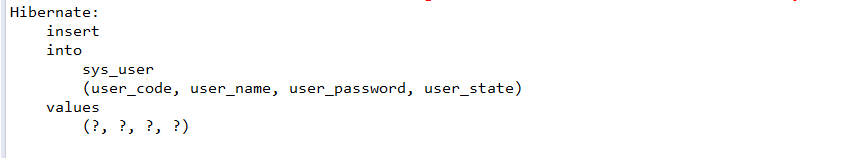
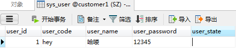

单独配置Hibernate就成功了

# hibernate和spring整合
整合原理：将`SessionFactory`对象交给spring容器管理

## 在spring中配置sessionFactory
也就是要在配置文件中配置sessionFactory,然后`sessionFactory`加载配置有两种方案:
* 1.仍然使用外部的hibernate.cfg.xml配置信息

```xml
  <!-- 将sessionFactory配置到spring容器中 -->
	<bean name="sessionFactory" class="org.springframework.orm.hibernate5.LocalSessionFactoryBean">
		<property name="configLocation" value="classpath:hibernate.cfg.xml"></property>
	</bean>
```
注意选择和自己的hibernate版本一样的(我的是hibernate5)

书写代码进行测试，直接使用spring注入的sessionFactory:

```java
package my.study.web.test;

import javax.annotation.Resource;

import org.hibernate.Session;
import org.hibernate.SessionFactory;
import org.hibernate.Transaction;
import org.hibernate.cfg.Configuration;
import org.junit.Test;
import org.junit.runner.RunWith;
import org.springframework.test.context.ContextConfiguration;
import org.springframework.test.context.junit4.SpringJUnit4ClassRunner;

import my.study.web.domain.User;

@RunWith(SpringJUnit4ClassRunner.class)
@ContextConfiguration("classpath:applicationContext.xml")
public class HibernateTest {
	
	@Resource(name="sessionFactory")
	private SessionFactory sf;
	
  	@Test
	public void test1() {
    ....
  }

	@Test
	public void test2() {			
		Session session = sf.openSession();
		
		Transaction tx = session.beginTransaction();
		
		User u = new User();
		
		u.setUser_code("hello");
		u.setUser_name("你好");
		u.setUser_password("8765");		
		session.save(u);		
		tx.commit();
		
		session.close();
	}
}
```
其中 sessionFactory的关闭可以交给spring来管理,所以close()方法可以不用写
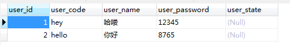

* 2.在spring配置中放置hibernate配置信息
第二种配置方法就是在spring中配置hibernate配置信息，包括必选配置，可选配置和引入orm元数据。
```xml
	<bean name="sessionFactory" class="org.springframework.orm.hibernate5.LocalSessionFactoryBean">
		<!-- 配置hibernate基本信息 -->
		<property name="hibernateProperties">
			<props>
				<!-- 必选配置 -->
				<prop key="hibernate.connection.driver_class">com.mysql.jdbc.Driver</prop>
				<prop key="hibernate.connection.url">jdbc:mysql:///customer1</prop>
				<prop key="hibernate.connection.username">root</prop>
				<prop key="hibernate.connection.password">12345</prop>
				<prop key="hibernate.dialect">org.hibernate.dialect.MySQLDialect</prop>
				<!-- 可选配置 -->
				<prop key="hibernate.show_sql">true</prop>
				<prop key="hibernate.format_sql">true</prop>
				<prop key="hibernate.hbm2ddl.auto">update</prop>				
			</props>
		</property>
		<!-- 引入orm元数据，指定orm元数据所在的包路径，spring会读取包中的所有配置 -->
		<property name="mappingDirectoryLocations" value="classpath:my/study/web/domain"></property>
	</bean>
```
将方法1中的配置换成上面的配置，进行测试:
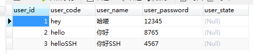
这样就完成了spring和hibernate的整合

重点总结，整合原理就是将`SessionFactory`对象交给spring容器管理

# spring整合c3p0连接池

c3p0的配置如下：
```xml
	<!-- 读取db.properties -->
	<context:property-placeholder location="classpath:db.properties"/>
	<!-- 配置c3p0连接池 -->
	<bean name="dataSource" class="com.mchange.v2.c3p0.ComboPooledDataSource">
		<property name="JdbcUrl" value="${jdbc.JdbcUrl}"></property>
		<property name="DriverClass" value="${jdbc.DriverClass}"></property>
		<property name="User" value="${jdbc.User}"></property>
		<property name="Password" value="${jdbc.Password}"></property>
	</bean>
```

将c3p0注入到sessionFactory中,hibernate会通过连接池获得连接:
```xml
<bean name="sessionFactory" class="org.springframework.orm.hibernate5.LocalSessionFactoryBean">
		<!-- 配置hibernate基本信息 -->
		<!-- 将连接池注入到sessionFactory中 -->
		<property name="dataSource" ref="dataSource"></property>
		<property name="hibernateProperties">
			<props>
				<prop key="hibernate.dialect">org.hibernate.dialect.MySQLDialect</prop>
				<!-- 可选配置 -->
				<prop key="hibernate.show_sql">true</prop>
				<prop key="hibernate.format_sql">true</prop>
				<prop key="hibernate.hbm2ddl.auto">update</prop>				
			</props>
		</property>
		<!-- 引入orm元数据，指定orm元数据所在的包路径，spring会读取包中的所有配置 -->
		<property name="mappingDirectoryLocations" value="classpath:my/study/web/domain"></property>
	</bean>
```

# spring整合hibernate环境操作数据库
先创建测试类。
创建`UserDao`接口：
```java
package my.study.web.dao;

import my.study.web.domain.User;

public interface UserDao {	
	//根据登陆名称查询user对象
	User getByUserCode(String usercode);
	//保存用户
	void save(User u);
}
```

然后创建`UserDaoImpl`实现类，在整合环境中操作数据库，spring提供了一个hibernate模板对象`HibernateTemplate`.可以让实现类继承`HibernateDaoSupport`,从而简少Dao的依赖关系,不用再去配置`HibernateTemplate`.这样在使用模板时，直接使用`getHibernateTemplate()`方法就可以了.
要明确其中的依赖关系：`HibernateTemplate`通过`HibernateDaoSupport`创建出来，需要依赖`SessionFactory`,这个模板中封装的操作都是session中的操作.所以要先为dao注入`SessionFactory`.
```java
package my.study.web.impl;

import org.hibernate.HibernateException;
import org.hibernate.Query;
import org.hibernate.Session;
import org.springframework.orm.hibernate5.HibernateCallback;
import org.springframework.orm.hibernate5.support.HibernateDaoSupport;

import my.study.web.dao.UserDao;
import my.study.web.domain.User;
//HibernateDaoSupport 要为dao注入sessionFactory
public class UserDaoImpl extends HibernateDaoSupport implements UserDao {

	@Override
	public User getByUserCode(final String usercode) {
		//HQL
		return getHibernateTemplate().execute(new HibernateCallback<User>() {
			@Override
			public User doInHibernate(Session session) throws HibernateException {
					String hql = "from User where user_code = ? ";
					Query query = session.createQuery(hql);
					query.setParameter(0, usercode);
					User user = (User) query.uniqueResult();
				return user;
			}
		});
		//Criteria
		/*DetachedCriteria dc = DetachedCriteria.forClass(User.class);
		
		dc.add(Restrictions.eq("user_code", usercode));
		
		List<User> list = (List<User>) getHibernateTemplate().findByCriteria(dc);
			
		if(list != null && list.size()>0){
			return list.get(0);
		}else{
			return null;
		}*/
	}

}
```
在spring中配置`UserDao`,并注入sessionFactory：
```xml
	<!-- 配置UserDao -->
	<bean name="userDao" class="my.study.web.impl.UserDaoImpl">
		<!-- 注入sessionFactory -->
		<property name="sessionFacroty" ref="sessionFactory"></property>
	</bean>
```
在`HibernateTest.java`中添加测试代码：
```java
...
@Resource(name="userDao")
	private UserDao ud;
	@Test
	//测试Dao Hibernate模板
	public void test3() {
		User user = ud.getByUserCode("hello");
		
		System.out.println(user);
	}
```
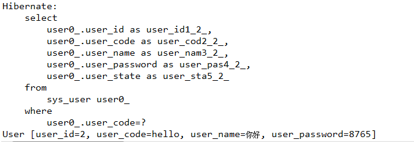

# Spring中的aop事务

## 准备
配置事务，最核心的是要配置核心事务管理器.其中包含了所有事务的打开提交关闭操作.所以要先在spring配置核心事务管理器.
`ctrl`+`shift`+`h`,搜索一下`TransactionManager`,可以看到`HibernateTransactionManager`就是需要的:
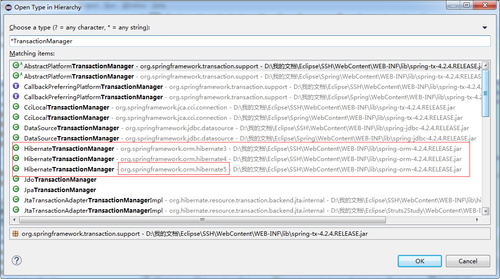

将其配置到spring配置中,并且，使用它管理事务，要通过sessionFactory进行管理，所以要配置注入sessionFactory
```xml
<!-- 配置核心事务管理器 -->
	<bean name="transactionManager" class="org.springframework.orm.hibernate5.HibernateTransactionManager">
		<property name="sessionFactory" ref="sessionFactory"></property>
	</bean>
```

## xml配置aop事务
`准备目标对象`->`配置通知`->`将配置织入目标对象(配置切点和切面)`。在前面已经有了目标对象，所以这里只需要配置通知和织入目标对象.具体可见博客上一篇文章
```xml
	<!-- 配置通知 -->
	<tx:advice id="txAdvice" transaction-manager="transactionManager">
		<tx:attributes>
			<tx:method name="save*" isolation="REPEATABLE_READ" propagation="REQUIRED" read-only="false" />
			<tx:method name="persist*" isolation="REPEATABLE_READ" propagation="REQUIRED" read-only="false" />
			<tx:method name="update*" isolation="REPEATABLE_READ" propagation="REQUIRED" read-only="false" />
			<tx:method name="modify*" isolation="REPEATABLE_READ" propagation="REQUIRED" read-only="false" />
			<tx:method name="delete*" isolation="REPEATABLE_READ" propagation="REQUIRED" read-only="false" />
			<tx:method name="remove*" isolation="REPEATABLE_READ" propagation="REQUIRED" read-only="false" />
			<tx:method name="get*" isolation="REPEATABLE_READ" propagation="REQUIRED" read-only="true" />
			<tx:method name="find*" isolation="REPEATABLE_READ" propagation="REQUIRED" read-only="true" />
		</tx:attributes>
	</tx:advice>
	
	<!-- 配置将通知织入目标对象 -->
	<aop:config>
		<!-- 配置切点 -->
		<aop:pointcut expression="execution(* my.study.web.impl.*ServiceImpl.*(..))" id="transactionPoincut"/>
		<!-- 配置切面 -->
		<aop:advisor advice-ref="txAdvice" pointcut-ref="transactionPoincut"/>
	</aop:config>
```

测试：
在`UserService`接口中添加方法:
```java
void saveUser(User u);
```
在`UserDao`接口中添加方法:
```java
//保存用户
	void save(User u);
```
在`UserDaoImpl`中添加方法:
```java
	@Override
	public void save(User u) {
		getHibernateTemplate().save(u);
	}
```
在`UserServiceImpl`中添加方法:
```java
	private UserDao ud;
	@Override
	public void saveUser(User u) {
		ud.save(u);		
	}
	//为ud添加setter方法
	public void setUd(UserDao ud) {
		this.ud = ud;
	}
```
在此之前，要在spring中的`userService`下将`userDao`注入进去:
```xml
<!-- servie配置 -->
	<bean name="userService" class="my.study.web.impl.UserServiceImpl">
		<property name="ud" ref="userDao"></property>
	</bean>
```

测试代码：
```java
	@Resource(name="userService")
	private UserService us;
	@Test
	//测试aop事务
	public void test4() {
		User u = new User();
		
		u.setUser_code("aoptest");
		u.setUser_name("aop测试");
		u.setUser_password("aop123");
		us.saveUser(u);
	}
```
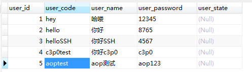

## 注解配置aop事务

在spring配置文件中，首先开启注解事务:
```xml
	<!-- 开启注解事务 -->
	<tx:annotation-driven transaction-manager="transactionManager"/>
```

改写`UserServiceImpl`:
```java
package my.study.web.impl;

import org.springframework.transaction.annotation.Isolation;
import org.springframework.transaction.annotation.Propagation;
import org.springframework.transaction.annotation.Transactional;

import my.study.web.dao.UserDao;
import my.study.web.domain.User;
import my.study.web.service.UserService;

@Transactional(isolation=Isolation.REPEATABLE_READ,propagation=Propagation.REQUIRED,readOnly=true)
public class UserServiceImpl implements UserService {

	private UserDao ud;
	@Override
	public User getUserByCodePassword(User u) {
		System.out.println("getUserByCodePassword");
		return null;
	}

	@Override
	@Transactional(isolation=Isolation.REPEATABLE_READ,propagation=Propagation.REQUIRED,readOnly=false)
	public void saveUser(User u) {
		ud.save(u);		
	}

	public void setUd(UserDao ud) {
		this.ud = ud;
	}
	
}
```
测试:
```java
@Resource(name="userService")
	private UserService us;
	@Test
	//测试aop事务
	public void test4() {
		User u = new User();
		
		u.setUser_code("aop注解test");
		u.setUser_name("aop测试注解");
		u.setUser_password("aop123");
		us.saveUser(u);
	}
```

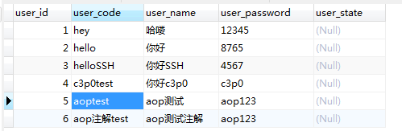

# 扩大session作用范围
为了避免使用懒加载时出现no-session问题.需要扩大session的作用范围

在`web.xml`配置filter:
```xml
   <!-- 扩大session作用域范围 
   	注意:任何filter一定要在struts的filter之前调用
   -->
  <filter>
  	<filter-name>openSessionInView</filter-name>
  	<filter-class>org.springframework.orm.hibernate5.support.OpenSessionInViewFilter</filter-class>
  </filter>
  
  <filter-mapping>
  	<filter-name>openSessionInView</filter-name>
  	<url-pattern>/*</url-pattern>
  </filter-mapping>
```
注意:任何filter一定要在struts的filter之前调用,所以要放在struts配置前面
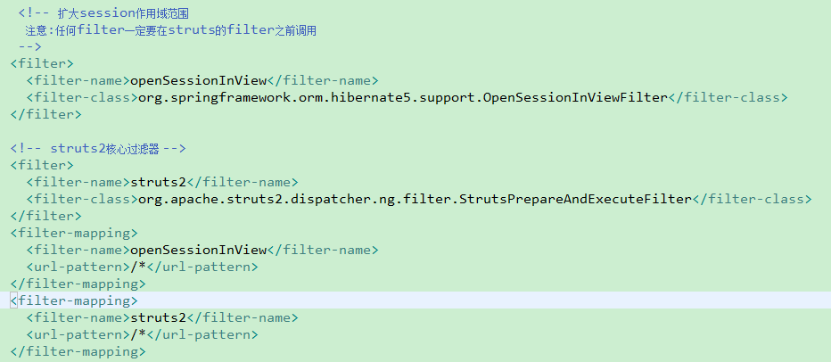

配置完毕

# 实现用户登陆功能

## Web层
改写`UserAction`方法:
```java
package my.study.web.action;

import com.opensymphony.xwork2.ActionContext;
import com.opensymphony.xwork2.ActionSupport;
import com.opensymphony.xwork2.ModelDriven;

import my.study.web.domain.User;
import my.study.web.service.UserService;

public class UserAction extends ActionSupport implements ModelDriven<User> {
	private User user = new User();
	private UserService userService;

	public void setUserService(UserService userService) {
		this.userService = userService;
	}
	
	public String login() throws Exception{
		//1. 调用service执行登陆逻辑
		User u = userService.getUserByCodePassword(user);
		//2. 将返回的user对象放到session域中
		ActionContext.getContext().getSession().put("user", u);
		//3. 重定向到项目首页
		return "toHome";
	}

	@Override
	public User getModel() {
		return user;
	}
}
```

改写`struts.xml`配置，改变跳转地址:
```xml
<?xml version="1.0" encoding="UTF-8"?>
<!DOCTYPE struts PUBLIC
	"-//Apache Software Foundation//DTD Struts Configuration 2.3//EN"
	"http://struts.apache.org/dtds/struts-2.3.dtd">
	
<struts>
	<constant name="struts.objectFactory" value="spring">
	</constant>
	<package name="ssh" namespace="/" extends="struts-default">
		<action name="UserAction_*" class="my.study.web.action.UserAction" method="{1}">
			<result name="toHome">/index.html</result>
		</action>
	</package>
</struts>
```

## Service层

改写`UserServiceImpl`中的方法:
```java
...
	@Override
	public User getUserByCodePassword(User u) {
		//1. 根据登录名称查询登陆用户
		User exitU = ud.getByUserCode(u.getUser_code());
		//2. 判断用户是否存在->不存在，抛出异常，提示用户名不存在
		//				->存在
		//					->密码错误，抛出异常，提示密码错误
		if(exitU==null) {
			throw new RuntimeException("用户不存在！");
		}
		
		if(!exitU.getUser_password().equals(u.getUser_password())) {
			throw new RuntimeException("密码错误！");
		}
		//3.返回查询到的用户对象
		return exitU;
	}
...
```

注意如果需要抛出异常，需要在`struts.xml`中配置:
```xml
<struts>
	<constant name="struts.objectFactory" value="spring">
	</constant>
	<package name="ssh" namespace="/" extends="struts-default">
		<global-exception-mappings >
			<exception-mapping result="error" exception="java.lang.RuntimeException"></exception-mapping>
		</global-exception-mappings>
		<action name="UserAction_*" class="my.study.web.action.UserAction" method="{1}">
			<result name="toHome">/index.html</result>
			<result name="error">/login.jsp</result>
		</action>
	</package>
</struts>
```

## dao层
dao层在上面已经实现好了

## 测试用的页面
`login.jsp`:
```html
<%@ page language="java" contentType="text/html; charset=UTF-8"
    pageEncoding="ISO-8859-1"%>
<%@ taglib prefix="s" uri="/struts-tags" %>
<!DOCTYPE html PUBLIC "-//W3C//DTD HTML 4.01 Transitional//EN" "http://www.w3.org/TR/html4/loose.dtd">
<html>
<head>
<meta http-equiv="Content-Type" content="text/html; charset=UTF-8">
<title>Insert title here</title>
</head>
<body>
	<form action="${pageContext.request.contextPath}/UserAction_login" method=post>
		<label>username:</label><input type="text" name="user_code"/>
		<br>
		<label>password:</label><input type=password name="user_password"/>
		<input type="submit" value="submit"/>
	</form>
	<font color="red"><s:property value="exception.message"></s:property></font>
</body>
</html>
```

```html
<!DOCTYPE html>
<html>
<head>
<meta charset="UTF-8">
<title>Insert title here</title>
</head>
<body>
	<h1>首页</h1>
</body>
</html>
```

# 项目总览
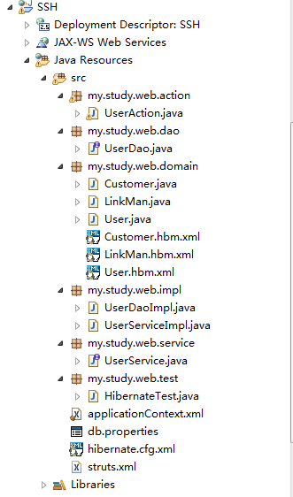
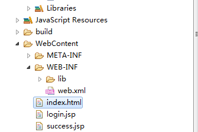