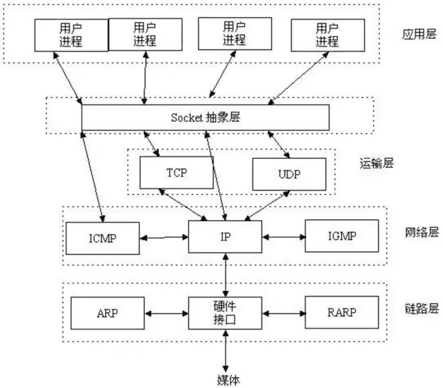
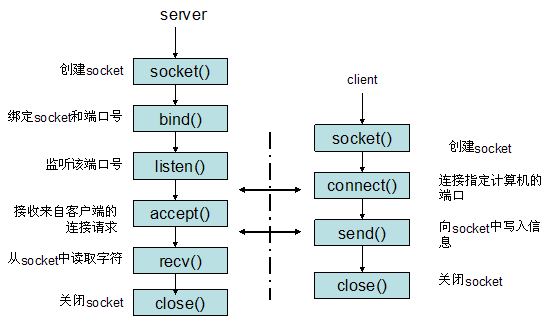
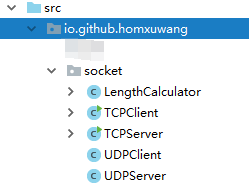
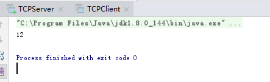
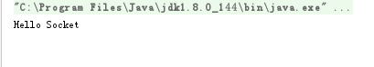
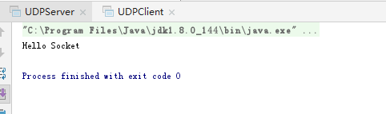
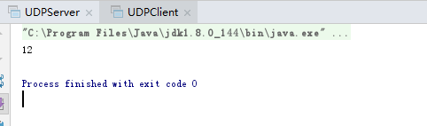

在[浅谈TCP协议](https://homxuwang.github.io/2019/05/06/%E6%B5%85%E8%B0%88TCP%E5%8D%8F%E8%AE%AE/)中提到过：
在本地两个进程间进行通信时，可以使用唯一标识符PID。但是如果是两台不同计算机之间的进程进行通信时,只用PID是不够的,这时就在传输层中使用协议端口号,简称端口。IP可以唯一标识主机，而TCP协议和端口号可以唯一标识一个主机中的进程。这样可以用三元组(IP地址+协议+端口号)唯一标识一个网络中的进程。

在唯一标识了一个网络中的进程后,便可以用socket进行编程了。

# Socket简介

Socket与TCP/IP协议没有必然的联系,Socket是对TCP/IP协议的封装，Socket本身并不是协议，而是一个调用接口(API)。


Socket通常也称作”套接字”，用于描述IP地址和端口，是一个通信链的句柄。网络上的两个程序通过一个双向的通讯连接实现数据的交换，这个双向链路的一端称为一个Socket，一个Socket由一个IP地址和一个端口号唯一确定。应用程序通常通过”套接字”向网络发出请求或者应答网络请求。

从设计模式的角度看来，Socket其实就是一个门面模式，它把复杂的TCP/IP协议族隐藏在Socket接口后面，对用户来说，一组简单的接口就是全部，让Socket去组织数据，以符合指定的协议。

Socket 起源于 Unix ，Unix/Linux 基本哲学之一就是“一切皆文件”，都可以用“打开(open) –> 读写(write/read) –> 关闭(close)”模式来进行操作。因此 Socket 也被处理为一种特殊的文件。

使用TCP协议通信的Socket的通信流程如下图：

* 服务器根据地址类型（ipv4,ipv6）、socket类型、协议创建socket

* 服务器为socket绑定ip地址和端口号

* 服务器socket监听端口号请求，随时准备接收客户端发来的连接，这时候服务器的socket并没有被打开

* 客户端创建socket

* 客户端打开socket，根据服务器ip地址和端口号试图连接服务器socket

* 服务器socket接收到客户端socket请求，被动打开，开始接收客户端请求，直到客户端返回连接信息。这时候socket进入阻塞状态，所谓阻塞即接收方法一直到客户端返回连接信息后才返回，开始接收下一个客户端请求。

* 客户端连接成功，向服务器发送连接状态信息

* 服务器接收方法返回，连接成功

* 客户端向socket写入信息

* 服务器读取信息

* 客户端关闭

* 服务器端关闭

# 简单的Socket编程
客户端想服务器发送一个字符串,服务器接收到字符串后打印,然后向客户端返回字符串的长度,最后,客户端输出服务器端返回的该字符串的长度,分别用TCP和UDP两种方式实现.

结合上一节内容,流程概括为:
* socket() 创建套接字
* bind() 分配套接字地址
* listen() 等待连接请求
* accept() 允许连接请求
* read()/write() 数据交换
* close() 关闭连接

在项目中创建以下结构:



## TCP

先以TCP为例.`TCPClient`表示TCP客户端,`TCPServer`表示TCP服务端,`LengthCaculator`是一个单独的处理线程,对数据的业务逻辑处理交给它来实现.

`TCPServer`:
```java
package io.github.homxuwang.socket;

import java.net.ServerSocket;
import java.net.Socket;

public class TCPServer {
    public static void main(String[] args) throws Exception {
        //创建Socket,并将socket绑定到5202端口
        ServerSocket ss = new ServerSocket(5202);
        //死循环,使得socket一直等待并处理客户端发送过来的请求
        while(true) {
            //监听5202端口,知道客户端返回信息后才返回
            Socket socket = ss.accept();
            //获取客户端的请求信息后,执行相关业务逻辑
            new LengthCalculator(socket).start();
        }
    }
}
```

`TCPClient`:
```java
package io.github.homxuwang.socket;

import java.io.InputStream;
import java.io.OutputStream;
import java.net.Socket;

public class TCPClient {
    public static void main(String[] args) throws Exception{
        //创建socket,并指定连接的是本机的端口号为5202的服务器socket
        Socket socket = new Socket("127.0.0.1",5202);
        //获取输出流
        OutputStream os = socket.getOutputStream();
        //获取输出流
        InputStream is = socket.getInputStream();
        //将要传递给server的字符串参数转换成byte数组,并将数组写入到输出流中
        os.write(new String("Hello Socket").getBytes());
        int ch = 0;
        byte[] buff = new byte[1024];
        //buff 主要用来读取输入的内容,存成byte数组,ch主要用来获取读取数组的长度
        ch = is.read(buff);
        //将接收流的byte数组转换成字符串,这里是从服务端发回来的字符串参数的长度
        String content = new String (buff,0,ch);
        System.out.println(content);
        //关闭流和socket
        os.close();
        is.close();
        socket.close();
    }
}
```

`LengthCaculator`:
```java
package io.github.homxuwang.socket;

import java.io.InputStream;
import java.io.OutputStream;
import java.net.Socket;

public class LengthCalculator extends Thread {
    //以socket为成员变量
    private Socket socket;

    public LengthCalculator(Socket socket) {
        this.socket = socket;
    }

    @Override
    public void run() {
        try{
            //获取socket的输出流
            OutputStream os = socket.getOutputStream();
            //获取socket的输入流
            InputStream is = socket.getInputStream();
            int ch = 0;
            byte[] buff = new byte[1024];
            //buff主要用来读取输入的内容,存成byte数组,主要用来获取读取数组的长度
            ch = is.read(buff);
            //将接收流的byte数组转换成字符串,这里获取的内容是客户端发送来的字符串参数
            String content = new String(buff,0,ch);
            System.out.println(content);
            //向输出流里写入获得的字符串长度,回发给客户端
            os.write(String.valueOf(content.length()).getBytes());
            //关闭输入输出流和socket
            os.close();
            is.close();
            socket.close();
        }catch (Exception e){
            e.printStackTrace();
        }
    }
}
```

进行测试时,先运行Server,使得其能够进行监听,然后运行Client,打印结果如下:




## UDP

`UDPServer.java`:
```java
package io.github.homxuwang.socket;

import java.net.DatagramPacket;
import java.net.DatagramSocket;

public class UDPServer {
    public static void main(String[] args) throws Exception {
        //服务端接受客户端发送的数据报
        DatagramSocket socket = new DatagramSocket(52021); //监听的端口号
        byte[] buff = new byte[100]; //存储从客户端接受到的内容
        DatagramPacket packet = new DatagramPacket(buff,buff.length);
        //接受客户端发送过来的内容,并将内容封装进DatagramPacket对象中
        socket.receive(packet);

        byte[] data = packet.getData(); //从DatagramPacket对象中获取到真正存储的数据
        //将数据从二进制转换成字符串形式
        String content = new String(buff,0,packet.getLength());
        System.out.println(content);
        //将要发送给客户端的数据转换成二进制
        byte[] sendedContent = String.valueOf(content.length()).getBytes();
        //服务端给客户端发送数据报
        //从DatagramPacket对象中获取到数据的来源地址与端口号
        DatagramPacket packetToClient = new DatagramPacket(sendedContent,
                sendedContent.length,packet.getAddress(),packet.getPort());
        socket.send(packetToClient); //发送数据给客户端
    }
}
```

`UDPServer.java`:
```java
package io.github.homxuwang.socket;

import java.net.DatagramPacket;
import java.net.DatagramSocket;
import java.net.InetAddress;

public class UDPClient {
    public static void main(String[] args) throws Exception{
        //客户端发送数据报给服务端
        DatagramSocket socket = new DatagramSocket();
        //要发给服务端的数据
        byte[] buf = "Hello Socket".getBytes();
        //将IP封装成InetAddress对象
        InetAddress address = InetAddress.getByName("127.0.0.1");
        //将要发送给服务端的数据封装成DatagramPacket对象 需要填写上ip地址与端口号
        DatagramPacket packet = new DatagramPacket(buf,buf.length,address,52021);
        //发送数据给服务端
        socket.send(packet);

        //客户端接受服务端发送来的数据报文
        byte[] data = new byte[100];
        //创建DatagramPacket对象用来存储服务端发送来的数据
        DatagramPacket receivedPacket = new DatagramPacket(data,data.length);
        //将收到的数据存储到DatagramPacket对象中
        socket.receive(receivedPacket);
        //将服务端发送来的数据取出并打印
        String content = new String(receivedPacket.getData(),0,receivedPacket.getLength());
        System.out.println(content);
    }
}
```
进行测试时,先运行Server,使得其能够进行监听,然后运行Client,打印结果如下:



# 参考

https://hit-alibaba.github.io/interview/basic/network/Socket-Programming-Basic.html

https://github.com/halfrost/Halfrost-Field/blob/master/contents/iOS/WebSocket/iOS_WebSocket.md

https://broqiang.com/posts/waht-is-socket

https://blog.csdn.net/ns_code/article/details/14105457