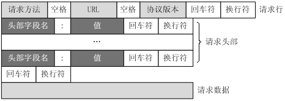
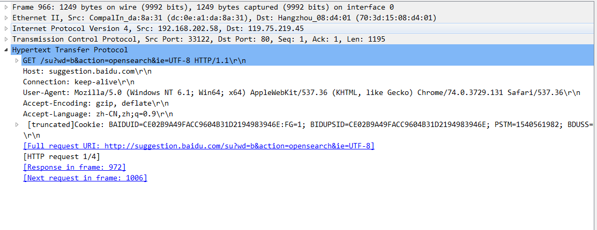
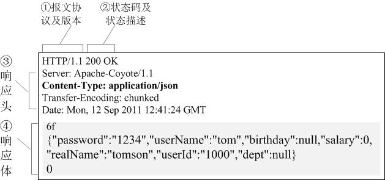
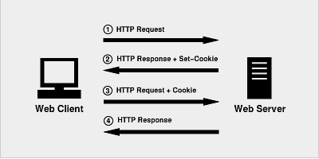
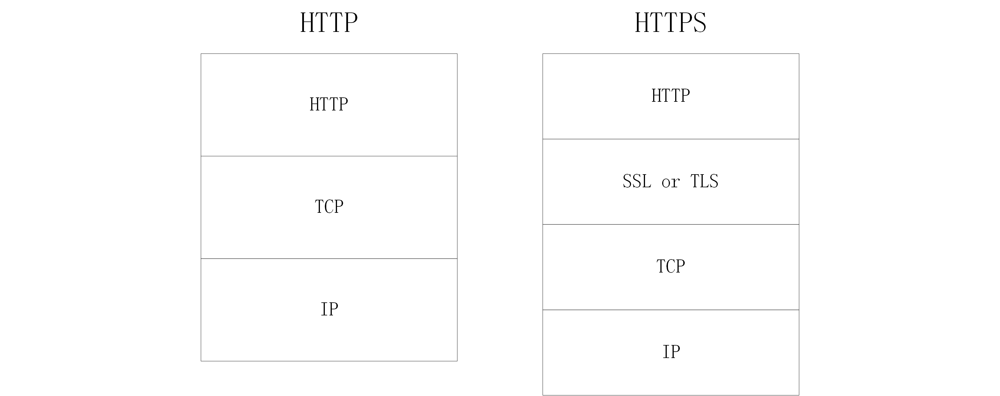
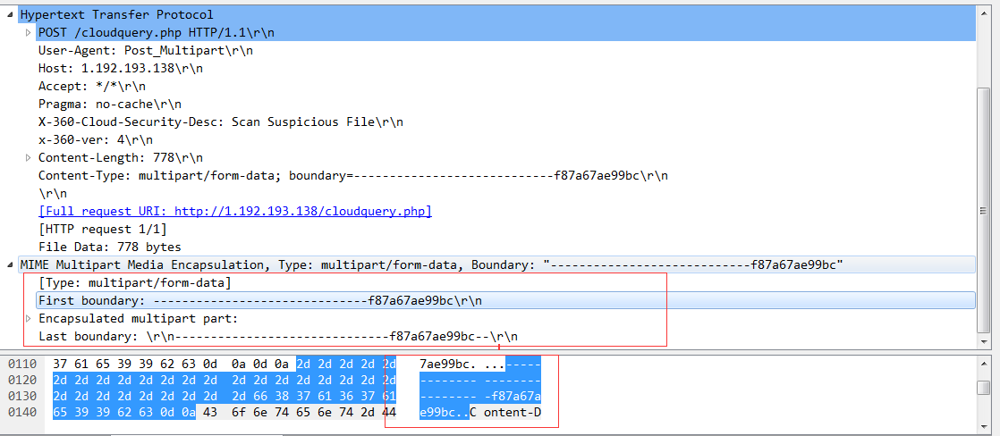

HTTP即超文本传输协议

# HTTP的特性
* HTTP 协议构建于 TCP/IP 协议之上，是一个应用层协议，默认端口号是 80
* HTTP 是基于请求与相应模式的**无连接无状态**的协议.
无连接的目的是限制每次连接只处理一个请求,服务器处理完客户请求并受到客户应答后即断开连接,采用这种方式可以节省时间.HTTP1.1起默认使用长连接,即服务器要等待一定时间后才断开连接,以保证连接特性,虽然目前的一些技术(如keepAlive)使用长连接进行优化,但这些是属于HTTP请求之外的.也就是说,在每个独立的HTTP请求之中,用户无法知道当前的HTTP是否处于长连接的状态,所以用户始终都要认为HTTP在请求结束后就会关闭.至于下层实现是否在HTTP请求结束后关闭连接,都不会改变这个特性.长连接可以理解为下层实现对上层透明.
无状态是指协议对于事务处理没有记忆能力,缺少状态意味着如果后续处理需要前面的信息,则必须被重传.可能导致每次连接传送的数据量增大,不过再服务器不需要先前信息时,它的应答就较快.
* HTTP 支持客户服务器模式.HTTP工作在Client、Server架构之上,浏览器作为HTTP客户端,通过URL向HTTP服务端(Web服务器)发送请求.Web服务器根据请求向客户端发送响应信息.
* HTTP 简单快速.客户端发送请求时只需发送请求方法和路径.由于HTTP协议较为简单，使HTTP程序规模小,因而通信速度很快
* HTTP 较为灵活.HTTP可以传输任意类型的数据对象(使用ContentType标记).

# HTTP请求/响应

## HTTP请求结构



HTTP的请求报文主要由**请求行**、**请求头部**、**空行**、**请求数据**组成.

* 请求行主要包括:
`请求方法`: 主要有GET、POST、PUT、DELETE等
`URL`: 全称是资源描述符,即请求路径.一个URL地址，用于描述一个网络上的资源
`协议版本`: HTTP版本(1.0、1.1)
* 请求头部主要包括:
请求头部由若干个报头组成,每个报头的格式为`头部字段名:值`
用来设置HTTP请求的一些参数.例如HOST,被请求数据的主机和端口号;ContentType等.
* 请求数据:
请求数据就是数据体,它一般只在POST请求中用到,表示上传的数据

* 注意:
请求头部后面的空行是必须的,用它来标识已经结束了头部信息的发送.


使用抓包工具查看一段HTTP请求的信息.

可以看到第一行请求方法为GET;接着空格;然后是URL;接着空格;然后是协议版本,为HTTP1.1;最后回车换行.
第二部分就是一些请求头,包括Host、Connection等.请求头部分一般就是Host到Cookie部分.
再往下就空出一行.

### GET请求和POST请求的区别

||GET|POST|
| -- | -- | -- |
|HTTP报文层面|请求信息放在URL|请求信息放在报文体|
|数据库层面|符合幂等性和安全性|不符合幂等性和安全性|
|其他层面|可以被缓存、被存储|不可以被缓存、被存取|

GET的请求信息和URL之间以`?`隔开,请求信息的格式为键值对,可参考上图GET请求的路径.因为是通过URL,所以是有长度限制的(HTTP 协议规范没有对 URL 长度进行限制。这个限制是特定的浏览器及服务器对它的限制).
POST将请求信息放在报文体中，想获得请求信息要解析报文,所以安全性较GET方式要高一些(其实要获得报文信息也很简单,所以二者安全性没有太大区别,如果要提高安全性最好使用HTTPS).

安全性意味着该操作用于获取信息而非修改信息。换句话说，GET请求一般不应产生副作用。就是说，它仅仅是获取资源信息，就像数据库查询一样，不会修改，增加数据，不会影响资源的状态。
幂等性意味着对同一URL的多个请求应该返回同样的结果。

大部分的GET请求通常都被CDN缓存了,这样可以减小对Web服务器的压力.而POST是非幂等的操作,每次都要交由Web服务器处理.

## HTTP响应结构



HTTP 响应与 HTTP 请求相似，HTTP响应也由3个部分构成，分别是：

* 状态行
* 响应头(Response Header)
* 响应正文
状态行由协议版本、数字形式的状态代码、及相应的状态描述，各元素之间以空格分隔。
响应头是客户端要使用的一些附加信息.比如Date是响应生成的日期时间;Content-Type是对应的数据格式.
响应体则是具体的数据.即Content的内容

常见的**状态码**有如下几种：
* `1xx` 指示信息 表示请求已接收,继续处理
* `2xx` 成功 表示请求已被成功接收、理解
  * `200` OK 客户端请求成功
* `3xx` 重定向 要完成请求必须进行更进一步操作
  * `301` Moved Permanently 请求永久重定向
  * `302` Moved Temporarily 请求临时重定向
  * `304` Not Modified 文件未修改，可以直接使用缓存的文件。
* `4xx` 客户端错误 请求有语法错误或者请求无法实现
  * `400` Bad Request 由于客户端请求有语法错误，不能被服务器所理解。
  * `401` Unauthorized 请求未经授权。这个状态代码必须和WWW-Authenticate报头域一起使用
  * `403` Forbidden 服务器收到请求，但是拒绝提供服务。服务器通常会在响应正文中给出不提供服务的原因
  * `404` Not Found 请求的资源不存在，例如，输入了错误的URL
* `5xx` 服务器端错误 服务器未能实现合法的请求
  * `500` Internal Server Error 服务器发生不可预期的错误，导致无法完成客户端的请求。
  * `503` Service Unavailable 服务器当前不能够处理客户端的请求，在一段时间之后，服务器可能会恢复正常。

## HTTP请求/响应的步骤
* 客户端连接到Web服务器.通常是浏览器客户端与Web服务器的HTTP端口(默认为80端口)建立TCP套接字(socket)连接.
* 发送HTTP请求.即客户端通过TCP套接字向服务器发送文本请求报文.
* 服务器接收请求并返回HTTP响应.Web服务器解析请求并定位请求资源,服务器将资源副本写入TCP套接字,由客户端读取.
* 释放TCP连接.若连接模式为CLOSE,则服务器主动关闭TCP连接,客户端被动关闭连接.若为KeepAlive,则该连接会保持一段时间,在该时间内可以继续接收请求.
* 客户端浏览器解析内容.客户端拿到数据后首先解析状态行,查看表明请求是否成功,然后解析每个响应头,对内容进行解析(HTML、json等)

## 浏览器键入URL,按下回车后经历的流程
* 1 DNS解析.
浏览器根据URL逐层查询DNS服务器缓存,解析URL中域名对应的IP地址.DNS解析是一个递归查询的过程，从哪个缓存找到对应的IP后就直接返回,不再查询后面的缓存。
DNS域名解析过程
域名解析过程： . -> .com -> google.com. -> www.google.com.
DNS缓存从近到远依次是
`浏览器缓存`:浏览器缓存DNS记录一段时间，操作系统并没有告诉浏览器每个DNS记录的生存时间，因此浏览器会将其缓存一段固定的时间（一般在2到30分钟之间）。
`系统缓存`:如果浏览器缓存不包含所需的记录，则浏览器进行调用操作系统的缓存。
`路由器缓存`:请求继续到路由器，路由器通常具有自己的DNS缓存。
`ips服务器缓存`:检查的下一个位置是缓存ISP的DNS服务器。
`根域名服务器缓存`
`顶级域名服务器缓存`

* 2 TCP连接
找到了IP地址后,会根据IP地址和对应端口(默认为80)与服务器建立TCP连接(三次握手).

* 3 发送HTTP请求
浏览器向服务器发送HTTP请求

* 4 服务器处理请求并返回HTTP报文
服务器收到浏览器的请求后返回对应的HTTP报文

* 5 浏览器解析返回的数据
浏览器收到服务器返回的数据后,进行进一步操作(渲染页面等)

* 6 连接结束
释放TCP连接(四次挥手)

其中5 6可以认为是同时发生的.

# Cookie和Session

## Cookie

`Cookie`是服务器发送给客户端的特殊信息,以文本的形式保存在客户端.当浏览器再请求该网站时，浏览器把请求的网址连同该Cookie一同提交给服务器,而这一次Cookie信息则存放在HTTP请求头中.服务器接收到后,解析该Cookie,得到客户端特有的信息,动态生成与客户端相对应的内容。服务器还可以根据需要修改Cookie的内容。



* 1、首先，客户端会发送一个http请求到服务器端。
* 2、 服务器端接受客户端请求后，发送一个http响应到客户端，这个响应头，其中就包含Set-Cookie头部。
* 3、在客户端发起的第二次请求（注意：如果服务器需要我们带上Cookie，我们就需要在B步骤上面拿到这个Cookie然后作为请求头一起发起第二次请求），提供给了服务器端可以用来唯一标识客户端身份的信息。这时，服务器端也就可以判断客户端是否启用了cookies。尽管，用户可能在和应用程序交互的过程中突然禁用cookies的使用，但是，这个情况基本是不太可能发生的，所以可以不加以考虑，这在实践中也被证明是对的。

客户端可以采用两种方式来保存这个 Cookie 对象，一种方式是保存在客户端内存中，称为临时 Cookie，浏览器关闭后这个 Cookie 对象将消失。另外一种方式是保存在客户机的磁盘上，称为永久 Cookie。以后客户端只要访问该网站，就会将这个 Cookie 再次发送到服务器上，前提是这个 Cookie 在有效期内，这样就实现了对客户的跟踪。

Cookie 是可以被客户端禁用的。

## Session
Session是对于服务端来说的,服务器使用一种类似于散列表的结构来保存信息.当程序需要为某个客户端的请求创建一个Session时,服务器首先检查这个请求是否已包含一个Session标识,称为session id,如果已经包含此session id,说明以前为此客户端创建过session,服务器就根据session id将这个session检索出来进行使用.如果客户端请求没有session id,就会新建一个session,并且生成一个与此session相关的session id,session id将会在本次响应中回发给客户端进行保存.

**Session的实现方式**
* 1.使用Cookie实现.服务器为每个Session提供一个唯一的JSESSIONID,并通过Cookie发送给客户端.当客户端发起新的请求时,将在Cookie头中携带这个JSESSIONID,这样服务器能够找到客户端对应的Session.


* 2.使用URL回写来实现.这种方法是指服务器在发送给浏览器页面的所有链接中,都携带JSESSIONID的参数,这样客户端点击任何一个链接都会把JSESSIONID带回服务器,如果直接在地址栏输入URL来请求资源,那么会匹配不到Session.

这两种方式的实现都和JSESSIONID有关.JSESSIONID维护了客户端和服务器之间请求和响应的映射关系.

## Cookie和Session的区别

||Cookie|Session|
|-- | -- | -- |
|存放位置|客户浏览器|服务器|
|安全性|不是很安全|更安全|
|服务器压力|对服务器压力小|对服务器压力大|

cookie不是很安全，别人可以分析存放在本地的cookie并进行cookie欺骗,考虑到安全应当使用session。

session会在一定时间内保存在服务器上。当访问增多，会比较占用你服务器的性能,考虑到减轻服务器性能方面，应当使用cookie。

单个cookie保存的数据不能超过4K，很多浏览器都限制一个站点最多保存20个cookie。

建议： 将登陆信息等重要信息存放为session 其他信息如果需要保留，可以放在cookie中

## Token

Token 也称作令牌，由uid+time+sign[+固定参数]
Token 的认证方式类似于临时的证书签名, 并且是一种服务端无状态的认证方式, 非常适合于 REST API 的场景. 所谓无状态就是服务端并不会保存身份认证相关的数据。

Token和Session有一定的类似，但是服务器不保存状态，而是生成一个Token保存在客户端，这个Token是加密并确保完整性和不变性的，也就是修改后无效的，所以是安全的，可以保存在客户端。

token的组成:
`uid`: 用户唯一身份标识
`time`: 当前时间的时间戳
`sign`: 签名, 使用 hash/encrypt 压缩成定长的十六进制字符串，以防止第三方恶意拼接
`固定参数(可选)`: 将一些常用的固定参数加入到 token 中是为了避免重复查库

Token的认证流程:
Token 的认证流程与cookie很相似

1. 用户登录，成功后服务器返回Token给客户端
2. 客户端收到数据后保存在客户端
3. 客户端再次访问服务器，将token放入headers中
4. 服务器端采用filter过滤器校验。校验成功则返回请求数据，校验失败则返回错误码

对于`3`,Token可以用url传参，也可以用post提交，也可以夹在http的header中。


token与session的流程对比:
`session`:注册登录->服务端将user存入session->将sessionid存入浏览器的cookie->再次访问时根据cookie里的sessionid找到session里的user
`token`:注册登录->服务端将生成一个token，并将token与user加密生成一个密文->将token+user+密文数据 返回给浏览器->再次访问时传递token+user+密文数据，后台会再次使用token+user生成新密文，与传递过来的密文比较，一致则正确。
注：上文中得token里保存的用户信息，一般不会包含敏感信息。

**Session与Token的异同点**

* Session的状态是存储在服务器端，客户端只有session id,session依赖cookie；而Token的状态是存储在客户端;
* Token和Session其实都是为了身份验证，Session一般翻译为会话，而token更多的时候是翻译为令牌；
* cookie + session在跨域场景表现并不好
* 作为身份认证 token 安全性比session好，因为每个请求都有签名还能防止监听以及重放攻击，而session就必须靠链路层来保障通讯安全了。基于 cookie 的机制很容易被 CSRF,Token可以抵抗CSRF

注:
CSRF（Cross-site request forgery，跨站请求伪造）
CSRF(XSRF) 顾名思义，是伪造请求，冒充用户在站内的正常操作。
例如，一论坛网站的发贴是通过 GET 请求访问，点击发贴之后 JS 把发贴内容拼接成目标 URL 并访问：
  `http://example.com/bbs/create_post.php?title=标题&content=内容`
那么，我们只需要在论坛中发一帖，包含一链接：
 `http://example.com/bbs/create_post.php?title=你好&content=哈哈`
只要有用户点击了这个链接，那么他们的帐户就会在不知情的情况下发布了这一帖子。可能这只是个恶作剧，但是既然发贴的请求可以伪造，那么删帖、转帐、改密码、发邮件全都可以伪造。

# HTTPS


HTTPS(超文本传输安全协议) 即 HyperText Transfer Protocol Secure；常称为HTTP over TLS、HTTP over SSL或HTTP Secure，是一种在加密信道进行 HTTP 内容传输的协议。

>TLS 的早期版本叫做 SSL(Security Sockets Layer,安全套接层)。SSL 的 1.0, 2.0, 3.0 版本均已经被废弃，出于安全问题考虑广大浏览器也不再对老旧的 SSL 版本进行支持了，因此这里我们就统一使用 TLS 名称了。

* 为网络通信提供安全及数据完整性的一种安全协议
* 是操作系统对外的API
* 采用**身份认证**和**数据加密**保证网络通信的安全和数据的完整性

加密方式:
* 对称加密：加密和解密都使用同一个密钥.该算法性能较非对称加密要高,但是安全性相对较弱.
* 非对称加密:加密使用的密钥和解密使用的密钥是不相同的.分别称为公钥和私钥,公钥和算法都是公开的,但是私钥是保密的.该算法性能较低,但是安全性强.
* 哈希算法:将任意长度的信息转换为固定长度的值,算法不可逆.常用的有MD5加密算法.
* 数字签名:在信息后面加上一段内容,证明某个消息或者文件是某人发出的
实际应用中,仅使用其中一种加密方式不能满足生产要求,要么非对称加密性能过低,要么加密密钥容易泄露.因此HTTPS使用证书配合各种加密手段进行加密.

## TLS的基本过程如下:
(参考[what-happens-when-zh_CN](https://github.com/skyline75489/what-happens-when-zh_CN#tls))

* 客户端发送一个 ClientHello 消息到服务器端，消息中同时包含了它的 Transport Layer Security (TLS) 版本，可用的加密算法和压缩算法。
* 服务器端向客户端返回一个 ServerHello 消息，消息中包含了服务器端的 TLS 版本，服务器所选择的加密和压缩算法，以及数字证书认证机构（Certificate Authority，缩写 CA）签发的服务器公开证书，证书中包含了公钥。客户端会使用这个公钥加密接下来的握手过程，直到协商生成一个新的对称密钥。证书中还包含了该证书所应用的域名范围（Common Name，简称 CN），用于客户端验证身份。
* 客户端根据自己的信任 CA 列表，验证服务器端的证书是否可信。如果认为可信（具体的验证过程在下一节讲解），客户端会生成一串伪随机数，使用服务器的公钥加密它。这串随机数会被用于生成新的对称密钥
* 服务器端使用自己的私钥解密上面提到的随机数，然后使用这串随机数生成自己的对称主密钥
* 客户端发送一个 Finished 消息给服务器端，使用对称密钥加密这次通讯的一个散列值
* 服务器端生成自己的 hash 值，然后解密客户端发送来的信息，检查这两个值是否对应。如果对应，就向客户端发送一个 Finished 消息，也使用协商好的对称密钥加密
* 从现在开始，接下来整个 TLS 会话都使用对称秘钥进行加密，传输应用层（HTTP）内容
从上面的过程可以看到，TLS 的完整过程需要三个算法（协议），密钥交互算法，对称加密算法，和消息认证算法（TLS 的传输会使用 MAC(message authentication code) 进行完整性检查）。

HTTPS在进行网络传输之前,会与网站服务器和Web浏览器进行一次握手,在握手时确认双方的加密密码信息.
概括来说，HTTPS数据传输流程:
* 浏览器将支持的加密算法信息发送给服务器
* 服务器选择一套浏览器支持的加密算法和哈希算法,将验证身份的信息以证书形式回发给浏览器.证书信息中包含了证书发布的CA机构,证书的有效期,公钥,证书所有者,签名等.
* 浏览器验证证书合法性,并结合证书公钥加密信息发送给服务器
* 服务器接收到客户端的信息后,使用私钥解密信息,验证哈希值是否与Web浏览器一致,然后服务器加密响应消息回发给浏览器
* 最后,浏览器解密响应消息,并对消息进行验真,之后浏览器和服务器进行加密交换数据

使用抓包工具可以看到,HTTPS抓取到的数据都是经过加密的,而HTTP的数据是明文.


## HTTP和HTTPS的区别：
* HTTPS需要到CA申请证书,HTTP不需要
* HTTPS密文传输,HTTP明文传输
* 连接方式不同,HTTPS默认使用443端口,HTTP默认使用80端口
* HTTPS=HTTP+加密+认证+完整性保护,较HTTP安全

## 中间人攻击：
HTTPS 的过程并不是密不透风的，HTTPS 有若干漏洞，给中间人攻击（Man In The Middle Attack，简称 MITM）提供了可能。

所谓中间人攻击，指攻击者与通讯的两端分别建立独立的联系，并交换其所收到的数据，使通讯的两端认为他们正在通过一个私密的连接与对方直接对话，但事实上整个会话都被攻击者完全控制。在中间人攻击中，攻击者可以拦截通讯双方的通话并插入新的内容。

## HTTPS并不是真的安全:
### SSL剥离
SSL 剥离即阻止用户使用 HTTPS 访问网站.浏览器会默认填充`http://`,请求需要进行跳转,这个访问完全是明文的，这就给了攻击者可乘之机,有被劫持的风险.通过攻击 DNS 响应，攻击者可以将自己变成中间人。
### HSTS
为了防止上面说的这种情况，一种叫做 **HSTS** 的技术被引入了。HSTS（HTTP Strict Transport Security）是用于强制浏览器使用 HTTPS 访问网站的一种机制。它的基本机制是在服务器返回的响应中，加上一个特殊的头部，指示浏览器对于此网站，强制使用 HTTPS 进行访问：
```
Strict-Transport-Security: max-age=31536000; includeSubdomains; preload
```
可以看到如果这个过期时间非常长，就是导致在很长一段时间内，浏览器都会强制使用 HTTPS 访问该网站。

HSTS 有一个很明显的缺点，是需要等待第一个服务器的影响中的头部才能生效，但如果第一次访问该网站就被攻击呢？为了解决这个问题，浏览器中会带上一些网站的域名，被称为 HSTS preload list。对于在这个 list 的网站来说，直接强制使用 HTTPS。

### 伪造证书攻击

HSTS 只解决了 SSL 剥离的问题，然而即使在全程使用 HTTPS 的情况下，我们仍然有可能被监听。

假设我们想访问 www.google.com，但我们的 DNS 服务器被攻击了，指向的 IP 地址并非 Google 的服务器，而是攻击者的 IP。当攻击者的服务器也有合法的证书的时候，我们的浏览器就会认为对方是 Google 服务器，从而信任对方。这样，攻击者便可以监听我们和谷歌之前的所有通信了。

可以看到攻击者有两步需要操作，第一步是需要攻击 DNS 服务器。第二步是攻击者自己的证书需要被用户信任，这一步对于用户来说是很难控制的，需要证书颁发机构能够控制自己不滥发证书。

# 参考

https://hit-alibaba.github.io/interview/basic/network/HTTP.html

https://hit-alibaba.github.io/interview/basic/network/HTTPS.html

https://zhuanlan.zhihu.com/p/33781119

http://blog.wizun.cn/2019/02/19/cookie-session/

https://juejin.im/post/59d1f59bf265da06700b0934

https://segmentfault.com/a/1190000017831088

https://www.zhihu.com/question/51759560/answer/332128488

http://www.intelligentunit.com/authorization-with-session-token-principle-and-compare/

https://blog.csdn.net/qq_35891226/article/details/79931210

https://juejin.im/post/5a437441f265da43294e54c3