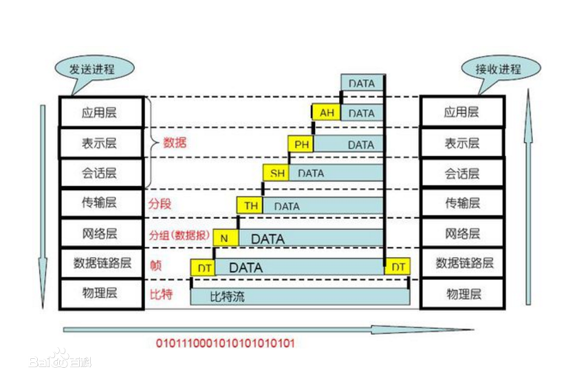
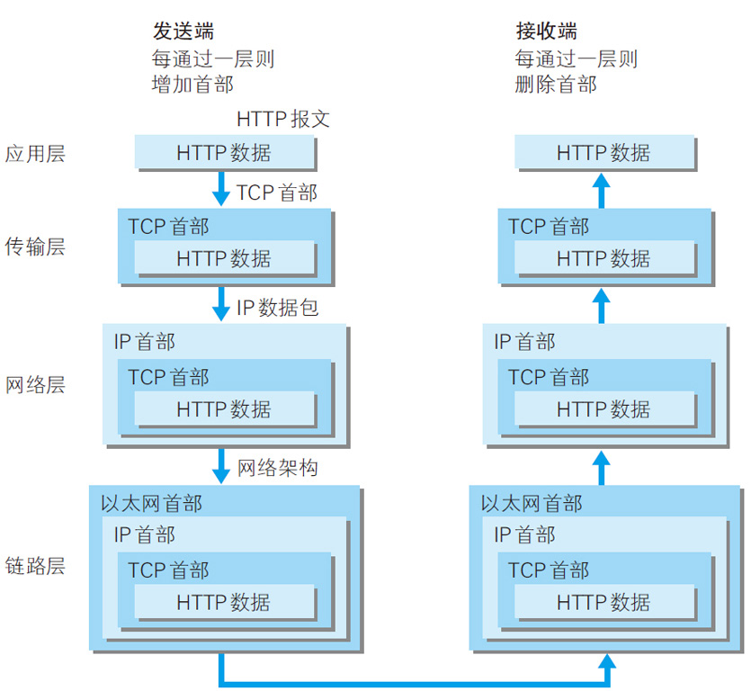
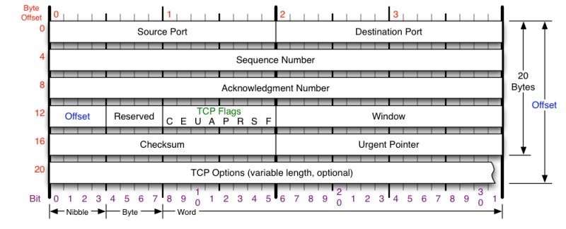
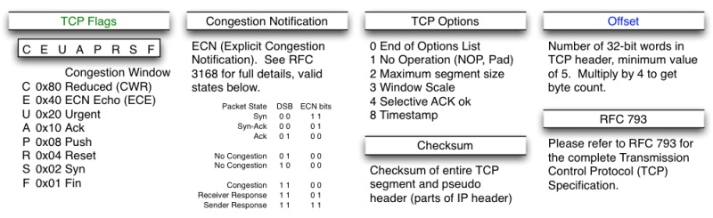
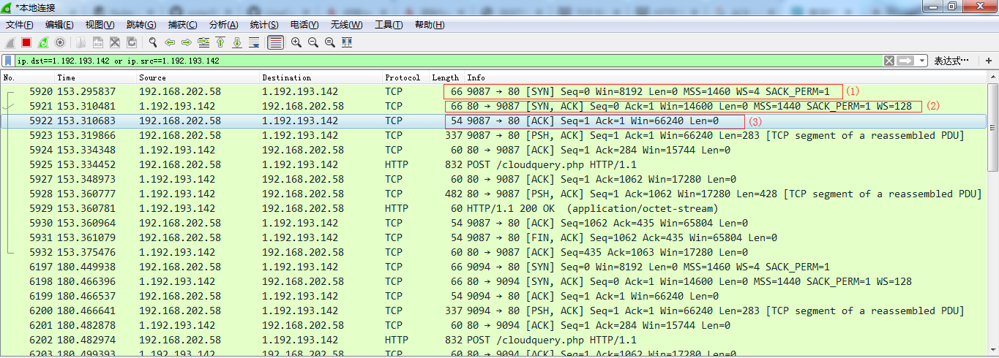
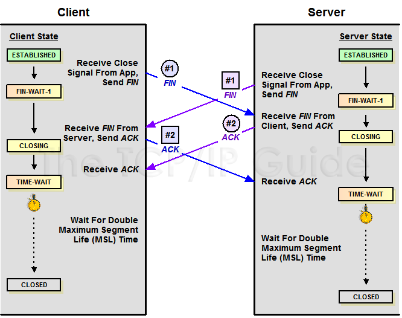
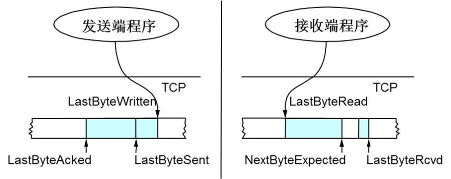
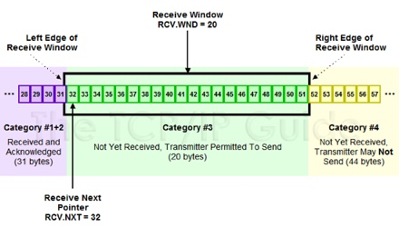

TCP协议比较复杂，这里主要记录学习TCP过程中的一些要点。

目前有四层、五层、七层协议。

# OSI开放式互联参考模型(概念化七层协议)

* 第一层(物理层)
  要解决两台物理机之间的通讯需求,机器A向机器B发送比特流,机器B能收到比特流。这是物理层要解决的问题。
  物理层定义了物理设备的标准,比如网线的类型、光纤接口类型、各种传输介质的传输速率。它的主要作用是传输比特流(0101)数据,将其转化为电流强弱进行传输,到达目的地后再转化为0101的机器码,也就是数模转换和模数转化,这一层的数据是比特。网卡工作在这一层。
* 第二层(数据链路层)
  物理寻址，同时将原始比特流转为逻辑传输线路。
  在传输比特流的过程中，可能会产生错传和数据不完整的情况。这一层定义了如何格式化数据以进行传输,以及控制对物理介质的访问。这一层还提供错误检测和纠正，以确保数据传输的可靠性。该层将比特数据组成了帧,其中交换机工作在该层,对帧解码，并根据帧中包含的信息发送到接收方。
* 第三层(网络层)
  随着网络节点的增加，点对点的通讯是要经过多个节点的,如何找到目标节点、选择最佳路径成为首要需求，此时便有了网络层。
  网络层的主要功能是将网络地址翻译为对应的物理地址,并决定如何将数据从发送方路由到接收方。网络层通过综合考虑发送优先权、网络拥塞程度、服务质量、可选路由的花费来决定从一个网络中节点A到另一个网络中节点B的最佳路径。由于网络层处理并智能指导数据传送,路由器连接网络各个节点,所以路由器属于网络层。此层的数据被称为数据包,此层需要关注的协议是TCP/IP协议中的IP协议。
* 第四层(传输层)
  随着网络通讯需求的进一步扩大，通讯过程中需要发送大量数据,如海量文件传输等,可能需要很长的时间,而网络在通讯过程中会中断好多次,此时为了保证传输大量文件的准确性,需要对数据进行切分,切割为一个个的段落,如果其中一个段落丢失了需不需要重新传输,每个段落是否要按照顺序到达,这便是传输层要考虑的问题。
  传输层解决了主机间的数据传输(可以是不同网络),同时解决了传输质量的问题。该层是OSI模型中最重要的一层:传输协议同时进行流量控制,或是基于接收方可接受数据的快慢程度规定适当的发送速率。除此之外,传输层按照网络处理的最大尺寸,将较长的数据包进行强制分割,将文件处理为数据片并为每一个数据片安排一个序列号,以便数据片到达接收方时能够正确重组。该过程即称为排序。
  传输层中需要关注的协议有TCP/IP协议中的TCP协议和UDP协议。
  
* 第五层(会话层)
  第四层保证了给正确的计算机发送正确的封装过后的信息了,但是用户的体验好不好(难道每次都要调用TCP去打包,然后调用IP协议去找路由),当然不可以。我们要建立一个自动收发包，自动寻址的功能，于是发明了会话层。
  会话层的作用就是管理和应用程序之间的通讯。
* 第六层(表示层)
  在第五层的基础上，可以保证应用程序自动收发包和寻址了。但是如果是两个不同的系统之间通讯，往往有阻碍。就像shell不能在windows下直接执行一样。于是需要表示层帮用户解决不同系统之间的通讯语法的问题。
* 第七层(应用层)
  在表示层，数据将按照网络能理解的方案进行格式化。这种格式化也因所使用的网络类型的不同而不同，此时发送方虽然知道自己发送的是什么，转化为字节数组后有多长，但接收方不知道。所以应用层的网络协议诞生了。
  它规定发送方和接收方必须使用一个固定长度的消息头，消息头必须使用某种固定的组成，而且消息头必须记录消息体的长度等信息，以方便接收方正确解析发送方发送的数据。
  应用层旨在让用户更方便的应用从网络中接收到的数据，至于数据传递，没有该层用户也可以在两台电脑间传递信息。只不过穿来穿去都是01组成的字节数组。
  该层需要重点关注的是TCP/IP协议中的HTTP协议。

以上就是OSI各层次的划分。
先自上而下从应用层开始都要对传输的数据头部进行处理，加上本层的一些信息。最后由物理层通过电缆、以太网等介质将数据解析为比特流在网络中进行传输。数据传递到目标地址，再自底而上的将先前对应层的头部进行解析分离。这就是网络处理的整个流程。(先自上而下，后自下而上处理数据头部)

图片[引自](https://www.cnblogs.com/qishui/p/5428938.html)

## TCP/IP

OSI并不是一个标准，只是一个在指定标准时使用的概念框架。
其标准是TCP/IP，即TCP/IP是OSI的实现。

虽然TCP/IP并不完全符合OSI的七层参考模型。但是它依然是OSI的一种实现。

图片[引自](https://www.cnblogs.com/qishui/p/5428938.html)

TCP/IP很多情况下是用IP进行通信时所必须用到的协议群的统称。TCP/IP在分层模块上与OSI略有缺别，可参照上图。

OSI注重通讯协议必要的功能是什么，而TCP/IP则更强调实现协议要开发哪种程序。

# TCP

## TCP(Transmission Control Protocol)简介

TCP是属于传输层的协议，是传输控制协议。

* 是一种**面向连接的**，**可靠的**，**基于字节流的**传输层通信协议
* 将应用层的数据流分割成报文段并发送给目标节点的TCP层
* TCP为了不丢失包,每个数据包都有序号,对方收到则发送ACK确认,未收到则重新传送
* 使用校验和函数来检验数据再传输过程中是否有误，发送和接收时都要计算校验和。即使用校验和,确认和重传机制来保证可靠传输
* 在一个 TCP 连接中，仅有两方进行彼此通信。广播和多播不能用于 TCP
* TCP 给数据分节进行排序，并使用累积确认保证数据的顺序不变和非重复
* TCP 使用滑动窗口机制来实现流量控制，通过动态改变窗口的大小进行拥塞控制

**注意**：TCP 并不能保证数据一定会被对方接收到，因为这是不可能的。TCP 能够做到的是，如果有可能，就把数据递送到接收方，否则就（通过放弃重传并且中断连接这一手段）通知用户。因此准确说 TCP 也不是 100% 可靠的协议，它所能提供的是数据的可靠递送或故障的可靠通知。

## TCP报文头

TCP连接中传送的字节流中的每个字节都按顺序编号。例如一短报文的序列号字段值是107,而携带的字段为100个字段。如果有下一个报文段，则从207开始。

`Source Port` 代表源端口 占2字节

`Destination Port` 代表目的端口 占2字节

`Sequence Number` 包的序号Seq，用于解决网络包乱序（reordering） 占4个字节

`Acknowledgment Number` 确认字符 占4个字节 代表期望收到对方下一段报文的下一个字节的序号 用于确认收到，用来解决不丢包的问题(本文图片中的ACKnum 有的则写成小写ack)

例如B收到了A发来的报文，其序列号字段是301,而数据长度为200字节。这表明B收到了到序号到500(301+200-1)为止的数据。因此B期望收到A的下一个数据序号是501.所以B发送给A的确认报文段中把ACK置为501.

`Offset` 数据偏移
由于头部有可选字段，长度不固定，因此它指出TCP报文的数据距离TCP报文的起始处有多远

`Reserved` 保留域

`TCP Flags` 控制位 由八个标志位组成 每一个位置表示一个控制功能
TCP Flags中常见的6个:
* URG: 紧急指针标志。为1时紧急指针有效，为0则忽略紧急指针
* ACK(Acknowledgement): 确认序号标志。为1时表示确认号有效，为0表示报文中不含确认信息。上面的确认号是否有效就是由该控制位控制的。
* PSH: push标志。为1时表示是带有PUSH标志的数据，指示接收方接收到后尽快将报文段交给应用程序，而不是在缓冲区排队。
* RST: 重置连接标志。用于重置由于主机崩溃或其他原因而出现错误的连接，或者用于拒绝非法的报文段或拒绝连接请求。
* SYN(Synchronize Sequence Numbers): 同步序号,用于建立连接过程。在连接请求中,SYN=1和ACK=0表示该数据段没有使用捎带的确认域,而连接应答捎带一个确认即SYN=1和ACK=1.
* FIN(finish): finish标志，用于释放连接。为1时表示发送方已经没有数据发送了，即关闭本方数据流。

`Window` 又叫Advertised Window，可以近似理解为滑动窗口（Sliding Window）的大小，用于流控。以此控制发送端发送数据的速率，从而达到流量控制。详细解析可见本文的[滑动窗口](https://homxuwang.github.io/2019/05/06/%E6%B5%85%E8%B0%88TCP%E5%8D%8F%E8%AE%AE/#TCP%E7%9A%84%E6%BB%91%E7%AA%97)部分.

`Checksum` 校验和。此校验和是对TCP报文段,包括TCP头部,和TCP数据以16位进行计算所得。由发送端计算和存储并由接收端进行验证

`Urgent Pointer` 紧急指针。只有当URG为1时有效，指出本报文段中紧急数据的字节数。

`TCP Options` 可选项。长度可变，定义一些可选参数。

**注意**:

* TCP和UDP不包含IP地址信息,但是它们包含源端口和目的端口。即端口是属于传输层范畴的，IP地址是IP层上的事。

* 在本地两个进程间进行通信时，可以使用唯一标识符PID。但是如果是两台不同计算机之间的进程进行通信时,只用PID是不够的,这时就在传输层中使用协议端口号,简称端口。IP可以唯一标识主机，而TCP协议和端口号可以唯一标识一个主机中的进程。这样可以用IP地址+协议+端口号唯一标识一个网络中的进程。一些场合中，这种唯一标识模式也称为套接字(socket)。虽然通信的重点是应用进程，但是只要把要传送的报文交给目的主机的正确端口，剩下的工作就由TCP来完成。

* 一个TCP连接需要四个元组来表示是同一个连接（src_ip, src_port, dst_ip, dst_port）（准确说是五元组，还有一个是协议，但因为这里只是说TCP协议，所以，这里我只说四元组）。

其他字段参考下图:

# TCP三次握手

当应用程序希望通过TCP与另一个应用程序通信时，它会发送一个通信请求，这个请求必须被送到一个确切的地址。在双方握手之后，TCP将会在两个应用程序之间建立一个全双工的通信。这个全双工的通信将占用两个计算机之间的通信线路，直到它被一方或双方关闭为止。
**注**:全双工是指允许数据在两个方向上进行传输,即在同一时间,服务器可以发送数据给客户端,客户端也可以发送数据给服务器。

所谓三次握手(Three-way Handshake)，是指建立一个 TCP 连接时，需要客户端和服务器总共发送3个包。

三次握手的目的是连接服务器指定端口，建立 TCP 连接，并同步连接双方的序列号和确认号，交换 TCP 窗口大小信息。在 socket 编程中，客户端执行 connect() 时。将触发三次握手。

* 第一次握手(SYN=1, seq=x):

客户端发送一个 TCP 的 SYN 标志位置1的包，指明客户端打算连接的服务器的端口，以及初始序号 X,保存在包头的序列号(Sequence Number)字段里。

发送完毕后，客户端进入 SYN_SEND 状态。
这个报文不携带数据，并消耗一个序号。

* 第二次握手(SYN=1, ACK=1, seq=y, ACKnum=x+1):

服务器发回确认包(ACK)应答。即 SYN 标志位和 ACK 标志位均为1。服务器端选择自己 ISN(Initial Sequence Number) 序列号，放到 Seq 域里，同时将确认序号(Acknowledgement Number)设置为客户的 ISN 加1，即ACKnum=X+1。 发送完毕后，服务器端进入 SYN_RCVD 状态。
这个报文不携带数据，并消耗一个序号。

* 第三次握手(ACK=1，ACKnum=y+1)

客户端再次发送确认包(ACK)，确认报文的 ACK = 1，并且把服务器发来 ACK 的序号字段+1，放在确定字段中发送给对方，并且在数据段放写ISN的+1

发送完毕后，TCP连接建立，客户端进入 ESTABLISHED 状态，当服务器端接收到这个包时，也进入 ESTABLISHED 状态，这时双方就可以开始进行通信了。TCP 握手结束。

TCP规定，这个ACK报文段可以携带数据(也可以不携带).如果不携带数据就不会消耗序号。

三次握手主要是要初始化Sequence Number 的初始值。双方需要发送自己的ISN（初始化序列号，Inital Sequence Number）给对方，并收到对方的回复——最简单的方式也是两个一来一回，四次握手，但此处进行了优化，将server端回复的ACK同server端自己的SYN合并在一个报文中发送给client，所以减少为三次。

>通信的双方要同步对方ISN——所以叫SYN（全称Synchronize Sequence Numbers）。也就是上图中的 x 和 y。这个号在以后的数据通信中，在client端按发送顺序递增，在server端按递增顺序重新组织，以保证应用层接收到的数据不会因为网络问题乱序。

## 抓包

使用抓包工具,对三次握手进行查看:

图中9087->80是客户端的9087端口号发送到服务器端的80端口.

(1)中,客户端发送了一个SYN包,在SYN包中首次握手，标明了Seq = x = 0。客户端进入 `SYN_SEND` 状态。
(2)中，服务器收到了SYN包,再回送SYN = 1, Ack = 1的确认包。此时服务器端的Seq = 0.Ack = 1是因为客户端最开始发送的Seq = x = 0,所以消耗一个序号后Ack = x + 1 = 0 + 1 = 1.将Seq = y = 0 ,Ack = 1 回发给客户端.服务器端进入 `SYN_RCVD` 状态
(3)中，浏览器接收到服务器的ACK确认后，回发一个ACK,因为服务器的Seq = y = 0 ,需要消耗掉一个序号，所以此时的Ack = y + 1 = 0 + 1 = 1.Seq = 1.
服务器和客户端进入`ESTABLISHED`状态.双方建立起连接，可以开始通信了.

其中 `Win = xxxx` ,Win的值就是作为滑动窗口进行流量控制的。

**总结**：
在TCP/IP协议中，TCP协议提供可靠的连接服务，采用三次握手建立一个连接。

第一次握手:建立连接时,客户端发送SYN包(syn=j)到服务器，并进入`SYN_SEND`状态，等待服务器确认；
第二次握手:服务器收到SYN包，必须确认用户的SYN(ack = j + 1),同时自己也发送一个SYN包(syn = k),即SYN+ACK包,此时服务器进入`SYN_RECV`状态;
第三次握手:客户端收到服务器的SYN+ACK包,向服务器发送确认包ACK(ack = k + 1),此包发送完毕，客户端和服务器进入ESTABLISHED状态,完成三次握手。

## 相关问题

* 为什么要三次握手建立连接？

**为了初始化Sequence Number的初始值**.通信的双方要互相通知对方自己初始化的Sequence Number，也就是上图的x和y,这个号要作为以后数据通讯的序号，以保证传输的数据不会因为网络上的传输问题而乱序,即TCP用这个序号进行拼接数据。因此在服务器回发Sequence Number即第二次握手之后，还需要发送确认报文给服务器，告诉服务器客户端已经收到初始化的Sequence Number了。

* 首次握手的隐患---SYN超时

**问题起因分析**:
Server收到Client的SYN,回复SYN-ACK的时候未收到ACK确认(比如客户端掉线).那么连接就会处于中间状态即半连接(half-open connect)，没有成功也没有失败。

Server不断重试(重新发送SYN-ACK)直至超时，Linux默认最多发送5次,每次发送时间翻倍。默认等待63秒才判定超时，TCP才断开连接。这样可能会产生针对SYN-Flood攻击的风险。

* SYN攻击

SYN 攻击指的是，攻击客户端在短时间内伪造大量不存在的IP地址，向服务器不断地发送SYN包，服务器回复确认包，并等待客户的确认。由于源地址是不存在的，服务器需要不断的重发直至超时，这些伪造的SYN包将长时间占用未连接队列，正常的SYN请求被丢弃，导致目标系统运行缓慢，严重者会引起网络堵塞甚至系统瘫痪。
SYN 攻击是一种典型的 DoS/DDoS 攻击。

* 针对SYN-Flood的防护措施：

①检测 SYN 攻击非常的方便，当你在服务器上看到大量的半连接状态时，特别是源IP地址是随机的，基本上可以断定这是一次SYN攻击。在 Linux/Unix 上可以使用系统自带的 netstats 命令来检测 SYN 攻击。

②SYN cookies技术
* SYN队列满后,TCP通过源地址端口，目标地址端口和时间戳，打造一个特别的Sequence Number回发回去.(通过tcp_syncookies参数回发SYN Cookie.)
* 若是攻击者则没有响应。如果是正常用户，则Client会回发SYN Cookie,直接建立连接

③缩短超时（SYN Timeout）时间
④过滤网关防护
⑤增加最大半连接数

* 建立连接后,Client出现故障怎么办？
**保活机制**:
在一段时间处于保活时间(KeepAlive Time)，在这段时间连接处于非活动状态。开启保活功能的一段将向对方发送保活探测报文，如果发送端未收到响应报文，经过一个提前配置好的保活时间间隔,继续发送保活探测报文。直到发送次数达到保活探测数仍未收到响应，则对方主机则确认为不可达，此时中断连接。

* KeepAlive 的局限
首先 TCP KeepAlive 监测的方式是发送一个 probe 包，会给网络带来额外的流量，另外 TCP KeepAlive 只能在内核层级监测连接的存活与否，而连接的存活不一定代表服务的可用。例如当一个服务器 CPU 进程服务器占用达到 100%，已经卡死不能响应请求了，此时 TCP KeepAlive 依然会认为连接是存活的。因此 TCP KeepAlive 对于应用层程序的价值是相对较小的。需要做连接保活的应用层程序，例如 QQ，往往会在应用层实现自己的心跳功能。

# TCP四次挥手

是为了终止连接，客户端和服务器总共要发送4个包，来确认连接的断开,因此称为四次挥手(Four-way handshake)。客户端或服务器均可主动发起挥手动作,任何一方执行 `close()` 操作即可产生挥手操作.

* 第一次挥手(FIN=1,seq=x)
假设客户端想要关闭连接，客户端发送一个 FIN 标志位置为1的包，表示自己已经没有数据可以发送了，但是仍然可以接受数据。此时的序列号seq = ESTABLISHED状态下数据最后一次发送的时候已经传送过来的数据的最后一个字节的序号+1。

发送完毕后，客户端进入 `FIN_WAIT_1` 状态。

* 第二次挥手(ACK=1,ACKnum=x+1)
服务器端确认客户端的 FIN 包，发送一个确认包，表明自己接受到了客户端关闭连接的请求，但还没有准备好关闭连接。

发送完毕后，服务器端进入 **`CLOSE_WAIT`** 状态，客户端接收到这个确认包之后，进入 `FIN_WAIT_2` 状态，等待服务器发送释放连接报文。

* 第三次挥手(FIN=1,ACK=1,seq=y)
服务器端准备好关闭连接时，向客户端发送结束连接请求，FIN = 1,ACK = 1。

发送完毕后，服务器端进入 `LAST_ACK` 状态，等待来自客户端的最后一个ACK。

* 第四次挥手(ACK=1，ACKnum=y+1)
客户端接收到来自服务器端的关闭请求，发送一个确认包，并进入 `TIME_WAIT` 状态，等待可能出现的要求重传的 ACK 包。

服务器端接收到这个确认包之后，关闭连接，进入 `CLOSED` 状态。

客户端等待了某个固定时间（两个最大段生命周期，2MSL，2 Maximum Segment Lifetime）之后，没有收到服务器端的 ACK ，认为服务器端已经正常关闭连接，于是自己也关闭连接，进入 `CLOSED` 状态。

**总结**:
第一次挥手：Client发送一个FIN,用来关闭Client到Server的数据传送,Client进入FIN_WAIT_1状态;
第二次挥手: Server收到FIN后,发送一个ACK给Client,确认序号为收到序号+1(与SYN相同,一个FIN占用一个序号),Server进入CLOSE_WAIT状态;
第三次挥手: Server发送一个FIN,用来关闭Server到Client的数据传送,Server进入LAST_ACK状态;
第四次挥手: Client收到FIN后,Client进入TIME_WAIT状态,接着发送一个ACK给Server,确认序号为收到序号+1,Server进入CLOSED状态,客户端等待2MSL时间后,进入CLOSED状态.完成四次挥手。

## 相关问题

* 为什么要设置2MSL时间后客户端才关闭？
①:确保有足够的时间让对方收到ACK包或主动方收到了被动方超时重传的FIN。即，如果被动方没有收到Ack，就会触发被动方重传FIN，发送Ack+接收FIN正好2个MSL，TIME_WAIT状态的连接收到重传的FIN后，重传Ack，再等待2 * MSL时间。
②:避免新旧连接混淆.确保有足够的时间让“迷途的重复分组”过期丢弃。这只需要1 * MSL即可，超过MSL的分组将被丢弃，否则很容易同新连接的数据混在一起（仅仅依靠ISN是不行的）。因为有些路由器会缓存IP数据包,如果连接被重用了,那么延迟收到的包就有可能跟新连接混在一起.

* 为什么要进行四次才能完成挥手操作？
参照三次握手的过程，其实是双方各自关闭资源进行2次挥手。握手的目的是同步双方的ISN，不是耗时操作，因此可以“将server端回复的ACK同server端自己的SYN合并在一个报文中发送给client”；但挥手要回收大量资源，是耗时操作，因此，不能强制“将server端回复的ACK同server端自己的FIN合并在一个报文中发送给client”，所以通常认为挥手需要四次。
对于挥手，因为TCP是全双工的，client与server都占用各自的资源发送segment（同一通道，同时双向传输seq和ack），所以，**双方都需要关闭自己的资源（向对方发送FIN）并确认对方资源已关闭（回复对方Ack）**,也就是双方都需要FIN报文和ACK报文；而双方可以同时主动关闭，也可以由一方主动关闭带动另一方被动关闭。只不过，通常以一方主动另一方被动举例（如图，client主动server被动），所以看上去是所谓的4次挥手。

* 服务器出现大量CLOSE_WAIT状态的原因
对方关闭socket连接,我方忙于读或写,没有及时关闭连接.
需要检查代码,特别是释放资源的代码.
检查配置,特别是处理请求的线程配置.
如果CLOSE_WAIT状态的连接过多的话,就需要去排查问题。如果CLOSE_WAIT一直保持，意味着对应数目的通道一直被占用,一旦达到了上限,则新的请求就无法被处理，甚至会让服务器崩溃。

# UDP
UDP报文结构相比TCP要简单,主要包括:
`Source Port`: 源端口
`Destination Port`: 目标端口
`Length`: 数据包长度
`Checksum`: 校验值
最后一部分为用户数据

因为UDP的报文头较TCP简单,所以它不像TCP一样会支持错误重传、滑动窗口等精细控制.

**UDP的特点:**

* 面向非连接的协议,传输数据之前,**源端与终端不建立连接**。UDP 客户和服务器之前不必存在长期的关系。UDP 发送数据报之前也不需要经过握手创建连接的过程。当想传送时,就简单抓取来自应用程序的数据,并尽可能快的放到网络上.发送端,UDP的传送速度是应用程序生成数据的速度、计算机的能力、传送带宽的限制.在接收端，UDP把每个消息段放在队列中,应用程序每次从队列中读取一个消息段.

* 由于不建立连接,所以不需要维护连接状态,因此UDP **支持多播和广播**,即支持向多个客户端传送相同的消息。

* UDP数据包报头只有8个字节(TCP有20个字节),额外开销较小

* 吞吐量不受拥挤控制算法的调节，只受限于数据生成速率、传输带宽及机器性能

* UDP 缺乏可靠性。UDP 本身不提供确认，序列号，超时重传等机制。UDP 数据报可能在网络中被复制，被重新排序。即 UDP 不保证数据报会到达其最终目的地，也不保证各个数据报的先后顺序，也不保证每个数据报只到达一次。(UDP尽最大努力交付,不保证可靠交付,不需要维持复杂的链接状态表)

* UDP 数据报是有长度的。每个 UDP 数据报都有长度，如果一个数据报正确地到达目的地，那么该数据报的长度将随数据一起传递给接收方。而 TCP 是一个字节流协议，没有任何（协议上的）记录边界。

* UDP面向报文,不对应用程序提交的报文信息进行拆分或者合并。因此应用程序要选择合适的大小。

**TCP和UDP的区别**:
||TCP|UDP|
| -- | -- | -- |
|面向连接 vs 无连接|面向连接|无连接|
||点对点传输|单个点向多个点传输|
|可靠性|可靠性保证(握手、挥手)|不提供可靠性保证(可能会丢失,不知道是否被接收)|
|有序性|有序性保证(到达可能无序,但是会进行排序保证有序)|不具备有序性|
|速度|速度慢(要创建连接、保证可靠性、有序性等)|较快(比较适合对速度敏感的应用:在线视频等)|
|量级(体现在元数据头的大小)|重量级(20个字节)|轻量级(8个字节)|

# TCP的滑窗

## RTT和RTO
从前面的TCP重传机制我们知道Timeout的设置对于重传非常重要。

* 设长了，重发就慢，丢了老半天才重发，没有效率，性能差；
* 设短了，会导致可能并没有丢就重发。于是重发的就快，会增加网络拥塞，导致更多的超时，更多的超时导致更多的重发。

而且，这个超时时间在不同的网络的情况下，根本没有办法设置一个死的值。只能动态地设置。 为了动态地设置，TCP引入了RTT——Round Trip Time，也就是一个数据包从发出去到回来的时间。这样发送端就大约知道需要多少的时间，从而可以方便地设置Timeout——RTO（Retransmission TimeOut），以让我们的重传机制更高效,即TCP在发送一个数据包之后,会启动一个重传定时器,RTO就是这个定时器的重传时间. 听起来似乎很简单，好像就是在发送端发包时记下t0，然后接收端再把这个ack回来时再记一个t1，于是RTT = t1 – t0。没那么简单，这只是一个采样，不能代表普遍情况。
所以简单的说,RTT就是发送一个数据包(记录时间为t0)到收到对应的ACK(记录时间为t1)所花费的时间(RTT=t1-t0)；
RTO(Retransmission TimeOut)是重传时间间隔,最开始预先算一个定时器时间,如果回复了ACK那么重传定时器就失效,即不用重传了.如果没有回复ACK,而RTO定时器的时间又到了,则就重传.由于RTO是本次发送当前数据包所预估的超时时间,则RTO就需要一个很好的算法来统计,更好的预测这次的超时时间,所以RTO不是写死的配置,而是根据RTT计算出来的.有了RTT才能计算出RTO.关于具体计算方法可以参考本文的`参考`部分的链接.

基于RTO才有了重传机制,进一步有了滑动窗口.

## 滑动窗口计算过程

TCP在传送时会将数据拆分成段,出于效率和传输速度的考虑,不可能将数据一段一段的发送,而是要实现对数据的批量发送,所以TCP要解决可靠传输和包乱序的问题.所以TCP要知道网络实际的数据处理带宽或数据处理速度,这样才不会引起网络拥塞,导致丢包.
**TCP使用滑动窗口(Sliding Window)做流量控制与乱序重排**
即它的两个作用是

* 保证TCP的可靠性
* 保证TCP的流控特性

在本文前面TCP的报文字段中,有一个`Window`值,也叫`Advertised-Window`,用于接收方通知发送方自己还有多少缓冲区可以接收数据,发送方根据接收方的处理能力来发送数据,这样不会导致接收方处理不过来,这就是**流量控制**.
同时窗口控制还体现了TCP面向字节流的设计思路.

上图中左半部分是TCP协议的发送端缓冲区,右图是接收端缓冲区.

* LastByteAcked指向了被接收端Ack过的位置（表示成功发送确认）,即从左端算起连续已经被接收端的程序发送ACK回执确认，已收到了Sequence Number.
* LastByteSent指向已发送的最后一个字节的位置,该位置只是发送出去,但是还没有收到ACK的回应.
* LastByteWritten指向上层应用已写完的最后一个字节的位置.即当前程序已经准备好的需要发送的最后一个数据段.

所以LastByteAcked之前的数据是已经发送并确认的数据,LastByteAcked和LastByteSent之间的数据是已经发送出去但还没有确认的数据,LastByteWritten指向的是上层应用正在写的地方。

* LastByteRead指向上层应用已经读完的最后一个字节的位置(TCP缓冲区中读到的位置),即收到了发送方的数据,并且已经处理和回执了的数据的最后一个位置.
* NextByteExpected指向收到的连续最大的Sequence的位置(收到的连续包的最后一个位置)，即这段数据已经收到了但是还没有给发送端发送回执信息.
* LastByteRcved指向已收到包的最后一个字节的位置,中间有些数据还没有到达，所以有数据空白区.

接收端在给发送端回ACK中会汇报自己还能处理的数据**AdvertisedWindow = MaxRcvBuffer – (LastByteRcvd – LastByteRead)**;
MaxRcvBuffer:接收方能接收的最大数据量,可以理解为接收端缓存池的大小;
LastByteRcvd – LastByteRead: 表示当前接收方已为接收到的数据或为还没有接收到的预定的数据留出来的空间.
这样做减法，用最大缓存减去不能用的缓存,就是还能接收的数据量。然后将接收端在给发送端回ACK中会汇报自己还能处理的数据AdvertisedWindow告知发送方.发送方要根据接收端在给发送端回ACK中会汇报自己还能处理的数据AdvertisedWindow的值,保证**LastByteSent - LastByteAcked <= AdvertisedWindow**

窗口内剩余可发送数据的大小**EffectiveWindow = AdvertisedWindow - (LastByteSent - LastByteAcked)**.即LastByteSent - LastByteAcked为已经发送了但待确认的,那么还能发送的内容就用接收方能承受的数据量AdvertisedWindow为基准,减去这部分大小.这样才能保证接收方能处理这些数据.

## 滑动窗口的基本原理

TCP会话的发送方

上图中分成了四个部分，分别是：（其中那个黑模型就是滑动窗口）

* 1已发送并收到端ack回应的数据
* 2已经发送但还没收到ack的
* 3在窗口中未发送但还允许发送的
* 4未发送且由于达到了window的大小,对端不允许发送的数据

则2 3部分就组成了一个发送窗口

原滑动窗口的边界为32-51,已发送但未被确认的序号为32-45,此时如果32和33都没有被确认,即使34被确认了,窗口也不会向右滑动,只有等到32也被确认后(即连续确认后)窗口才会移动,在移动之前,大于51的数据是不能被发送的.
滑动后32-36都被确认了,则滑动窗口向右移动了5位,进而后面能继续发送52-56的数据了.滑动后收到36的ack，并发出了46-51的字节

TCP会话的接收方

* 1 2已接收和已发送回执的状态
* 3未接收但可以接收的数据(准备接收的状态)
* 4未接收并不能接收的状态(因为达到窗口阈值)

由于ACK直接由TCP栈回复,默认没有应用延迟,所以不存在已接收但是未回复ACK的状态

其中绿色部分(未接收但准备接收)就是接收窗口.其滑动机制和传送方的机制是一样的.

**总结**:
TCP的最基本的传输可靠性来源于确认重传机制,TCP的滑动窗口的可靠性也是建立在确认重传基础上.发送窗口只有收到接收端对于本段发送窗口内字节的ack确认,才会移动发送窗口的左边界,接收窗口只有在前面所有的段都确认的情况下,才会移动左边界.当前面还有字节未接收,但收到后面字节的情况下窗口是不会移动的,不会对后续的字节确认,以此确保对端会对数据重传.滑动窗口的大小可以依据一定的策略进行动态调整,应用会根据自身处理能力的变化,通过本端TCP接收窗口大小的控制实现对端的发送窗口进行流量限制.

# 参考

https://coolshell.cn/articles/11609.html

https://hit-alibaba.github.io/interview/basic/network/TCP.html

https://monkeysayhi.github.io/2018/03/07/%E6%B5%85%E8%B0%88TCP%EF%BC%881%EF%BC%89%EF%BC%9A%E7%8A%B6%E6%80%81%E6%9C%BA%E4%B8%8E%E9%87%8D%E4%BC%A0%E6%9C%BA%E5%88%B6/
