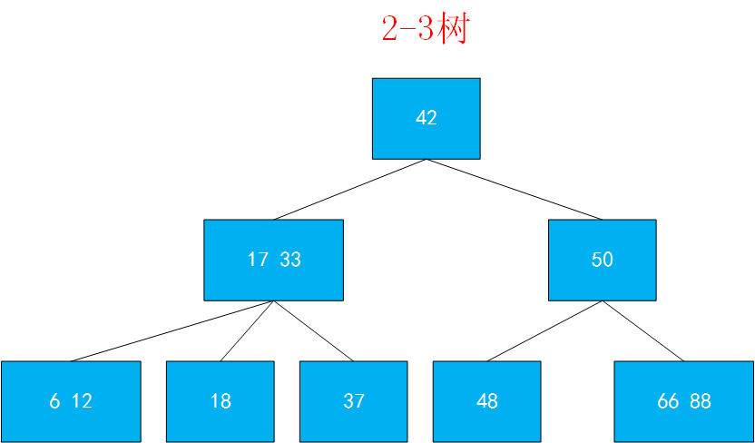
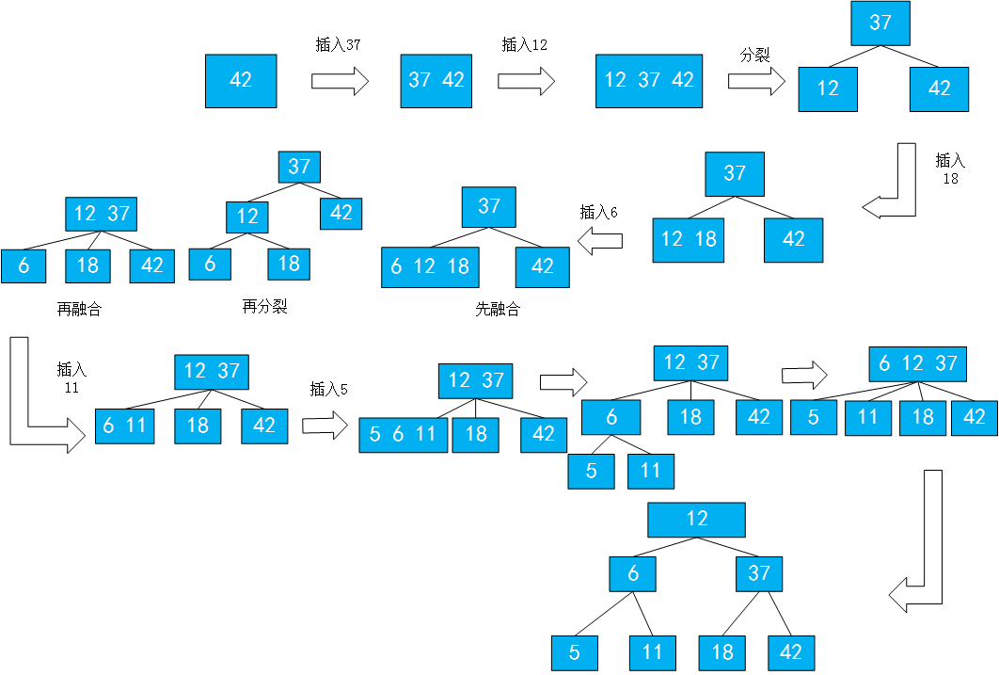
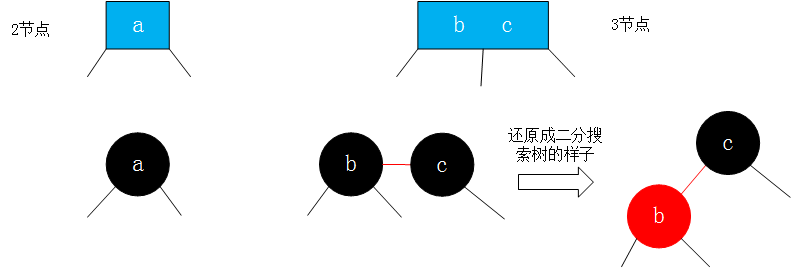
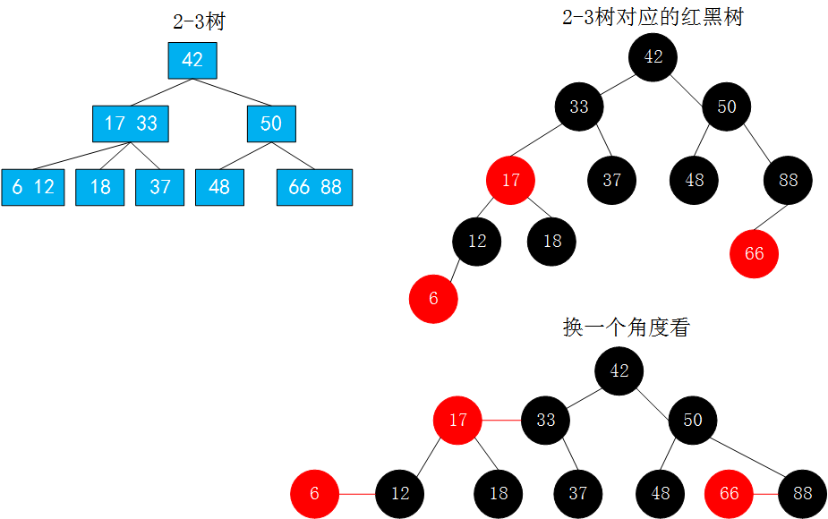
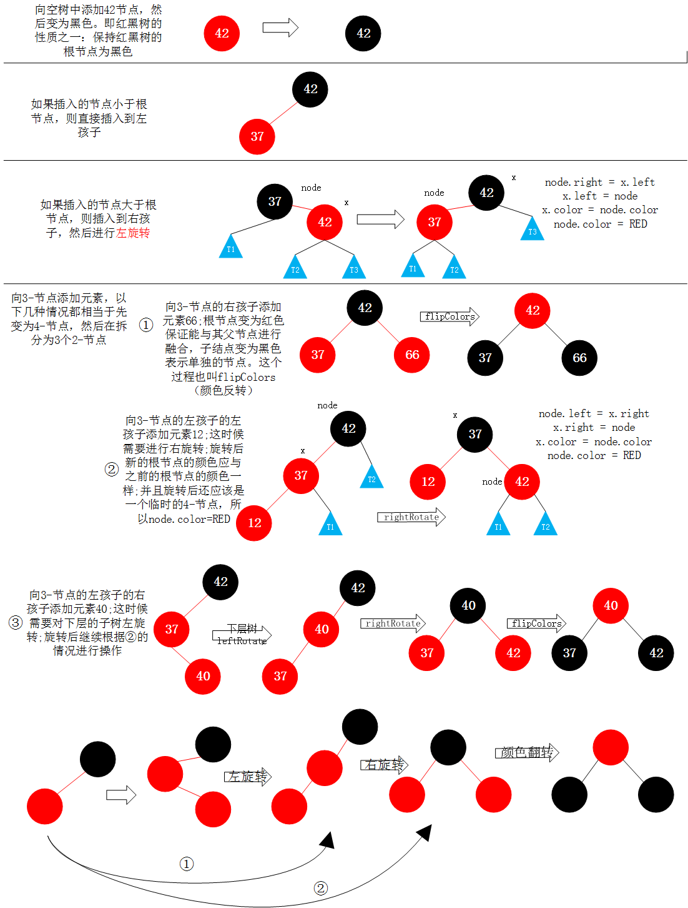

# 红黑树的定义

红黑树是一棵二分搜索树。

红黑树的五个性质：

1、每个结点或者是红的，或者是黑的。

2、根结点是黑的。

3、每一个叶结点（nil结点,即最后的空结点）是黑的。

4、如果一个结点是红的，则其孩子结点都是黑的。

5、对于任意结点，从该结点到其子孙叶结点（nil结点）的所有路径上包含相同数目的黑结点。

红黑树是保持“黑平衡”的二叉树。严格意义上并不是平衡二叉树。因为有红色结点，所以红黑树的最大高度为O(logn)。

与AVL树相比，如果添加和删除操作比较频繁，那么用红黑树将有很大的优势。但是如果使用的数据近乎是不会改变，只涉及到查询操作，那么AVL树比红黑树有优势（虽然它们的查询复杂度都是O(logn)）。

# 2-3树

2-3树满足二分搜索树的基本性质。

结点可以存放一个元素或者两个元素。

在《算法4》中，2-3树的定义如下：
>一棵2-3查找树或为一棵空树，或由以下结点组成：
>2-结点，含有一个建（与其对应的值）和两条链接，左链接指向的2-3树中的键都小于该结点，右链接指向的2-3树中的键都大于该结点。
>3-结点，含有两个键（及其对应的值）和三条链接，左链接指向的2-3树中的键都小于该结点，中链接指向的2-3树中的键都位于该结点的两个键之间，右链接指向的2-3树中的键都大于该结点。



2-3树是一棵绝对平衡的树。
>一棵完美平衡的2-3查找树中的所有空链接到根结点的距离都应该是相同的。

## 2-3树的绝对平衡性

### 插入新键

>要在2-3树中插入一个新结点，我们可以和二叉查找树一样先进行一次未命中的查找，然后把新结点挂在树的底部。但这样的话树就无法保持完美平衡性。我们使用2-3树的蛀牙原因就在于它能够在插入后继续保持平衡。如果未命中的查找结束于一个2-结点，事情就好办了：我们只要把这个2-结点替换为一个3-结点，将要插入的键保存在其中即可。

在2-3树中，添加一个结点将永远不会添加到一个空的位置。如图，如果将37插入到以42为根的2-3树中，插入37时，因为42的左孩子为空，新结点将融合到之前添加过程中最后的一个叶子结点上，即42，所以产生了结点融合.42由2-结点变成了3-结点。而若如果继续添加一个12结点，那么由于12小于37，它要添加到3-树的左子树，又因为2-3树的性质，不能添加到空的位置，那么先将12与3-树进行融合，产生一个4-树，接着进行分裂操作。这时候一个4-结点就转变成了一个由3个2-结点组成的平衡的树，同时这棵树保持着绝对平衡。此时，如果继续添加一个18结点，那么18要添加到12的右子树，12的右子树为空，不能添加到空结点，而是与它找到的最后一个叶子结点，即12结点进行融合，从而成为一个3-结点。接着插入6结点，6从根结点出发，比37小，要插入到37的左子树上，而其左子树是`12 18`的3-结点，它比12要小，所以要插入到其左子树，但它的左子树是一棵空树，添加结点不能添加到一个空的位置，而是找到它最后添加位置的叶子结点，与叶子结点进行融合，此时的叶子结点是一个3-结点，暂时与其融合成为4-结点，然后进行分裂拆解，但是此时如果拆解，那么树将不是一个绝对平衡的二叉树，而是应该将此时拆解后的新的根结点12与其父结点37进行融合，37是一个2-结点，进行融合就很容易了，37融合成3-结点，进而12结点对应的左右孩子变为新的根结点的左孩子和中孩子。继续添加11结点，11应插入到根结点的总左子树，11比6大，本应插入到6的右子树，但是6的右子树为空，所以11和6融合。再插入5,5应插入到`12 37`的左子树`6 11`的左结点，其左结点为空，此时应与其融合，首先融合成4-结点，再分裂为3个2-结点，6接着应与父结点融合，形成一个4-结点，4-结点应该进行分裂，分裂成3个2-结点。至此所有结点都是2-结点，仍是平衡的。

其实总结来说添加元素，添加的结点不会添加到空的位置，它会添加到最后搜索到的叶子结点，与其融合。如果其本身是2-结点，那么融合为3-结点，如果本身是3-结点，先融合为4-结点后，在分裂为3个2-结点。



# 2-3树和红黑树的等价性

在使用2-3树进行表达和实现时，有的结点包含2个子结点，有的结点包含3个子结点。使用红黑树，均使用含有两个子结点的结点进行表达。

以下是《算法4》中关于替换3-结点的描述：
>红黑二叉查找树背后的基本思想是用标准的二叉查找树（完全由2-结点构成）和一些额外的信息（替换3-结点）来表示2-3树。我们将树中的链接分为两种类型：红连接将两个2-结点连接起来构成一个3-结点，黑链接则是2-3树中的普通链接。确切地说，我们将3-结点表示为由一条左斜的红色链接（两个2-结点其中之一是另一个的左子结点）相连的两个2-结点。这种表示法的一个优点是，我们无需修改就可以直接使用标准二叉查找树的get()方法。对于任意的2-3树，只要对结点进行转换，我们都可以立即派生出一棵对应的二叉查找树。我们将这种表示2-3树的二叉查找树称为红黑二叉树（以下简称为红黑树）。

>红黑树的另一种定义是含有红黑链接并满足下列条件的二叉查找树：
> 1.红链接均为左链接 
> 2.没有任何一个结点同时和两条红链接相连
> 3.该树是完美黑色平衡的，即任意空链接到根结点的路径上的黑链接数量相同
> 满足这样定义的红黑树和相应的2-3树是一一对应的

即红结点和它的父结点一起表示原来2-3树中的3-结点。所有的红色结点都是向左倾斜的。





在原来的2-3树中有3个3-结点，所以在红黑树中有3个红结点。

# 颜色表示

直接上代码吧:
```java
import java.util.ArrayList;

public class RBTree<K extends Comparable<K>,V> {

    private static final boolean RED = true;
    private static final boolean BLACK = false;
    private class Node{
        public K key;
        public V value;
        public Node left,right;
        public boolean color;//由其父结点指向它的链接的颜色

        public Node(K key,V value){
            this.key = key;
            this.value = value;
            left = null;
            right = null;
            color = RED; //初始化为红结点，相当于刚创建时就与其父结点进行融合，融合后的操作是后续的事。
        }
    }

    private Node root;
    private int size;

    public RBTree() {
        root = null;
        size = 0;
    }

    // 返回以node为根节点的二分搜索树中，key所在的节点
    private Node getNode(Node node, K key){

        if(node == null)
            return null;

        if(key.equals(node.key))
            return node;
        else if(key.compareTo(node.key) < 0)
            return getNode(node.left, key);
        else // if(key.compareTo(node.key) > 0)
            return getNode(node.right, key);
    }

    public boolean contains(K key){return getNode(root,key) != null;}

    public V get(K key){
        Node node = getNode(root,key);
        return node == null ? null : node.value;
    }
}
```

# 在红黑树中添加新元素

在2-3树中添加一个新结点时，它都是或者添加进2-结点，行程一个3-结点；或者是添加进3-结点，暂时形成一个4-结点，然后在进行后续的操作。总之就是把要添加的元素融合到已有的结点中。所以在红黑树中假设永远添加红色结点的意图也就是，添加的结点和其他结点先融合。

在上面的代码中可以看到，我们将新添加的结点定义为红结点。所以在添加时有几种情况。

1.最初情况是刚开始的树为空，然后让红黑树的根为新添加的元素，然后让根结点的红色变为黑色。

2.要添加的结点小于根结点，即添加到根结点的左孩子位置，则直接添加过去就可以了。

3.要添加的结点大于根结点，则先添加到根结点的右孩子位置，然后进行左旋转。左旋转方法和AVL树的左旋转类似。在左旋转后，有可能会产生两个红色结点(`x.color = node.color;node.color = RED;`)，这时候不用担心，因为返回的根结点如果为红色，它将会继续和上一层进行相关转换操作。

4.向红黑树中的3-结点添加元素时：
①：向3-结点的右孩子添加时，直接添加到右孩子，然后所有子结点变为黑结点，也就是相当于在2-3树中先将3-结点变为4-结点，然后再分离为3个2-结点，然后再和其上面的父结点进行融合，所以这里要将其根结点变为红色（这样才能保证在红黑树中这个结点和其父结点进行融合）
②：向3-结点添加元素时，新元素小于根结点的左孩子（即新键小于原树中的两个键），需要继续添加到根结点的左孩子的左孩子（即连接到最左边的空链接），它应该是一个红色结点，这样就产生了两个连续的红链接。此时需要将上层的红链接右旋转（中值键作为根结点并和其他两个结点用红链接相连）
③：如果新键的值介于原树中的两个树之间，这样又会产生两个连续的红链接，一条红色左链接一条红色右链接。这时候需要将下层的红链接左旋转得到第②种情况，然后在②情况的基础上继续操作。



维护红黑树的时机和AVL树一样，在基于二分搜索树的基础上，添加了新结点后回溯向上维护。

相关代码:
```java

    //判断节点node的颜色
    private boolean isRed(Node node){
        if(node ==null) {
            return BLACK;
        }
        return node.color;
    }

    //左旋转
    private Node leftRotate(Node node) {

        Node x = node.right;

        //左旋转操作
        node.right = x.left;
        x.left = node;

        x.color = node.color;
        node.color = RED;

        return x;
    }

    //右旋转
    private Node rightRotate(Node node) {
        Node x = node.left;

        //右旋转
        node.left = x.right;
        x.right = node;

        x.color = node.color;
        node.color = RED;

        return x;
    }

    //颜色翻转
    private void flipColors(Node node){

        node.color = RED;
        node.left.color = BLACK;
        node.right.color = BLACK;
    }

    //向红黑树中添加新元素(key,value)
    public void add(K key,V value){
        root = add(root,key,value);
        root.color = BLACK;//保证最后的根节点为黑色
    }

    //向以node为根的红黑树中插入元素(key,value),递归算法
    //返回插入新节点后红黑树的根
    private Node add(Node node,K key,V value){
        if(node == null){
            size ++;
            return new Node(key,value); //默认插入红色结点
        }

        if(key.compareTo(node.key) < 0)
            node.left = add(node.left,key,value);
        else if(key.compareTo(node.key) > 0)
            node.right = add(node.right,key,value);
        else
            node.value = value;

        //插入结点结束后，进行红黑树性质的维护
        //如果右孩子是红色，左孩子不是红色，则进行左旋转
        if(isRed(node.right) && !isRed(node.left))
            node = leftRotate(node);
        //如果左孩子是红色，左孩子的左孩子也是红色，则进行右旋转
        if(isRed(node.left) && isRed(node.left.left))
            node = rightRotate(node);
        //如果node的左孩子和右孩子都是红结点，则进行颜色反转
        if(isRed(node.left) && isRed(node.right))
            flipColors(node);

        return node;
    }
```

# 与其他树的比较

如果对于完全随机的数据，普通的二分搜索树BST就已经很好用了。
缺点：极端情况下退化成链表（高度不平衡）

对于查询较多的情况，AVL树的性能很好。
红黑树牺牲了平衡性（2logn的高度）

红黑树的统计性能更优（综合增删改查所有的操作）

# 红黑树中删除节点

删除节点的操作较为复杂，以后有缘在整理 0.0